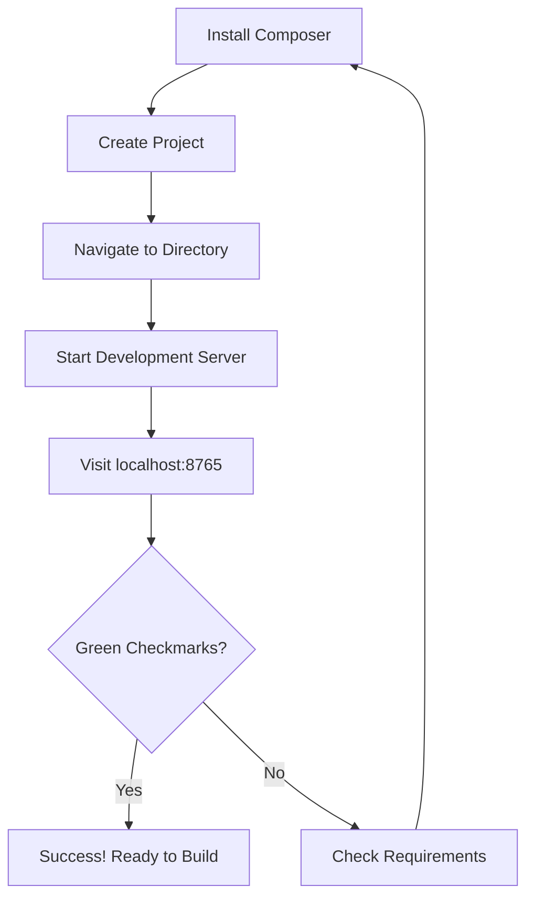
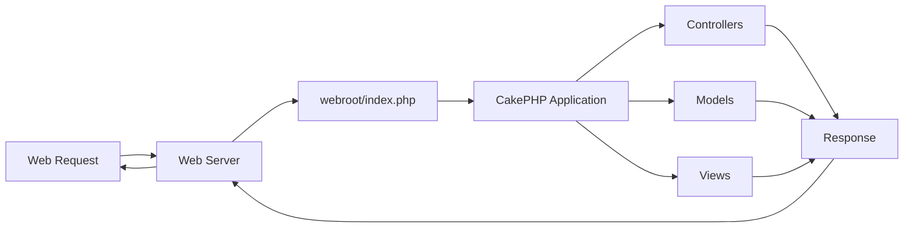
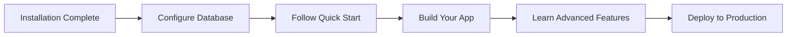

# CakePHP 5.x Installation Guide

> **Source:** [CakePHP Official Documentation](https://book.cakephp.org/5.x/installation.html)

<nav style="background: var(--bg-secondary); border: 1px solid var(--border-color); border-radius: 6px; padding: 15px 20px; margin: 20px 0;">
  <div style="display: flex; align-items: center; justify-content: space-between; flex-wrap: wrap; gap: 10px;">
    <a href="01-cakephp-at-a-glance.html" style="color: var(--link-color);">← Previous: Introduction</a>
    <span style="color: var(--text-secondary);">⚙️ Page 2 of 8</span>
    <a href="03-conventions.html" style="color: var(--link-color);">Next: Conventions →</a>
  </div>
</nav>

CakePHP is designed to be easy to install and configure. This guide will walk you through getting CakePHP up and running in just a few minutes.

## Table of Contents

- [System Requirements](#system-requirements)
- [Installation Methods](#installation-methods)
  - [Method 1: Using Composer](#method-1-using-composer)
  - [Method 2: Using DDEV + Composer](#method-2-using-ddev--composer)
  - [Method 3: Docker](#method-3-docker)
- [File Permissions](#file-permissions)
- [Development Server](#development-server)
- [Production Deployment](#production-deployment)
- [Web Server Configuration](#web-server-configuration)
  - [Apache](#apache)
  - [nginx](#nginx)
  - [Caddy / FrankenPHP](#caddy--frankenphp)
  - [IIS (Windows)](#iis-windows)
- [Without URL Rewriting](#without-url-rewriting)
- [Next Steps](#next-steps)

---

## System Requirements

### Quick Check

Verify your PHP version meets the requirements:

```bash
php -v
```

### Minimum Requirements

- **PHP 8.2+** (CLI and web server must match)
- **Required PHP Extensions:**
  - `mbstring`
  - `intl`
  - `pdo`
  - `simplexml`

### Supported Databases

- MySQL 5.7+
- MariaDB 10.1+
- PostgreSQL 9.6+
- SQLite 3.x
- SQL Server 2012+

> **Important:** Your web server's PHP version must match your CLI PHP version (8.2+). All database drivers require the appropriate PDO extension.

---

## Installation Methods

Choose the method that best fits your workflow:

### Method 1: Using Composer

The standard way to install CakePHP.

#### Install Composer

**Linux/macOS:**

```bash
#!/bin/bash
# Download and install Composer
curl -sS https://getcomposer.org/installer | php
sudo mv composer.phar /usr/local/bin/composer

# Verify installation
composer --version
```

**Windows:**

```batch
@echo off
REM Download and run the Windows installer
REM https://getcomposer.org/Composer-Setup.exe

REM Verify installation
composer --version
```

#### Create a New CakePHP Project

```bash
#!/bin/bash
# Create a new CakePHP 5 application
composer create-project --prefer-dist cakephp/app:5.3 my_app_name

# Navigate to your app
cd my_app_name

# Start development server
bin/cake server

# Or if you have frankenphp available
bin/cake server --frankenphp
```

#### Version Constraints

Your `composer.json` version constraint controls updates:

```json
{
  "require": {
    "cakephp/cakephp": "5.3.*"
  }
}
```

- `"cakephp/cakephp": "5.3.*"` - Locks to 5.3.x (patch updates only)
- `"cakephp/cakephp": "^5.3"` - Allows 5.3.x and 5.4.x (minor updates)



---

### Method 2: Using DDEV + Composer

Perfect for local development environments.

#### Create New Project

```bash
#!/bin/bash
# Create and configure project
mkdir my-cakephp-app && cd my-cakephp-app
ddev config --project-type=cakephp --docroot=webroot
ddev composer create --prefer-dist cakephp/app:5.3

# Launch in browser
ddev launch
```

#### Clone Existing Project

```bash
#!/bin/bash
# Clone your repository
git clone <your-cakephp-repo>
cd <your-cakephp-project>

# Configure DDEV
ddev config --project-type=cakephp --docroot=webroot
ddev composer install

# Launch in browser
ddev launch
```

> **Tip:** Check [DDEV Documentation](https://ddev.readthedocs.io/) for installation and advanced configuration.

---

### Method 3: Docker

For containerized development:

```bash
#!/bin/bash
# Create project using Composer in Docker
docker run --rm -v $(pwd):/app composer create-project \
  --prefer-dist cakephp/app:5.3 my_app

# Start PHP development server (install required extensions first)
cd my_app
docker run -it --rm -p 8765:8765 -v $(pwd):/app \
  -w /app php:8.2-cli bash -c "apt-get update && apt-get install -y libicu-dev && docker-php-ext-install intl mbstring && php bin/cake server -H 0.0.0.0"
```

> **Warning:** The built-in server is for development only. Never use it in production environments.

---

## File Permissions

CakePHP uses the `tmp` and `logs` directories for various operations like caching, sessions, and logging.

> **Important:** Ensure `logs` and `tmp` (including all subdirectories) are writable by your web server user.

### Quick Setup (Unix/Linux/macOS)

**Using ACL (Recommended):**

```bash
#!/bin/bash
# Auto-detect web server user and set permissions using ACL
HTTPDUSER=`ps aux | grep -E '[a]pache|[h]ttpd|[_]www|[w]ww-data|[n]ginx' | grep -v root | head -1 | cut -d\  -f1`
setfacl -R -m u:${HTTPDUSER}:rwx tmp logs
setfacl -R -d -m u:${HTTPDUSER}:rwx tmp logs
```

**Using chmod:**

```bash
#!/bin/bash
# Auto-detect web server user and set permissions using chmod
HTTPDUSER=`ps aux | grep -E '[a]pache|[h]ttpd|[_]www|[w]ww-data|[n]ginx' | grep -v root | head -1 | cut -d\  -f1`
sudo chown -R $(whoami):${HTTPDUSER} tmp logs
sudo chmod -R 775 tmp logs
```

**Fallback (if auto-detection doesn't work):**

```bash
#!/bin/bash
# Use broader permissions
chmod -R 777 tmp logs
```

> **Note (macOS):** macOS does not include `setfacl` by default. Use the chmod method or install ACL tools via Homebrew: `brew install acl`

### Make Console Executable

```bash
#!/bin/bash
# Unix/Linux/macOS
chmod +x bin/cake
```

```batch
@echo off
REM Windows
REM .bat file is already executable
REM For WSL or shared directories, ensure execute permissions are shared
```

**Alternative (if you cannot change permissions):**

```bash
#!/bin/bash
php bin/cake.php
```

---

## Development Server

The fastest way to get started. CakePHP includes a development server built on PHP's built-in web server.

```bash
#!/bin/bash
# Starts at http://localhost:8765
bin/cake server
```

**Custom Host and Port:**

```bash
#!/bin/bash
# Useful for network access or port conflicts
bin/cake server -H 192.168.1.100 -p 5000
```

**Allow Network Access:**

```bash
#!/bin/bash
# Allow access from other devices on your network
bin/cake server -H 0.0.0.0
```

> **Success!** Visit http://localhost:8765 and you should see the CakePHP welcome page with green checkmarks.

> **Warning:** Never use the development server in production. It's designed only for local development and lacks security hardening, performance optimizations, and proper process management.

---

## Production Deployment

For production environments, configure your web server to serve from the `webroot` directory.

### Directory Structure

After installation, your structure should look like this:

```
my_app/
├── bin/
├── config/
├── logs/
├── plugins/
├── src/
├── templates/
├── tests/
├── tmp/
├── vendor/
├── webroot/          # ← Web server document root
│   ├── css/
│   ├── img/
│   ├── js/
│   ├── .htaccess
│   └── index.php
├── .gitignore
├── .htaccess
├── composer.json
└── README.md
```

> **Important:** Point your web server's DocumentRoot to `/path/to/my_app/webroot/`



---

## Web Server Configuration

> **Note:** The following examples are illustrative starting points. You should fine-tune these configurations to match your application's specific requirements, security policies, and performance needs.

### Apache

Apache works out of the box with CakePHP's included `.htaccess` files.

**Virtual Host Configuration:**

```apache
<VirtualHost *:80>
    ServerName myapp.local
    DocumentRoot /var/www/myapp/webroot

    <Directory /var/www/myapp/webroot>
        Options FollowSymLinks
        AllowOverride All
        Require all granted
    </Directory>

    ErrorLog ${APACHE_LOG_DIR}/myapp_error.log
    CustomLog ${APACHE_LOG_DIR}/myapp_access.log combined
</VirtualHost>
```

**Enable mod_rewrite:**

```bash
#!/bin/bash
# Ensure mod_rewrite is enabled
LoadModule rewrite_module modules/mod_rewrite.so

# Verify with:
apache2ctl -M | grep rewrite
```

**Subdirectory Installation:**

```apache
# If installing in a subdirectory like /~username/myapp/
<IfModule mod_rewrite.c>
    RewriteEngine On
    RewriteBase /~username/myapp
    RewriteCond %{REQUEST_FILENAME} !-f
    RewriteRule ^ index.php [L]
</IfModule>
```

#### Troubleshooting

If rewrites aren't working:

1. Ensure `AllowOverride All` is set in your Apache configuration
2. Verify `.htaccess` files exist in root and webroot
3. Confirm `mod_rewrite` is enabled

#### Performance Optimization

```apache
# Add to webroot/.htaccess to prevent CakePHP from handling static assets
RewriteCond %{REQUEST_URI} !^/(webroot/)?(img|css|js)/(.*)$
```

---

### nginx

nginx requires manual rewrite configuration:

```nginx
server {
    listen 80;
    server_name myapp.local;

    root /var/www/myapp/webroot;
    index index.php;

    access_log /var/log/nginx/myapp_access.log;
    error_log /var/log/nginx/myapp_error.log;

    location / {
        try_files $uri $uri/ /index.php?$args;
    }

    location ~ \.php$ {
        try_files $uri =404;
        include fastcgi_params;
        fastcgi_pass unix:/var/run/php/php8.2-fpm.sock;
        fastcgi_index index.php;
        fastcgi_intercept_errors on;
        fastcgi_param SCRIPT_FILENAME $document_root$fastcgi_script_name;
    }
}
```

> **Note:** Modern PHP-FPM uses Unix sockets instead of TCP. Update `fastcgi_pass` to match your setup:
>
> - Unix socket: `unix:/var/run/php/php8.2-fpm.sock`
> - TCP: `127.0.0.1:9000`

---

### Caddy / FrankenPHP

Modern web server with automatic HTTPS. FrankenPHP extends Caddy with a built-in PHP runtime.

**Caddyfile Configuration:**

```caddy
myapp.local {
    root * /var/www/myapp/webroot
    php_fastcgi unix//var/run/php/php8.2-fpm.sock
    encode gzip
    file_server

    try_files {path} {path}/ /index.php?{query}
}
```

**Using FrankenPHP (Docker):**

```dockerfile
# Dockerfile in your project root
FROM dunglas/frankenphp

# Copy your CakePHP application
COPY . /app

# FrankenPHP defaults to /app/public as document root.
# CakePHP uses webroot/ instead, so override it:
ENV SERVER_ROOT=/app/webroot

# Install dependencies (composer.json lives in /app)
RUN composer install --no-dev --optimize-autoloader

# Build and run:
# docker build -t myapp .
# docker run -p 80:80 -p 443:443 myapp
```

**Standalone FrankenPHP:**

```bash
#!/bin/bash
# Download FrankenPHP
curl -L https://github.com/dunglas/frankenphp/releases/latest/download/frankenphp-linux-x86_64 -o frankenphp
chmod +x frankenphp

# Run with your CakePHP app
./frankenphp php-server --root /var/www/myapp/webroot
```

#### Local Development

For local development, you can use the built-in CakePHP development server with FrankenPHP support:

```bash
#!/bin/bash
bin/cake server --frankenphp
```

> **Note:** This requires the `frankenphp` binary to be available in your PATH.

> **Why FrankenPHP?** FrankenPHP combines PHP with Caddy, providing automatic HTTPS, HTTP/3, and modern compression without needing PHP-FPM. Particularly efficient for containerized deployments.

---

### IIS (Windows)

Create a `web.config` file in your application root:

```xml
<?xml version="1.0" encoding="UTF-8"?>
<configuration>
    <system.webServer>
        <rewrite>
            <rules>
                <rule name="Exclude webroot" stopProcessing="true">
                    <match url="^webroot/(.*)$" ignoreCase="false" />
                    <action type="None" />
                </rule>
                <rule name="Rewrite assets" stopProcessing="true">
                    <match url="^(font|img|css|files|js|favicon.ico)(.*)$" />
                    <action type="Rewrite" url="webroot/{R:1}{R:2}" />
                </rule>
                <rule name="Rewrite to index.php" stopProcessing="true">
                    <match url="^(.*)$" ignoreCase="false" />
                    <action type="Rewrite" url="index.php" />
                </rule>
            </rules>
        </rewrite>
    </system.webServer>
</configuration>
```

---

## Without URL Rewriting

If you cannot enable URL rewriting, you can use CakePHP's built-in non-rewritten `index.php` URLs.

### Configuration

In `config/app.php`, uncomment:

```php
<?php
'App' => [
    // ...
    'baseUrl' => env('SCRIPT_NAME'),
]
?>
```

### Remove .htaccess Files

Remove these `.htaccess` files:

- `/.htaccess`
- `/webroot/.htaccess`

### URL Format

Your URLs will include `index.php`:

- **With rewriting:** `https://myapp.com/articles/view/1`
- **Without rewriting:** `https://myapp.com/index.php/articles/view/1`

---

## Next Steps

Your CakePHP installation is complete! Here's what to do next:

### Ready to Build?

Follow the [Quick Start Guide](https://book.cakephp.org/5.x/quickstart.html) to create your first CakePHP application in minutes.

### Learn More:

- [CakePHP Conventions](https://book.cakephp.org/5.x/intro/conventions.html)
- [Database Configuration](https://book.cakephp.org/5.x/orm/database-basics.html)
- [Routing](https://book.cakephp.org/5.x/development/routing.html)
- [Controllers](https://book.cakephp.org/5.x/controllers.html)



---

<nav style="background: var(--bg-secondary); border: 1px solid var(--border-color); border-radius: 6px; padding: 15px 20px; margin: 30px 0;">
  <div style="display: flex; align-items: center; justify-content: space-between; flex-wrap: wrap; gap: 10px;">
    <a href="01-cakephp-at-a-glance.html" style="color: var(--link-color);">← Previous: Introduction</a>
    <span style="color: var(--text-secondary);">⚙️ Page 2 of 8</span>
    <a href="03-conventions.html" style="color: var(--link-color);">Next: Conventions →</a>
  </div>
</nav>

---

**Released under the MIT License.**

**Copyright © Cake Software Foundation, Inc. All rights reserved.**
