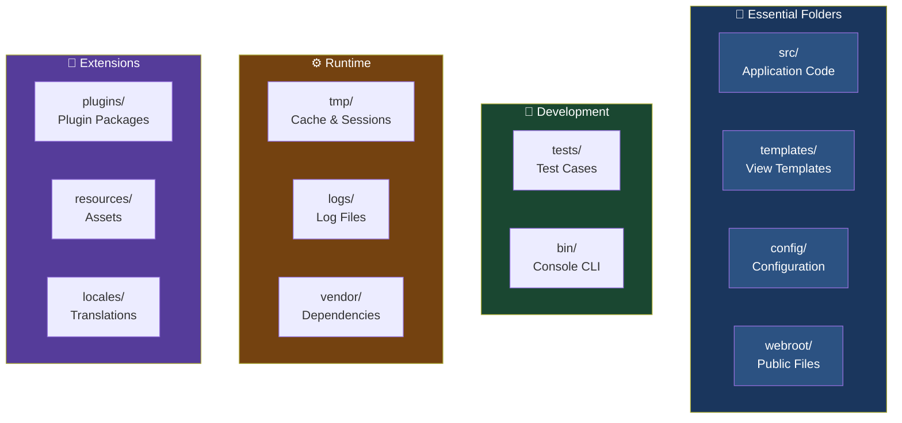
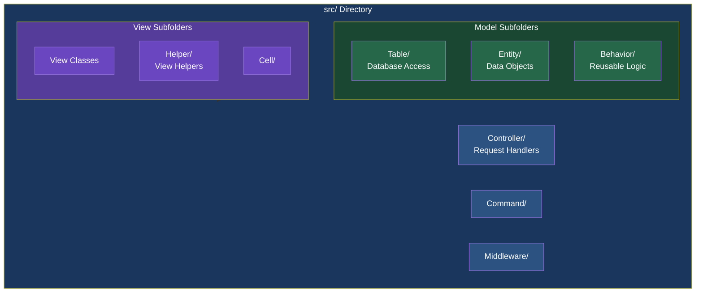
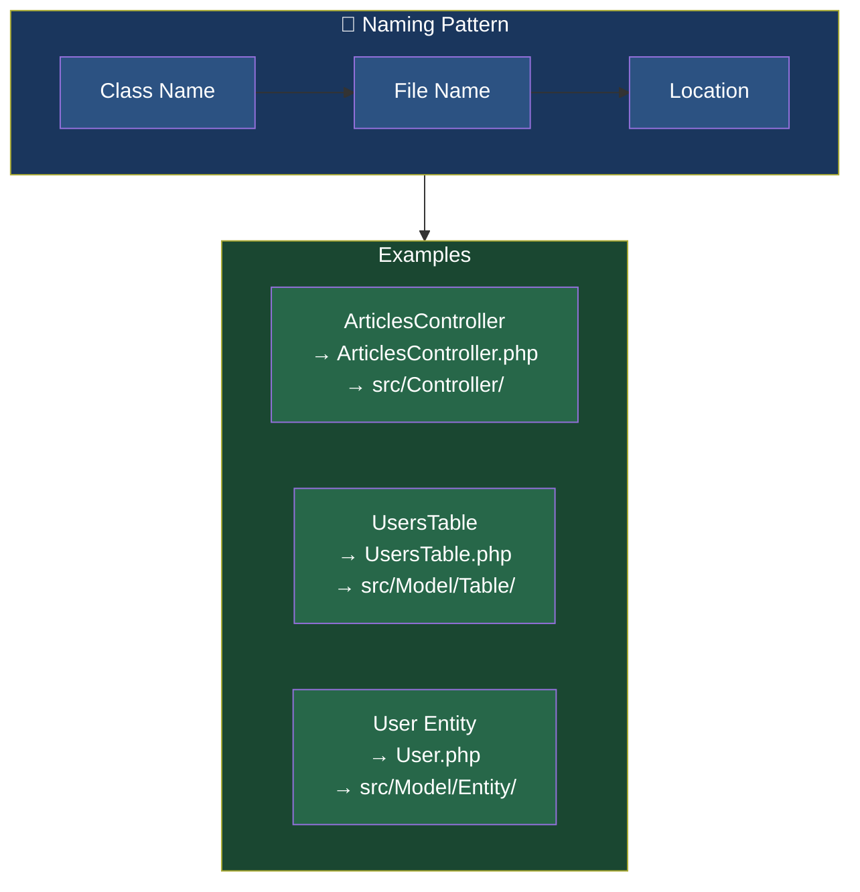
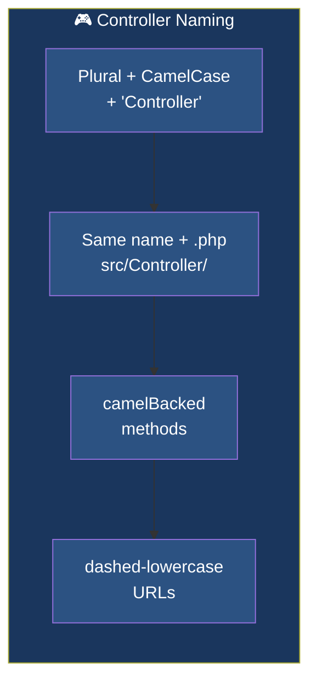
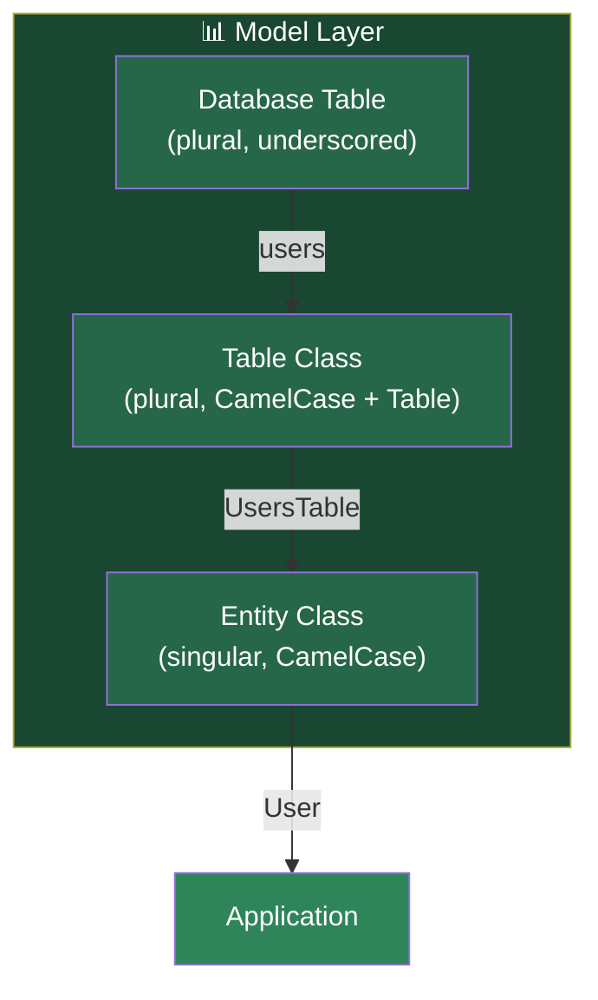
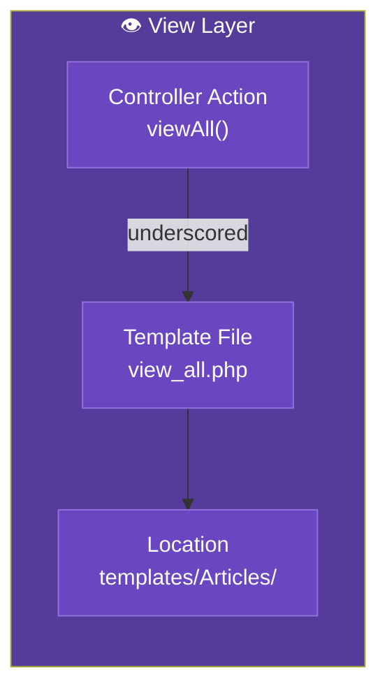
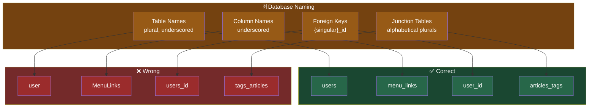
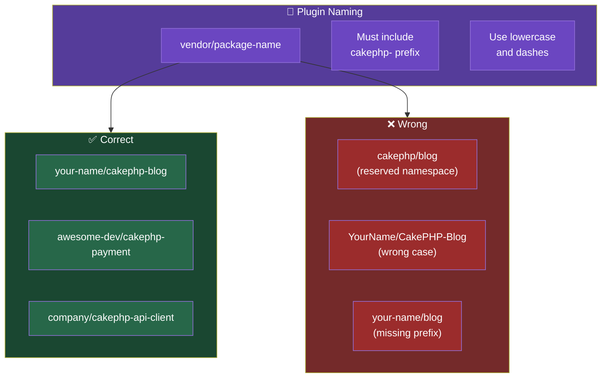
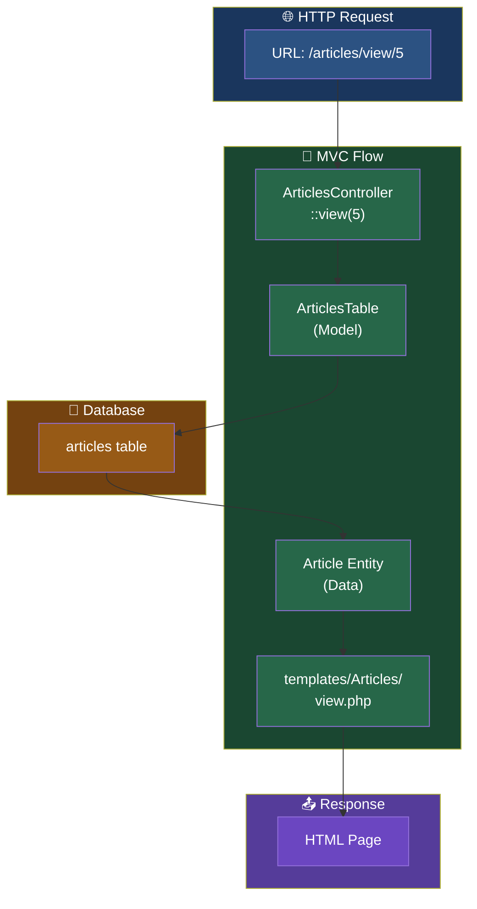
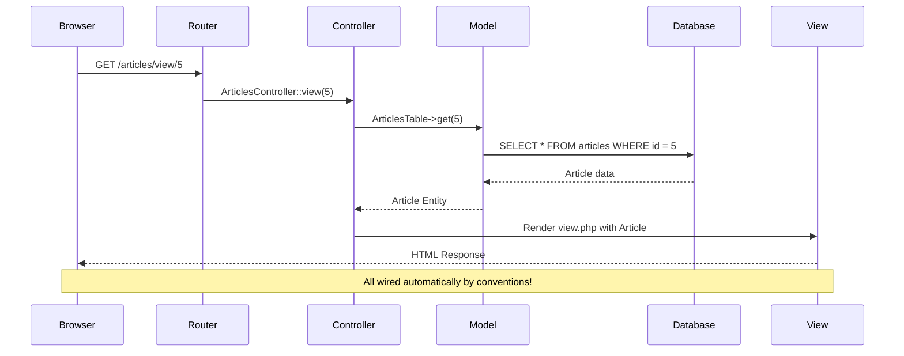

# CakePHP Conventions

> **Source:** [CakePHP Official Documentation](https://book.cakephp.org/5.x/intro/conventions.html)

<nav style="background: var(--bg-secondary); border: 1px solid var(--border-color); border-radius: 6px; padding: 15px 20px; margin: 20px 0;">
  <div style="display: flex; align-items: center; justify-content: space-between; flex-wrap: wrap; gap: 10px;">
    <a href="02-installation-guide.html" style="color: var(--link-color);">← Previous: Installation</a>
    <span style="color: var(--text-secondary);">📋 Page 3 of 4</span>
    <a href="04-cms-tutorial.html" style="color: var(--link-color);">Next: CMS Tutorial →</a>
  </div>
</nav>

CakePHP embraces **convention over configuration**. By following conventions, you get free functionality without tracking config files, and create a uniform codebase that other developers can quickly understand.

> **Tip:** Following these conventions means CakePHP automatically wires up your application - controllers find their models, views find their templates, and URLs map to actions without any configuration.

## Table of Contents

- [Application Folder Structure](#application-folder-structure)
- [The src/ Directory](#the-src-directory)
- [Naming Conventions](#naming-conventions)
- [Controller Conventions](#controller-conventions)
- [Model Conventions](#model-conventions)
- [View Conventions](#view-conventions)
- [Database Conventions](#database-conventions)
- [Plugin Conventions](#plugin-conventions)
- [Complete Example](#complete-example)

---

## Application Folder Structure

After downloading the CakePHP application skeleton, you'll see these top-level folders:



### Essential Folders

| Folder | Purpose |
|--------|---------|
| `src/` | Your application code (controllers, models, views) |
| `templates/` | View templates and layouts |
| `config/` | Configuration files (routes, database, app settings) |
| `webroot/` | Public files (CSS, JS, images) - document root |

### Development & Testing

| Folder | Purpose |
|--------|---------|
| `tests/` | PHPUnit test cases |
| `bin/` | Console executable (`bin/cake`) |

### Runtime & Dependencies

| Folder | Purpose |
|--------|---------|
| `tmp/` | Cache, logs, sessions (must be writable) |
| `logs/` | Application log files (must be writable) |
| `vendor/` | Composer dependencies |

### Extensions & Localization

| Folder | Purpose |
|--------|---------|
| `plugins/` | Plugin packages |
| `resources/` | Locale files and other resources |
| `locales/` | Translation files |

> **Warning:** Make sure `tmp/` and `logs/` folders are writable! Poor performance or errors will occur otherwise.

---

## The src/ Directory

The `src/` folder is where you'll do most development:



| Subfolder | Purpose |
|-----------|---------|
| `Controller/` | Controllers handle requests |
| `Model/Table/` | Table classes (database access) |
| `Model/Entity/` | Entity classes (data objects) |
| `Model/Behavior/` | Reusable model behaviors |
| `View/` | View classes and helpers |
| `View/Helper/` | View helpers |
| `Command/` | Console commands |
| `Middleware/` | HTTP middleware |

> **Note:** The `Command/` folder isn't present by default - it's auto-generated when you create your first command using bake.

---

## Naming Conventions

### File and Class Name Conventions

All files follow PSR-4 autoloading - filenames must match class names exactly:



| Type | Class Name | File Name | Location |
|------|------------|-----------|----------|
| Controller | `ArticlesController` | `ArticlesController.php` | `src/Controller/` |
| Table | `ArticlesTable` | `ArticlesTable.php` | `src/Model/Table/` |
| Entity | `Article` | `Article.php` | `src/Model/Entity/` |
| Behavior | `TimestampBehavior` | `TimestampBehavior.php` | `src/Model/Behavior/` |
| Helper | `FormHelper` | `FormHelper.php` | `src/View/Helper/` |
| Command | `UpdateCacheCommand` | `UpdateCacheCommand.php` | `src/Command/` |

---

## Controller Conventions

### Rules

- **Name:** Plural, CamelCased, ends with `Controller`
- **File:** Same as class name in `src/Controller/`
- **Methods:** camelBacked (first word lowercase)
- **URLs:** Dashed lowercase (`/users/view-me` for `viewMe()`)



```php
// File: src/Controller/UsersController.php
namespace App\Controller;

class UsersController extends AppController
{
    // URL: /users/view-me
    public function viewMe()
    {
        // camelBacked method names
    }
}
```

### Wrong Example

```php
// Wrong: singular, lowercase, no suffix
class user extends AppController
{
    // Wrong: underscores instead of camelCase
    public function view_me()
    {
    }
}
```

> **Warning:** Only public methods are accessible through routing. Protected and private methods cannot be accessed via URLs.

> **Tip:** Acronyms: Treat them as words. CMS becomes `CmsController`, not `CMSController`

### URL Arrays

```php
$this->Html->link('title', [
    'prefix' => 'MyPrefix',      // CamelCased
    'plugin' => 'MyPlugin',      // CamelCased
    'controller' => 'Users',     // CamelCased
    'action' => 'viewProfile'    // camelBacked
]);
```

---

## Model Conventions



### Table Classes

- **Name:** Plural, CamelCased, ends with `Table`
- **File:** `src/Model/Table/UsersTable.php`

```php
// File: src/Model/Table/UsersTable.php
namespace App\Model\Table;

class UsersTable extends Table
{
    // Plural, CamelCased, ends in "Table"
}
```

### Entity Classes

- **Name:** Singular, CamelCased, no suffix
- **File:** `src/Model/Entity/User.php`

```php
// File: src/Model/Entity/User.php
namespace App\Model\Entity;

class User extends Entity
{
    // Singular, CamelCased, no suffix
}
```

### Examples

| Database Table | Table Class | Entity Class |
|----------------|-------------|--------------|
| `users` | `UsersTable` | `User` |
| `menu_links` | `MenuLinksTable` | `MenuLink` |
| `user_favorite_pages` | `UserFavoritePagesTable` | `UserFavoritePage` |

---

## View Conventions



### Template Files

- **Location:** `templates/{Controller}/{underscored_action}.php`
- **Naming:** Underscored action name

```php
// Controller method: ArticlesController::viewAll()
templates/Articles/view_all.php

// Controller method: MenuLinksController::editItem()
templates/MenuLinks/edit_item.php
```

### View Classes

- **Name:** CamelCased, ends with `View`
- **File:** `src/View/ArticlesView.php`

```php
// File: src/View/ArticlesView.php
class ArticlesView extends View
{
}
```

### Helpers

- **Name:** CamelCased, ends with `Helper`
- **File:** `src/View/Helper/BestEverHelper.php`

---

## Database Conventions



### Table Names

```sql
-- Plural, underscored
CREATE TABLE users;
CREATE TABLE menu_links;
CREATE TABLE user_favorite_pages;

-- Foreign keys: {singular_table}_id
ALTER TABLE articles ADD user_id INT;
ALTER TABLE photos ADD menu_link_id INT;

-- Junction tables: alphabetically sorted plurals
CREATE TABLE articles_tags;
```

### Rules

| Convention | Correct | Wrong |
|------------|---------|-------|
| Table names | `users`, `menu_links` | `user`, `MenuLinks` |
| Column names | `first_name`, `created_at` | `FirstName`, `createdAt` |
| Foreign keys | `user_id`, `menu_link_id` | `users_id`, `UserId` |
| Junction tables | `articles_tags` | `tags_articles` |

> **Warning:** The bake command requires junction tables to be alphabetically sorted! Use `articles_tags`, not `tags_articles`.

### Wrong Examples

```sql
-- Wrong: singular
CREATE TABLE user;

-- Wrong: not underscored
CREATE TABLE MenuLinks;

-- Wrong: plural both words
CREATE TABLE users_favorites_pages;

-- Wrong: not alphabetical
CREATE TABLE tags_articles;
```

### Primary Keys

- Default: `id` (auto-increment)
- UUID: Use `Cake\Utility\Text::uuid()`

> **Tip:** If your junction table has extra columns beyond the foreign keys, create a dedicated Table and Entity class for it.

---

## Plugin Conventions



### Naming

Plugin names should follow Packagist conventions:

```
your-name/cakephp-blog
awesome-dev/cakephp-payment
company/cakephp-api-client
```

### Rules

- Use lowercase with dashes
- Include `cakephp-` prefix
- Avoid reserved `cakephp/` namespace

```php
cakephp/blog          // Reserved namespace!
YourName/CakePHP-Blog // Use lowercase & dashes
your-name/blog        // Missing cakephp- prefix
```

---

## Complete Example

Here's how all the conventions work together for a complete Articles feature:



### Database

```sql
CREATE TABLE articles (
    id INT PRIMARY KEY AUTO_INCREMENT,
    user_id INT,
    title VARCHAR(255),
    body TEXT,
    created DATETIME,
    modified DATETIME
);

CREATE TABLE users (
    id INT PRIMARY KEY AUTO_INCREMENT,
    username VARCHAR(50),
    email VARCHAR(255)
);
```

### File Structure

```
src/
├── Controller/
│   └── ArticlesController.php    → class ArticlesController
├── Model/
│   ├── Table/
│   │   └── ArticlesTable.php     → class ArticlesTable
│   └── Entity/
│       └── Article.php           → class Article
templates/
└── Articles/
    ├── index.php                 → ArticlesController::index()
    ├── view.php                  → ArticlesController::view()
    └── add.php                   → ArticlesController::add()
```

### How It Works

| URL | Controller | Table | Entity | Template |
|-----|------------|-------|--------|----------|
| `/articles/view/5` | `ArticlesController::view()` | `ArticlesTable` | `Article` | `templates/Articles/view.php` |

**No configuration required!** CakePHP wires everything automatically through conventions.



> **Warning:** If junction tables have additional data columns, create a dedicated Table and Entity class for them.

---

## Next Steps

Now that you understand CakePHP's structure and conventions:

1. Continue with the [Content Management Tutorial](04-cms-tutorial.html) for a hands-on walkthrough
2. Learn about [Routes Configuration](https://book.cakephp.org/5.x/development/routing.html) for URL handling

---

<nav style="background: var(--bg-secondary); border: 1px solid var(--border-color); border-radius: 6px; padding: 15px 20px; margin: 30px 0;">
  <div style="display: flex; align-items: center; justify-content: space-between; flex-wrap: wrap; gap: 10px;">
    <a href="02-installation-guide.html" style="color: var(--link-color);">← Previous: Installation</a>
    <span style="color: var(--text-secondary);">📋 Page 3 of 4</span>
    <a href="04-cms-tutorial.html" style="color: var(--link-color);">Next: CMS Tutorial →</a>
  </div>
</nav>

---

**Released under the MIT License.**

**Copyright © Cake Software Foundation, Inc. All rights reserved.**
