# Routing Basics

> **Source:** [CakePHP Official Documentation - Routing](https://book.cakephp.org/5.x/development/routing.html)

<nav style="background: var(--bg-secondary); border: 1px solid var(--border-color); border-radius: 6px; padding: 15px 20px; margin: 20px 0;">
  <div style="display: flex; align-items: center; justify-content: space-between; flex-wrap: wrap; gap: 10px;">
    <a href="02-installation-guide.html" style="color: var(--link-color);">← Previous: Installation</a>
    <span style="color: var(--text-secondary);">🛣️ Page 3 of 3</span>
    <a href="index.html" style="color: var(--link-color);">Home →</a>
  </div>
</nav>

## Table of Contents

- [What is Routing?](#what-is-routing)
- [How Routing Works](#how-routing-works)
- [Basic Route Examples](#basic-route-examples)
- [Route Elements](#route-elements)
- [Named Routes](#named-routes)
- [HTTP Methods](#http-methods)
- [Prefix Routing](#prefix-routing)
- [Plugin Routing](#plugin-routing)
- [RESTful Routes](#restful-routes)
- [Generating URLs](#generating-urls)

---

## What is Routing?

Routing connects URLs to controller actions. It separates how your app is implemented from how URLs look.

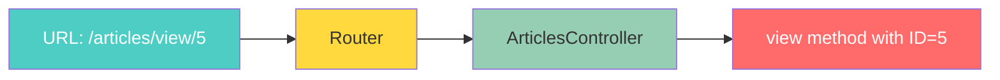

**Key Benefits:**

- Change URLs without changing code
- Clean, SEO-friendly URLs
- Reverse routing (generate URLs from arrays)
- Flexible URL patterns

---

## How Routing Works

Routes are defined in `config/routes.php`:

```php
<?php
/** @var \Cake\Routing\RouteBuilder $routes */
$routes->scope('/', function (RouteBuilder $routes) {
    // Your routes here
});
?>
```

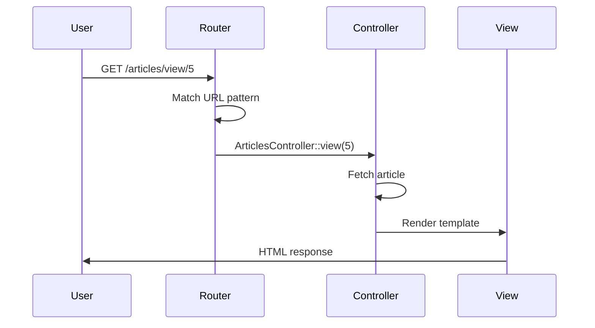

---

## Basic Route Examples

### Example 1: Homepage Route

```php
<?php
// Map homepage to Articles index
$routes->connect('/', ['controller' => 'Articles', 'action' => 'index']);
?>
```

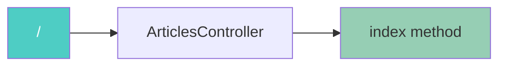

**Result:** Visiting `/` calls `ArticlesController::index()`

---

### Example 2: Dynamic Route with Parameters

```php
<?php
// Match /articles/15
$routes->connect('/articles/*', ['controller' => 'Articles', 'action' => 'view']);
?>
```

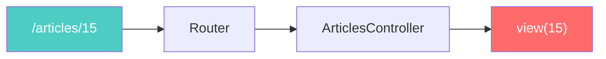

**Result:** `/articles/15` calls `ArticlesController::view(15)`

---

### Example 3: Route with Validation

```php
<?php
// Only accept numeric IDs
$routes->connect(
    '/articles/{id}',
    ['controller' => 'Articles', 'action' => 'view']
)
->setPatterns(['id' => '\d+'])
->setPass(['id']);
?>
```

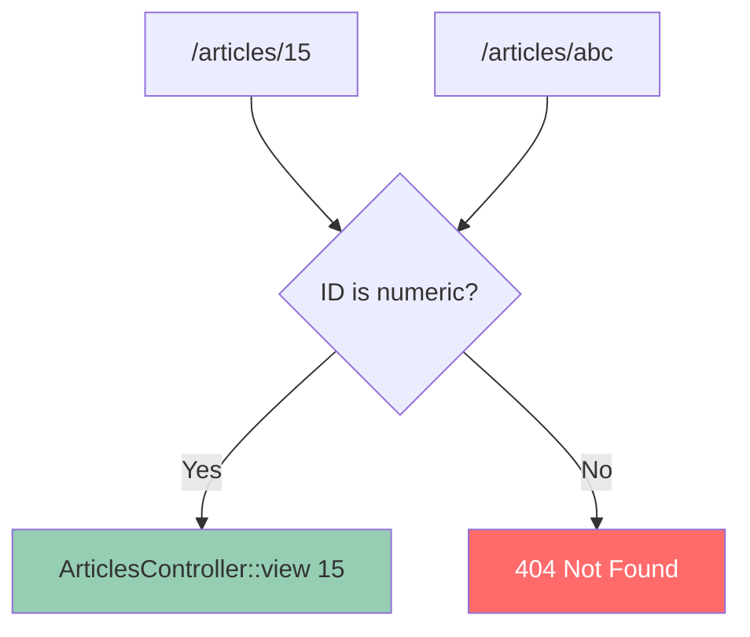

**Result:**
- `/articles/15` ✅ Works
- `/articles/abc` ❌ 404 Error

---

## Route Elements

Route elements are placeholders in URLs that capture values.

### Common Route Elements

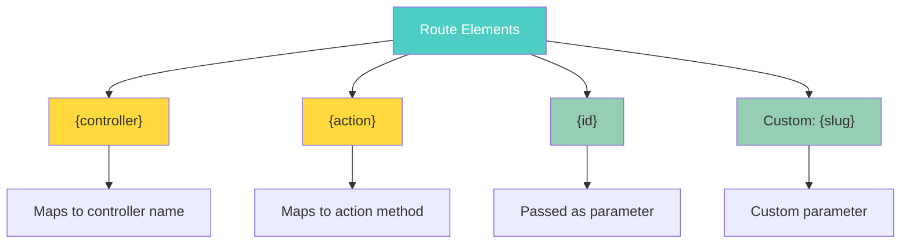

### Example: Multiple Route Elements

```php
<?php
$routes->connect(
    '/{controller}/{year}/{month}/{day}',
    ['action' => 'index']
)->setPatterns([
    'year' => '[12][0-9]{3}',
    'month' => '0[1-9]|1[012]',
    'day' => '0[1-9]|[12][0-9]|3[01]'
]);
?>
```

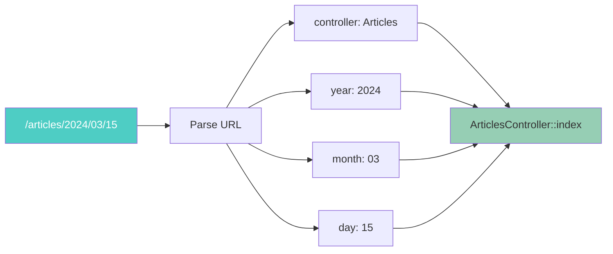

**Result:** `/articles/2024/03/15` calls `ArticlesController::index()` with date parameters

---

## Named Routes

Named routes let you reference routes by name instead of typing all parameters.

### Creating Named Routes

```php
<?php
// Define a named route
$routes->connect(
    '/login',
    ['controller' => 'Users', 'action' => 'login'],
    ['_name' => 'login']
);

// Use the named route
echo Router::url(['_name' => 'login']);
// Output: /login
?>
```

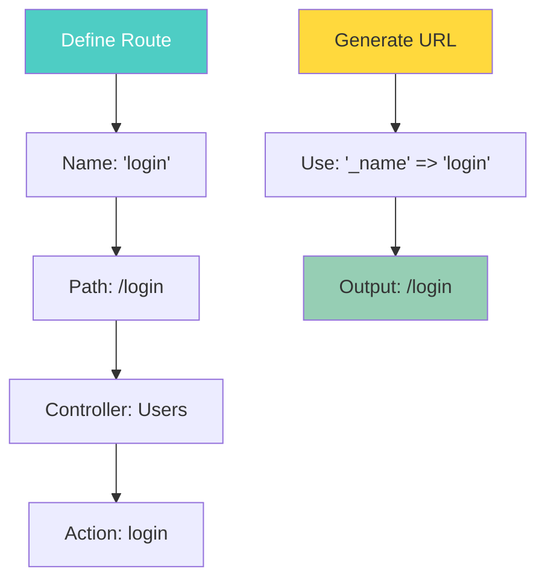

### Named Routes with Prefixes

```php
<?php
$routes->scope('/api', ['_namePrefix' => 'api:'], function (RouteBuilder $routes) {
    // Route name will be 'api:ping'
    $routes->get('/ping', ['controller' => 'Pings'], 'ping');
});

// Generate URL
Router::url(['_name' => 'api:ping']);
// Output: /api/ping
?>
```

---

## HTTP Methods

Routes can respond to specific HTTP verbs.

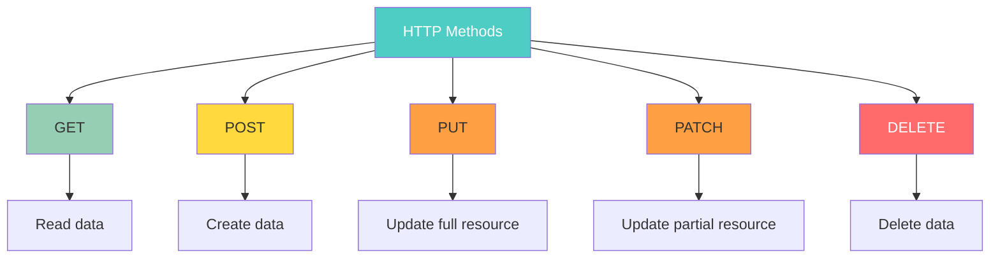

### HTTP Method Examples

```php
<?php
// GET request only
$routes->get(
    '/articles/{id}',
    ['controller' => 'Articles', 'action' => 'view'],
    'articles:view'
);

// POST request only
$routes->post(
    '/articles',
    ['controller' => 'Articles', 'action' => 'add'],
    'articles:add'
);

// PUT request only
$routes->put(
    '/articles/{id}',
    ['controller' => 'Articles', 'action' => 'edit'],
    'articles:edit'
);

// DELETE request only
$routes->delete(
    '/articles/{id}',
    ['controller' => 'Articles', 'action' => 'delete'],
    'articles:delete'
);
?>
```

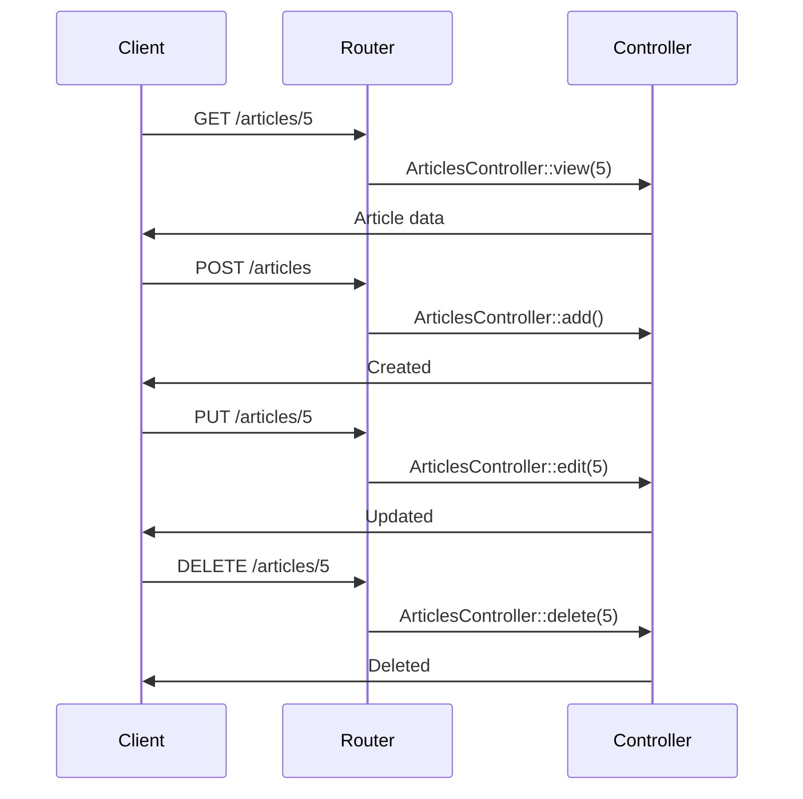

---

## Prefix Routing

Prefixes create admin or special sections with different URLs.

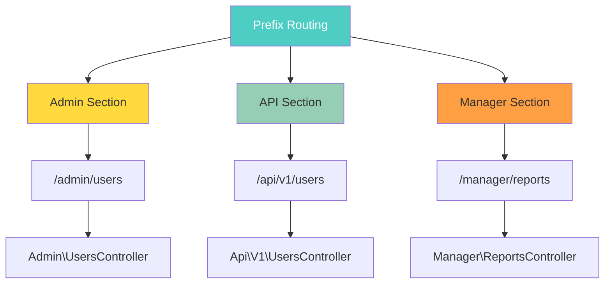

### Admin Prefix Example

```php
<?php
$routes->prefix('Admin', function (RouteBuilder $routes) {
    // All routes here are prefixed with /admin
    $routes->connect('/', ['controller' => 'Dashboard', 'action' => 'index']);
    $routes->connect('/users', ['controller' => 'Users', 'action' => 'index']);
});
?>
```

**File structure:**

```
src/Controller/
└── Admin/
    ├── DashboardController.php
    └── UsersController.php
```

**URLs:**
- `/admin` → `Admin\DashboardController::index()`
- `/admin/users` → `Admin\UsersController::index()`

---

## Plugin Routing

Routes for plugins are created using the `plugin()` method.

```php
<?php
$routes->plugin('DebugKit', function (RouteBuilder $routes) {
    // Routes prefixed with /debug-kit
    $routes->connect('/{controller}');
});
?>
```

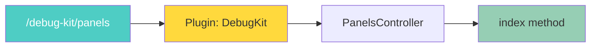

### Combining Prefix and Plugin

```php
<?php
$routes->prefix('Admin', function (RouteBuilder $routes) {
    $routes->plugin('DebugKit', function (RouteBuilder $routes) {
        $routes->connect('/{controller}');
    });
});
?>
```

**Result:** `/admin/debug-kit/{controller}`

---

## RESTful Routes

REST routes create standard API endpoints automatically.

```php
<?php
$routes->scope('/', function (RouteBuilder $routes) {
    $routes->setExtensions(['json']);
    $routes->resources('Articles');
});
?>
```

### Generated Routes

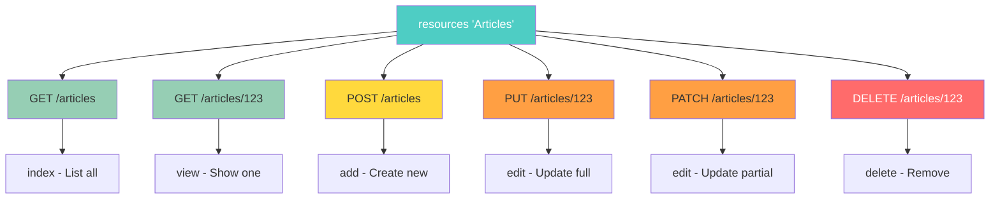

### REST Routes Table

| HTTP Method | URL                  | Controller Action       | Purpose           |
| ----------- | -------------------- | ----------------------- | ----------------- |
| GET         | `/articles`          | `ArticlesController::index()` | List all articles |
| GET         | `/articles/123`      | `ArticlesController::view(123)` | View one article  |
| POST        | `/articles`          | `ArticlesController::add()` | Create article    |
| PUT         | `/articles/123`      | `ArticlesController::edit(123)` | Update article    |
| PATCH       | `/articles/123`      | `ArticlesController::edit(123)` | Partial update    |
| DELETE      | `/articles/123`      | `ArticlesController::delete(123)` | Delete article    |

---

## Generating URLs

### Using Arrays

```php
<?php
// Generate URL from array
echo Router::url([
    'controller' => 'Articles',
    'action' => 'view',
    'id' => 15
]);
// Output: /articles/view/15
?>
```

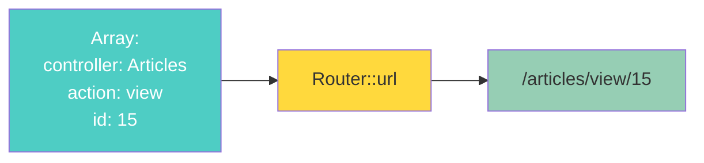

### Using Named Routes

```php
<?php
// Define named route
$routes->connect(
    '/upgrade',
    ['controller' => 'Subscriptions', 'action' => 'create'],
    ['_name' => 'upgrade']
);

// Generate URL
echo Router::url(['_name' => 'upgrade']);
// Output: /upgrade
?>
```

### With Query Strings and Fragments

```php
<?php
Router::url([
    'controller' => 'Articles',
    'action' => 'index',
    '?' => ['page' => 1],
    '#' => 'top'
]);
// Output: /articles/index?page=1#top
?>
```

---

## Quick Examples

### Example 1: Simple Static Route

```php
<?php
$routes->connect('/about', ['controller' => 'Pages', 'action' => 'display', 'about']);
?>
```

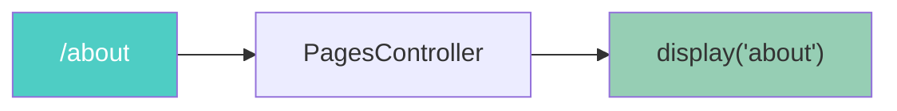

---

### Example 2: Blog Post with Slug

```php
<?php
$routes->connect(
    '/blog/{id}-{slug}',
    ['controller' => 'Blogs', 'action' => 'view']
)
->setPass(['id', 'slug'])
->setPatterns(['id' => '[0-9]+']);
?>
```

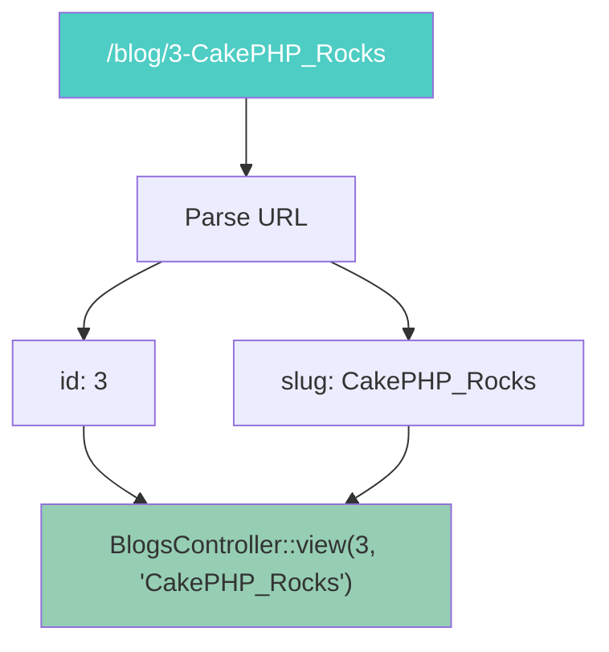

---

### Example 3: Admin Routes

```php
<?php
$routes->prefix('Admin', function (RouteBuilder $routes) {
    $routes->connect('/users', ['controller' => 'Users', 'action' => 'index']);
});
?>
```

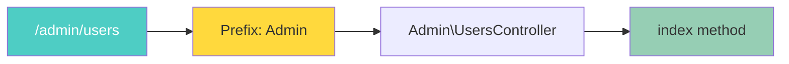

**File location:** `src/Controller/Admin/UsersController.php`

---

### Example 4: API with JSON

```php
<?php
$routes->scope('/api', function (RouteBuilder $routes) {
    $routes->setExtensions(['json']);
    $routes->resources('Articles');
});
?>
```

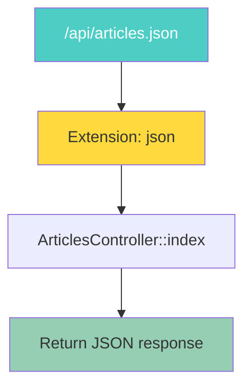

---

## Route Patterns Cheat Sheet

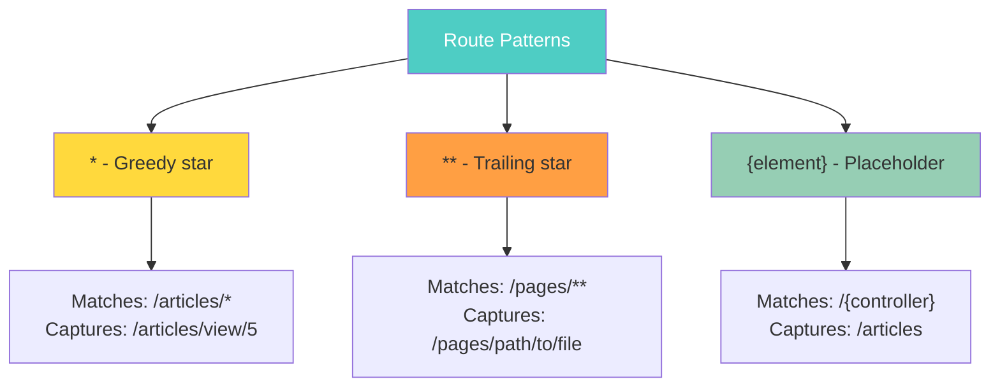

| Pattern         | Example URL           | Captures                    |
| --------------- | --------------------- | --------------------------- |
| `/*`            | `/articles/view/5`    | `['view', 5]`               |
| `/**`           | `/pages/a/b/c`        | `['a/b/c']` (single param)  |
| `/{controller}` | `/articles`           | `controller: 'Articles'`    |
| `/{id}`         | `/123`                | `id: '123'`                 |

---

## Complete Routing Flow

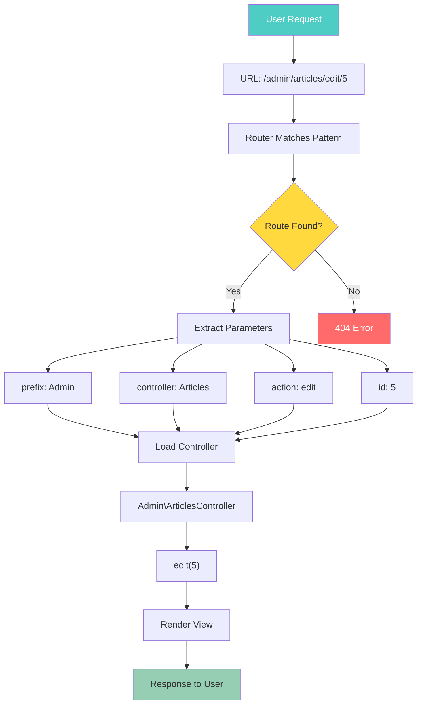

---

## Practical Examples

### Example: Blog System

```php
<?php
$routes->scope('/', function (RouteBuilder $routes) {
    // Homepage
    $routes->connect('/', ['controller' => 'Articles', 'action' => 'index']);
    
    // View article
    $routes->connect(
        '/article/{slug}',
        ['controller' => 'Articles', 'action' => 'view']
    )->setPass(['slug']);
    
    // Category
    $routes->connect(
        '/category/{category}',
        ['controller' => 'Articles', 'action' => 'category']
    )->setPass(['category']);
    
    // Admin section
    $routes->prefix('Admin', function (RouteBuilder $routes) {
        $routes->fallbacks(DashedRoute::class);
    });
});
?>
```

```mermaid
graph TB
    A[Blog Routes] --> B["/"]
    A --> C["/article/{slug}"]
    A --> D["/category/{category}"]
    A --> E["/admin/*"]
    
    B --> B1[Homepage - List articles]
    C --> C1[View single article]
    D --> D1[Articles by category]
    E --> E1[Admin dashboard]
    
    style A fill:#4ecdc4,color:#fff
    style B fill:#96ceb4
    style C fill:#96ceb4
    style D fill:#96ceb4
    style E fill:#ffd93d
```

---

### Example: E-commerce API

```php
<?php
$routes->scope('/api', function (RouteBuilder $routes) {
    $routes->setExtensions(['json', 'xml']);
    
    // Products
    $routes->resources('Products');
    
    // Nested: Product reviews
    $routes->resources('Products', function (RouteBuilder $routes) {
        $routes->resources('Reviews');
    });
});
?>
```

```mermaid
graph TB
    A[API Routes] --> B[Products]
    A --> C[Reviews]
    
    B --> B1[GET /api/products.json]
    B --> B2[GET /api/products/5.json]
    B --> B3[POST /api/products.json]
    
    C --> C1[GET /api/products/5/reviews.json]
    C --> C2[POST /api/products/5/reviews.json]
    
    style A fill:#4ecdc4,color:#fff
    style B fill:#96ceb4
    style C fill:#ffd93d
```

---

## Common Patterns

### Pattern 1: SEO-Friendly URLs

```php
<?php
use Cake\Routing\Route\DashedRoute;

$routes->scope('/', function (RouteBuilder $routes) {
    $routes->setRouteClass(DashedRoute::class);
    $routes->fallbacks();
});
?>
```

**Result:**
- `BlogPostsController` → `/blog-posts`
- `showItems()` action → `/show-items`

---

### Pattern 2: Redirect Old URLs

```php
<?php
$routes->redirect(
    '/old-blog/*',
    ['controller' => 'Articles', 'action' => 'view'],
    ['persist' => true]
);
?>
```

```mermaid
flowchart LR
    A["/old-blog/5"] --> B[Redirect 301]
    B --> C["/articles/view/5"]
    
    style A fill:#ff6b6b,color:#fff
    style B fill:#ffd93d
    style C fill:#96ceb4
```

---

### Pattern 3: Subdomain Routing

```php
<?php
$routes->connect(
    '/images/logo.png',
    ['controller' => 'Images', 'action' => 'logo']
)->setHost('cdn.example.com');
?>
```

```mermaid
flowchart LR
    A["cdn.example.com/images/logo.png"] --> B[Match Host]
    B --> C[ImagesController]
    C --> D[logo method]
    
    E["www.example.com/images/logo.png"] --> F[No Match]
    
    style A fill:#96ceb4
    style D fill:#96ceb4
    style F fill:#ff6b6b,color:#fff
```

---

## Tips and Best Practices

> **Tip:** Use named routes for easier refactoring. Change the URL pattern without updating all your links.

> **Tip:** Use `DashedRoute` for SEO-friendly URLs with hyphens.

> **Tip:** Validate route elements with regex patterns to prevent invalid URLs.

> **Warning:** Avoid using fallback routes in production. Define explicit routes for better performance and security.

> **Important:** Route order matters! More specific routes should come before generic ones.

```mermaid
flowchart TD
    A[Route Order] --> B[Specific Routes First]
    A --> C[Generic Routes Last]
    
    B --> B1["/articles/latest"]
    B --> B2["/articles/{id}"]
    C --> C1["/articles/*"]
    
    D[Wrong Order] --> E["/articles/*"]
    E --> F["/articles/latest"]
    F --> G["❌ 'latest' treated as ID"]
    
    style A fill:#4ecdc4,color:#fff
    style B fill:#96ceb4
    style C fill:#ffd93d
    style G fill:#ff6b6b,color:#fff
```

---

## Quick Reference

### Basic Syntax

```php
<?php
// Simple route
$routes->connect('/url', ['controller' => 'Name', 'action' => 'method']);

// With placeholder
$routes->connect('/{controller}/{action}/*');

// With validation
$routes->connect('/articles/{id}', ['controller' => 'Articles', 'action' => 'view'])
    ->setPatterns(['id' => '\d+']);

// Named route
$routes->connect('/login', ['controller' => 'Users', 'action' => 'login'], ['_name' => 'login']);

// HTTP method
$routes->get('/articles', ['controller' => 'Articles', 'action' => 'index']);

// Prefix
$routes->prefix('Admin', function ($routes) { /* routes */ });

// Plugin
$routes->plugin('DebugKit', function ($routes) { /* routes */ });

// REST
$routes->resources('Articles');
?>
```

---

<nav style="background: var(--bg-secondary); border: 1px solid var(--border-color); border-radius: 6px; padding: 15px 20px; margin: 30px 0;">
  <div style="display: flex; align-items: center; justify-content: space-between; flex-wrap: wrap; gap: 10px;">
    <a href="02-installation-guide.html" style="color: var(--link-color);">← Previous: Installation</a>
    <span style="color: var(--text-secondary);">🛣️ Page 3 of 3</span>
    <a href="index.html" style="color: var(--link-color);">Home →</a>
  </div>
</nav>

---

**Released under the MIT License.**

**Copyright © Cake Software Foundation, Inc. All rights reserved.**
