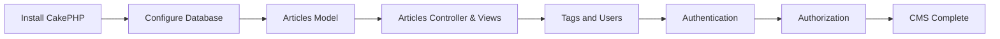

# Content Management Tutorial

> **Source:** [CakePHP Official Documentation](https://book.cakephp.org/5.x/tutorials-and-examples/cms/installation.html)

<nav style="background: var(--bg-secondary); border: 1px solid var(--border-color); border-radius: 6px; padding: 15px 20px; margin: 20px 0;">
  <div style="display: flex; align-items: center; justify-content: space-between; flex-wrap: wrap; gap: 10px;">
    <a href="03-conventions.html" style="color: var(--link-color);">← Previous: Conventions</a>
    <span style="color: var(--text-secondary);">📚 Page 4 of 6</span>
    <a href="05-components.html" style="color: var(--link-color);">Next: Components →</a>
  </div>
</nav>

This tutorial walks you through building a simple CMS (Content Management System) using CakePHP 5.x. You will install CakePHP, configure a database, build an articles workflow, add tags and users, and secure the app with authentication and authorization.

## Table of Contents

- [Overview](#overview)
- [Installation](#installation)
- [Verify Installation](#verify-installation)
- [Database Setup](#database-setup)
- [Articles Model](#articles-model)
- [Articles Controller and Views](#articles-controller-and-views)
- [Tags and Users](#tags-and-users)
- [Authentication](#authentication)
- [Authorization](#authorization)
- [Wrap Up](#wrap-up)

---

## Overview



You will build:

- A database schema for articles, tags, and users
- A model layer with tables and entities
- Controller actions and templates to list, view, add, edit, and delete articles
- Tagging, user CRUD, and finder methods
- Authentication and authorization plugins

---

## Installation

### Requirements

- PHP 8.2 or higher (CLI and web server)
- Composer

### Install CakePHP with Composer

```bash
#!/bin/bash
curl -s https://getcomposer.org/installer | php
```

```bash
#!/bin/bash
php composer.phar create-project --prefer-dist cakephp/app:5.3 cms
```

---

## Verify Installation

Start the development server:

```bash
#!/bin/bash
bin/cake server
```

Open http://localhost:8765 to confirm the welcome page loads.

---

## Database Setup

Create an empty database (for example, `cake_cms`) and configure it in `config/app_local.php`:

```php
<?php
declare(strict_types=1);

return [
    'Datasources' => [
        'default' => [
            'host' => 'localhost',
            'username' => 'your_user',
            'password' => 'your_password',
            'database' => 'cake_cms',
            'url' => env('DATABASE_URL', null),
        ],
    ],
];
?>
```

### Migrations (Recommended)

```bash
#!/bin/bash
bin/cake bake migration CreateUsers email:string password:string created modified
bin/cake bake migration CreateArticles user_id:integer title:string slug:string[191]:unique body:text published:boolean created modified
bin/cake bake migration CreateTags title:string[191]:unique created modified
bin/cake bake migration CreateArticlesTags article_id:integer:primary tag_id:integer:primary created modified

bin/cake migrations migrate
```

If you use the `articles_tags` migration, remove auto-increment from the composite key columns before running the migration.

---

## Articles Model

Create a table class in `src/Model/Table/ArticlesTable.php`:

```php
<?php
declare(strict_types=1);

namespace App\Model\Table;

use Cake\ORM\Table;

class ArticlesTable extends Table
{
    public function initialize(array $config): void
    {
        parent::initialize($config);
        $this->addBehavior('Timestamp');
    }
}
?>
```

Create an entity in `src/Model/Entity/Article.php`:

```php
<?php
declare(strict_types=1);

namespace App\Model\Entity;

use Cake\ORM\Entity;

class Article extends Entity
{
    protected array $_accessible = [
        'user_id' => true,
        'title' => true,
        'slug' => true,
        'body' => true,
        'published' => true,
        'created' => true,
        'modified' => true,
        'user' => true,
        'tags' => true,
    ];
}
?>
```

You can also generate these with Bake:

```bash
#!/bin/bash
bin/cake bake model articles
```

---

## Articles Controller and Views

Create `src/Controller/ArticlesController.php` and add an index action:

```php
<?php
declare(strict_types=1);

namespace App\Controller;

class ArticlesController extends AppController
{
    public function index(): void
    {
        $articles = $this->paginate($this->Articles);
        $this->set(compact('articles'));
    }
}
?>
```

A basic view template in `templates/Articles/index.php` might start like:

```html
<h1>Articles</h1>
<table>
  <tr>
    <th>Title</th>
    <th>Created</th>
    <th>Actions</th>
  </tr>
</table>
```

Next, add `view`, `add`, `edit`, and `delete` actions. These actions rely on conventions and helper classes to build forms and render templates.

---

## Tags and Users

Generate user CRUD with Bake:

```bash
bin/cake bake model users
bin/cake bake controller users
bin/cake bake template users
```

Generate tags CRUD:

```bash
bin/cake bake all tags
```

Add a tags association in `ArticlesTable`:

```php
public function initialize(array $config): void
{
    parent::initialize($config);
    $this->addBehavior('Timestamp');
    $this->belongsToMany('Tags');
}
```

To find articles by tag, add a custom finder and a `tags()` action in the controller, then create `templates/Articles/tags.php` to render results.

---

## Authentication

Install the Authentication plugin:

```bash
composer require "cakephp/authentication:^4.0"
```

Add password hashing in `src/Model/Entity/User.php`:

```php
use Authentication\PasswordHasher\DefaultPasswordHasher;

protected function _setPassword(string $password): ?string
{
    if (mb_strlen($password) > 0) {
        return (new DefaultPasswordHasher())->hash($password);
    }
    return null;
}
```

Configure `src/Application.php` to load authentication middleware and add authentication support in `AppController`. Then add `login` and `logout` actions in `UsersController`, and allow public access to `index` and `view`.

---

## Authorization

Install the Authorization plugin:

```bash
composer require "cakephp/authorization:^3.0"
```

Load the plugin and middleware in `src/Application.php`, then add the Authorization component in `AppController`.

Generate a policy and implement access checks:

```bash
bin/cake bake policy --type entity Article
```

Example policy:

```php
<?php
namespace App\Policy;

use App\Model\Entity\Article;
use Authorization\IdentityInterface;

class ArticlePolicy
{
    public function canAdd(IdentityInterface $user, Article $article): bool
    {
        return true;
    }

    public function canEdit(IdentityInterface $user, Article $article): bool
    {
        return $this->isAuthor($user, $article);
    }

    public function canDelete(IdentityInterface $user, Article $article): bool
    {
        return $this->isAuthor($user, $article);
    }

    protected function isAuthor(IdentityInterface $user, Article $article): bool
    {
        return $article->user_id === $user->getIdentifier();
    }
}
```

After adding authorization checks, ensure `user_id` is assigned server-side when creating articles and prevent mass assignment of `user_id` in edit actions.

---

## Wrap Up

You now have a working CMS with:

- Database schema and migrations
- CRUD for articles, tags, and users
- Authentication and authorization
- Tagging and custom finder logic

**Next steps:**

- [Database Basics](https://book.cakephp.org/5.x/orm/database-basics.html)
- [Routing](https://book.cakephp.org/5.x/development/routing.html)
- [Authentication Plugin](https://book.cakephp.org/authentication/4/en/)
- [Authorization Plugin](https://book.cakephp.org/authorization/3/en/)

---

<nav style="background: var(--bg-secondary); border: 1px solid var(--border-color); border-radius: 6px; padding: 15px 20px; margin: 30px 0;">
  <div style="display: flex; align-items: center; justify-content: space-between; flex-wrap: wrap; gap: 10px;">
    <a href="03-conventions.html" style="color: var(--link-color);">← Previous: Conventions</a>
    <span style="color: var(--text-secondary);">📚 Page 4 of 6</span>
    <a href="05-components.html" style="color: var(--link-color);">Next: Components →</a>
  </div>
</nav>

---

**Released under the MIT License.**

**Copyright © Cake Software Foundation, Inc. All rights reserved.**
