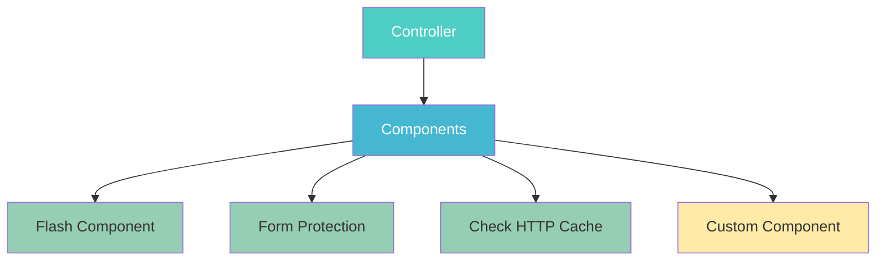
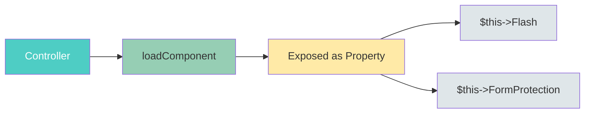
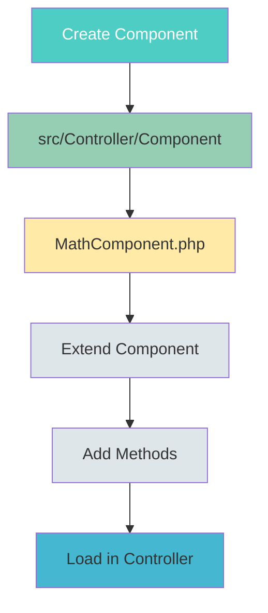
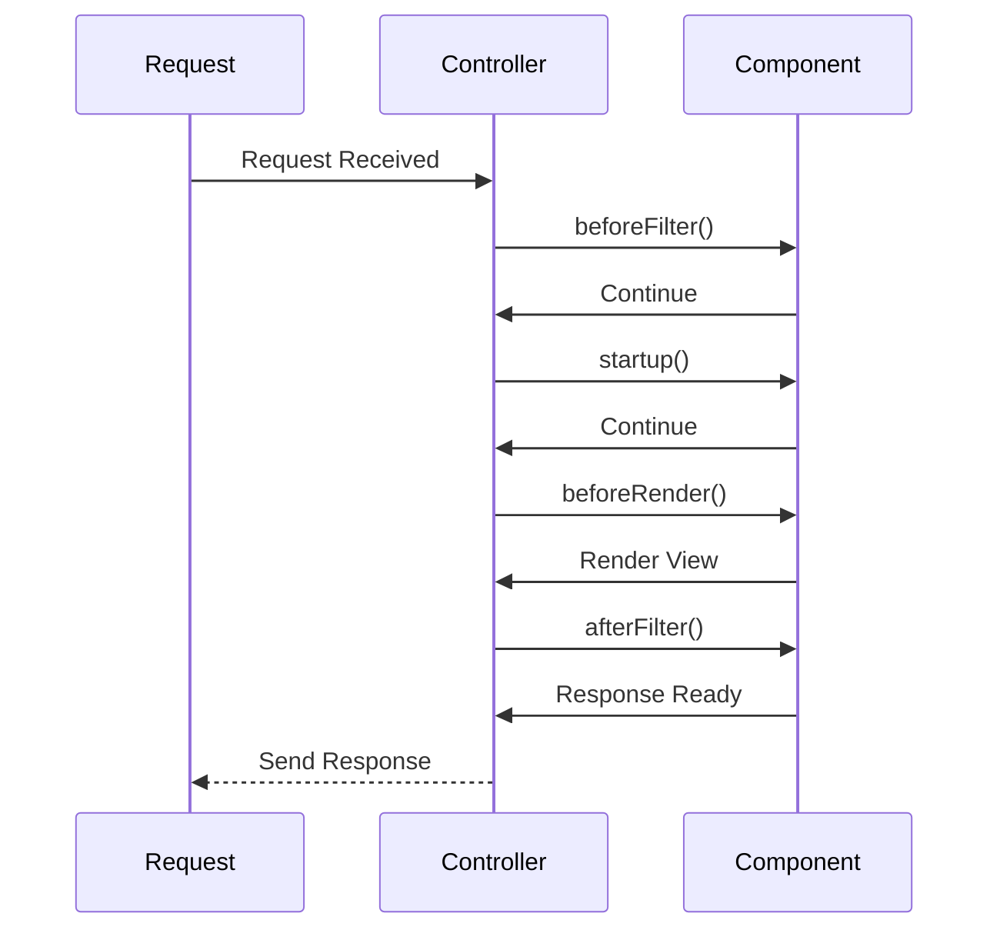
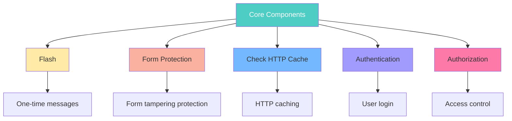
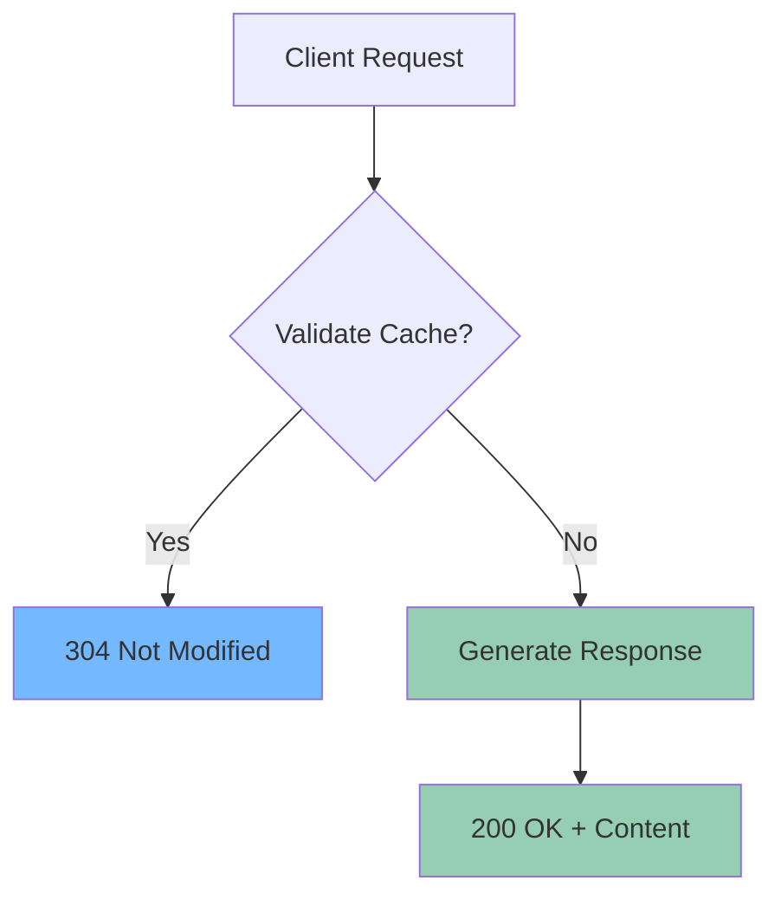
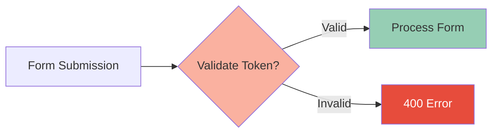

# Controller Components

> **Source:** [CakePHP Official Documentation](https://book.cakephp.org/5.x/controllers/components.html)

<nav style="background: var(--bg-secondary); border: 1px solid var(--border-color); border-radius: 6px; padding: 15px 20px; margin: 20px 0;">
  <div style="display: flex; align-items: center; justify-content: space-between; flex-wrap: wrap; gap: 10px;">
    <a href="04-cms-tutorial.html" style="color: var(--link-color);">← Previous: CMS Tutorial</a>
    <span style="color: var(--text-secondary);">⚙️ Page 5 of 5</span>
    <a href="index.html" style="color: var(--link-color);">Home →</a>
  </div>
</nav>

## Table of Contents

- [What are Components?](#what-are-components)
- [Configuring Components](#configuring-components)
- [Using Components](#using-components)
- [Creating a Component](#creating-a-component)
- [Component Callbacks](#component-callbacks)
- [Core Components](#core-components)

---

## What are Components?

Components are packages of logic that are shared between controllers. They provide a way to organize reusable controller logic.



> **Key Benefits:**
> - Reusable across multiple controllers
> - Keeps controller code clean
> - Organized business logic
> - Shared functionality

> **Important:** Since both Models and Components are added to Controllers as properties they share the same 'namespace'. Be sure to not give a component and a model the same name.

---

## Configuring Components

Many of the core components require configuration. Configuration for these components is usually done via `loadComponent()` in your Controller's `initialize()` method:

```php
<?php
namespace App\Controller;

use App\Controller\AppController;

class PostsController extends AppController
{
    public function initialize(): void
    {
        parent::initialize();
        $this->loadComponent('FormProtection', [
            'unlockedActions' => ['index'],
        ]);
        $this->loadComponent('Flash');
    }
}
?>
```

### Configuration Methods

```mermaid
graph LR
    A[Configuration] --> B[initialize()]
    A --> C[setConfig()]
    A --> D[beforeFilter()]
    
    B --> E[Static Config]
    C --> F[Runtime Config]
    D --> G[Dynamic Config]
    
    style A fill:#4ecdc4,color:#fff
    style B fill:#96ceb4
    style C fill:#ffeaa7
    style D fill:#dfe6e9
```

You can configure components at runtime using the `setConfig()` method:

```php
<?php
public function beforeFilter(EventInterface $event): void
{
    $this->FormProtection->setConfig('unlockedActions', ['index']);
}
?>
```

Like helpers, components implement `getConfig()` and `setConfig()` methods:

```php
<?php
// Read config data.
$this->FormProtection->getConfig('unlockedActions');

// Set config
$this->Flash->setConfig('key', 'myFlash');
?>
```

### Aliasing Components

One common setting is the `className` option, which allows you to alias components:

```php
<?php
// Alias MyFlashComponent to $this->Flash
$this->loadComponent('Flash', [
    'className' => 'MyFlash',
]);
?>
```

> **Note:** Aliasing a component replaces that instance anywhere that component is used, including inside other Components.

---

## Using Components

Once you've included some components in your controller, using them is pretty simple:



```php
<?php
// If you loaded the FlashComponent, you can use it like this:
$this->Flash->success('Your message here');
?>
```

### Loading Components on the Fly

You might not need all components on every action. Load them at runtime:

```php
<?php
$this->loadComponent('Flash');
?>
```

> **Note:** Components loaded on the fly won't have missed callbacks called automatically.

### Using Other Components in your Component

Sometimes one component needs another component:

```php
<?php
namespace App\Controller\Component;

use Cake\Controller\Component;

class MathComponent extends Component
{
    protected $components = ['Flash'];
}
?>
```

> **Note:** In contrast to a component included in a controller, no callbacks will be triggered on a component's component.

### Accessing Component's Controller

From within a Component you can access the controller:

```php
<?php
$controller = $this->getController();
?>
```

---

## Creating a Component

Suppose our application needs a complex mathematical operation in many places. Create a component:



Create the file in `src/Controller/Component/MathComponent.php`:

```php
<?php
namespace App\Controller\Component;

use Cake\Controller\Component;

class MathComponent extends Component
{
    public function calculate($operator, $operand1, $operand2)
    {
        switch ($operator) {
            case 'add':
                return $operand1 + $operand2;
            case 'subtract':
                return $operand1 - $operand2;
            case 'multiply':
                return $operand1 * $operand2;
            case 'divide':
                return $operand1 / $operand2;
        }
    }
}
?>
```

> **Note:** All components must extend `Cake\Controller\Component`.

### Dependency Injection

Components can use Dependency Injection (added in version 5.1.0):

```php
<?php
namespace App\Controller\Component;

use Cake\Controller\Component;
use App\Service\MathService;

class MathComponent extends Component
{
    protected MathService $mathService;

    public function __construct(ComponentCollection $collection, array $config = [], MathService $mathService)
    {
        parent::__construct($collection, $config);
        $this->mathService = $mathService;
    }
}
?>
```

Load it in your controller:

```php
<?php
public function initialize(): void
{
    parent::initialize();
    $this->loadComponent('Math');
}
?>
```

---

## Component Callbacks

Components offer request life-cycle callbacks:



Available callbacks:
- `beforeFilter(EventInterface $event): void` - Called before controller's beforeFilter
- `startup(EventInterface $event): void` - Called after controller's startup
- `beforeRender(EventInterface $event): void` - Called before rendering
- `afterFilter(EventInterface $event): void` - Called after rendering
- `beforeRedirect(EventInterface $event, $url, Response $response): void` - Called on redirect

### Using Redirects in Component Events

To redirect from within a component:

```php
<?php
// Setting redirect as event result
$event->setResult([
    'url' => '/some/path',
    'status' => 302
]);
?>
```

Or raise a `RedirectException`:

```php
<?php
use Cake\Http\Exception\RedirectException;

throw new RedirectException('/some/path');
?>
```

> Raising an exception will halt all other event listeners and create a new response.

---

## Core Components

CakePHP provides several useful core components:



### Flash Component

FlashComponent provides one-time notification messages:

```php
<?php
// Uses templates/element/flash/success.php
$this->Flash->success('This was successful');

// Plain text message
$this->Flash->set('This is a message');
?>
```

#### Options:

| Option | Description |
|--------|-------------|
| `key` | The flash message key (default: 'flash') |
| `clear` | Set to true to overwrite existing messages |
| `params` | Additional parameters for the template |
| `escape` | Set to false to allow HTML |

```php
<?php
$this->Flash->success('Saved!', [
    'key' => 'positive',
    'clear' => true,
    'params' => ['name' => $user->name]
]);
?>
```

> **Note:** By default, CakePHP escapes content in flash messages to prevent XSS.

---

### Check HTTP Cache Component

The HTTP cache validation model helps reduce bandwidth and CPU usage:



Enable it:

```php
<?php
public function initialize(): void
{
    parent::initialize();
    $this->addComponent('CheckHttpCache');
}
?>
```

This automatically activates a `beforeRender` check comparing:
- `If-None-Match` with response `ETag`
- `If-Modified-Since` with response `Last-Modified`

If headers match, view rendering is skipped and a 304 response is returned.

---

### Form Protection Component

The FormProtection Component provides protection against form data tampering:



Enable it:

```php
<?php
public function initialize(): void
{
    parent::initialize();
    $this->loadComponent('FormProtection');
}
?>
```

#### Configuration Options:

| Option | Description |
|--------|-------------|
| `validate` | Set to false to skip validation |
| `unlockedFields` | Fields to exclude from validation |
| `unlockedActions` | Actions to exclude from validation |
| `validationFailureCallback` | Custom callback for failures |

#### Disabling for Specific Actions:

```php
<?php
public function beforeFilter(EventInterface $event): void
{
    parent::beforeFilter($event);
    // Disable for AJAX requests
    $this->FormProtection->setConfig('unlockedActions', ['edit']);
}
?>
```

#### Handling Validation Failure:

```php
<?php
public function beforeFilter(EventInterface $event): void
{
    parent::beforeFilter($event);
    
    $this->FormProtection->setConfig('validationFailureCallback', function ($controller) {
        $controller->response->statusCode(403);
        $controller->response->body('Invalid form submission');
        return $controller->response;
    });
}
?>
```

> **Important:** When using FormProtection, you must use FormHelper to create forms and not override field "name" attributes.

---

<nav style="background: var(--bg-secondary); border: 1px solid var(--border-color); border-radius: 6px; padding: 15px 20px; margin: 30px 0;">
  <div style="display: flex; align-items: center; justify-content: space-between; flex-wrap: wrap; gap: 10px;">
    <a href="04-cms-tutorial.html" style="color: var(--link-color);">← Previous: CMS Tutorial</a>
    <span style="color: var(--text-secondary);">⚙️ Page 5 of 5</span>
    <a href="index.html" style="color: var(--link-color);">Home →</a>
  </div>
</nav>

---

**Released under the MIT License.**

**Copyright © Cake Software Foundation, Inc. All rights reserved.**
