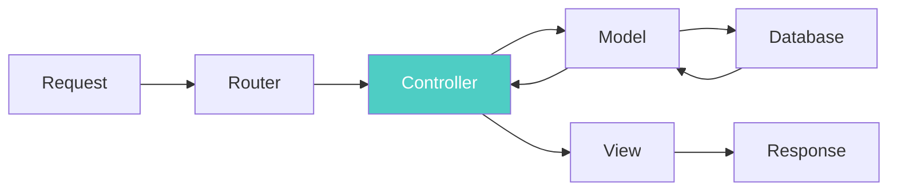
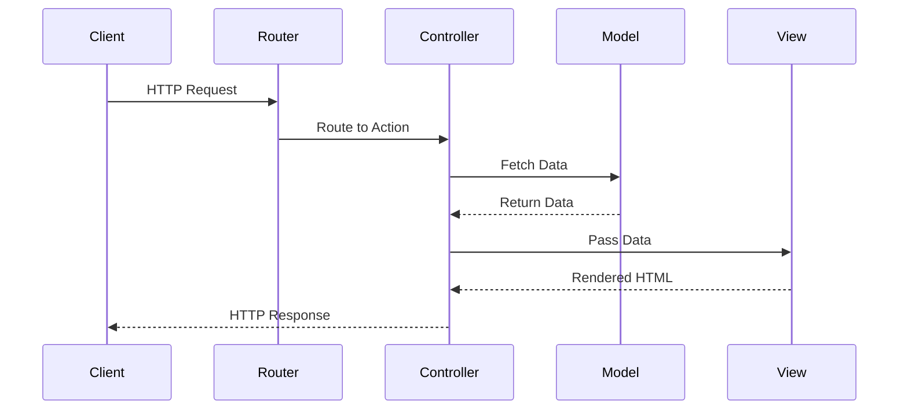
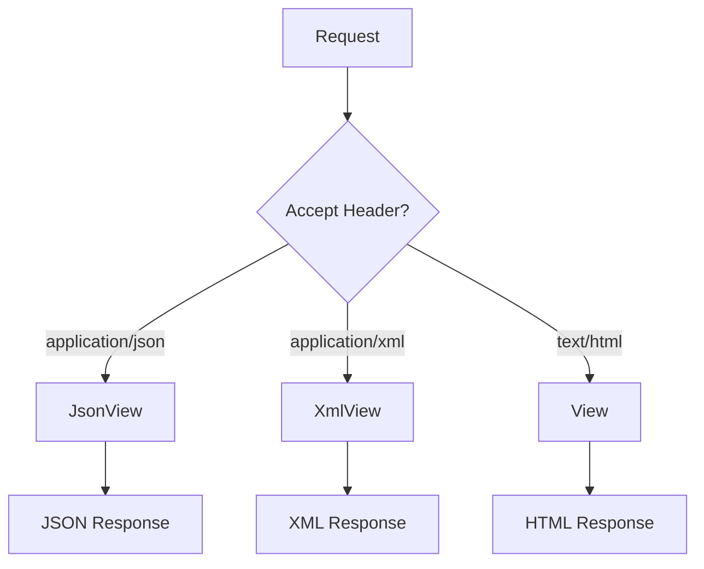
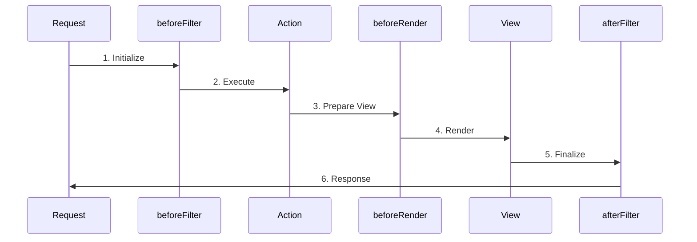
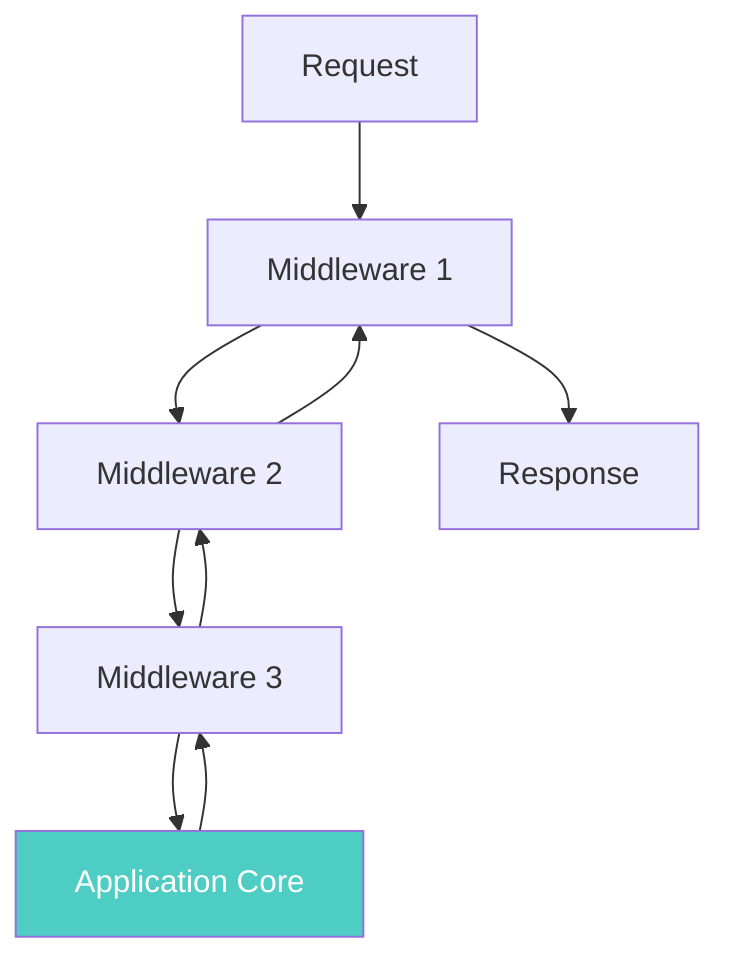
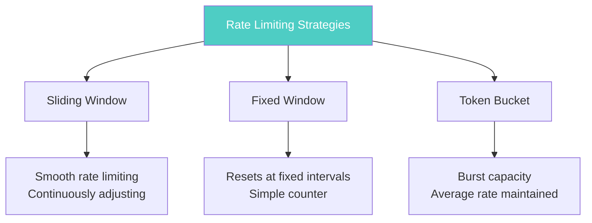
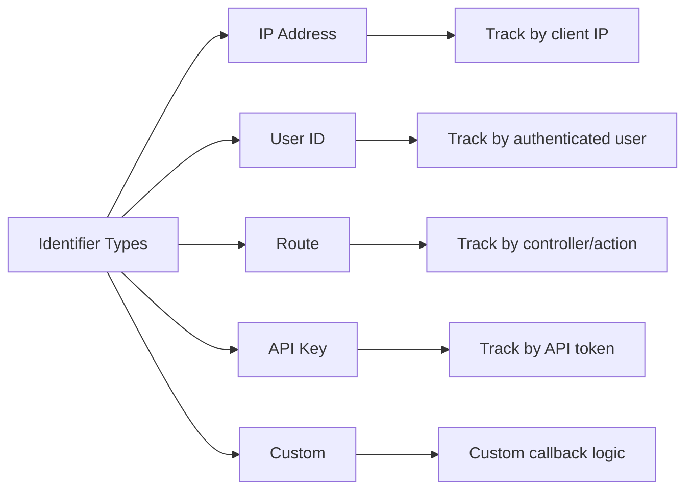
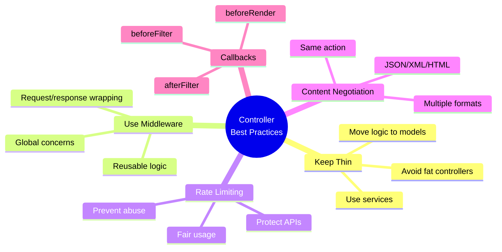

# Controllers

> **Source:** [CakePHP Official Documentation](https://book.cakephp.org/5.x/controllers.html)

<nav style="background: var(--bg-secondary); border: 1px solid var(--border-color); border-radius: 6px; padding: 15px 20px; margin: 20px 0;">
  <div style="display: flex; align-items: center; justify-content: space-between; flex-wrap: wrap; gap: 10px;">
    <a href="05-components.html" style="color: var(--link-color);">← Previous: Components</a>
    <span style="color: var(--text-secondary);">🎮 Page 6 of 6</span>
    <a href="index.html" style="color: var(--link-color);">Home →</a>
  </div>
</nav>

---

## 📋 Table of Contents

- [Introduction](#introduction)
- [The App Controller](#the-app-controller)
- [Request Flow](#request-flow)
- [Controller Actions](#controller-actions)
- [Interacting with Views](#interacting-with-views)
- [Content Type Negotiation](#content-type-negotiation)
- [Redirecting](#redirecting)
- [Loading Models](#loading-models)
- [Request Life-cycle Callbacks](#request-life-cycle-callbacks)
- [Middleware](#middleware)
- [Rate Limiting](#rate-limiting)
- [Pages Controller](#pages-controller)

---

## Introduction

Controllers are the 'C' in MVC. After routing is applied and the correct controller is found, your controller's action is called. Your controller should interpret the request, ensure the right models are called, and return the appropriate response or view.

> **Tip:** Keep Controllers Thin - Move heavy business logic into models and services. Thin controllers are easier to test and reuse.



---

## The App Controller

Your application's controllers extend the `AppController` class, which extends the core `Controller` class. The `AppController` can be defined in `src/Controller/AppController.php` and should contain methods shared between all controllers.

```php
<?php
namespace App\Controller;

use Cake\Controller\Controller;

class AppController extends Controller
{
}
?>
```

### Loading Components

Use the `initialize()` method to load components that will be used in every controller:

```php
<?php
namespace App\Controller;

use Cake\Controller\Controller;

class AppController extends Controller
{
    public function initialize(): void
    {
        // Always enable the FormProtection component.
        $this->loadComponent('FormProtection');
    }
}
?>
```

---

## Request Flow



When a request is made to a CakePHP application:

1. `Cake\Routing\Router` and `Cake\Routing\Dispatcher` use Routes Configuration to find the correct controller
2. Request data is encapsulated in a request object
3. CakePHP puts request information into `$this->request`
4. Controller action is invoked
5. Response is generated and returned

---

## Controller Actions

Controller actions are public methods that handle requests. By convention, CakePHP renders a view with an inflected version of the action name.

```php
<?php
// src/Controller/RecipesController.php

class RecipesController extends AppController
{
    public function view($id)
    {
        // Action logic goes here.
    }

    public function share($customerId, $recipeId)
    {
        // Action logic goes here.
    }

    public function search($query)
    {
        // Action logic goes here.
    }
}
?>
```

Template files for these actions:

- `templates/Recipes/view.php`
- `templates/Recipes/share.php`
- `templates/Recipes/search.php`

---

## Interacting with Views

### Setting View Variables

The `Controller::set()` method is the main way to send data from your controller to your view:

```php
<?php
// First you pass data from the controller:
$this->set('color', 'pink');
?>
```

```php
<?php
// Then, in the view, you can utilize the data:
You have selected <?= h($color) ?> icing for the cake.
?>
```

### Setting Multiple Variables

```php
<?php
$data = [
    'color' => 'pink',
    'type' => 'sugar',
    'base_price' => 23.95,
];

// Make $color, $type, and $base_price
// available to the view:

$this->set($data);
?>
```

> **Warning:** View variables are shared with the layout and elements. Prefer specific keys to avoid accidental collisions.

### Setting View Options

Use `viewBuilder()` to customize the view class, layout, helpers, or theme:

```php
<?php
$this->viewBuilder()
    ->addHelper('MyCustom')
    ->setTheme('Modern')
    ->setClassName('Modern.Admin');
?>
```

### Rendering a View

The `Controller::render()` method is automatically called at the end of each action:

```php
<?php
namespace App\Controller;

class RecipesController extends AppController
{
    public function search()
    {
        // Render the view in templates/Recipes/search.php
        return $this->render();
    }
}
?>
```

> **Tip:** Call `$this->disableAutoRender()` when the action fully handles the response.

### Rendering a Specific Template

```php
<?php
namespace App\Controller;

class PostsController extends AppController
{
    public function myAction()
    {
        return $this->render('custom_file');
    }
}
?>
```

This renders `templates/Posts/custom_file.php` instead of `templates/Posts/my_action.php`.

---

## Content Type Negotiation

Controllers can define a list of view classes they support for content-type negotiation:

```php
<?php
namespace App\Controller;

use Cake\View\JsonView;
use Cake\View\XmlView;

class PostsController extends AppController
{
    public function initialize(): void
    {
        parent::initialize();

        $this->addViewClasses([JsonView::class, XmlView::class]);
    }
}
?>
```

> **Tip:** Use `addViewClasses()` to serve multiple formats from the same action.



### Per-Action Content Types

```php
<?php
public function export(): void
{
    // Use a custom CSV view for data exports.
    $this->addViewClasses([CsvView::class]);

    // Rest of the action code
}
?>
```

### Conditional Data Loading

```php
<?php
// In a controller action

// Load additional data when preparing JSON responses
if ($this->request->is('json')) {
    $query->contain('Authors');
}
?>
```

---

## Redirecting

The `redirect()` method adds a `Location` header and sets the status code:

```php
<?php
// Redirect to another action
return $this->redirect(['action' => 'index']);

// Redirect with status code
return $this->redirect(['action' => 'index'], 301);

// Redirect to external URL
return $this->redirect('https://example.com');
?>
```

---

## Loading Models

### fetchTable()

Load an ORM table that is not the controller's default:

```php
<?php
$articles = $this->fetchTable('Articles');
$recentArticles = $articles->find('all')
    ->where(['created >=' => new DateTime('-1 week')])
    ->toArray();
?>
```

### fetchModel()

Load non-ORM models:

```php
<?php
$service = $this->fetchModel('UserService', 'Custom');
?>
```

---

## Request Life-cycle Callbacks

CakePHP controllers trigger several events/callbacks:



### beforeFilter()

Called before the controller action:

```php
<?php
public function beforeFilter(\Cake\Event\EventInterface $event)
{
    parent::beforeFilter($event);
    // Add your logic here
}
?>
```

### beforeRender()

Called after controller logic but before the view is rendered:

```php
<?php
public function beforeRender(\Cake\Event\EventInterface $event)
{
    parent::beforeRender($event);
    // Add your logic here
}
?>
```

### afterFilter()

Called after the view is rendered:

```php
<?php
public function afterFilter(\Cake\Event\EventInterface $event)
{
    parent::afterFilter($event);
    // Add your logic here
}
?>
```

> **Important:** Remember to call `AppController`'s callbacks within child controller callbacks for best results.

---

## Middleware

Middleware objects give you the ability to 'wrap' your application in re-usable, composable layers of request handling or response building logic.



### Middleware in CakePHP

Middleware are part of the HTTP stack that leverages PSR-7 request and response interfaces. CakePHP supports the PSR-15 standard for server request handlers.

### Using Middleware

Apply middleware globally in your `App\Application` class:

```php
<?php
namespace App;

use Cake\Core\Configure;
use Cake\Error\Middleware\ErrorHandlerMiddleware;
use Cake\Http\BaseApplication;
use Cake\Http\MiddlewareQueue;

class Application extends BaseApplication
{
    public function middleware(MiddlewareQueue $middlewareQueue): MiddlewareQueue
    {
        // Bind the error handler into the middleware queue.
        $middlewareQueue->add(new ErrorHandlerMiddleware(Configure::read('Error'), $this));

        // Add middleware by classname.
        $middlewareQueue->add(UserRateLimiting::class);

        return $middlewareQueue;
    }
}
?>
```

### Middleware Queue Operations

```php
<?php
$layer = new \App\Middleware\CustomMiddleware;

// Added middleware will be last in line.
$middlewareQueue->add($layer);

// Prepended middleware will be first in line.
$middlewareQueue->prepend($layer);

// Insert in a specific slot.
$middlewareQueue->insertAt(2, $layer);

// Insert before another middleware.
$middlewareQueue->insertBefore(
    'Cake\Error\Middleware\ErrorHandlerMiddleware',
    $layer,
);

// Insert after another middleware.
$middlewareQueue->insertAfter(
    'Cake\Error\Middleware\ErrorHandlerMiddleware',
    $layer,
);
?>
```

### Creating Middleware

Middleware must implement `Psr\Http\Server\MiddlewareInterface`:

```php
<?php
// In src/Middleware/TrackingCookieMiddleware.php
namespace App\Middleware;

use Cake\Http\Cookie\Cookie;
use Cake\I18n\Time;
use Psr\Http\Message\ResponseInterface;
use Psr\Http\Message\ServerRequestInterface;
use Psr\Http\Server\RequestHandlerInterface;
use Psr\Http\Server\MiddlewareInterface;

class TrackingCookieMiddleware implements MiddlewareInterface
{
    public function process(
        ServerRequestInterface $request,
        RequestHandlerInterface $handler,
    ): ResponseInterface
    {
        // Calling $handler->handle() delegates control to the *next* middleware
        $response = $handler->handle($request);

        if (!$request->getCookie('landing_page')) {
            $expiry = new Time('+ 1 year');
            $response = $response->withCookie(new Cookie(
                'landing_page',
                $request->getRequestTarget(),
                $expiry,
            ));
        }

        return $response;
    }
}
?>
```

### Routing Middleware

Routing middleware is responsible for applying your application's routes:

```php
<?php
// In Application.php
public function middleware(MiddlewareQueue $middlewareQueue): MiddlewareQueue
{
    // ...
    $middlewareQueue->add(new RoutingMiddleware($this));
}
?>
```

### Encrypted Cookie Middleware

Protect cookie data with encryption:

```php
<?php
use Cake\Http\Middleware\EncryptedCookieMiddleware;

$cookies = new EncryptedCookieMiddleware(
    // Names of cookies to protect
    ['secrets', 'protected'],
    Configure::read('Security.cookieKey'),
);

$middlewareQueue->add($cookies);
?>
```

### Body Parser Middleware

Decode JSON, XML, or other encoded request bodies:

```php
<?php
use Cake\Http\Middleware\BodyParserMiddleware;

// only JSON will be parsed.
$bodies = new BodyParserMiddleware();

// Enable XML parsing
$bodies = new BodyParserMiddleware(['xml' => true]);

// Disable JSON parsing
$bodies = new BodyParserMiddleware(['json' => false]);

// Add your own parser
$bodies = new BodyParserMiddleware();
$bodies->addParser(['text/csv'], function ($body, $request) {
    // Use a CSV parsing library.
    return Csv::parse($body);
});
?>
```

### Controller-Specific Middleware

Define middleware for a specific controller:

```php
<?php
public function initialize(): void
{
    parent::initialize();

    $this->middleware(function ($request, $handler) {
        // Middleware logic
        return $handler->handle($request);
    });
}
?>
```

> **Note:** Middleware defined by a controller will be called before `beforeFilter()` and action methods.

---

## Rate Limiting

> **Added in version 5.3**

The `RateLimitMiddleware` provides configurable rate limiting to protect against abuse and ensure fair usage of resources.

### Basic Usage

```php
<?php
// In src/Application.php
use Cake\Http\Middleware\RateLimitMiddleware;

public function middleware(MiddlewareQueue $middlewareQueue): MiddlewareQueue
{
    $middlewareQueue
        // ... other middleware
        ->add(new RateLimitMiddleware([
            'limit' => 60,        // 60 requests
            'window' => 60,       // per 60 seconds
            'identifier' => RateLimitMiddleware::IDENTIFIER_IP,
        ]));

    return $middlewareQueue;
}
?>
```

When a client exceeds the rate limit, they receive a `429 Too Many Requests` response.

### Rate Limiting Strategies



#### Sliding Window (Default)

```php
<?php
new RateLimitMiddleware([
    'strategy' => RateLimitMiddleware::STRATEGY_SLIDING_WINDOW,
])
?>
```

#### Fixed Window

```php
<?php
new RateLimitMiddleware([
    'strategy' => RateLimitMiddleware::STRATEGY_FIXED_WINDOW,
])
?>
```

#### Token Bucket

```php
<?php
new RateLimitMiddleware([
    'strategy' => RateLimitMiddleware::STRATEGY_TOKEN_BUCKET,
    'limit' => 100,    // bucket capacity
    'window' => 60,    // refill rate
])
?>
```

### Identifier Types



#### IP Address

```php
<?php
new RateLimitMiddleware([
    'identifier' => RateLimitMiddleware::IDENTIFIER_IP,
    'limit' => 100,
    'window' => 60,
])
?>
```

#### User-based

```php
<?php
new RateLimitMiddleware([
    'identifier' => RateLimitMiddleware::IDENTIFIER_USER,
    'limit' => 1000,
    'window' => 3600, // 1 hour
])
?>
```

> **Note:** Requires authentication middleware to be loaded before rate limiting.

#### Route-based

```php
<?php
new RateLimitMiddleware([
    'identifier' => RateLimitMiddleware::IDENTIFIER_ROUTE,
    'limit' => 10,
    'window' => 60,
])
?>
```

#### API Key / Token

```php
<?php
new RateLimitMiddleware([
    'identifier' => RateLimitMiddleware::IDENTIFIER_API_KEY,
    'limit' => 5000,
    'window' => 3600,
])
?>
```

By default, looks for tokens in `Authorization` and `X-API-Key` headers.

#### Custom Identifier

```php
<?php
new RateLimitMiddleware([
    'identifierCallback' => function ($request) {
        // Custom logic to identify the client
        $tenant = $request->getHeader('X-Tenant-ID');
        return 'tenant_' . $tenant[0];
    },
])
?>
```

### Named Limiters

Define multiple limiter configurations and resolve them dynamically:

```php
<?php
new RateLimitMiddleware([
    'limiters' => [
        'default' => [
            'limit' => 60,
            'window' => 60,
        ],
        'api' => [
            'limit' => 1000,
            'window' => 3600,
        ],
        'premium' => [
            'limit' => 10000,
            'window' => 3600,
        ],
    ],
    'limiterResolver' => function ($request) {
        $user = $request->getAttribute('identity');
        if ($user && $user->plan === 'premium') {
            return 'premium';
        }
        if (str_starts_with($request->getPath(), '/api/')) {
            return 'api';
        }
        return 'default';
    },
])
?>
```

### Advanced Rate Limiting

#### Skip Rate Limiting

```php
<?php
new RateLimitMiddleware([
    'skipCheck' => function ($request) {
        // Skip rate limiting for health checks
        return $request->getParam('action') === 'health';
    },
])
?>
```

#### Request Cost

Assign different costs to different request types:

```php
<?php
new RateLimitMiddleware([
    'costCallback' => function ($request) {
        // POST requests cost 5x more
        return $request->getMethod() === 'POST' ? 5 : 1;
    },
])
?>
```

#### Dynamic Limits

Set different limits for different users:

```php
<?php
new RateLimitMiddleware([
    'limitCallback' => function ($request, $identifier) {
        $user = $request->getAttribute('identity');
        if ($user && $user->plan === 'premium') {
            return 10000; // Premium users get higher limit
        }
        return 100; // Free tier limit
    },
])
?>
```

### Rate Limit Headers

When enabled, the middleware adds these headers to responses:

- `X-RateLimit-Limit` - Maximum requests allowed
- `X-RateLimit-Remaining` - Requests remaining in current window
- `X-RateLimit-Reset` - Unix timestamp when limit resets
- `Retry-After` - Seconds until client can retry (when limit exceeded)

### Multiple Rate Limiters

Apply multiple rate limiters with different configurations:

```php
<?php
// Strict limit for login attempts
$middlewareQueue->add(new RateLimitMiddleware([
    'identifier' => RateLimitMiddleware::IDENTIFIER_IP,
    'limit' => 5,
    'window' => 900, // 15 minutes
    'skipCheck' => function ($request) {
        return $request->getParam('action') !== 'login';
    },
]));

// General API rate limit
$middlewareQueue->add(new RateLimitMiddleware([
    'identifier' => RateLimitMiddleware::IDENTIFIER_API_KEY,
    'limit' => 1000,
    'window' => 3600,
]));
?>
```

### Cache Configuration

Configure a persistent cache for rate limiting:

```php
<?php
// In config/app.php
'Cache' => [
    'rate_limit' => [
        'className' => 'Redis',
        'prefix' => 'rate_limit_',
        'duration' => '+1 hour',
    ],
],
?>
```

```php
<?php
new RateLimitMiddleware([
    'cache' => 'rate_limit',
])
?>
```

> **Warning:** The File cache engine is not recommended for production use with rate limiting.

---

## Pages Controller

CakePHP's official skeleton app ships with a default `PagesController.php` for serving static content.

The home page you see after installation is generated using this controller and the view file `templates/Pages/home.php`.

### Usage Example

If you create the view file `templates/Pages/about_us.php`, you can access it using:

```
https://example.com/pages/about_us
```

You are free to modify the Pages Controller to meet your needs.

---

## Configuration Options Summary

### Rate Limiting Configuration

| Option              | Type     | Description                                    | Default                   |
| ------------------- | -------- | ---------------------------------------------- | ------------------------- |
| `limit`             | int      | Maximum requests allowed                       | Required                  |
| `window`            | int      | Time window in seconds                         | Required                  |
| `identifier`        | string   | How to identify clients                        | `IDENTIFIER_IP`           |
| `strategy`          | string   | Rate limiting algorithm                        | `STRATEGY_SLIDING_WINDOW` |
| `cache`             | string   | Cache configuration name                       | `'default'`               |
| `skipCheck`         | callable | Function to skip rate limiting                 | `null`                    |
| `costCallback`      | callable | Function to calculate request cost             | `null`                    |
| `limitCallback`     | callable | Function to dynamically set limits             | `null`                    |
| `keyGenerator`      | callable | Function to customize cache key generation     | `null`                    |
| `includeRetryAfter` | bool     | Include Retry-After header when limit exceeded | `true`                    |

### Identifier Constants

- `RateLimitMiddleware::IDENTIFIER_IP` - Track by IP address
- `RateLimitMiddleware::IDENTIFIER_USER` - Track by authenticated user
- `RateLimitMiddleware::IDENTIFIER_ROUTE` - Track by controller/action
- `RateLimitMiddleware::IDENTIFIER_API_KEY` - Track by API key
- `RateLimitMiddleware::IDENTIFIER_TOKEN` - Track by token

### Strategy Constants

- `RateLimitMiddleware::STRATEGY_SLIDING_WINDOW` - Smooth rate limiting
- `RateLimitMiddleware::STRATEGY_FIXED_WINDOW` - Reset at fixed intervals
- `RateLimitMiddleware::STRATEGY_TOKEN_BUCKET` - Burst capacity with average rate

---

## Best Practices



1. **Keep Controllers Thin** - Move business logic to models and services
2. **Use Middleware** - For cross-cutting concerns like authentication, logging, rate limiting
3. **Content Negotiation** - Support multiple response formats from the same action
4. **Rate Limiting** - Protect your APIs from abuse
5. **Proper Callbacks** - Use lifecycle callbacks for initialization and cleanup
6. **Return Responses** - Always return response objects from actions when needed

---

<nav style="background: var(--bg-secondary); border: 1px solid var(--border-color); border-radius: 6px; padding: 15px 20px; margin: 30px 0;">
  <div style="display: flex; align-items: center; justify-content: space-between; flex-wrap: wrap; gap: 10px;">
    <a href="05-components.html" style="color: var(--link-color);">← Previous: Components</a>
    <span style="color: var(--text-secondary);">🎮 Page 6 of 6</span>
    <a href="index.html" style="color: var(--link-color);">Home →</a>
  </div>
</nav>

---

**Released under the MIT License.**

**Copyright © Cake Software Foundation, Inc. All rights reserved.**
