# Controllers

> **Source:** [CakePHP Official Documentation](https://book.cakephp.org/5.x/controllers.html)

<nav style="background: var(--bg-secondary); border: 1px solid var(--border-color); border-radius: 6px; padding: 15px 20px; margin: 20px 0;">
  <div style="display: flex; align-items: center; justify-content: space-between; flex-wrap: wrap; gap: 10px;">
    <a href="05-components.html" style="color: var(--link-color);">← Previous: Components</a>
    <span style="color: var(--text-secondary);">🎮 Page 6 of 6</span>
    <a href="index.html" style="color: var(--link-color);">Home →</a>
  </div>
</nav>

---

## 📋 Table of Contents

- [Introduction](#introduction)
- [The App Controller](#the-app-controller)
- [Request Flow](#request-flow)
- [Controller Actions](#controller-actions)
- [Interacting with Views](#interacting-with-views)
- [Content Type Negotiation](#content-type-negotiation)
- [Redirecting](#redirecting)
- [Loading Models](#loading-models)
- [Request Life-cycle Callbacks](#request-life-cycle-callbacks)
- [Middleware](#middleware)
- [Rate Limiting](#rate-limiting)
- [Pages Controller](#pages-controller)

---

## Introduction

Controllers are the 'C' in MVC. After routing is applied and the correct controller is found, your controller's action is called. Your controller should interpret the request, ensure the right models are called, and return the appropriate response or view.

> **Tip:** Keep Controllers Thin - Move heavy business logic into models and services. Thin controllers are easier to test and reuse.

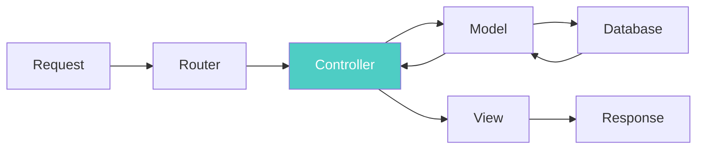

---

## The App Controller

Your application's controllers extend the `AppController` class, which extends the core `Controller` class. The `AppController` can be defined in `src/Controller/AppController.php` and should contain methods shared between all controllers.

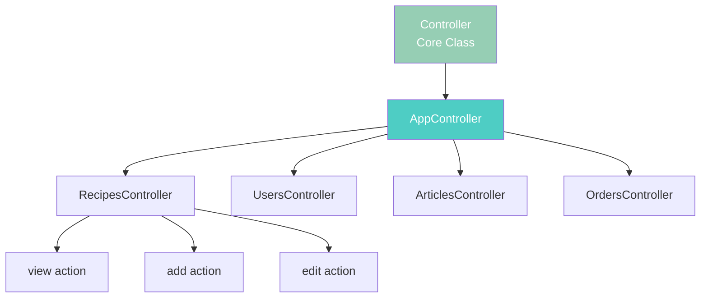

**Basic AppController Structure:**

```php
<?php
namespace App\Controller;

use Cake\Controller\Controller;

class AppController extends Controller
{
    // Shared properties available to all controllers
    protected $helpers = ['Html', 'Form'];

    // Shared methods available to all controllers
    public function isAuthorized($user)
    {
        // Authorization logic
        return false;
    }
}
?>
```

> **Key Concept:** The AppController acts as a base class where you define shared functionality. Any component, helper, or method defined here is automatically available in all your controllers.

### Loading Components

Use the `initialize()` method to load components that will be used in every controller:

```php
<?php
namespace App\Controller;

use Cake\Controller\Controller;

class AppController extends Controller
{
    public function initialize(): void
    {
        // Always enable the FormProtection component.
        $this->loadComponent('FormProtection');

        // Load Flash component for messages
        $this->loadComponent('Flash');

        // Load Authentication component
        $this->loadComponent('Authentication.Authentication');
    }
}
?>
```

**What happens here:**

1. `initialize()` is called automatically after the controller is constructed
2. Components are loaded and configured
3. These components become available as `$this->FormProtection`, `$this->Flash`, etc.
4. All child controllers inherit these loaded components

---

## Request Flow

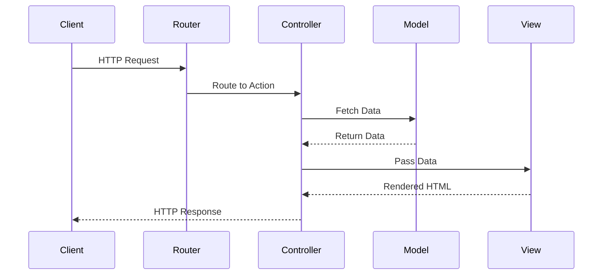

When a request is made to a CakePHP application:

1. `Cake\Routing\Router` and `Cake\Routing\Dispatcher` use Routes Configuration to find the correct controller
2. Request data is encapsulated in a request object
3. CakePHP puts request information into `$this->request`
4. Controller action is invoked
5. Response is generated and returned

---

## Controller Actions

Controller actions are public methods that handle requests. By convention, CakePHP renders a view with an inflected version of the action name.

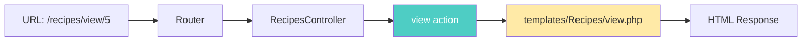

**Example Controller with Actions:**

```php
<?php
// src/Controller/RecipesController.php

class RecipesController extends AppController
{
    // Action: handles /recipes/view/123
    public function view($id)
    {
        // 1. Fetch the recipe from database
        $recipe = $this->Recipes->get($id);

        // 2. Pass data to the view
        $this->set('recipe', $recipe);

        // 3. CakePHP automatically renders templates/Recipes/view.php
    }

    // Action: handles /recipes/share/456/789
    public function share($customerId, $recipeId)
    {
        // 1. Get customer and recipe
        $customer = $this->Customers->get($customerId);
        $recipe = $this->Recipes->get($recipeId);

        // 2. Create sharing record
        $this->RecipeShares->createShare($customer, $recipe);

        // 3. Redirect with success message
        $this->Flash->success('Recipe shared successfully!');
        return $this->redirect(['action' => 'index']);
    }

    // Action: handles /recipes/search?q=chocolate
    public function search($query)
    {
        // 1. Search recipes by query
        $results = $this->Recipes->find('all')
            ->where(['title LIKE' => "%{$query}%"])
            ->toArray();

        // 2. Pass results to view
        $this->set('results', $results);
        $this->set('query', $query);

        // 3. Renders templates/Recipes/search.php
    }
}
?>
```

**Action Flow Breakdown:**

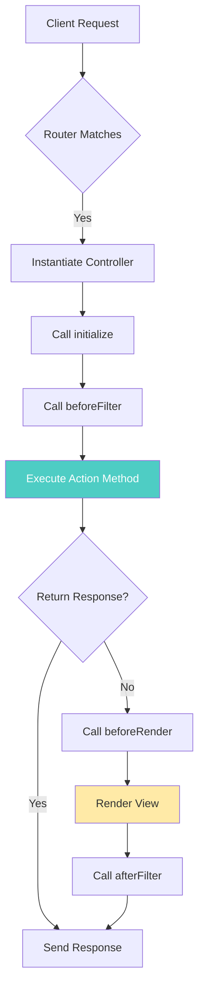

    }

}
?>

````

Template files for these actions:

- `templates/Recipes/view.php`
- `templates/Recipes/share.php`
- `templates/Recipes/search.php`

---

## Interacting with Views

### Setting View Variables

The `Controller::set()` method is the main way to send data from your controller to your view:

```php
<?php
// First you pass data from the controller:
$this->set('color', 'pink');
?>
````

```php
<?php
// Then, in the view, you can utilize the data:
You have selected <?= h($color) ?> icing for the cake.
?>
```

### Setting Multiple Variables

```php
<?php
$data = [
    'color' => 'pink',
    'type' => 'sugar',
    'base_price' => 23.95,
];

// Make $color, $type, and $base_price
// available to the view:

$this->set($data);
?>
```

> **Warning:** View variables are shared with the layout and elements. Prefer specific keys to avoid accidental collisions.

### Setting View Options

Use `viewBuilder()` to customize the view class, layout, helpers, or theme:

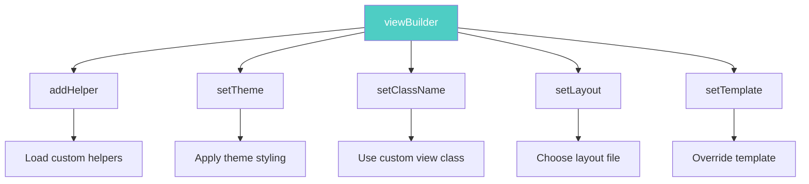

```php
<?php
$this->viewBuilder()
    ->addHelper('MyCustom')      // 1. Load a custom helper for the view
    ->setTheme('Modern')          // 2. Apply the 'Modern' theme
    ->setClassName('Modern.Admin'); // 3. Use a custom view class

// Each method returns the builder, allowing method chaining
// This is called the "fluent interface" pattern
?>
```

### Rendering a View

The `Controller::render()` method is automatically called at the end of each action:

```php
<?php
namespace App\Controller;

class RecipesController extends AppController
{
    public function search()
    {
        // Render the view in templates/Recipes/search.php
        return $this->render();

        // What happens:
        // 1. CakePHP looks for templates/Recipes/search.php
        // 2. View variables are passed to the template
        // 3. Template is rendered with the layout
        // 4. Response object is returned with HTML content
    }
}
?>
```

> **Tip:** Call `$this->disableAutoRender()` when the action fully handles the response.

### Rendering a Specific Template

```php
<?php
namespace App\Controller;

class PostsController extends AppController
{
    public function myAction()
    {
        // Override the default template
        return $this->render('custom_file');

        // Default behavior (without render call):
        // Would render: templates/Posts/my_action.php

        // With render('custom_file'):
        // Renders: templates/Posts/custom_file.php

        // Use case: Reuse the same template for multiple actions
    }
}
?>
```

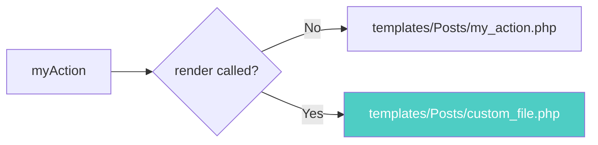

This renders `templates/Posts/custom_file.php` instead of `templates/Posts/my_action.php`.

---

## Content Type Negotiation

Controllers can define a list of view classes they support for content-type negotiation. This allows a single action to serve multiple response formats based on the client's request.

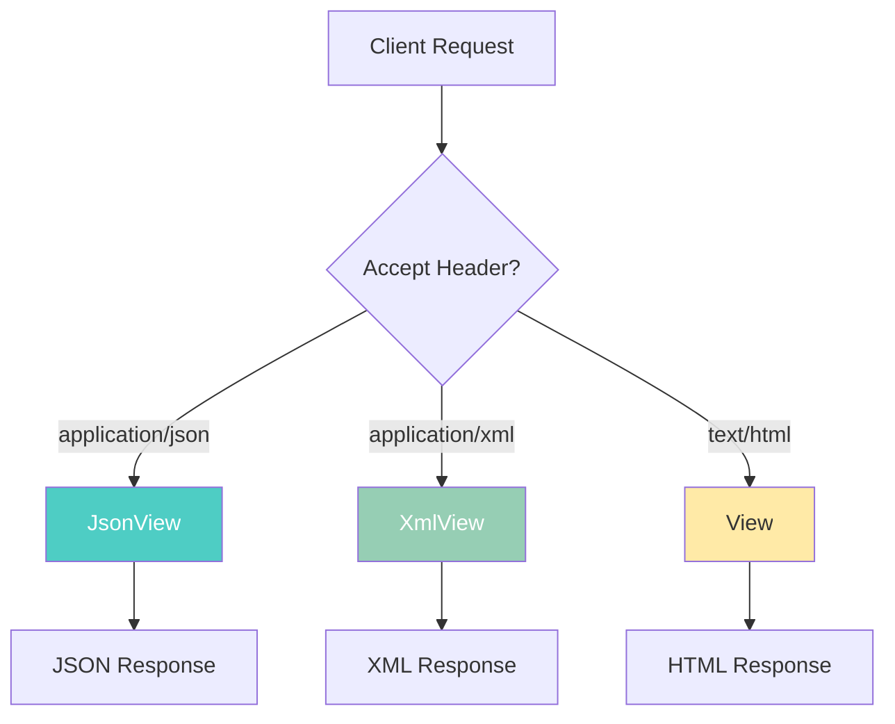

```php
<?php
namespace App\Controller;

use Cake\View\JsonView;
use Cake\View\XmlView;

class PostsController extends AppController
{
    public function initialize(): void
    {
        parent::initialize();

        // Register view classes for content negotiation
        $this->addViewClasses([JsonView::class, XmlView::class]);

        // How it works:
        // 1. Client sends request with Accept header (e.g., "application/json")
        // 2. CakePHP checks registered view classes
        // 3. Matches Accept header to appropriate view class
        // 4. Uses that view class to render the response
    }
}
?>
```

> **Tip:** Use `addViewClasses()` to serve multiple formats from the same action.

### Per-Action Content Types

```php
<?php
public function export(): void
{
    // Use a custom CSV view for data exports.
    $this->addViewClasses([CsvView::class]);

    // Step-by-step:
    // 1. This action only supports CSV format
    // 2. Client must request with Accept: text/csv
    // 3. CsvView will format the data as CSV
    // 4. Response will have Content-Type: text/csv header

    // Rest of the action code
}
?>
```

### Conditional Data Loading

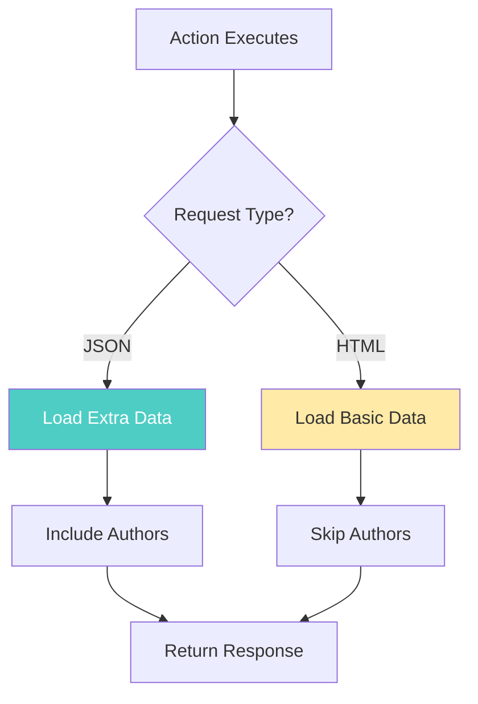

```php
<?php
// In a controller action

// Load additional data when preparing JSON responses
if ($this->request->is('json')) {
    $query->contain('Authors');

    // Why do this?
    // 1. JSON API clients often need related data
    // 2. HTML views might display authors separately
    // 3. Reduces unnecessary database queries for HTML requests
    // 4. Optimizes performance based on response format
}
?>
```

---

## Redirecting

The `redirect()` method adds a `Location` header and sets the status code. This is commonly used after form submissions or to enforce access control.

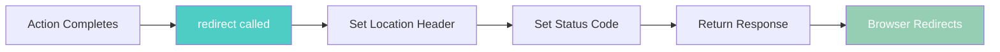

```php
<?php
// Redirect to another action in the same controller
return $this->redirect(['action' => 'index']);
// Result: Redirects to /controller-name/index

// Redirect with status code (301 = Permanent, 302 = Temporary)
return $this->redirect(['action' => 'index'], 301);
// Use 301 when the resource has permanently moved
// Use 302 (default) for temporary redirects

// Redirect to external URL
return $this->redirect('https://example.com');
// Result: Redirects to external site

// Redirect to different controller
return $this->redirect(['controller' => 'Users', 'action' => 'profile', $userId]);
// Result: Redirects to /users/profile/123

// Redirect with named routes
return $this->redirect(['_name' => 'user-profile', 'id' => $userId]);
// Uses named route defined in routes.php
?>
```

**Common Redirect Patterns:**

```php
<?php
// After successful form submission
public function add()
{
    $article = $this->Articles->newEmptyEntity();
    if ($this->request->is('post')) {
        $article = $this->Articles->patchEntity($article, $this->request->getData());
        if ($this->Articles->save($article)) {
            // 1. Show success message
            $this->Flash->success('Article saved!');
            // 2. Redirect to prevent duplicate submissions (POST-Redirect-GET pattern)
            return $this->redirect(['action' => 'view', $article->id]);
        }
    }
    $this->set('article', $article);
}

// Redirect back to referring page
public function cancel()
{
    // 1. Get the referer URL from request
    $referer = $this->request->referer();
    // 2. Redirect back or to default location
    return $this->redirect($referer ?: ['action' => 'index']);
}
?>
```

---

## Loading Models

Controllers automatically load their default table (e.g., `RecipesController` loads `RecipesTable`). Use these methods to load additional models.

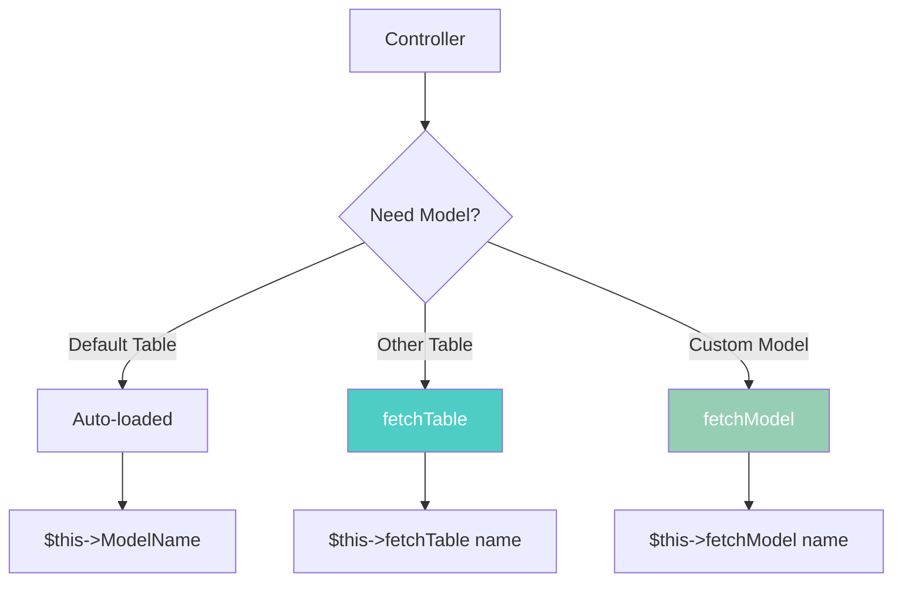

### fetchTable()

Load an ORM table that is not the controller's default:

```php
<?php
// In RecipesController, load the Articles table
$articles = $this->fetchTable('Articles');

// Now you can query the Articles table
$recentArticles = $articles->find('all')
    ->where(['created >=' => new DateTime('-1 week')])
    ->toArray();

// Step-by-step:
// 1. fetchTable('Articles') loads the ArticlesTable class
// 2. Returns a table instance you can query
// 3. Use find() to build a query
// 4. where() adds conditions
// 5. toArray() executes query and returns results

// Common use case: Cross-model operations
$recipe = $this->Recipes->get($id);
$comments = $this->fetchTable('Comments')
    ->find()
    ->where(['recipe_id' => $id])
    ->toArray();
?>
```

### fetchModel()

Load non-ORM models (services, custom data sources):

```php
<?php
// Load a custom service class
$service = $this->fetchModel('UserService', 'Custom');

// What this does:
// 1. Looks for App\Model\Custom\UserService class
// 2. Instantiates the service
// 3. Returns the service instance
// 4. Use for business logic that doesn't fit in tables

// Example service usage:
$result = $service->processUserData($userData);
?>
```

---

## Request Life-cycle Callbacks

CakePHP controllers trigger several events/callbacks during request processing. These hooks let you inject logic at specific points in the request lifecycle.

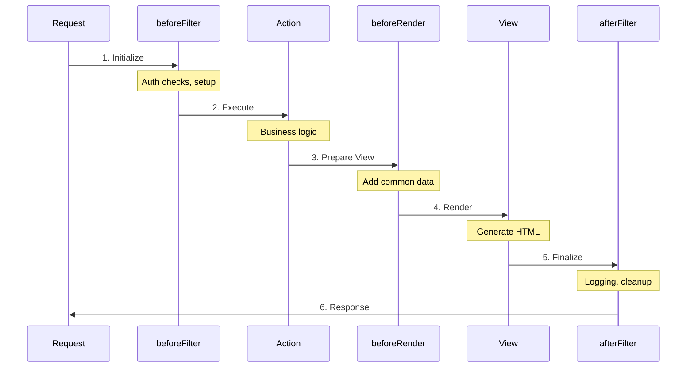

### beforeFilter()

Called before the controller action. Perfect for authentication, authorization, and setup logic:

```php
<?php
public function beforeFilter(\Cake\Event\EventInterface $event)
{
    parent::beforeFilter($event);

    // Common use cases:

    // 1. Authentication check
    if (!$this->Authentication->getIdentity()) {
        return $this->redirect(['controller' => 'Users', 'action' => 'login']);
    }

    // 2. Set common view variables
    $this->set('currentUser', $this->Authentication->getIdentity());

    // 3. Configure components
    $this->Security->setConfig('unlockedActions', ['search']);

    // 4. Log request
    $this->log('Action: ' . $this->request->getParam('action'), 'info');
}
?>
```

### beforeRender()

Called after controller logic but before the view is rendered. Use this to add data needed by all views:

```php
<?php
public function beforeRender(\Cake\Event\EventInterface $event)
{
    parent::beforeRender($event);

    // Common use cases:

    // 1. Add navigation data to all views
    $this->set('menuItems', $this->fetchTable('MenuItems')->find('active')->toArray());

    // 2. Add user preferences
    $user = $this->Authentication->getIdentity();
    $this->set('theme', $user ? $user->theme : 'default');

    // 3. Set layout based on request type
    if ($this->request->is('ajax')) {
        $this->viewBuilder()->setLayout('ajax');
    }

    // 4. Add metadata for SEO
    $this->set('pageTitle', $this->getPageTitle());
}
?>
```

### afterFilter()

Called after the view is rendered. Use for logging, analytics, or response modification:

```php
<?php
public function afterFilter(\Cake\Event\EventInterface $event)
{
    parent::afterFilter($event);

    // Common use cases:

    // 1. Log response time
    $duration = microtime(true) - $this->startTime;
    $this->log("Request completed in {$duration}s", 'info');

    // 2. Track analytics
    $this->Analytics->track([
        'action' => $this->request->getParam('action'),
        'user_id' => $this->Authentication->getIdentity()?->id,
    ]);

    // 3. Add custom headers
    $response = $this->response->withHeader('X-App-Version', '1.0.0');
    $this->setResponse($response);
}
?>
```

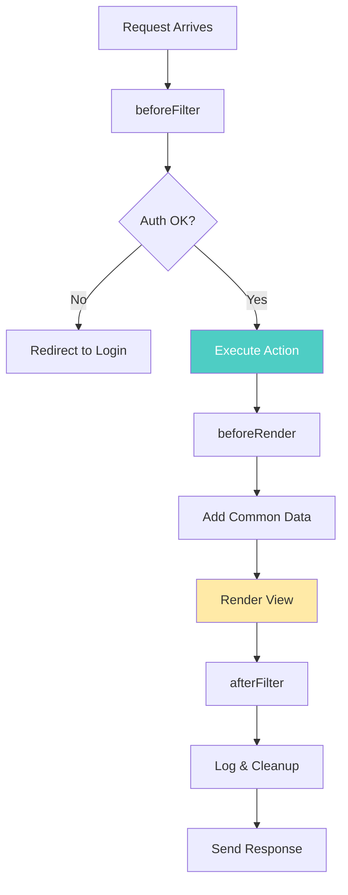

> **Important:** Remember to call `AppController`'s callbacks within child controller callbacks for best results.

---

## Middleware

Middleware objects give you the ability to 'wrap' your application in re-usable, composable layers of request handling or response building logic. Think of middleware as an onion - each layer wraps the next.

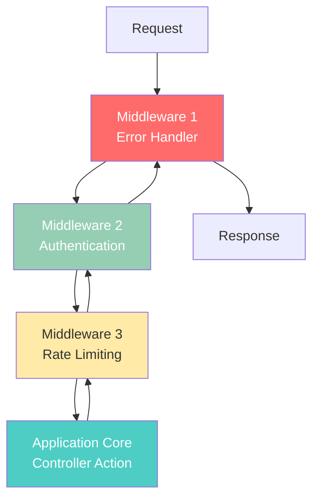

### Middleware in CakePHP

Middleware are part of the HTTP stack that leverages PSR-7 request and response interfaces. CakePHP supports the PSR-15 standard for server request handlers.

**Key Concepts:**

- Each middleware can inspect/modify the request before passing it forward
- Each middleware can inspect/modify the response on the way back
- Middleware execute in the order they're added to the queue
- Each middleware decides whether to pass control to the next layer

### Using Middleware

Apply middleware globally in your `App\Application` class:

```php
<?php
namespace App;

use Cake\Core\Configure;
use Cake\Error\Middleware\ErrorHandlerMiddleware;
use Cake\Http\BaseApplication;
use Cake\Http\MiddlewareQueue;

class Application extends BaseApplication
{
    public function middleware(MiddlewareQueue $middlewareQueue): MiddlewareQueue
    {
        // Bind the error handler into the middleware queue.
        $middlewareQueue->add(new ErrorHandlerMiddleware(Configure::read('Error'), $this));
        // Step 1: Error handler catches exceptions and converts them to error pages

        // Add middleware by classname.
        $middlewareQueue->add(UserRateLimiting::class);
        // Step 2: Rate limiting checks if user has exceeded request limits

        // Execution order:
        // Request → ErrorHandler → RateLimiting → Controller → RateLimiting → ErrorHandler → Response

        return $middlewareQueue;
    }
}
?>
```

### Middleware Queue Operations

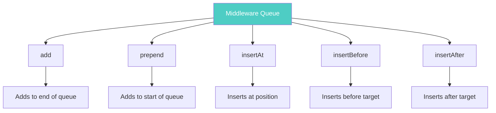

```php
<?php
$layer = new \App\Middleware\CustomMiddleware;

// Added middleware will be last in line.
$middlewareQueue->add($layer);
// Result: [Existing1, Existing2, CustomMiddleware]

// Prepended middleware will be first in line.
$middlewareQueue->prepend($layer);
// Result: [CustomMiddleware, Existing1, Existing2]

// Insert in a specific slot (0-indexed).
$middlewareQueue->insertAt(2, $layer);
// Result: [Existing1, Existing2, CustomMiddleware, Existing3]

// Insert before another middleware.
$middlewareQueue->insertBefore(
    'Cake\Error\Middleware\ErrorHandlerMiddleware',
    $layer,
);
// Result: [CustomMiddleware, ErrorHandlerMiddleware, ...]
// Use case: Run logic before error handling

// Insert after another middleware.
$middlewareQueue->insertAfter(
    'Cake\Error\Middleware\ErrorHandlerMiddleware',
    $layer,
);
// Result: [ErrorHandlerMiddleware, CustomMiddleware, ...]
// Use case: Run logic after error handling but before other middleware
?>
```

### Creating Middleware

Middleware must implement `Psr\Http\Server\MiddlewareInterface`. Here's a complete example with detailed explanations:

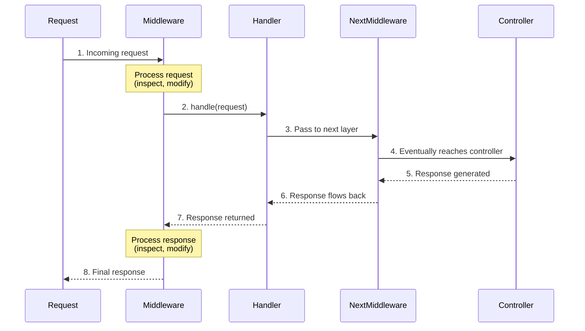

```php
<?php
// In src/Middleware/TrackingCookieMiddleware.php
namespace App\Middleware;

use Cake\Http\Cookie\Cookie;
use Cake\I18n\Time;
use Psr\Http\Message\ResponseInterface;
use Psr\Http\Message\ServerRequestInterface;
use Psr\Http\Server\RequestHandlerInterface;
use Psr\Http\Server\MiddlewareInterface;

class TrackingCookieMiddleware implements MiddlewareInterface
{
    public function process(
        ServerRequestInterface $request,
        RequestHandlerInterface $handler,
    ): ResponseInterface
    {
        // STEP 1: Process the incoming request
        // You can inspect or modify the request here
        // Example: Check headers, validate tokens, log request details

        // STEP 2: Call the next middleware in the chain
        // Calling $handler->handle() delegates control to the *next* middleware
        // This is where the request continues through the middleware stack
        $response = $handler->handle($request);

        // STEP 3: Process the outgoing response
        // At this point, the controller has executed and generated a response
        // You can now inspect or modify the response

        // Check if landing page cookie exists
        if (!$request->getCookie('landing_page')) {
            // Set cookie expiry to 1 year from now
            $expiry = new Time('+ 1 year');

            // Add cookie to response
            $response = $response->withCookie(new Cookie(
                'landing_page',                    // Cookie name
                $request->getRequestTarget(),      // Cookie value (the URL path)
                $expiry,                           // Expiration time
            ));

            // Note: withCookie() returns a NEW response object (immutable)
            // PSR-7 responses are immutable, so always reassign the result
        }

        // STEP 4: Return the (possibly modified) response
        return $response;
    }
}
?>
```

**Key Middleware Concepts:**

1. **Request Phase**: Before calling `$handler->handle()` - inspect/modify incoming request
2. **Delegation**: `$handler->handle($request)` passes control to next middleware
3. **Response Phase**: After `$handler->handle()` returns - inspect/modify outgoing response
4. **Immutability**: PSR-7 objects are immutable, always use `with*()` methods and reassign

### Routing Middleware

Routing middleware is responsible for applying your application's routes:

```php
<?php
// In Application.php
public function middleware(MiddlewareQueue $middlewareQueue): MiddlewareQueue
{
    // ...
    $middlewareQueue->add(new RoutingMiddleware($this));
}
?>
```

### Encrypted Cookie Middleware

Protect cookie data with encryption:

```php
<?php
use Cake\Http\Middleware\EncryptedCookieMiddleware;

$cookies = new EncryptedCookieMiddleware(
    // Names of cookies to protect
    ['secrets', 'protected'],
    Configure::read('Security.cookieKey'),
);

$middlewareQueue->add($cookies);
?>
```

### Body Parser Middleware

Decode JSON, XML, or other encoded request bodies automatically:

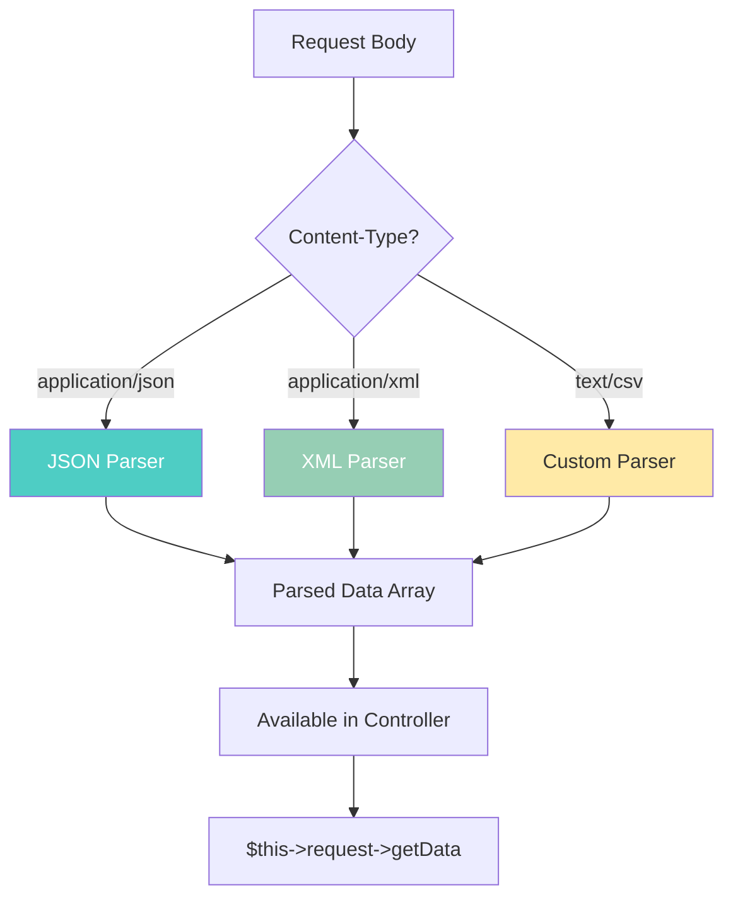

```php
<?php
use Cake\Http\Middleware\BodyParserMiddleware;

// only JSON will be parsed.
$bodies = new BodyParserMiddleware();
// Default: Parses application/json requests

// Enable XML parsing
$bodies = new BodyParserMiddleware(['xml' => true]);
// Now parses both JSON and XML

// Disable JSON parsing
$bodies = new BodyParserMiddleware(['json' => false]);
// Useful if you want to handle JSON manually

// Add your own parser for custom content types
$bodies = new BodyParserMiddleware();
$bodies->addParser(['text/csv'], function ($body, $request) {
    // Use a CSV parsing library.
    return Csv::parse($body);

    // How this works:
    // 1. Middleware checks Content-Type header
    // 2. If it matches 'text/csv', calls this function
    // 3. Function receives raw body string and request object
    // 4. Returns parsed data array
    // 5. Data becomes available via $this->request->getData()
});

// After parsing, access data in controller:
// $data = $this->request->getData();
?>
```

### Controller-Specific Middleware

Define middleware for a specific controller using closures:

```php
<?php
public function initialize(): void
{
    parent::initialize();

    // Add middleware that only applies to this controller
    $this->middleware(function ($request, $handler) {
        // BEFORE: Inspect/modify request before action executes

        // Example: Log all requests to this controller
        $this->log('Request to ' . $request->getParam('action'), 'info');

        // Example: Add custom request attribute
        $request = $request->withAttribute('processed_at', time());

        // Pass to next middleware/controller
        $response = $handler->handle($request);

        // AFTER: Inspect/modify response after action executes

        // Example: Add custom header to all responses
        $response = $response->withHeader('X-Controller', 'CustomController');

        return $response;
    });

    // You can add multiple middleware
    $this->middleware(function ($request, $handler) {
        // This runs after the first middleware
        return $handler->handle($request);
    });
}
?>
```

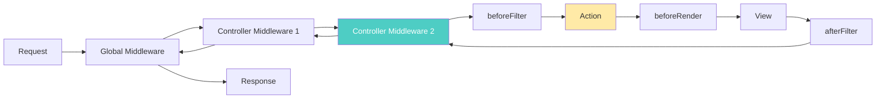

> **Note:** Middleware defined by a controller will be called before `beforeFilter()` and action methods.

---

## Rate Limiting

> **Added in version 5.3**

The `RateLimitMiddleware` provides configurable rate limiting to protect against abuse and ensure fair usage of resources. Rate limiting prevents clients from overwhelming your application with too many requests.

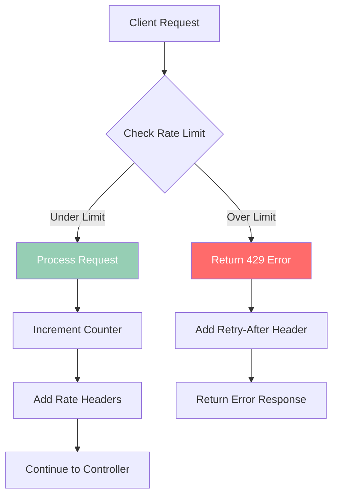

### Basic Usage

```php
<?php
// In src/Application.php
use Cake\Http\Middleware\RateLimitMiddleware;

public function middleware(MiddlewareQueue $middlewareQueue): MiddlewareQueue
{
    $middlewareQueue
        // ... other middleware
        ->add(new RateLimitMiddleware([
            'limit' => 60,        // 60 requests
            'window' => 60,       // per 60 seconds
            'identifier' => RateLimitMiddleware::IDENTIFIER_IP,
        ]));

    // What this does:
    // 1. Tracks requests per IP address
    // 2. Allows 60 requests per 60-second window
    // 3. Returns 429 error when limit exceeded
    // 4. Adds rate limit headers to all responses

    return $middlewareQueue;
}
?>
```

When a client exceeds the rate limit, they receive a `429 Too Many Requests` response.

### Rate Limiting Strategies

Different strategies offer different trade-offs between accuracy, performance, and burst handling.

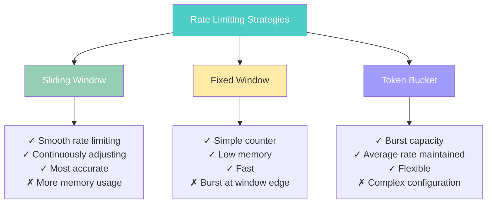

#### Sliding Window (Default)

Best for: Smooth, accurate rate limiting without edge-case bursts

```php
<?php
new RateLimitMiddleware([
    'strategy' => RateLimitMiddleware::STRATEGY_SLIDING_WINDOW,
    'limit' => 100,
    'window' => 60,
])

// How it works:
// 1. Tracks requests with timestamps
// 2. Counts requests in the last N seconds (rolling window)
// 3. Example: At 12:00:30, counts requests from 11:59:30 to 12:00:30
// 4. At 12:00:31, counts requests from 11:59:31 to 12:00:31
// 5. Window continuously slides forward
?>
```

#### Fixed Window

Best for: Simple rate limiting with minimal overhead

```php
<?php
new RateLimitMiddleware([
    'strategy' => RateLimitMiddleware::STRATEGY_FIXED_WINDOW,
    'limit' => 100,
    'window' => 60,
])

// How it works:
// 1. Window starts at fixed time (e.g., 12:00:00)
// 2. Counts all requests until 12:01:00
// 3. Counter resets to 0 at 12:01:00
// 4. New window starts
// 5. Warning: User could make 100 requests at 12:00:59 and 100 at 12:01:00
?>
```

#### Token Bucket

Best for: Allowing bursts while maintaining average rate

```php
<?php
new RateLimitMiddleware([
    'strategy' => RateLimitMiddleware::STRATEGY_TOKEN_BUCKET,
    'limit' => 100,    // bucket capacity (max burst)
    'window' => 60,    // refill rate (tokens per window)
])

// How it works:
// 1. Bucket starts with 100 tokens
// 2. Each request consumes 1 token
// 3. Tokens refill at rate of 100 per 60 seconds (~1.67/second)
// 4. Allows bursts up to bucket capacity
// 5. Maintains average rate over time
// 6. Example: Can burst 100 requests immediately, then ~1.67/second
?>
```

### Identifier Types

```mermaid
flowchart LR
    A[Identifier Types] --> B[IP Address]
    A --> C[User ID]
    A --> D[Route]
    A --> E[API Key]
    A --> F[Custom]

    B --> B1[Track by client IP]
    C --> C1[Track by authenticated user]
    D --> D1[Track by controller/action]
    E --> E1[Track by API token]
    F --> F1[Custom callback logic]
```

#### IP Address

Track rate limits by client IP address (most common approach):

```php
<?php
new RateLimitMiddleware([
    'identifier' => RateLimitMiddleware::IDENTIFIER_IP,
    'limit' => 100,
    'window' => 60,
])

// How it works:
// 1. Gets client IP from $request->clientIp()
// 2. Each IP address gets its own rate limit counter
// 3. Requests from 192.168.1.1 don't affect 192.168.1.2
// 4. Simple and effective for public-facing applications

// Use case: Protect public endpoints from abuse
?>
```

```mermaid
flowchart LR
    A[Requests] --> B[IP Identifier]
    B --> C[192.168.1.1]
    B --> D[192.168.1.2]
    B --> E[10.0.0.5]

    C --> F[Counter: 45/100]
    D --> G[Counter: 12/100]
    E --> H[Counter: 89/100]

    style B fill:#4ecdc4,color:#fff
```

#### User-based

Track rate limits per authenticated user:

```php
<?php
new RateLimitMiddleware([
    'identifier' => RateLimitMiddleware::IDENTIFIER_USER,
    'limit' => 1000,
    'window' => 3600, // 1 hour
])

// How it works:
// 1. Requires authentication middleware to be loaded first
// 2. Gets user ID from $request->getAttribute('identity')
// 3. Each user gets their own rate limit counter
// 4. User A's requests don't affect User B's limit

// Use case: SaaS applications where each user has a quota
?>
```

```mermaid
flowchart LR
    A[Request] --> B[Get User ID]
    B --> C[User 123]
    B --> D[User 456]
    B --> E[User 789]

    C --> F[Counter: 45/1000]
    D --> G[Counter: 892/1000]
    E --> H[Counter: 12/1000]

    style B fill:#4ecdc4,color:#fff
```

> **Note:** Requires authentication middleware to be loaded before rate limiting.

#### Route-based

Track rate limits per controller/action combination:

```php
<?php
new RateLimitMiddleware([
    'identifier' => RateLimitMiddleware::IDENTIFIER_ROUTE,
    'limit' => 10,
    'window' => 60,
])

// How it works:
// 1. Creates identifier from controller + action
// 2. Example: "Articles::view" or "Users::login"
// 3. Each route gets its own rate limit counter
// 4. All users share the same counter for each route

// Use case: Protect expensive operations
// - /articles/export → 10 requests/minute (all users combined)
// - /search/advanced → 20 requests/minute (all users combined)
?>
```

```mermaid
flowchart TD
    A[Requests] --> B[Route Identifier]
    B --> C[Articles::view]
    B --> D[Users::login]
    B --> E[Search::advanced]

    C --> F[Counter: 8/10]
    D --> G[Counter: 3/10]
    E --> H[Counter: 15/20]

    style B fill:#4ecdc4,color:#fff
```

#### API Key / Token

Track rate limits by API key or authentication token:

```php
<?php
new RateLimitMiddleware([
    'identifier' => RateLimitMiddleware::IDENTIFIER_API_KEY,
    'limit' => 5000,
    'window' => 3600,
])

// How it works:
// 1. Looks for API key in request headers
// 2. Checks 'Authorization' header first
// 3. Falls back to 'X-API-Key' header
// 4. Each API key gets its own rate limit counter

// Example request headers:
// Authorization: Bearer abc123xyz
// OR
// X-API-Key: abc123xyz
?>
```

```mermaid
flowchart LR
    A[Request] --> B{Header?}
    B -->|Authorization| C[Extract Token]
    B -->|X-API-Key| C

    C --> D[API Key: abc123]
    C --> E[API Key: xyz789]

    D --> F[Counter: 2341/5000]
    E --> G[Counter: 89/5000]

    style C fill:#4ecdc4,color:#fff
```

By default, looks for tokens in `Authorization` and `X-API-Key` headers.

**Use Cases:**

- Public APIs with API key authentication
- Third-party integrations
- Mobile app backends
- Microservices communication

#### Custom Identifier

Create your own logic to identify clients:

```php
<?php
new RateLimitMiddleware([
    'identifierCallback' => function ($request) {
        // Custom logic to identify the client

        // Example 1: Multi-tenant application
        $tenant = $request->getHeader('X-Tenant-ID');
        return 'tenant_' . $tenant[0];

        // Example 2: Combine IP and user agent
        $ip = $request->clientIp();
        $userAgent = $request->getHeaderLine('User-Agent');
        return md5($ip . $userAgent);

        // Example 3: Use session ID
        $session = $request->getAttribute('session');
        return 'session_' . $session->id();

        // The returned string becomes the cache key for rate limiting
        // Different identifiers = separate rate limit counters
    },
])
?>
```

```mermaid
flowchart TD
    A[identifierCallback] --> B{Logic Type?}
    B -->|Tenant ID| C[tenant_123]
    B -->|IP + User Agent| D[hash_abc...]
    B -->|Session ID| E[session_xyz]

    C --> F[Separate Counter]
    D --> F
    E --> F

    F --> G[Track Requests]

    style A fill:#4ecdc4,color:#fff
```

### Named Limiters

Define multiple limiter configurations and resolve them dynamically based on request context:

```mermaid
flowchart TD
    A[Request] --> B[limiterResolver]
    B --> C{User Type?}
    C -->|Premium| D[10000 req/hour]
    C -->|API Path| E[1000 req/hour]
    C -->|Default| F[60 req/hour]

    D --> G[Apply Limit]
    E --> G
    F --> G

    style B fill:#4ecdc4,color:#fff
    style D fill:#96ceb4,color:#fff
    style E fill:#ffeaa7,color:#333
    style F fill:#ff6b6b,color:#fff
```

```php
<?php
new RateLimitMiddleware([
    // Define multiple named limiters
    'limiters' => [
        'default' => [
            'limit' => 60,
            'window' => 60,
        ],
        'api' => [
            'limit' => 1000,
            'window' => 3600,
        ],
        'premium' => [
            'limit' => 10000,
            'window' => 3600,
        ],
    ],

    // Resolver function decides which limiter to use
    'limiterResolver' => function ($request) {
        // STEP 1: Check if user is premium
        $user = $request->getAttribute('identity');
        if ($user && $user->plan === 'premium') {
            return 'premium';  // Use premium limiter (10000/hour)
        }

        // STEP 2: Check if this is an API request
        if (str_starts_with($request->getPath(), '/api/')) {
            return 'api';  // Use API limiter (1000/hour)
        }

        // STEP 3: Default for all other requests
        return 'default';  // Use default limiter (60/hour)

        // Each limiter maintains its own counter
        // Premium users and API requests get higher limits
    },
])

// Real-world example: E-commerce site
// - Free users: 100 requests/hour
// - Paid users: 1000 requests/hour
// - Admin users: 10000 requests/hour
// - Public API: 500 requests/hour
?>
```

### Advanced Rate Limiting

#### Skip Rate Limiting

Exclude certain requests from rate limiting:

```php
<?php
new RateLimitMiddleware([
    'limit' => 100,
    'window' => 60,

    'skipCheck' => function ($request) {
        // STEP 1: Skip health checks (monitoring systems)
        if ($request->getParam('action') === 'health') {
            return true;  // Don't rate limit health checks
        }

        // STEP 2: Skip internal API calls
        $apiKey = $request->getHeader('X-Internal-API-Key');
        if ($apiKey && $apiKey[0] === Configure::read('InternalApiKey')) {
            return true;  // Internal services bypass rate limiting
        }

        // STEP 3: Skip admin users
        $user = $request->getAttribute('identity');
        if ($user && $user->role === 'admin') {
            return true;  // Admins are not rate limited
        }

        // STEP 4: Skip specific IP addresses (trusted partners)
        $trustedIps = ['192.168.1.100', '10.0.0.50'];
        if (in_array($request->clientIp(), $trustedIps)) {
            return true;
        }

        // Return false to apply rate limiting
        return false;
    },
])
?>
```

```mermaid
flowchart TD
    A[Request] --> B[skipCheck]
    B --> C{Should Skip?}
    C -->|Health Check| D[Skip ✓]
    C -->|Internal API| D
    C -->|Admin User| D
    C -->|Trusted IP| D
    C -->|Regular Request| E[Apply Rate Limit]

    D --> F[Process Without Limit]
    E --> G[Check Limit]

    style D fill:#96ceb4,color:#fff
    style E fill:#ffeaa7,color:#333
```

#### Request Cost

Assign different costs to different request types. Some operations are more expensive than others:

```mermaid
flowchart LR
    A[Request] --> B{Method?}
    B -->|GET| C[Cost: 1]
    B -->|POST| D[Cost: 5]
    B -->|DELETE| E[Cost: 10]

    C --> F[Deduct from Limit]
    D --> F
    E --> F

    style D fill:#ffeaa7,color:#333
    style E fill:#ff6b6b,color:#fff
```

```php
<?php
new RateLimitMiddleware([
    'limit' => 100,  // 100 "points" per window
    'window' => 60,

    'costCallback' => function ($request) {
        // Assign costs based on request characteristics

        // Example 1: Method-based costs
        $method = $request->getMethod();
        if ($method === 'POST') {
            return 5;  // POST costs 5 points (writes are expensive)
        }
        if ($method === 'DELETE') {
            return 10;  // DELETE costs 10 points (destructive)
        }
        return 1;  // GET costs 1 point (reads are cheap)

        // Example 2: Endpoint-based costs
        $path = $request->getPath();
        if (str_contains($path, '/export')) {
            return 20;  // Export operations are expensive
        }
        if (str_contains($path, '/search')) {
            return 3;   // Search operations are moderate
        }
        return 1;

        // Real-world scenario:
        // User has 100 points per minute
        // - 100 GET requests OR
        // - 20 POST requests OR
        // - 10 DELETE requests OR
        // - 5 export operations
    },
])
?>
```

#### Dynamic Limits

Set different limits for different users based on their subscription tier or role:

```mermaid
flowchart TD
    A[Request] --> B[limitCallback]
    B --> C{User Plan?}
    C -->|Premium| D[10000 requests]
    C -->|Pro| E[1000 requests]
    C -->|Free| F[100 requests]
    C -->|Anonymous| G[10 requests]

    D --> H[Apply Limit]
    E --> H
    F --> H
    G --> H

    style B fill:#4ecdc4,color:#fff
    style D fill:#96ceb4,color:#fff
```

```php
<?php
new RateLimitMiddleware([
    'limitCallback' => function ($request, $identifier) {
        // Get authenticated user
        $user = $request->getAttribute('identity');

        // STEP 1: Check user subscription tier
        if ($user && $user->plan === 'premium') {
            return 10000; // Premium users: 10k requests/hour
        }

        // STEP 2: Check for pro users
        if ($user && $user->plan === 'pro') {
            return 1000;  // Pro users: 1k requests/hour
        }

        // STEP 3: Check for authenticated free users
        if ($user) {
            return 100;   // Free tier: 100 requests/hour
        }

        // STEP 4: Anonymous users get lowest limit
        return 10;        // Anonymous: 10 requests/hour

        // The $identifier parameter contains the client identifier
        // You can use it for additional logic if needed
    },
])

// Alternative: Database-driven limits
new RateLimitMiddleware([
    'limitCallback' => function ($request, $identifier) {
        $user = $request->getAttribute('identity');
        if ($user) {
            // Fetch limit from database
            $settings = $this->fetchTable('UserSettings')
                ->find()
                ->where(['user_id' => $user->id])
                ->first();
            return $settings->rate_limit ?? 100;
        }
        return 10;
    },
])
?>
```

### Rate Limit Headers

When enabled, the middleware adds these headers to responses to inform clients about their rate limit status:

```mermaid
flowchart LR
    A[Response] --> B[X-RateLimit-Limit]
    A --> C[X-RateLimit-Remaining]
    A --> D[X-RateLimit-Reset]
    A --> E[Retry-After]

    B --> B1[Max allowed: 100]
    C --> C1[Remaining: 45]
    D --> D1[Reset at: 1678901234]
    E --> E1[Retry in: 30 seconds]

    style A fill:#4ecdc4,color:#fff
```

**Header Descriptions:**

- `X-RateLimit-Limit` - Maximum requests allowed in the window (e.g., "100")
- `X-RateLimit-Remaining` - Requests remaining in current window (e.g., "45")
- `X-RateLimit-Reset` - Unix timestamp when limit resets (e.g., "1678901234")
- `Retry-After` - Seconds until client can retry (only when limit exceeded, e.g., "30")

**Example Response Headers:**

```
HTTP/1.1 200 OK
X-RateLimit-Limit: 100
X-RateLimit-Remaining: 45
X-RateLimit-Reset: 1678901234
```

**When Limit Exceeded:**

```
HTTP/1.1 429 Too Many Requests
X-RateLimit-Limit: 100
X-RateLimit-Remaining: 0
X-RateLimit-Reset: 1678901234
Retry-After: 30
```

**Client-Side Usage:**

```javascript
// JavaScript example: Check rate limit before making requests
fetch("/api/data").then((response) => {
  const limit = response.headers.get("X-RateLimit-Limit");
  const remaining = response.headers.get("X-RateLimit-Remaining");
  const reset = response.headers.get("X-RateLimit-Reset");

  console.log(`Rate limit: ${remaining}/${limit} remaining`);

  if (remaining < 10) {
    console.warn("Approaching rate limit!");
  }

  if (response.status === 429) {
    const retryAfter = response.headers.get("Retry-After");
    console.error(`Rate limited. Retry after ${retryAfter} seconds`);
  }
});
```

### Multiple Rate Limiters

Apply multiple rate limiters with different configurations for different purposes:

```mermaid
flowchart TD
    A[Request] --> B[Rate Limiter 1<br/>Login Protection]
    B --> C{Is Login?}
    C -->|Yes| D[Check: 5 per 15min]
    C -->|No| E[Skip]

    D --> F{Under Limit?}
    E --> G[Rate Limiter 2<br/>General API]

    F -->|Yes| G
    F -->|No| H[429 Error]

    G --> I[Check: 1000 per hour]
    I --> J{Under Limit?}
    J -->|Yes| K[Process Request]
    J -->|No| H

    style D fill:#ff6b6b,color:#fff
    style I fill:#4ecdc4,color:#fff
```

```php
<?php
// Strict limit for login attempts (prevent brute force)
$middlewareQueue->add(new RateLimitMiddleware([
    'identifier' => RateLimitMiddleware::IDENTIFIER_IP,
    'limit' => 5,           // Only 5 attempts
    'window' => 900,        // per 15 minutes
    'skipCheck' => function ($request) {
        // Only apply to login action
        return $request->getParam('action') !== 'login';
    },
]));

// Why this works:
// 1. Prevents brute force password attacks
// 2. 5 failed attempts = 15 minute lockout
// 3. Only affects login endpoint
// 4. Other endpoints are not restricted by this limiter

// General API rate limit (prevent abuse)
$middlewareQueue->add(new RateLimitMiddleware([
    'identifier' => RateLimitMiddleware::IDENTIFIER_API_KEY,
    'limit' => 1000,        // 1000 requests
    'window' => 3600,       // per hour
]));

// Why this works:
// 1. Tracks by API key (each key gets separate limit)
// 2. Prevents API abuse
// 3. Applies to all endpoints
// 4. Runs after login limiter

// Execution order:
// Request → Login Limiter → API Limiter → Controller
// Both limiters must pass for request to proceed
?>
```

**Common Multi-Limiter Patterns:**

```php
<?php
// Pattern 1: Endpoint-specific + Global
// - Strict limit on expensive operations
// - Generous limit on everything else

// Pattern 2: User-tier + IP-based
// - Track authenticated users by user ID
// - Track anonymous users by IP
// - Different limits for each tier

// Pattern 3: Method-based + Route-based
// - Strict POST/DELETE limits
// - Generous GET limits
// - Per-route overrides for special cases
?>
```

### Cache Configuration

Configure a persistent cache for rate limiting. Using a proper cache backend is crucial for production environments.

```mermaid
flowchart TD
    A[Rate Limiter] --> B{Cache Backend?}
    B -->|Redis| C[Fast, Distributed]
    B -->|Memcached| D[Fast, Distributed]
    B -->|File| E[Slow, Not Recommended]
    B -->|APCu| F[Fast, Single Server]

    C --> G[Production Ready ✓]
    D --> G
    E --> H[Development Only ✗]
    F --> I[Single Server Only]

    style C fill:#96ceb4,color:#fff
    style D fill:#96ceb4,color:#fff
    style E fill:#ff6b6b,color:#fff
```

```php
<?php
// In config/app.php
'Cache' => [
    // Define a dedicated cache configuration for rate limiting
    'rate_limit' => [
        'className' => 'Redis',           // Use Redis for distributed caching
        'prefix' => 'rate_limit_',        // Prefix all keys to avoid collisions
        'duration' => '+1 hour',          // How long to keep rate limit data
        'host' => '127.0.0.1',            // Redis server host
        'port' => 6379,                   // Redis server port
        'password' => false,              // Redis password (if required)
        'database' => 0,                  // Redis database number
    ],

    // Alternative: Memcached
    'rate_limit' => [
        'className' => 'Memcached',
        'prefix' => 'rate_limit_',
        'servers' => ['127.0.0.1:11211'],
        'duration' => '+1 hour',
    ],

    // Development only: APCu (single server)
    'rate_limit' => [
        'className' => 'Apcu',
        'prefix' => 'rate_limit_',
        'duration' => '+1 hour',
    ],
],
?>
```

```php
<?php
// In Application.php, reference the cache configuration
new RateLimitMiddleware([
    'cache' => 'rate_limit',  // Use the 'rate_limit' cache config
    'limit' => 100,
    'window' => 60,
])

// Why use Redis/Memcached?
// 1. Shared across multiple web servers (load balanced apps)
// 2. Fast in-memory storage
// 3. Automatic expiration of old data
// 4. Atomic increment operations (thread-safe)
?>
```

> **Warning:** The File cache engine is not recommended for production use with rate limiting. It's slow and doesn't work well in multi-server environments.

---

## Pages Controller

CakePHP's official skeleton app ships with a default `PagesController.php` for serving static content. This is perfect for simple pages that don't need database interaction.

```mermaid
flowchart LR
    A[URL: /pages/about] --> B[PagesController]
    B --> C[display action]
    C --> D[templates/Pages/about.php]
    D --> E[Rendered HTML]

    style C fill:#4ecdc4,color:#fff
    style D fill:#ffeaa7,color:#333
```

The home page you see after installation is generated using this controller and the view file `templates/Pages/home.php`.

### Usage Example

If you create the view file `templates/Pages/about_us.php`, you can access it using:

```
https://example.com/pages/about_us
```

**How it works:**

```php
<?php
// In src/Controller/PagesController.php
namespace App\Controller;

class PagesController extends AppController
{
    public function display(...$path): void
    {
        // 1. Takes the URL path segments as parameters
        // 2. Looks for template in templates/Pages/
        // 3. Renders the template if found
        // 4. Returns 404 if template doesn't exist

        // Example: /pages/about/team
        // Looks for: templates/Pages/about/team.php
    }
}
?>
```

**Common Use Cases:**

- About Us pages
- Terms of Service
- Privacy Policy
- FAQ pages
- Landing pages
- Any static content that doesn't need database queries

You are free to modify the Pages Controller to meet your needs.

```mermaid
flowchart TD
    A[Static Content Needs] --> B{Requires Database?}
    B -->|No| C[Use PagesController]
    B -->|Yes| D[Create Custom Controller]

    C --> E[Create Template File]
    E --> F[Access via /pages/name]

    D --> G[Create Controller + Action]
    G --> H[Fetch Data from Model]
    H --> I[Pass to View]

    style C fill:#96ceb4,color:#fff
    style D fill:#4ecdc4,color:#fff
```

---

## Configuration Options Summary

### Rate Limiting Configuration

| Option              | Type     | Description                                    | Default                   |
| ------------------- | -------- | ---------------------------------------------- | ------------------------- |
| `limit`             | int      | Maximum requests allowed                       | Required                  |
| `window`            | int      | Time window in seconds                         | Required                  |
| `identifier`        | string   | How to identify clients                        | `IDENTIFIER_IP`           |
| `strategy`          | string   | Rate limiting algorithm                        | `STRATEGY_SLIDING_WINDOW` |
| `cache`             | string   | Cache configuration name                       | `'default'`               |
| `skipCheck`         | callable | Function to skip rate limiting                 | `null`                    |
| `costCallback`      | callable | Function to calculate request cost             | `null`                    |
| `limitCallback`     | callable | Function to dynamically set limits             | `null`                    |
| `keyGenerator`      | callable | Function to customize cache key generation     | `null`                    |
| `includeRetryAfter` | bool     | Include Retry-After header when limit exceeded | `true`                    |

### Identifier Constants

- `RateLimitMiddleware::IDENTIFIER_IP` - Track by IP address
- `RateLimitMiddleware::IDENTIFIER_USER` - Track by authenticated user
- `RateLimitMiddleware::IDENTIFIER_ROUTE` - Track by controller/action
- `RateLimitMiddleware::IDENTIFIER_API_KEY` - Track by API key
- `RateLimitMiddleware::IDENTIFIER_TOKEN` - Track by token

### Strategy Constants

- `RateLimitMiddleware::STRATEGY_SLIDING_WINDOW` - Smooth rate limiting
- `RateLimitMiddleware::STRATEGY_FIXED_WINDOW` - Reset at fixed intervals
- `RateLimitMiddleware::STRATEGY_TOKEN_BUCKET` - Burst capacity with average rate

---

## Best Practices

```mermaid
mindmap
  root((Controller<br/>Best Practices))
    Keep Thin
      Move logic to models
      Use services
      Avoid fat controllers
    Use Middleware
      Global concerns
      Reusable logic
      Request/response wrapping
    Rate Limiting
      Protect APIs
      Prevent abuse
      Fair usage
    Content Negotiation
      Multiple formats
      Same action
      JSON/XML/HTML
    Callbacks
      beforeFilter
      beforeRender
      afterFilter
```

1. **Keep Controllers Thin** - Move business logic to models and services
2. **Use Middleware** - For cross-cutting concerns like authentication, logging, rate limiting
3. **Content Negotiation** - Support multiple response formats from the same action
4. **Rate Limiting** - Protect your APIs from abuse
5. **Proper Callbacks** - Use lifecycle callbacks for initialization and cleanup
6. **Return Responses** - Always return response objects from actions when needed

---

<nav style="background: var(--bg-secondary); border: 1px solid var(--border-color); border-radius: 6px; padding: 15px 20px; margin: 30px 0;">
  <div style="display: flex; align-items: center; justify-content: space-between; flex-wrap: wrap; gap: 10px;">
    <a href="05-components.html" style="color: var(--link-color);">← Previous: Components</a>
    <span style="color: var(--text-secondary);">🎮 Page 6 of 6</span>
    <a href="index.html" style="color: var(--link-color);">Home →</a>
  </div>
</nav>

---

**Released under the MIT License.**

**Copyright © Cake Software Foundation, Inc. All rights reserved.**
