# Pagination & Request/Response

> **Source:** [CakePHP Official Documentation](https://book.cakephp.org/5.x/controllers/pagination.html)

<nav style="background: var(--bg-secondary); border: 1px solid var(--border-color); border-radius: 6px; padding: 15px 20px; margin: 20px 0;">
  <div style="display: flex; align-items: center; justify-content: space-between; flex-wrap: wrap; gap: 10px;">
    <a href="06-controllers.html" style="color: var(--link-color);">← Previous: Controllers</a>
    <span style="color: var(--text-secondary);">📄 Page 7 of 8</span>
    <a href="08-views.html" style="color: var(--link-color);">Next: Views →</a>
  </div>
</nav>

---

## 📋 Table of Contents

- [Pagination](#pagination)
  - [Basic Usage](#basic-usage)
  - [Advanced Pagination](#advanced-pagination)
  - [Simple Pagination](#simple-pagination)
  - [Paginating Multiple Queries](#paginating-multiple-queries)
  - [Sortable Fields](#sortable-fields)
  - [Limiting Max Rows](#limiting-max-rows)
- [Request Object](#request-object)
  - [Request Parameters](#request-parameters)
  - [Query String Parameters](#query-string-parameters)
  - [Request Body Data](#request-body-data)
  - [File Uploads](#file-uploads)
  - [Checking Request Conditions](#checking-request-conditions)
  - [HTTP Headers](#http-headers)
- [Response Object](#response-object)
  - [Setting Content Types](#setting-content-types)
  - [Sending Files](#sending-files)
  - [Setting Headers](#setting-headers)
  - [HTTP Caching](#http-caching)
  - [Setting Cookies](#setting-cookies)
  - [CORS Configuration](#cors-configuration)

---

## Pagination

Pagination is essential for displaying large datasets in manageable chunks. CakePHP provides a powerful pagination system that handles the complexity for you.

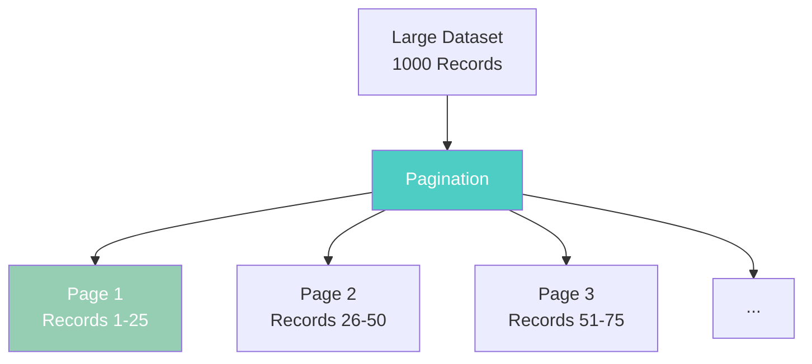

### Basic Usage

The `paginate()` method in controllers handles pagination automatically:

```php
<?php
namespace App\Controller;

class ArticlesController extends AppController
{
    public function index()
    {
        // OPTION 1: Paginate the ORM table directly
        $articles = $this->paginate($this->Articles);

        // What happens:
        // 1. CakePHP reads ?page=X from URL (defaults to 1)
        // 2. Fetches 25 records (default limit) for that page
        // 3. Returns a PaginatedResultSet with records and metadata
        // 4. Metadata includes: current page, total pages, total count

        $this->set('articles', $articles);

        // OPTION 2: Paginate a custom query
        $query = $this->Articles->find('published')
            ->contain('Comments')
            ->where(['status' => 'active']);

        $articles = $this->paginate($query);

        // Step-by-step:
        // 1. Build your custom query with conditions
        // 2. Pass query to paginate() method
        // 3. Pagination is applied on top of your query
        // 4. Returns paginated results matching your conditions

        $this->set('articles', $articles);
    }
}
?>
```

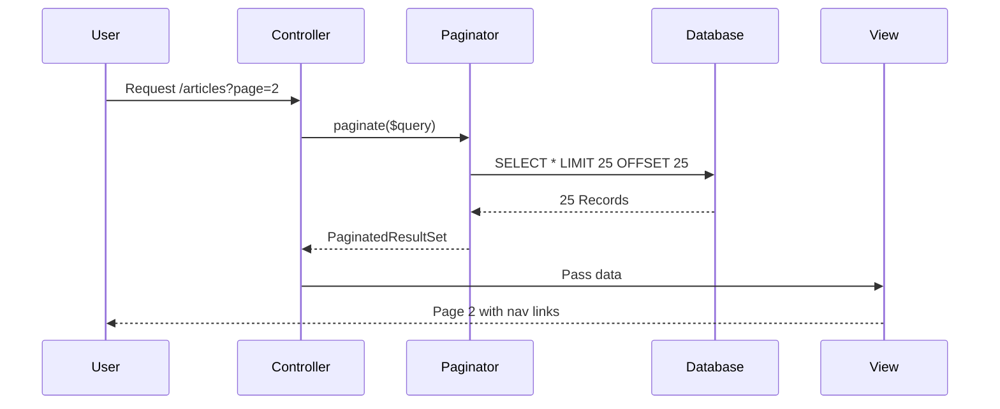

**URL Parameters:**

- `?page=2` - Go to page 2
- `?sort=title` - Sort by title column
- `?direction=desc` - Sort descending
- `?limit=50` - Show 50 records per page

### Advanced Pagination

Configure pagination defaults using the `$paginate` property:

```php
<?php
namespace App\Controller;

class ArticlesController extends AppController
{
    // Define pagination defaults for this controller
    protected array $paginate = [
        'limit' => 25,              // Records per page
        'order' => [
            'Articles.title' => 'asc',  // Default sort order
        ],
    ];

    // How this works:
    // 1. These settings apply to all paginate() calls in this controller
    // 2. URL parameters can override these defaults
    // 3. Example: ?limit=50 overrides the default limit of 25
    // 4. Example: ?sort=created overrides the default sort
}
?>
```

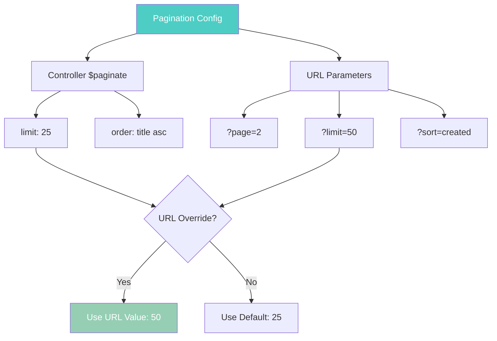

### Using Custom Finders

Paginate with custom finder methods:

```php
<?php
class ArticlesController extends AppController
{
    protected array $paginate = [
        'finder' => 'published',  // Use the findPublished() method
    ];

    // Alternative: Pass finder options
    public function tags()
    {
        $tags = $this->request->getParam('pass');

        // STEP 1: Define custom finder options
        $customFinderOptions = [
            'tags' => $tags,
        ];

        // STEP 2: Configure pagination with finder
        $settings = [
            'finder' => [
                'tagged' => $customFinderOptions,  // Calls findTagged()
            ]
        ];

        // STEP 3: Paginate with custom finder
        $articles = $this->paginate($this->Articles, $settings);

        // How this works:
        // 1. Looks for findTagged() method in ArticlesTable
        // 2. Passes $customFinderOptions to the finder
        // 3. Finder returns a query with tag conditions
        // 4. Pagination is applied to the filtered query

        $this->set(compact('articles', 'tags'));
    }
}
?>
```

### Simple Pagination

For very large datasets where counting total records is expensive, use simple pagination:

```php
<?php
class ArticlesController extends AppController
{
    protected array $paginate = [
        'className' => 'Simple',  // Use SimplePaginator
        // Or use the full class name:
        // 'className' => \Cake\Datasource\Paging\SimplePaginator::class,
    ];

    // What changes:
    // 1. No COUNT() query is executed
    // 2. Only "Next" and "Previous" links available
    // 3. No page numbers or total count
    // 4. Much faster for millions of records
}
?>
```

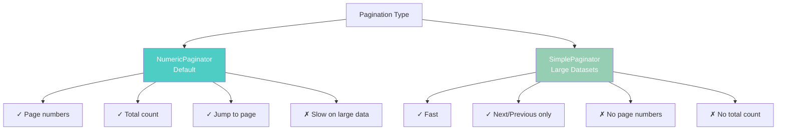

### Paginating Multiple Queries

Paginate multiple models in the same action using scopes:

```php
<?php
class DashboardController extends AppController
{
    protected array $paginate = [
        'Articles' => ['scope' => 'article'],
        'Tags' => ['scope' => 'tag'],
    ];

    public function index()
    {
        // STEP 1: Paginate articles with 'article' scope
        $articles = $this->paginate($this->Articles, ['scope' => 'article']);

        // STEP 2: Paginate tags with 'tag' scope
        $tags = $this->paginate($this->Tags, ['scope' => 'tag']);

        // URL structure:
        // /dashboard?article[page]=1&tag[page]=3
        // Each scope has independent pagination

        $this->set(compact('articles', 'tags'));
    }
}
?>
```

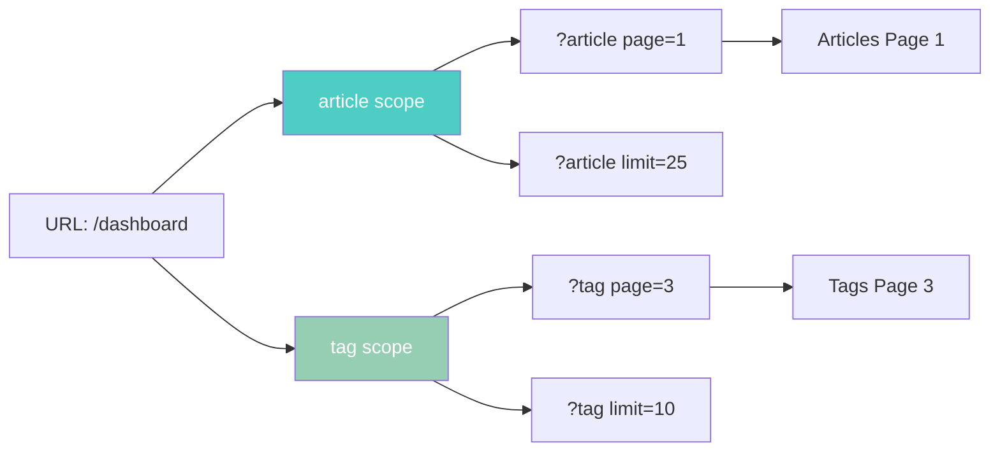

### Sortable Fields

Control which fields users can sort by for security:

```php
<?php
protected array $paginate = [
    'sortableFields' => [
        'id', 'title', 'Users.username', 'created',
    ],
];

// Why this matters:
// 1. Prevents sorting on un-indexed columns (performance)
// 2. Blocks sorting on sensitive fields
// 3. Prevents SQL injection attempts
// 4. Only listed fields can be used in ?sort= parameter
?>
```

### Advanced Sorting with SortableFieldsBuilder

Create user-friendly sort URLs with complex sorting logic:

```php
<?php
use Cake\Datasource\Paging\SortField;
use Cake\Datasource\Paging\SortableFieldsBuilder;

protected array $paginate = [
    'sortableFields' => function (SortableFieldsBuilder $builder) {
        return $builder
            // Simple mapping: friendly name → database field
            ->add('id', 'Articles.id')
            ->add('title', 'Articles.title')
            ->add('username', 'Users.username')

            // Multi-column sorting
            ->add('best-deal', [
                SortField::desc('in_stock'),  // Sort by stock first
                SortField::asc('price'),       // Then by price
            ])

            // Locked direction (can't be toggled)
            ->add('latest', SortField::desc('created', locked: true));
    },
];

// URL examples:
// ?sort=username → Sorts by Users.username
// ?sort=best-deal → Sorts by in_stock DESC, price ASC
// ?sort=latest → Always sorts by created DESC (locked)
?>
```

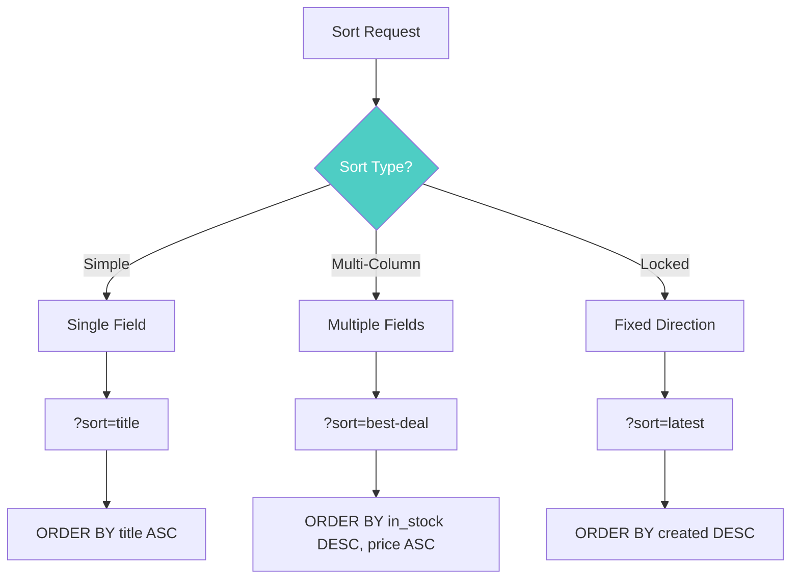

### Limiting Max Rows

Prevent users from requesting too many records:

```php
<?php
protected array $paginate = [
    'limit' => 25,      // Default limit
    'maxLimit' => 100,  // Maximum allowed limit
];

// How it works:
// 1. User requests ?limit=50 → Allowed (under maxLimit)
// 2. User requests ?limit=500 → Reduced to 100 (maxLimit)
// 3. Protects against memory exhaustion
// 4. Prevents database overload
?>
```

### Out of Range Page Requests

Handle requests for non-existent pages:

```php
<?php
use Cake\Http\Exception\NotFoundException;

public function index()
{
    try {
        $articles = $this->paginate();
    } catch (NotFoundException $e) {
        // Page doesn't exist (e.g., page 999 when only 10 pages exist)

        // OPTION 1: Redirect to first page
        return $this->redirect(['action' => 'index', '?' => ['page' => 1]]);

        // OPTION 2: Redirect to last page
        $pagingParams = $e->getPrevious()->getAttributes('pagingParams');
        $lastPage = $pagingParams['pageCount'];
        return $this->redirect(['action' => 'index', '?' => ['page' => $lastPage]]);

        // OPTION 3: Show error message
        $this->Flash->error('Page not found');
        return $this->redirect(['action' => 'index']);
    }
}
?>
```

---

## Request Object

The `ServerRequest` object provides access to all incoming request data. It implements PSR-7 `ServerRequestInterface`.

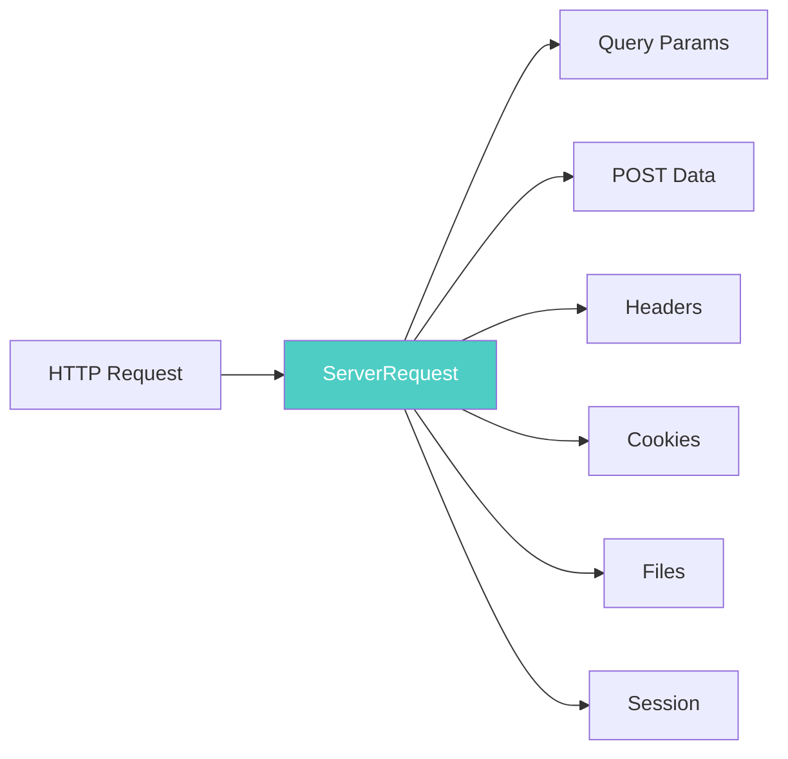

### Request Parameters

Access routing parameters using `getParam()`:

```php
<?php
// URL: /articles/view/123

// Get controller name
$controller = $this->request->getParam('controller');
// Returns: 'Articles'

// Get action name
$action = $this->request->getParam('action');
// Returns: 'view'

// Get passed arguments
$id = $this->request->getParam('pass')[0];
// Returns: '123'

// Get all routing parameters as array
$params = $this->request->getAttribute('params');
// Returns: ['controller' => 'Articles', 'action' => 'view', 'pass' => ['123'], ...]
?>
```

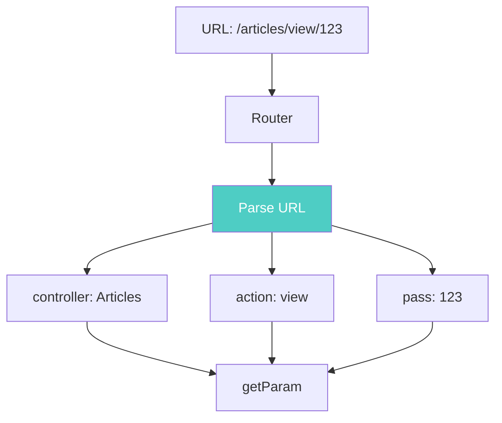

### Query String Parameters

Read URL query parameters:

```php
<?php
// URL: /posts/index?page=1&sort=title&filter=active

// Get single parameter
$page = $this->request->getQuery('page');
// Returns: '1'

// Get with default value
$limit = $this->request->getQuery('limit', 25);
// Returns: 25 (if 'limit' not in URL)

// Get all query parameters
$query = $this->request->getQueryParams();
// Returns: ['page' => '1', 'sort' => 'title', 'filter' => 'active']

// Type-safe access (CakePHP 5.1+)
use function Cake\Core\toInt;
use function Cake\Core\toBool;
use function Cake\Core\toString;

$page = toInt($this->request->getQuery('page'));
// Returns: int|null (converts '1' to 1)

$active = toBool($this->request->getQuery('active'));
// Returns: bool|null (converts 'true'/'1' to true)

$query = toString($this->request->getQuery('query'));
// Returns: string|null
?>
```

### Request Body Data

Access POST data using `getData()`:

```php
<?php
// Form: <input name="title" value="My Article">

// Get single field
$title = $this->request->getData('title');
// Returns: 'My Article'

// Get nested data using dot notation
$street = $this->request->getData('address.street_name');
// Accesses: $_POST['address']['street_name']

// Get with default value
$status = $this->request->getData('status', 'draft');
// Returns: 'draft' if 'status' not in POST data

// Get all POST data
$data = $this->request->getParsedBody();
// Returns: Complete POST data array
?>
```

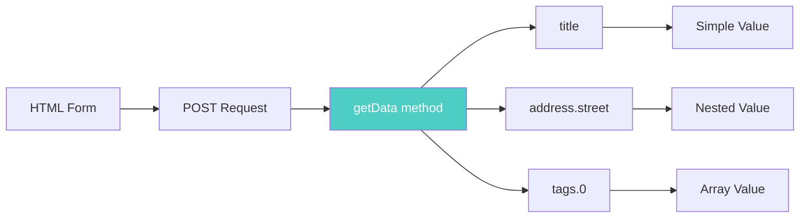

### File Uploads

Handle file uploads using PSR-7 `UploadedFileInterface`:

```php
<?php
// Form: <input type="file" name="attachment">

public function upload()
{
    // STEP 1: Get uploaded file object
    $attachment = $this->request->getData('attachment');

    // STEP 2: Access file properties
    $filename = $attachment->getClientFilename();
    // Returns: 'document.pdf'

    $mimeType = $attachment->getClientMediaType();
    // Returns: 'application/pdf'

    $size = $attachment->getSize();
    // Returns: 1048576 (bytes)

    $error = $attachment->getError();
    // Returns: UPLOAD_ERR_OK (0) if successful

    // STEP 3: Move file to permanent location
    $targetPath = WWW_ROOT . 'uploads' . DS . $filename;
    $attachment->moveTo($targetPath);

    // How moveTo() works:
    // 1. Validates file is an actual upload (HTTP mode)
    // 2. Moves from temp location to target
    // 3. Throws exception if validation fails
    // 4. In CLI mode, allows any file move (for testing)
}
?>
```

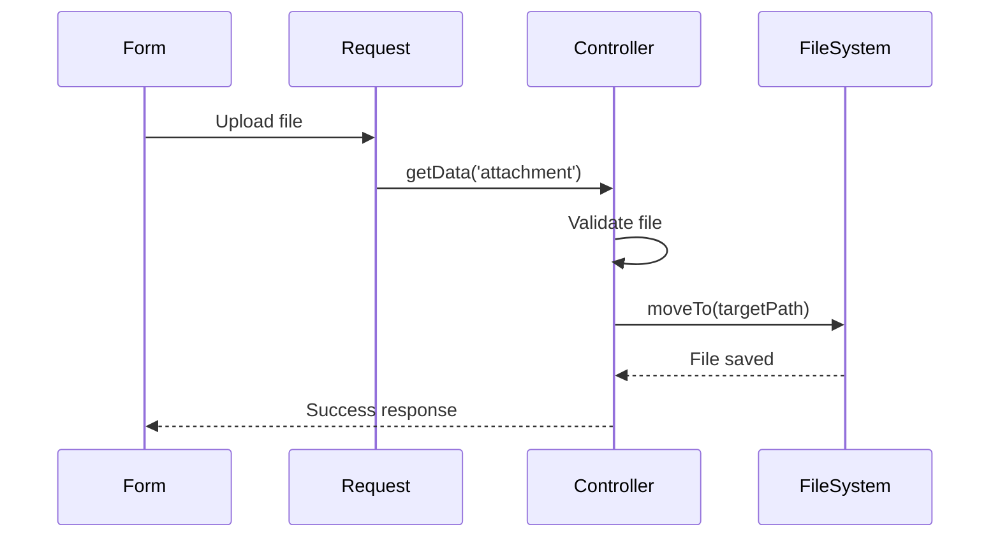

**Alternative: Get file directly**

```php
<?php
// Get uploaded file (returns null if not a file upload)
$file = $this->request->getUploadedFile('attachment');

// Get all uploaded files
$files = $this->request->getUploadedFiles();
// Returns: ['attachment' => UploadedFile object]
?>
```

### Checking Request Conditions

Use `is()` method to check request properties:

```php
<?php
// Check HTTP method
if ($this->request->is('post')) {
    // Handle POST request
}

if ($this->request->is('ajax')) {
    // Handle AJAX request
}

if ($this->request->is('ssl')) {
    // Request is over HTTPS
}

// Check content type
if ($this->request->is('json')) {
    // Client accepts JSON
}

// Built-in detectors:
// - is('get'), is('post'), is('put'), is('patch'), is('delete')
// - is('head'), is('options')
// - is('ajax'), is('ssl'), is('flash')
// - is('json'), is('xml')
?>
```

### Custom Request Detectors

Create your own request detectors:

```php
<?php
// Environment detector (checks $_SERVER variables)
$this->request->addDetector('post', [
    'env' => 'REQUEST_METHOD',
    'value' => 'POST',
]);

// Pattern detector (regex match)
$this->request->addDetector('iphone', [
    'env' => 'HTTP_USER_AGENT',
    'pattern' => '/iPhone/i',
]);

// Option detector (value in list)
$this->request->addDetector('internalIp', [
    'env' => 'CLIENT_IP',
    'options' => ['192.168.0.101', '192.168.0.100'],
]);

// Callback detector (custom logic)
$this->request->addDetector('premium', function ($request) {
    $user = $request->getAttribute('identity');
    return $user && $user->plan === 'premium';
});

// Usage:
if ($this->request->is('premium')) {
    // User is premium subscriber
}
?>
```

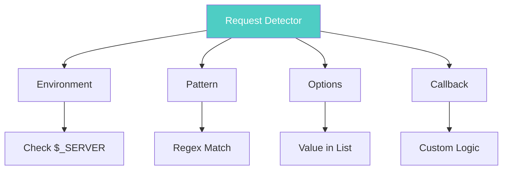

### HTTP Headers

Read request headers:

```php
<?php
// Get header as string
$userAgent = $this->request->getHeaderLine('User-Agent');
// Returns: 'Mozilla/5.0 ...'

// Get header as array (for multi-value headers)
$acceptHeader = $this->request->getHeader('Accept');
// Returns: ['text/html', 'application/json']

// Check if header exists
$hasAuth = $this->request->hasHeader('Authorization');
// Returns: true/false

// Common headers:
$contentType = $this->request->getHeaderLine('Content-Type');
$accept = $this->request->getHeaderLine('Accept');
$auth = $this->request->getHeaderLine('Authorization');
?>
```

### Trusting Proxy Headers

When behind a load balancer, trust forwarded headers:

```php
<?php
// Enable proxy trust
$this->request->trustProxy = true;

// Now these methods use X-Forwarded-* headers:
$port = $this->request->port();        // Uses X-Forwarded-Port
$host = $this->request->host();        // Uses X-Forwarded-Host
$scheme = $this->request->scheme();    // Uses X-Forwarded-Proto
$clientIp = $this->request->clientIp(); // Uses X-Forwarded-For

// For multiple proxies, define trusted proxy IPs
$this->request->setTrustedProxies(['127.1.1.1', '127.8.1.3']);

// How this works:
// 1. Load balancer adds X-Forwarded-For: client_ip, proxy1_ip
// 2. CakePHP checks if proxy1_ip is in trusted list
// 3. If trusted, uses client_ip as the real client IP
// 4. If not trusted, ignores the header
?>
```

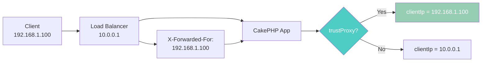

---

## Response Object

The `Response` object encapsulates HTTP response generation. It implements PSR-7 `ResponseInterface` and uses immutable patterns.

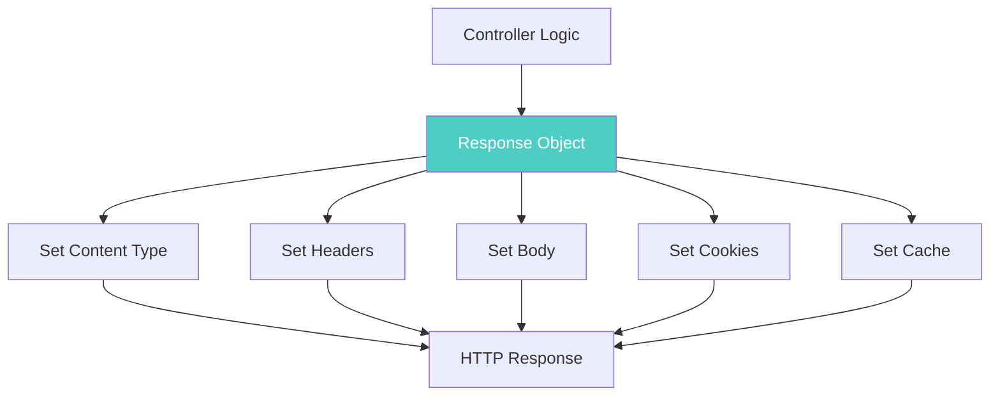

### Setting Content Types

Control the `Content-Type` header:

```php
<?php
// Set content type by name
$response = $this->response->withType('json');
// Sets: Content-Type: application/json

// Common types:
$response = $this->response->withType('html');  // text/html
$response = $this->response->withType('xml');   // application/xml
$response = $this->response->withType('csv');   // text/csv
$response = $this->response->withType('pdf');   // application/pdf

// Add custom content type
$this->response->setTypeMap('vcf', ['text/v-card']);
$response = $this->response->withType('vcf');
// Sets: Content-Type: text/v-card
?>
```

### Sending Files

Send files as download or inline display:

```php
<?php
public function download($id)
{
    // STEP 1: Get file path
    $file = $this->Attachments->getFile($id);

    // STEP 2: Send file with automatic content type
    $response = $this->response->withFile($file['path']);

    // CakePHP automatically:
    // 1. Detects MIME type from file extension
    // 2. Sets Content-Type header
    // 3. Sets Content-Length header
    // 4. Streams file to client

    return $response;
}

public function forceDownload($id)
{
    $file = $this->Attachments->getFile($id);

    // Force download with custom filename
    $response = $this->response->withFile($file['path'], [
        'download' => true,              // Force download
        'name' => 'custom-filename.pdf', // Override filename
    ]);

    // Sets headers:
    // Content-Disposition: attachment; filename="custom-filename.pdf"

    return $response;
}
?>
```

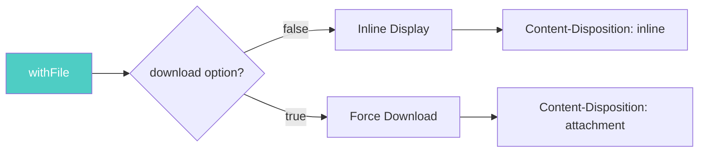

### Sending Generated Content

Send dynamically generated files:

```php
<?php
public function generatePdf()
{
    // STEP 1: Generate content
    $pdfContent = $this->Pdf->generate($data);

    // STEP 2: Set as response body
    $response = $this->response->withStringBody($pdfContent);

    // STEP 3: Set content type
    $response = $response->withType('pdf');

    // STEP 4: Force download
    $response = $response->withDownload('report.pdf');

    // Complete flow:
    // 1. Generate PDF in memory
    // 2. Inject into response body
    // 3. Set proper MIME type
    // 4. Add download headers
    // 5. Return response

    return $response;
}
?>
```

### Setting Headers

Add custom HTTP headers:

```php
<?php
// Add/replace a header
$response = $response->withHeader('X-Custom', 'My Value');

// Set multiple headers (method chaining)
$response = $response
    ->withHeader('X-API-Version', '2.0')
    ->withHeader('X-Request-ID', $requestId)
    ->withHeader('X-Rate-Limit', '100');

// Append to existing header (for multi-value headers)
$response = $response->withAddedHeader('Set-Cookie', 'session=abc123');

// IMPORTANT: Immutability
// ❌ Wrong - doesn't save the new response
$response->withHeader('X-Custom', 'value');

// ✅ Correct - reassign to capture new response
$response = $response->withHeader('X-Custom', 'value');
?>
```

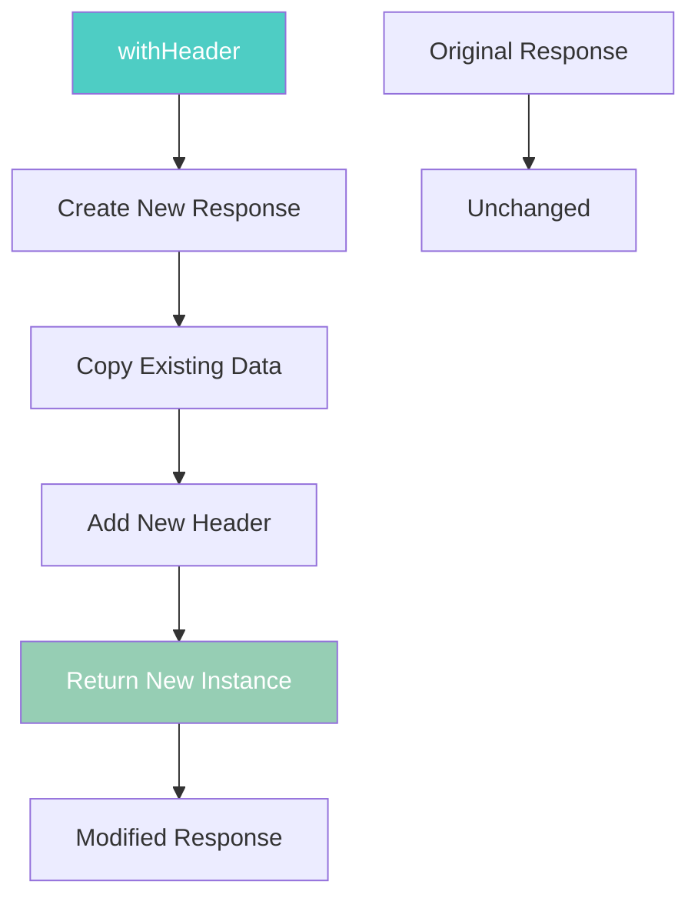

### HTTP Caching

Control browser and proxy caching:

```php
<?php
// Disable caching completely
$response = $this->response->withDisabledCache();
// Sets headers:
// Cache-Control: no-store, no-cache, must-revalidate, max-age=0
// Pragma: no-cache

// Enable caching
$response = $this->response->withCache('-1 minute', '+5 days');
// Sets headers:
// Last-Modified: [1 minute ago]
// Expires: [5 days from now]
// Cache-Control: public, max-age=432000

// How it works:
// 1. First parameter: Last-Modified time
// 2. Second parameter: Expiration time
// 3. Browser caches response for 5 days
// 4. Reduces server load for static content
?>
```

### Cache Control Header

Fine-tune caching behavior:

```php
<?php
// Public cache (shared by all users)
$response = $this->response->withSharable(true, 3600);
// Sets: Cache-Control: public, max-age=3600

// Private cache (user-specific)
$response = $this->response->withSharable(false, 3600);
// Sets: Cache-Control: private, max-age=3600

// Set expiration date
$response = $this->response->withExpires('+5 days');
// Sets: Expires: [date 5 days from now]
?>
```

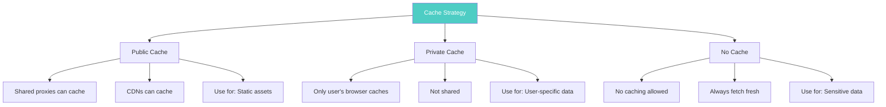

### ETag and Last-Modified

Implement conditional requests for efficient caching:

```php
<?php
public function view($id)
{
    $article = $this->Articles->get($id);

    // OPTION 1: Use ETag (content-based)
    $checksum = md5(json_encode($article));
    $response = $this->response->withEtag($checksum);

    // OPTION 2: Use Last-Modified (time-based)
    $response = $this->response->withModified($article->modified);

    // Check if client's cached version is still valid
    if ($response->isNotModified($this->request)) {
        // Client has current version
        // Return 304 Not Modified (no body)
        return $response;
    }

    // Client needs new version
    // Continue with normal response
    $this->response = $response;
    $this->set('article', $article);
}
?>
```

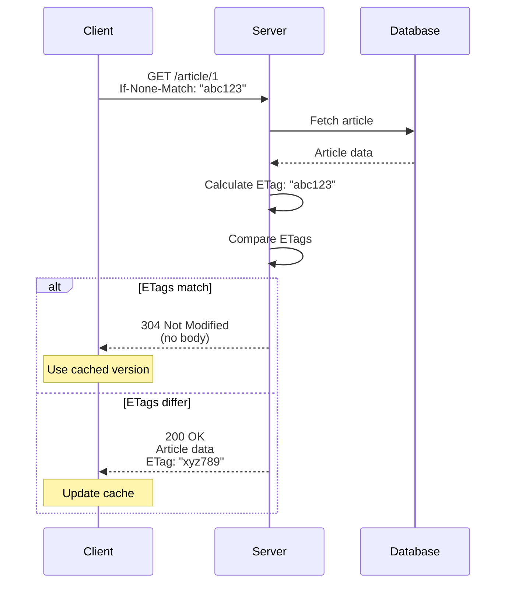

### Setting Cookies

Add cookies to the response:

```php
<?php
use Cake\Http\Cookie\Cookie;
use DateTime;

// Create a cookie
$cookie = Cookie::create(
    'remember_me',              // Name
    'yes',                      // Value
    [
        'expires' => new DateTime('+1 year'),
        'path' => '/',
        'domain' => '',
        'secure' => true,       // HTTPS only
        'httponly' => true,     // Not accessible via JavaScript
        'samesite' => 'Lax',    // CSRF protection
    ]
);

// Add cookie to response
$response = $this->response->withCookie($cookie);

// Alternative: Fluent interface
$cookie = (new Cookie('session_id'))
    ->withValue($sessionId)
    ->withExpiry(new DateTime('+2 hours'))
    ->withPath('/')
    ->withSecure(true)
    ->withHttpOnly(true);

$response = $this->response->withCookie($cookie);

// Delete a cookie (send expired cookie)
$response = $this->response->withExpiredCookie(new Cookie('remember_me'));
?>
```

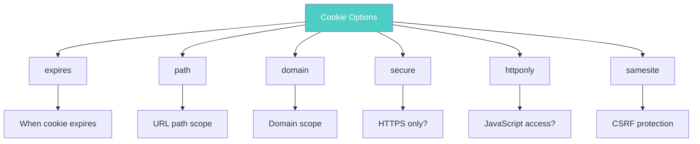

### CORS Configuration

Configure Cross-Origin Resource Sharing for APIs:

```php
<?php
public function api()
{
    // Configure CORS using fluent interface
    $response = $this->response->cors($this->request)
        ->allowOrigin(['https://app.example.com', 'https://mobile.example.com'])
        ->allowMethods(['GET', 'POST', 'PUT', 'DELETE'])
        ->allowHeaders(['Content-Type', 'Authorization', 'X-API-Key'])
        ->allowCredentials()
        ->exposeHeaders(['X-Total-Count', 'X-Page'])
        ->maxAge(3600)
        ->build();

    // What each method does:
    // allowOrigin: Which domains can access this API
    // allowMethods: Which HTTP methods are allowed
    // allowHeaders: Which request headers are allowed
    // allowCredentials: Allow cookies/auth in cross-origin requests
    // exposeHeaders: Which response headers client can read
    // maxAge: How long to cache preflight response (seconds)

    $this->response = $response;
}
?>
```

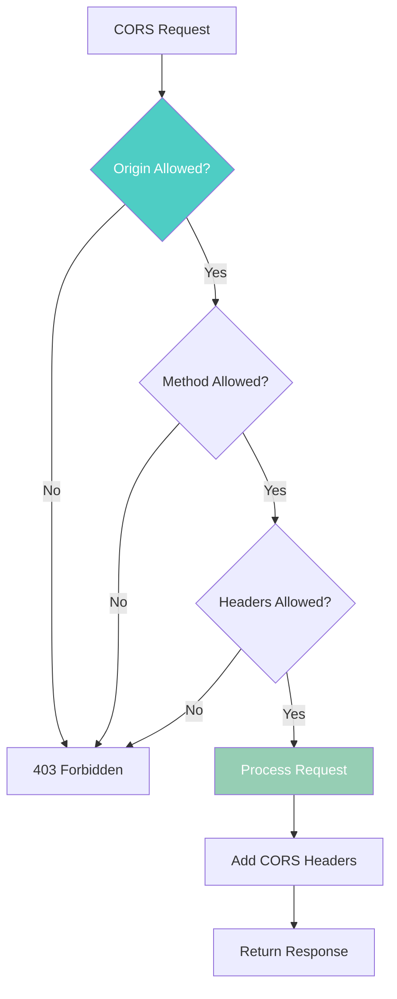

**Preflight Requests:**

```php
<?php
public function beforeFilter(\Cake\Event\EventInterface $event)
{
    parent::beforeFilter($event);

    // Handle OPTIONS preflight requests
    if ($this->request->is('options')) {
        $this->response = $this->response->cors($this->request)
            ->allowOrigin(['https://app.example.com'])
            ->allowMethods(['GET', 'POST', 'PUT', 'DELETE'])
            ->allowHeaders(['Content-Type', 'Authorization'])
            ->allowCredentials()
            ->maxAge(86400)  // Cache preflight for 24 hours
            ->build();

        // Stop further processing
        $event->setResult($this->response);
    }
}
?>
```

### Common CORS Patterns

```php
<?php
// Pattern 1: Public API (anyone can access)
$response = $this->response->cors($this->request)
    ->allowOrigin('*')
    ->allowMethods(['GET'])
    ->maxAge(3600)
    ->build();

// Pattern 2: Authenticated API (credentials required)
$response = $this->response->cors($this->request)
    ->allowOrigin(['https://app.example.com'])
    ->allowMethods(['GET', 'POST', 'PUT', 'DELETE'])
    ->allowHeaders(['Content-Type', 'Authorization'])
    ->allowCredentials()  // Required for cookies/auth
    ->build();

// Pattern 3: Wildcard subdomains
$response = $this->response->cors($this->request)
    ->allowOrigin(['*.example.com'])
    ->allowMethods(['GET', 'POST'])
    ->build();
?>
```

### Immutable Response Pattern

Response objects are immutable - methods return new instances:

```php
<?php
// ❌ WRONG - Changes are lost
$this->response->withHeader('X-Custom', 'value');
$this->response->withType('json');
// Headers are NOT applied because we didn't reassign

// ✅ CORRECT - Reassign to capture changes
$this->response = $this->response->withHeader('X-Custom', 'value');
$this->response = $this->response->withType('json');

// ✅ BEST - Method chaining
$this->response = $this->response
    ->withHeader('X-Custom', 'value')
    ->withType('json')
    ->withStatus(201);
?>
```

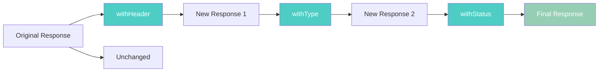

**Why Immutability?**

1. Prevents accidental side effects
2. Makes code easier to reason about
3. Enables safe concurrent operations
4. Follows PSR-7 standard

### Reading Request Cookies

Access cookies from the request:

```php
<?php
// Get cookie value (returns null if missing)
$rememberMe = $this->request->getCookie('remember_me');

// Get with default value
$theme = $this->request->getCookie('theme', 'light');

// Get all cookies as array
$cookies = $this->request->getCookieParams();
// Returns: ['remember_me' => 'yes', 'theme' => 'dark']

// Get CookieCollection for advanced operations
$cookies = $this->request->getCookieCollection();

// Check if cookie exists
if ($cookies->has('remember_me')) {
    $cookie = $cookies->get('remember_me');
    $value = $cookie->getValue();
}
?>
```

### Session Data

Access session data through the request:

```php
<?php
// Get session object
$session = $this->request->getSession();
// Or use attribute
$session = $this->request->getAttribute('session');

// Read session data
$userId = $session->read('Auth.User.id');

// Write session data
$session->write('Cart.items', $items);

// Check if key exists
if ($session->check('Auth.User')) {
    // User is logged in
}

// Delete session data
$session->delete('Flash.message');

// Destroy entire session
$session->destroy();
?>
```

### Host and Domain Information

Get host and domain details:

```php
<?php
// URL: https://my.dev.example.org/articles

// Get full host
$host = $this->request->host();
// Returns: 'my.dev.example.org'

// Get domain (without subdomains)
$domain = $this->request->domain();
// Returns: 'example.org'

// Get subdomains as array
$subdomains = $this->request->subdomains();
// Returns: ['my', 'dev']

// Get client IP
$ip = $this->request->clientIp();
// Returns: '192.168.1.100'

// Get HTTP method
$method = $this->request->getMethod();
// Returns: 'GET', 'POST', 'PUT', 'DELETE', etc.
?>
```

### Restricting HTTP Methods

Enforce allowed HTTP methods per action:

```php
<?php
public function delete($id)
{
    // Only allow POST and DELETE methods
    $this->request->allowMethod(['post', 'delete']);

    // What happens:
    // 1. If request is POST or DELETE → Continue
    // 2. If request is GET, PUT, etc. → Throw MethodNotAllowedException
    // 3. Response includes: Allow: POST, DELETE header
    // 4. Returns 405 Method Not Allowed status

    // Delete the article
    $article = $this->Articles->get($id);
    $this->Articles->delete($article);

    return $this->redirect(['action' => 'index']);
}
?>
```

```mermaid
flowchart TD
    A[Request] --> B{Method Check}
    B -->|POST| C[Allowed]
    B -->|DELETE| C
    B -->|GET| D[405 Error]
    B -->|PUT| D

    C --> E[Execute Action]
    D --> F[MethodNotAllowedException]

    style C fill:#96ceb4,color:#fff
    style D fill:#ff6b6b,color:#fff
```

### Accept Headers

Check what content types the client accepts:

```php
<?php
// Get all accepted types
$accepts = $this->request->accepts();
// Returns: ['text/html', 'application/json', '*/*']

// Check if specific type is accepted
if ($this->request->accepts('application/json')) {
    // Client accepts JSON
    $this->viewBuilder()->setClassName('Json');
}

// Check accepted languages
$languages = $this->request->acceptLanguage();
// Returns: ['en-US', 'en', 'es']

// Check specific language
if ($this->request->acceptLanguage('es-es')) {
    // Client accepts Spanish
}
?>
```

### Working with Request URI

Access URI components:

```php
<?php
// Get URI object
$uri = $this->request->getUri();

// Read URI components
$path = $uri->getPath();
// Returns: '/articles/view/123'

$query = $uri->getQuery();
// Returns: 'page=1&sort=title'

$host = $uri->getHost();
// Returns: 'example.com'

$scheme = $uri->getScheme();
// Returns: 'https'

// Get full URL
$fullUrl = (string)$uri;
// Returns: 'https://example.com/articles/view/123?page=1'
?>
```

### Streaming Responses

Stream large files or generated content:

```php
<?php
use Laminas\Diactoros\Stream;
use Cake\Http\CallbackStream;

// Stream from file
public function downloadLarge()
{
    // STEP 1: Create stream from file
    $stream = new Stream('/path/to/large-file.zip', 'rb');

    // STEP 2: Set as response body
    $response = $this->response->withBody($stream);

    // STEP 3: Set headers
    $response = $response
        ->withType('application/zip')
        ->withDownload('archive.zip');

    // Benefits:
    // 1. Low memory usage (doesn't load entire file)
    // 2. Starts sending immediately
    // 3. Works with files larger than PHP memory limit

    return $response;
}

// Stream from callback (generate on-the-fly)
public function generateImage()
{
    // Create image resource
    $img = imagecreate(800, 600);
    // ... draw on image ...

    // Stream image generation
    $stream = new CallbackStream(function () use ($img) {
        imagepng($img);  // Output PNG directly to stream
        imagedestroy($img);
    });

    $response = $this->response
        ->withBody($stream)
        ->withType('png');

    return $response;
}
?>
```

```mermaid
sequenceDiagram
    participant Client
    participant Controller
    participant Stream
    participant File

    Client->>Controller: Request large file
    Controller->>Stream: Create stream
    Stream->>File: Open file handle
    Controller->>Client: Start sending

    loop Stream chunks
        File->>Stream: Read chunk
        Stream->>Client: Send chunk
    end

    Stream->>File: Close handle
    Stream-->>Client: Complete
```

### Reading JSON and XML Payloads

Parse non-form request bodies:

```php
<?php
// For JSON requests
public function apiCreate()
{
    if ($this->request->is('json')) {
        // OPTION 1: Use Body Parser Middleware (recommended)
        // Automatically parses JSON into array
        $data = $this->request->getData();

        // OPTION 2: Manual parsing
        $json = $this->request->input('json_decode');

        // OPTION 3: Get raw body
        $body = (string)$this->request->getBody();
        $data = json_decode($body, true);
    }
}

// For XML requests
public function xmlImport()
{
    if ($this->request->is('xml')) {
        // Parse XML to DOMDocument
        $xml = $this->request->input('Cake\Utility\Xml::build', [
            'return' => 'domdocument',
        ]);

        // Or get raw XML string
        $xmlString = (string)$this->request->getBody();
    }
}
?>
```

```mermaid
flowchart TD
    A[Request Body] --> B{Content-Type?}
    B -->|application/json| C[JSON Parser]
    B -->|application/xml| D[XML Parser]
    B -->|application/x-www-form-urlencoded| E[Form Parser]

    C --> F[getData returns array]
    D --> F
    E --> F

    style B fill:#4ecdc4,color:#fff
```

---

## Practical Examples

### Complete Pagination Example

```php
<?php
namespace App\Controller;

class ArticlesController extends AppController
{
    // Configure pagination defaults
    protected array $paginate = [
        'limit' => 20,
        'order' => ['Articles.created' => 'desc'],
        'sortableFields' => ['id', 'title', 'created', 'Users.username'],
        'maxLimit' => 100,
    ];

    public function index()
    {
        // Build query with conditions
        $query = $this->Articles->find()
            ->contain(['Users', 'Tags'])
            ->where(['Articles.published' => true]);

        // Apply pagination
        $articles = $this->paginate($query);

        // Pass to view
        $this->set('articles', $articles);

        // In the view, use PaginatorHelper:
        // <?= $this->Paginator->prev('« Previous') ?>
        // <?= $this->Paginator->numbers() ?>
        // <?= $this->Paginator->next('Next »') ?>
    }
}
?>
```

### Complete API Response Example

```php
<?php
public function apiView($id)
{
    // STEP 1: Fetch data
    $article = $this->Articles->get($id, contain: ['Users', 'Comments']);

    // STEP 2: Calculate ETag for caching
    $etag = md5(json_encode($article));
    $response = $this->response->withEtag($etag);

    // STEP 3: Check if client has current version
    if ($response->isNotModified($this->request)) {
        return $response;  // Return 304 Not Modified
    }

    // STEP 4: Configure CORS
    $response = $response->cors($this->request)
        ->allowOrigin(['https://app.example.com'])
        ->allowCredentials()
        ->build();

    // STEP 5: Set content type and cache
    $response = $response
        ->withType('json')
        ->withSharable(true, 300);  // Cache for 5 minutes

    // STEP 6: Set response body
    $response = $response->withStringBody(json_encode([
        'article' => $article,
        'meta' => [
            'version' => '2.0',
            'timestamp' => time(),
        ],
    ]));

    return $response;
}
?>
```

```mermaid
sequenceDiagram
    participant Client
    participant Controller
    participant Database
    participant Cache

    Client->>Controller: GET /api/articles/1<br/>If-None-Match: "abc123"
    Controller->>Database: Fetch article
    Database-->>Controller: Article data
    Controller->>Controller: Calculate ETag

    alt ETag matches
        Controller-->>Client: 304 Not Modified
    else ETag differs
        Controller->>Controller: Build JSON response
        Controller->>Controller: Add CORS headers
        Controller->>Controller: Set cache headers
        Controller-->>Client: 200 OK + JSON data
        Client->>Cache: Store with ETag
    end
```

### File Upload Handling Example

```php
<?php
public function upload()
{
    if ($this->request->is('post')) {
        // STEP 1: Get uploaded file
        $file = $this->request->getData('document');

        // STEP 2: Validate file
        if ($file->getError() !== UPLOAD_ERR_OK) {
            $this->Flash->error('Upload failed');
            return $this->redirect(['action' => 'index']);
        }

        // STEP 3: Check file size (5MB limit)
        if ($file->getSize() > 5 * 1024 * 1024) {
            $this->Flash->error('File too large (max 5MB)');
            return $this->redirect(['action' => 'index']);
        }

        // STEP 4: Check file type
        $allowedTypes = ['application/pdf', 'image/jpeg', 'image/png'];
        if (!in_array($file->getClientMediaType(), $allowedTypes)) {
            $this->Flash->error('Invalid file type');
            return $this->redirect(['action' => 'index']);
        }

        // STEP 5: Generate safe filename
        $filename = uniqid() . '_' . $file->getClientFilename();
        $targetPath = WWW_ROOT . 'uploads' . DS . $filename;

        // STEP 6: Move file
        $file->moveTo($targetPath);

        // STEP 7: Save to database
        $document = $this->Documents->newEntity([
            'filename' => $filename,
            'original_name' => $file->getClientFilename(),
            'mime_type' => $file->getClientMediaType(),
            'size' => $file->getSize(),
        ]);

        if ($this->Documents->save($document)) {
            $this->Flash->success('File uploaded successfully');
        }

        return $this->redirect(['action' => 'index']);
    }
}
?>
```

```mermaid
flowchart TD
    A[File Upload] --> B{Validate}
    B -->|Error| C[Show Error]
    B -->|OK| D{Check Size}

    D -->|Too Large| C
    D -->|OK| E{Check Type}

    E -->|Invalid| C
    E -->|Valid| F[Generate Filename]

    F --> G[Move to Target]
    G --> H[Save to Database]
    H --> I[Success]

    style B fill:#4ecdc4,color:#fff
    style I fill:#96ceb4,color:#fff
    style C fill:#ff6b6b,color:#fff
```

---

## Best Practices

```mermaid
mindmap
  root((Pagination &<br/>Request/Response))
    Pagination
      Use appropriate paginator
      Set reasonable limits
      Implement sorting controls
      Handle out-of-range pages
    Request
      Validate input data
      Use type-safe accessors
      Check request methods
      Trust proxies carefully
    Response
      Use immutable pattern
      Set proper content types
      Implement caching
      Handle CORS correctly
    Security
      Validate file uploads
      Sanitize user input
      Set secure cookies
      Use HTTPS
```

### Pagination Best Practices

1. **Set Reasonable Limits** - Default to 25-50 records, max 100
2. **Use Simple Pagination** - For very large datasets (millions of records)
3. **Control Sortable Fields** - Prevent sorting on un-indexed columns
4. **Handle Edge Cases** - Gracefully handle out-of-range page requests
5. **Use Scopes** - When paginating multiple queries in one action

### Request Handling Best Practices

1. **Validate Input** - Always validate and sanitize user input
2. **Use Type-Safe Accessors** - Use `toInt()`, `toBool()` for type safety
3. **Check Request Methods** - Use `allowMethod()` to enforce HTTP methods
4. **Trust Proxies Carefully** - Only trust known proxy IPs
5. **Use Custom Detectors** - Create reusable request detection logic

### Response Generation Best Practices

1. **Remember Immutability** - Always reassign when using `with*()` methods
2. **Set Proper Content Types** - Use `withType()` for correct MIME types
3. **Implement Caching** - Use ETags and Last-Modified for efficiency
4. **Configure CORS Properly** - Be specific with allowed origins
5. **Stream Large Files** - Use streams for files larger than memory limit

### Security Best Practices

1. **Validate File Uploads** - Check size, type, and error status
2. **Use Secure Cookies** - Set `secure`, `httponly`, and `samesite` flags
3. **Implement CSRF Protection** - Use FormProtection component
4. **Sanitize Output** - Use `h()` helper in views
5. **Use HTTPS** - Always use SSL/TLS in production

---

<nav style="background: var(--bg-secondary); border: 1px solid var(--border-color); border-radius: 6px; padding: 15px 20px; margin: 30px 0;">
  <div style="display: flex; align-items: center; justify-content: space-between; flex-wrap: wrap; gap: 10px;">
    <a href="06-controllers.html" style="color: var(--link-color);">← Previous: Controllers</a>
    <span style="color: var(--text-secondary);">📄 Page 7 of 8</span>
    <a href="08-views.html" style="color: var(--link-color);">Next: Views →</a>
  </div>
</nav>

---

**Released under the MIT License.**

**Copyright © Cake Software Foundation, Inc. All rights reserved.**
