# Views - Templates, Elements, Themes & Cells

> **Source:** [CakePHP Official Documentation](https://book.cakephp.org/5.x/views.html)

<nav style="background: var(--bg-secondary); border: 1px solid var(--border-color); border-radius: 6px; padding: 15px 20px; margin: 20px 0;">
  <div style="display: flex; align-items: center; justify-content: space-between; flex-wrap: wrap; gap: 10px;">
    <a href="07-pagination-request-response.html" style="color: var(--link-color);">← Previous: Pagination & Request/Response</a>
    <span style="color: var(--text-secondary);">👁️ Page 8 of 8</span>
    <a href="index.html" style="color: var(--link-color);">Home →</a>
  </div>
</nav>

---

## Table of Contents

- [Views Overview](#views-overview)
  - [The App View](#the-app-view)
- [View Templates](#view-templates)
  - [Alternative Echos](#alternative-echos)
  - [Alternative Control Structures](#alternative-control-structures)
  - [View Variables](#view-variables)
- [Extending Views](#extending-views)
  - [Extending Layouts](#extending-layouts)
- [Using View Blocks](#using-view-blocks)
  - [Displaying Blocks](#displaying-blocks)
  - [Using Blocks for Script and CSS Files](#using-blocks-for-script-and-css-files)
- [Layouts](#layouts)
  - [Setting Layouts](#setting-layouts)
  - [Using Layouts from Plugins](#using-layouts-from-plugins)
- [Elements](#elements)
  - [Passing Variables into an Element](#passing-variables-into-an-element)
  - [Caching Elements](#caching-elements)
  - [Requesting Elements from a Plugin](#requesting-elements-from-a-plugin)
  - [Routing Prefix and Elements](#routing-prefix-and-elements)
  - [Caching Sections of Your View](#caching-sections-of-your-view)
- [Themes](#themes)
  - [Setting Up a Theme](#setting-up-a-theme)
  - [Theme Template Structure](#theme-template-structure)
  - [Theme Assets](#theme-assets)
- [View Cells](#view-cells)
  - [Creating a Cell](#creating-a-cell)
  - [Implementing the Cell](#implementing-the-cell)
  - [Loading and Rendering Cells](#loading-and-rendering-cells)
  - [Passing Arguments to a Cell](#passing-arguments-to-a-cell)
  - [Caching Cell Output](#caching-cell-output)
  - [Paginating Data inside a Cell](#paginating-data-inside-a-cell)
  - [Cell Options](#cell-options)
- [View Events](#view-events)
- [Creating Your Own View Classes](#creating-your-own-view-classes)

---

## Views Overview

Views are the **V** in MVC. Views are responsible for generating the specific output required for the request. Often this is in the form of HTML, XML, or JSON, but streaming files and creating PDFs that users can download are also responsibilities of the View Layer.

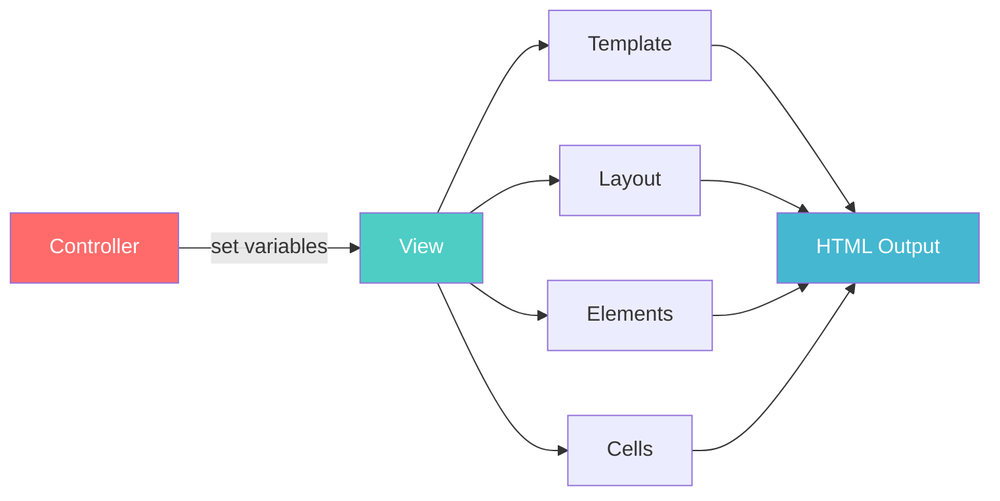

The view layer in CakePHP can be made up of several different parts:

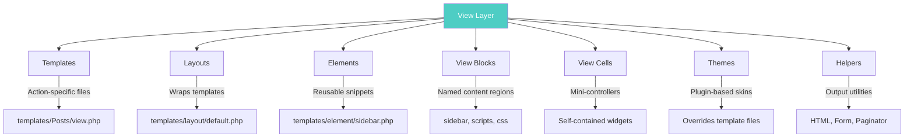

---

### The App View

`AppView` is your application's default View class. `AppView` itself extends the `Cake\View\View` class included in CakePHP and is defined in `src/View/AppView.php`:

```php
<?php
namespace App\View;

use Cake\View\View;

class AppView extends View
{
}
?>
```

You can use your `AppView` to load helpers that will be used for every view rendered in your application. CakePHP provides an `initialize()` method that is invoked at the end of a View's constructor for this kind of use:

```php
<?php
namespace App\View;

use Cake\View\View;

class AppView extends View
{
    public function initialize(): void
    {
        // Always enable the MyUtils Helper
        $this->addHelper('MyUtils');
    }
}
?>
```

---

## View Templates

CakePHP template files are regular PHP files and utilize the **alternative PHP syntax** for control structures and output. These files contain the logic necessary to prepare the data received from the controller into a presentation format that is ready for your audience.

Template files are stored in `templates/`, in a folder named after the controller that uses the files, and named after the action it corresponds to. For example, the view file for the `Products` controller's `view()` action would normally be found in `templates/Products/view.php`.

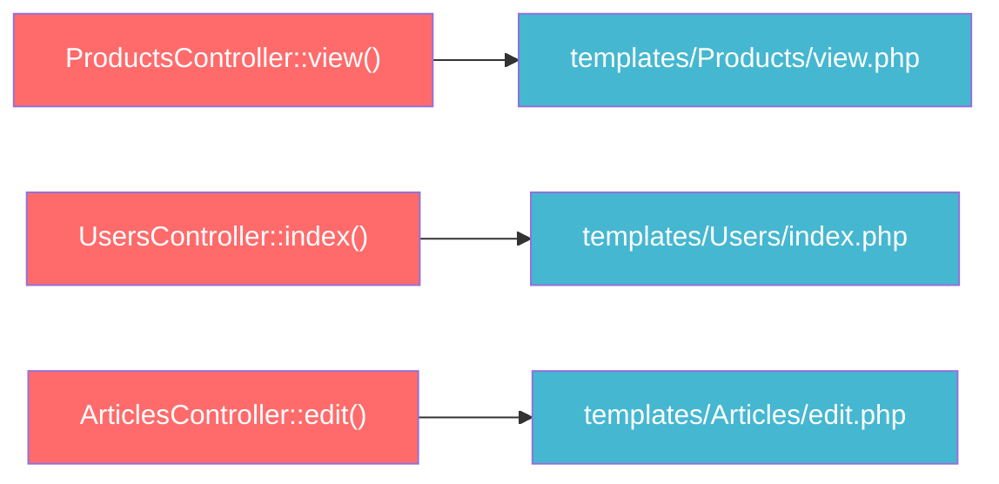

---

### Alternative Echos

Echo or print a variable in your template:

```php
<?php echo $variable; ?>
```

Using **Short Tag** support:

```php
<?= $variable ?>
```

---

### Alternative Control Structures

Control structures like `if`, `for`, `foreach`, `switch`, and `while` can be written in a simplified format. Notice that there are no braces. Instead, the end brace for the `foreach` is replaced with `endforeach`. Each of the control structures has a similar closing syntax: `endif`, `endfor`, `endforeach`, and `endwhile`.

**Example using `foreach`:**

```php
<?php
// Using foreach with alternative syntax
?>
<ul>
<?php foreach ($todo as $item): ?>
    <li><?= $item ?></li>
<?php endforeach; ?>
</ul>
```

**Example using `if/elseif/else`:**

```php
<?php if ($username === 'sally'): ?>
    <h3>Hi Sally</h3>
<?php elseif ($username === 'joe'): ?>
    <h3>Hi Joe</h3>
<?php else: ?>
    <h3>Hi unknown user</h3>
<?php endif; ?>
```

> **Tip:** If you'd prefer to use a templating language like Twig, check out the CakePHP Twig Plugin.

---

### View Variables

Any variables you set in your controller with `set()` will be available in both the view and the layout your action renders. In addition, any set variables will also be available in any element.

> **Important:** Always escape any user data before outputting it, as CakePHP does not automatically escape output. You can escape user content with the `h()` function.

```php
<?= h($user->bio); ?>
```

Views have a `set()` method that is analogous to the `set()` found in Controller objects. Using `set()` from your view file will add the variables to the layout and elements that will be rendered later:

```php
<?php
// In your view file
$this->set('activeMenuButton', 'posts');
?>
```

Then, in your layout, the `$activeMenuButton` variable will be available and contain the value `'posts'`.

---

## Extending Views

View extending allows you to wrap one view in another. Combining this with view blocks gives you a powerful way to keep your views **DRY** (Don't Repeat Yourself).

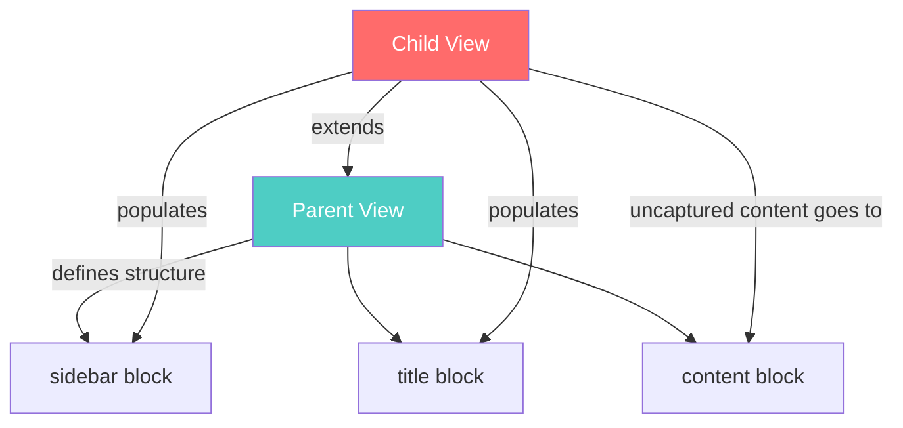

**Parent view** (`templates/Common/view.php`):

```php
<?php
// templates/Common/view.php
?>
<h1><?= h($this->fetch('title')) ?></h1>
<?= $this->fetch('content') ?>

<div class="actions">
    <h3>Related actions</h3>
    <ul>
    <?= $this->fetch('sidebar') ?>
    </ul>
</div>
```

**Child view** (`templates/Posts/view.php`):

```php
<?php
// templates/Posts/view.php
$this->extend('/Common/view');

$this->assign('title', $post->title);

$this->start('sidebar');
?>
<li>
<?php
echo $this->Html->link('edit', [
    'action' => 'edit',
    $post->id,
]);
?>
</li>
<?php $this->end(); ?>

<?= h($post->body) ?>
```

The `content` block is a special block that CakePHP creates. It will contain all the uncaptured content from the extending view.

> **Note:** You should avoid using `content` as a block name in your application. CakePHP uses this for uncaptured content in extended views.

Calling `extend()` more than once in a view file will override the parent view that will be processed next:

```php
<?php
$this->extend('/Common/view');
$this->extend('/Common/index');
// /Common/index.php will be rendered as the parent view
?>
```

---

### Extending Layouts

Just like views, layouts can also be extended. Like views, you use `extend()` to extend layouts. Layout extensions can update or replace blocks, and update or replace the content rendered by the child layout:

```php
<?php
// Our layout extends the application layout.
$this->extend('application');
$this->prepend('content', '<main class="nosidebar">');
$this->append('content', '</main>');

// Output more markup.

// Remember to echo the contents of the previous layout.
echo $this->fetch('content');
?>
```

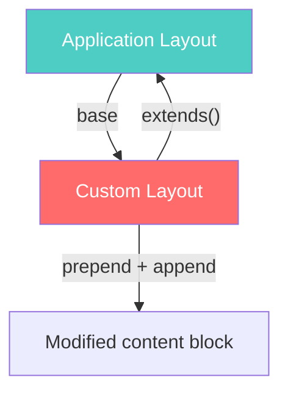

---

## Using View Blocks

View blocks provide a flexible API that allows you to define slots or blocks in your views/layouts that will be defined elsewhere. Blocks are ideal for implementing things such as sidebars, or regions to load assets at the bottom/top of the layout.

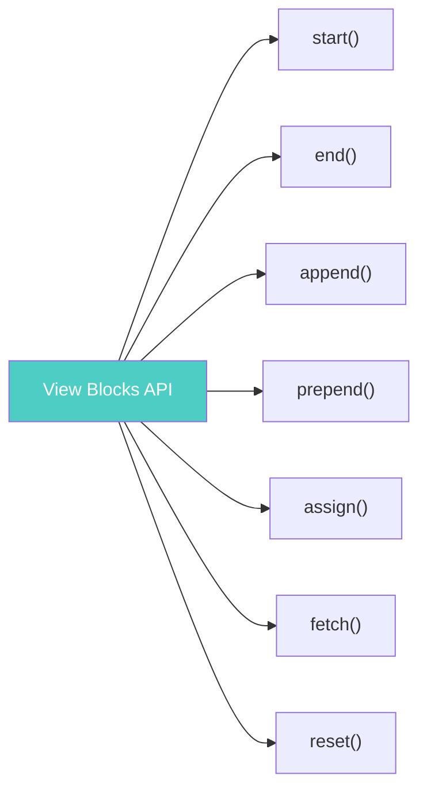

**Creating and using blocks:**

```php
<?php
// Create the sidebar block
$this->start('sidebar');
echo $this->element('sidebar/recent_topics');
echo $this->element('sidebar/recent_comments');
$this->end();

// Append into the sidebar later on
$this->start('sidebar');
echo $this->fetch('sidebar');
echo $this->element('sidebar/popular_topics');
$this->end();
?>
```

**Appending to a block:**

```php
<?php
$this->append('sidebar');
echo $this->element('sidebar/popular_topics');
$this->end();

// The same as the above
$this->append('sidebar', $this->element('sidebar/popular_topics'));
?>
```

**Clearing or resetting a block:**

```php
<?php
// Clear the previous content from the sidebar block
$this->reset('sidebar');

// Assigning an empty string will also clear the sidebar block
$this->assign('sidebar', '');
?>
```

**Assigning a block's content directly:**

```php
<?php
// In view file or layout above $this->fetch('title')
$this->assign('title', $title);
?>
```

**Prepending content:**

```php
<?php
// Prepend to sidebar
$this->prepend('sidebar', 'this content goes on top of sidebar');
?>
```

---

### Displaying Blocks

You can display blocks using the `fetch()` method. `fetch()` will output a block, returning `''` if a block does not exist:

```php
<?= $this->fetch('sidebar') ?>
```

You can also use `fetch()` to conditionally show content that should surround a block if it exists:

```php
<?php
// In templates/layout/default.php
?>
<?php if ($this->fetch('menu')): ?>
<div class="menu">
    <h3>Menu options</h3>
    <?= $this->fetch('menu') ?>
</div>
<?php endif; ?>
```

You can also provide a **default value** for a block if it does not exist:

```php
<?php
// Provides a fallback if 'cart' block is not defined
?>
<div class="shopping-cart">
    <h3>Your Cart</h3>
    <?= $this->fetch('cart', 'Your cart is empty') ?>
</div>
```

---

### Using Blocks for Script and CSS Files

The `HtmlHelper` ties into view blocks, and its `script()`, `css()`, and `meta()` methods each update a block with the same name when used with the `block => true` option:

```php
<?php
// In your view file
$this->Html->script('carousel', ['block' => true]);
$this->Html->css('carousel', ['block' => true]);
?>
```

```php
<?php
// In your layout file
?>
<!DOCTYPE html>
<html lang="en">
    <head>
    <title><?= h($this->fetch('title')) ?></title>
    <?= $this->fetch('script') ?>
    <?= $this->fetch('css') ?>
    </head>
```

You can also control which block the scripts and CSS go to:

```php
<?php
// In your view
$this->Html->script('carousel', ['block' => 'scriptBottom']);

// In your layout
?>
<?= $this->fetch('scriptBottom') ?>
```

---

## Layouts

A layout contains presentation code that wraps around a view. Anything you want to see in all of your views should be placed in a layout.

CakePHP's default layout is located at `templates/layout/default.php`. When you create a layout, you need to tell CakePHP where to place the output of your views using `$this->fetch('content')`.

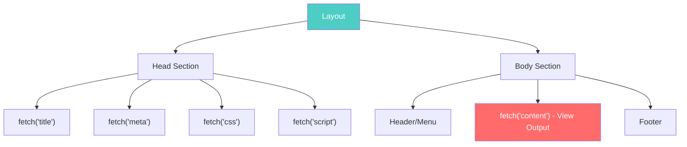

**Example default layout:**

```php
<?php
// templates/layout/default.php
?>
<!DOCTYPE html>
<html lang="en">
<head>
<title><?= h($this->fetch('title')) ?></title>
<link rel="shortcut icon" href="favicon.ico" type="image/x-icon">
<?php
echo $this->fetch('meta');
echo $this->fetch('css');
echo $this->fetch('script');
?>
</head>
<body>

<div id="header">
    <div id="menu">...</div>
</div>

<?= $this->fetch('content') ?>

<div id="footer">...</div>

</body>
</html>
```

> **Note:** When using `HtmlHelper::css()` or `HtmlHelper::script()` in template files, specify `'block' => true` to place the HTML source in a block with the same name.

You can set the `title` block content from inside your view file:

```php
<?php
$this->assign('title', 'View Active Users');
?>
```

---

### Setting Layouts

You can create as many layouts as you wish. Place them in the `templates/layout` directory and switch between them in your controller actions:

```php
<?php
// From a controller
public function view()
{
    // Set the layout
    $this->viewBuilder()->setLayout('admin');
}

// From a view file
$this->layout = 'loggedin';
?>
```

**Multiple layouts example:**

```php
<?php
namespace App\Controller;

class UsersController extends AppController
{
    public function viewActive()
    {
        $this->set('title', 'View Active Users');
        $this->viewBuilder()->setLayout('default_small_ad');
    }

    public function viewImage()
    {
        $this->viewBuilder()->setLayout('image');

        // Output user image
    }
}
?>
```

Besides a default layout, CakePHP's official skeleton app also has an `ajax` layout. The Ajax layout is handy for crafting AJAX responses - it's an empty layout (most AJAX calls only require a bit of markup in return).

---

### Using Layouts from Plugins

If you want to use a layout that exists in a plugin, you can use **plugin syntax**:

```php
<?php
namespace App\Controller;

class UsersController extends AppController
{
    public function viewActive()
    {
        $this->viewBuilder()->setLayout('Contacts.contact');
    }
}
?>
```

---

## Elements

Many applications have small blocks of presentation code that need to be repeated from page to page, sometimes in different places in the layout. CakePHP can help you repeat parts of your website that need to be reused. These reusable parts are called **Elements**.

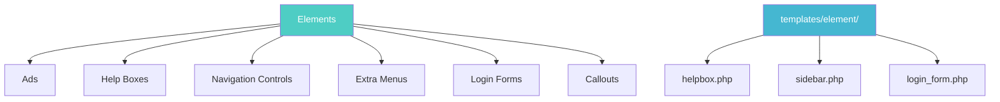

Elements live in the `templates/element/` folder, and have the `.php` filename extension. They are output using the `element()` method of the view:

```php
<?php
echo $this->element('helpbox');
?>
```

---

### Passing Variables into an Element

You can pass data to an element through the element's second argument:

```php
<?php
echo $this->element('helpbox', [
    'helptext' => 'Oh, this text is very helpful.',
]);
?>
```

Inside the element file, all the passed variables are available as members of the parameter array. In the above example, the `templates/element/helpbox.php` file can use the `$helptext` variable:

```php
<?php
// Inside templates/element/helpbox.php
echo $helptext; // Outputs `Oh, this text is very helpful.`
?>
```

> **Note:** View vars set using `Controller::set()` in the controller and `View::set()` in the view itself are also available inside the element.

The `View::element()` method also supports options for the element. The options supported are `'cache'` and `'callbacks'`:

```php
<?php
echo $this->element('helpbox', [
        'helptext' => "This is passed to the element as \$helptext",
        'foobar' => "This is passed to the element as \$foobar",
    ],
    [
        // uses the `long_view` cache configuration
        'cache' => 'long_view',
        // set to true to have before/afterRender called for the element
        'callbacks' => true,
    ]
);
?>
```

---

### Caching Elements

You can take advantage of CakePHP view caching if you supply a `cache` parameter. If set to `true`, it will cache the element in the `'default'` Cache configuration:

```php
<?php
echo $this->element('helpbox', [], ['cache' => true]);
?>
```

If you render the same element more than once in a view and have caching enabled, be sure to set the `'key'` parameter to a different name each time:

```php
<?php
echo $this->element(
    'helpbox',
    ['var' => $var],
    ['cache' => ['key' => 'first_use', 'config' => 'view_long']],
);

echo $this->element(
    'helpbox',
    ['var' => $differentVar],
    ['cache' => ['key' => 'second_use', 'config' => 'view_long']],
);
?>
```

To cache different versions of the same element in an application, provide a unique cache key value:

```php
<?php
$this->element('helpbox', [], [
        'cache' => ['config' => 'short', 'key' => 'unique value'],
    ]
);
?>
```

> **Tip:** If you need more logic in your element, such as dynamic data from a datasource, consider using a **View Cell** instead of an element.

---

### Requesting Elements from a Plugin

If you are using a plugin and wish to use elements from within the plugin, use the familiar **plugin syntax**:

```php
<?php
echo $this->element('Contacts.helpbox');
?>
```

If your view is a part of a plugin, you can omit the plugin name. For example, if you are in the `ContactsController` of the `Contacts` plugin:

```php
<?php
echo $this->element('helpbox');
// and
echo $this->element('Contacts.helpbox');
// are equivalent
?>
```

For elements inside a subfolder of a plugin:

```php
<?php
echo $this->element('Contacts.sidebar/helpbox');
?>
```

---

### Routing Prefix and Elements

If you have a **Routing prefix** configured, the Element path resolution can switch to a prefix location, as Layouts and action Views do. Assuming you have a prefix "Admin" configured and you call:

```php
<?php
echo $this->element('my_element');
?>
```

The element will first be looked for in `templates/Admin/element/`. If such a file does not exist, it will be looked for in the default location.

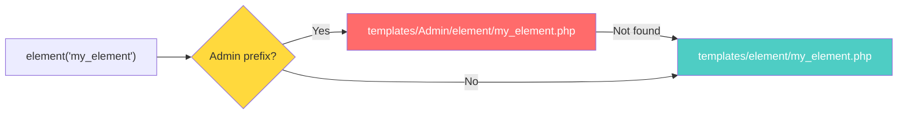

---

### Caching Sections of Your View

Sometimes generating a section of your view output can be expensive because of rendered View Cells or expensive helper operations. To help make your application run faster, CakePHP provides a way to cache view sections:

```php
<?php
// Assuming some local variables
echo $this->cache(function () use ($user, $article) {
    echo $this->cell('UserProfile', [$user]);
    echo $this->cell('ArticleFull', [$article]);
}, ['key' => 'my_view_key']);
?>
```

By default, cached view content will go into the `View::$elementCache` cache config, but you can use the `config` option to change this.

> **Tip:** Use view section caching for expensive operations like rendering multiple View Cells or complex helper calls to improve performance.

---

## Themes

Themes in CakePHP are simply **plugins** that focus on providing template files. You can take advantage of themes, allowing you to switch the look and feel of your page quickly. In addition to template files, themes can also provide helpers and cells if your theming requires that.

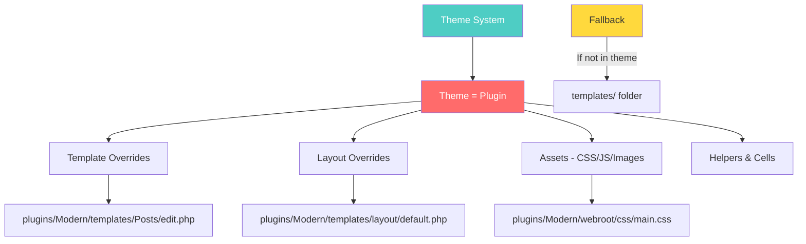

---

### Setting Up a Theme

First, ensure your theme plugin is loaded in your application's bootstrap method:

```php
<?php
// Load our plugin theme residing in the folder /plugins/Modern
$this->addPlugin('Modern');
?>
```

To use themes, set the theme name in your controller's action or `beforeRender()` callback:

```php
<?php
class ExamplesController extends AppController
{
    public function beforeRender(\Cake\Event\EventInterface $event): void
    {
        $this->viewBuilder()->setTheme('Modern');
    }
}
?>
```

---

### Theme Template Structure

Theme template files need to be within a plugin with the same name. CakePHP expects **PascalCase** plugin/theme names. The folder structure within the plugin's templates folder is exactly the same as `templates/`.

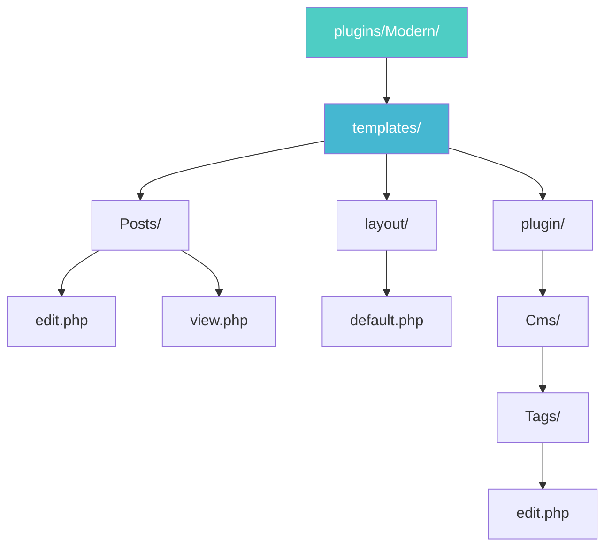

| Standard Template | Theme Override |
|---|---|
| `templates/Posts/edit.php` | `plugins/Modern/templates/Posts/edit.php` |
| `templates/layout/default.php` | `plugins/Modern/templates/layout/default.php` |
| Plugin Cms `Tags/edit.php` | `plugins/Modern/templates/plugin/Cms/Tags/edit.php` |

> **Important:** If a view file can't be found in the theme, CakePHP will try to locate the view file in the `templates/` folder. This way, you can create master template files and simply override them on a case-by-case basis within your theme folder.

---

### Theme Assets

Because themes are standard CakePHP plugins, they can include any necessary assets in their `webroot` directory. This allows for packaging and distribution of themes.

All of CakePHP's built-in helpers are aware of themes and will create the correct paths automatically. Like template files, if a file isn't in the theme folder, it will default to the main webroot folder:

```php
<?php
// When in a theme with the name of 'purple_cupcake'
$this->Html->css('main.css');

// creates a path like
// /purple_cupcake/css/main.css

// and links to
// plugins/PurpleCupcake/webroot/css/main.css
?>
```

> **Note:** During development, requests for theme assets will be handled by `Cake\Routing\Middleware\AssetMiddleware`. To improve performance for production environments, it's recommended that you symlink assets.

---

## View Cells

View cells are small **mini-controllers** that can invoke view logic and render out templates. The idea of cells is borrowed from cells in Ruby, where they fulfill a similar role and purpose.

Cells are ideal for building **reusable page components** that require interaction with models, view logic, and rendering logic.

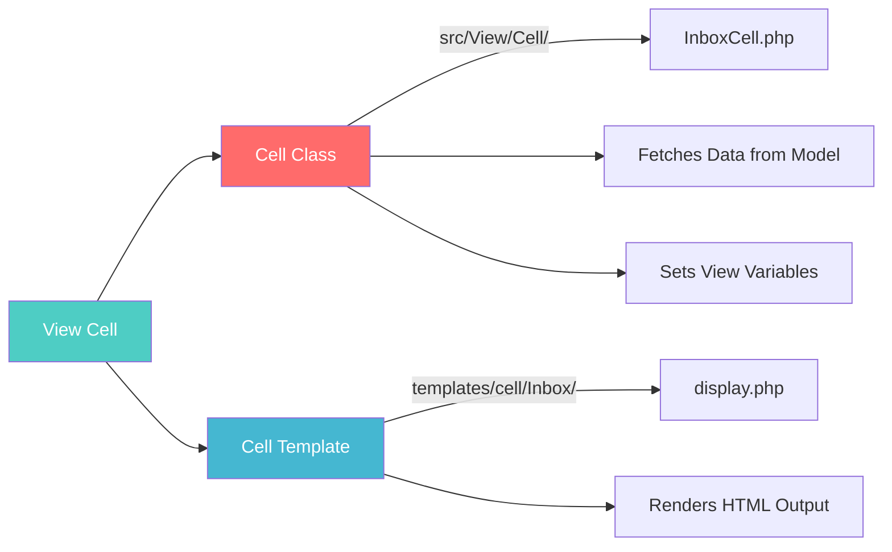

---

### Creating a Cell

To create a cell, define a class in `src/View/Cell` and a template in `templates/cell/`. Cells have a few conventions:

- Cell classes live in `App\View\Cell` (or `PluginName\View\Cell` for plugins)
- Cell classes extend `Cake\View\Cell`
- Cell templates live in `templates/cell/CellName/`

```php
<?php
namespace App\View\Cell;

use Cake\View\Cell;

class InboxCell extends Cell
{
    public function display(): void
    {
    }
}
?>
```

Save this file into `src/View/Cell/InboxCell.php`. Create the template file at `templates/cell/Inbox/display.php`.

You can generate this stub code quickly using **bake**:

```bash
#!/bin/bash
bin/cake bake cell Inbox
```

---

### Implementing the Cell

Because Cells use the `LocatorAwareTrait` and `ViewVarsTrait`, they behave very much like a controller. You can use the `fetchTable()` and `set()` methods just like in a controller:

```php
<?php
namespace App\View\Cell;

use Cake\View\Cell;

class InboxCell extends Cell
{
    public function display(): void
    {
        $unread = $this->fetchTable('Messages')->find('unread');
        $this->set('unread_count', $unread->count());
    }
}
?>
```

In the cell template file (`templates/cell/Inbox/display.php`):

```html
<!-- templates/cell/Inbox/display.php -->
<div class="notification-icon">
    You have <?= $unread_count ?> unread messages.
</div>
```

> **Note:** Cell templates have an isolated scope that does not share the same View instance as the one used to render template and layout for the current controller action or other cells.

---

### Loading and Rendering Cells

Cells can be loaded from views using the `cell()` method:

```php
<?php
// Load an application cell
$cell = $this->cell('Inbox');

// Load a plugin cell
$cell = $this->cell('Messaging.Inbox');
?>
```

The above will load the named cell class and execute the `display()` method. You can execute other methods using:

```php
<?php
// Run the expanded() method on the Inbox cell
$cell = $this->cell('Inbox::expanded');
?>
```

If you need controller logic to decide which cells to load in a request, you can use the `CellTrait` in your controller:

```php
<?php
namespace App\Controller;

use App\Controller\AppController;
use Cake\View\CellTrait;

class DashboardsController extends AppController
{
    use CellTrait;

    // More code.
}
?>
```

**Rendering a cell** is as simple as echoing it:

```php
<?= $cell ?>
```

This will render the template matching the lowercased and underscored version of the action name (e.g., `display.php`).

> **Tip:** Echoing a cell uses the PHP `__toString()` magic method which prevents PHP from showing the filename and line number for any fatal errors raised. To obtain a meaningful error message, use `<?= $cell->render() ?>` instead.

---

### Passing Arguments to a Cell

You will often want to parameterize cell methods. By using the second and third arguments of `cell()`, you can pass action parameters and additional options:

```php
<?php
$cell = $this->cell('Inbox::recent', ['-3 days']);
?>
```

The above would match the following function signature:

```php
<?php
public function recent(string $since): void
{
}
?>
```

**Rendering alternate templates:**

```php
<?php
// Calling render() explicitly
echo $this->cell('Inbox::recent', ['-3 days'])->render('messages');

// Set template before echoing the cell
$cell = $this->cell('Inbox');
$cell->viewBuilder()->setTemplate('messages');

echo $cell;
?>
```

---

### Caching Cell Output

When rendering a cell you may want to cache the rendered output. You can define the `cache` option when creating a cell:

```php
<?php
// Cache using the default config and a generated key
$cell = $this->cell('Inbox', [], ['cache' => true]);

// Cache to a specific cache config and a generated key
$cell = $this->cell('Inbox', [], ['cache' => ['config' => 'cell_cache']]);

// Specify the key and config to use
$cell = $this->cell('Inbox', [], [
    'cache' => ['config' => 'cell_cache', 'key' => 'inbox_' . $user->id],
]);
?>
```

> **Note:** A new View instance is used to render each cell and these new objects do not share context with the main template / layout. Each cell is self-contained and only has access to variables passed as arguments to the `View::cell()` call.

---

### Paginating Data inside a Cell

Creating a cell that renders a paginated result set can be done by leveraging a paginator class of the ORM:

```php
<?php
namespace App\View\Cell;

use Cake\View\Cell;
use Cake\Datasource\Paging\NumericPaginator;

class FavoritesCell extends Cell
{
    public function display(User $user): void
    {
        // Create a paginator
        $paginator = new NumericPaginator();

        // Paginate the model
        $results = $paginator->paginate(
            $this->fetchTable('Messages'),
            $this->request->getQueryParams(),
            [
                // Use a parameterized custom finder
                'finder' => ['favorites' => [$user]],

                // Use scoped query string parameters
                'scope' => 'favorites',
            ]
        );

        $this->set('favorites', $results);
    }
}
?>
```

---

### Cell Options

Cells can declare constructor options that are converted into properties when creating a cell object:

```php
<?php
namespace App\View\Cell;

use Cake\View\Cell;

class FavoritesCell extends Cell
{
    protected array $_validCellOptions = ['limit'];

    protected int $limit = 3;

    public function display(int $userId): void
    {
        $result = $this->fetchTable('Users')->find('friends', ['for' => $userId])
            ->limit($this->limit)
            ->all();
        $this->set('favorites', $result);
    }
}
?>
```

This allows you to define the option when creating the cell:

```php
<?php
$cell = $this->cell('Favorites', [$user->id], ['limit' => 10]);
?>
```

**Using Helpers inside a Cell:**

Helpers loaded inside your `AppView::initialize()` function are still loaded as usual. To load a specific Helper just for a specific cell:

```php
<?php
namespace App\View\Cell;

use Cake\View\Cell;

class FavoritesCell extends Cell
{
    public function initialize(): void
    {
        $this->viewBuilder()->addHelper('MyCustomHelper');
    }
}
?>
```

---

## View Events

Like Controller, views trigger several events/callbacks that you can use to insert logic around the rendering life-cycle:

| Event | Description |
|---|---|
| `View.beforeRender` | Fired before the view is rendered |
| `View.beforeRenderFile` | Fired before each view file is rendered |
| `View.afterRenderFile` | Fired after each view file is rendered |
| `View.afterRender` | Fired after the view is rendered |
| `View.beforeLayout` | Fired before the layout is rendered |
| `View.afterLayout` | Fired after the layout is rendered |

Cells also trigger their own events (added in CakePHP 5.1.0):

| Event | Description |
|---|---|
| `Cell.beforeAction` | Fired before a cell action is executed |
| `Cell.afterAction` | Fired after a cell action is executed |

You can attach application event listeners to these events or use Helper Callbacks.

---

## Creating Your Own View Classes

You may need to create custom view classes to enable new types of data views, or add additional custom view-rendering logic to your application.

View class files live in `src/View/` and class names are suffixed with `View` (e.g., `PdfView`):

```php
<?php
// In src/View/PdfView.php
namespace App\View;

use Cake\View\View;

class PdfView extends View
{
    protected string $layoutPath = 'pdf';

    protected string $subDir = 'pdf';

    public static function contentType(): string
    {
        return 'application/pdf';
    }

    public function render(?string $view = null, ?string $layout = null): string
    {
        // Custom logic here.
    }
}
?>
```

Replacing the `render` method lets you take full control over how your content is rendered.

---

<nav style="background: var(--bg-secondary); border: 1px solid var(--border-color); border-radius: 6px; padding: 15px 20px; margin: 30px 0;">
  <div style="display: flex; align-items: center; justify-content: space-between; flex-wrap: wrap; gap: 10px;">
    <a href="07-pagination-request-response.html" style="color: var(--link-color);">← Previous: Pagination & Request/Response</a>
    <span style="color: var(--text-secondary);">👁️ Page 8 of 8</span>
    <a href="index.html" style="color: var(--link-color);">Home →</a>
  </div>
</nav>

---

**Released under the MIT License.**

**Copyright © Cake Software Foundation, Inc. All rights reserved.**
