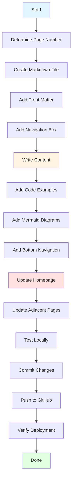
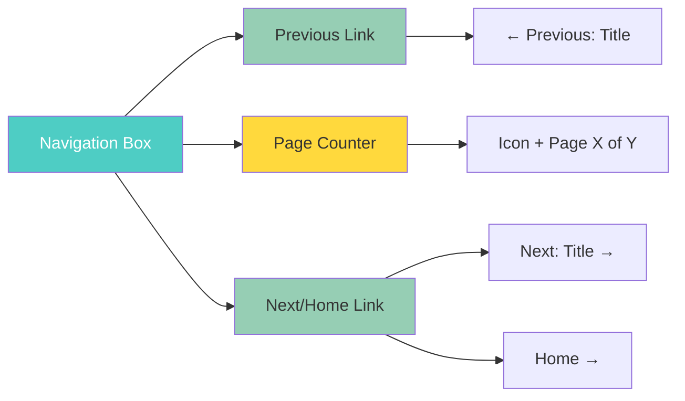
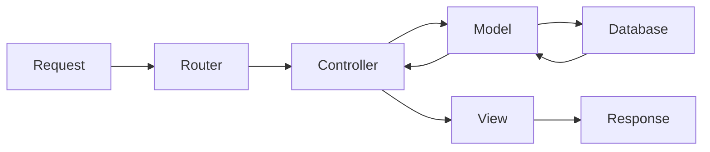
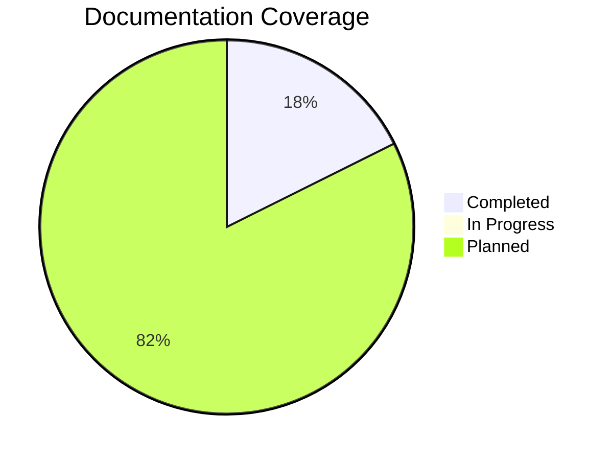
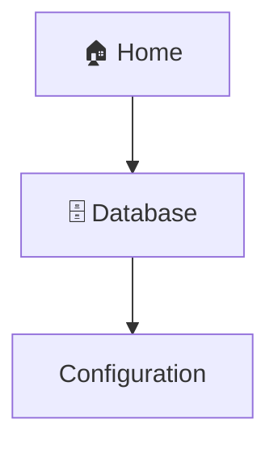

# Contributing to CakePHP Documentation

This guide explains how to create and add new documentation pages to this site.

---

## 📋 Table of Contents

- [Overview](#overview)
- [Workflow Diagram](#workflow-diagram)
- [Step-by-Step Guide](#step-by-step-guide)
- [File Structure](#file-structure)
- [Page Template](#page-template)
- [Navigation Setup](#navigation-setup)
- [Homepage Updates](#homepage-updates)
- [Testing](#testing)
- [Deployment](#deployment)

---

## Overview

Adding a new documentation page involves:

1. Creating a numbered markdown file
2. Adding front matter and navigation
3. Writing content with proper formatting
4. Updating the homepage
5. Updating navigation on adjacent pages
6. Committing and deploying



---

## Step-by-Step Guide

### Step 1: Determine Page Number

Find the highest numbered page and add 1.

**Current pages:**

- `01-cakephp-at-a-glance.md`
- `02-installation-guide.md`

**Next page:** `03-your-new-page.md`

```bash
# List existing pages to find the next number
ls docs/*.md | grep -E '^[0-9]' | sort
```

---

### Step 2: Create the Markdown File

**File location:** `docs/03-your-new-page.md`

**Naming convention:**

- Use kebab-case (lowercase with hyphens)
- Start with two-digit number (01, 02, 03, etc.)
- Be descriptive but concise

**Examples:**

- ✅ `03-database-configuration.md`
- ✅ `04-routing-basics.md`
- ❌ `database.md` (no number)
- ❌ `03-Database-Config.md` (wrong case)

```bash
# Create new file
touch docs/03-database-configuration.md
```

---

### Step 3: Add Front Matter

Every page must start with YAML front matter:

```yaml
---
layout: default
title: Your Page Title
description: Brief description for SEO and previews
---
```

**Example:**

```yaml
---
layout: default
title: Database Configuration
description: Complete guide to configuring database connections in CakePHP
---
```

---

### Step 4: Add Page Title and Source

```markdown
# Database Configuration

> **Source:** [CakePHP Official Documentation](https://book.cakephp.org/5.x/orm/database-basics.html)
```

---

### Step 5: Add Navigation Box Under Title

```markdown
<nav style="background: var(--bg-secondary); border: 1px solid var(--border-color); border-radius: 6px; padding: 15px 20px; margin: 20px 0;">
  <div style="display: flex; align-items: center; justify-content: space-between; flex-wrap: wrap; gap: 10px;">
    <a href="02-installation-guide.html" style="color: var(--link-color);">← Previous: Installation</a>
    <span style="color: var(--text-secondary);">🗄️ Page 3 of 3</span>
    <a href="index.html" style="color: var(--link-color);">Home →</a>
  </div>
</nav>
```

**Navigation box components:**



**Rules:**

- First page: Show only "Next" and page counter
- Middle pages: Show "Previous", page counter, and "Next"
- Last page: Show "Previous", page counter, and "Home"
- Update total page count (e.g., "Page 3 of 3" → "Page 3 of 4" when adding page 4)

---

### Step 6: Add Table of Contents

For long pages, add a table of contents:

```markdown
## Table of Contents

- [Section 1](#section-1)
- [Section 2](#section-2)
- [Section 3](#section-3)
```

---

### Step 7: Write Content

Follow these formatting guidelines:

#### Headings

```markdown
## Main Section (H2)

### Subsection (H3)

#### Sub-subsection (H4)
```

#### Code Blocks

Always specify the language for syntax highlighting:

````markdown
```php
<?php
namespace App\Controller;

class ArticlesController extends AppController
{
    public function index()
    {
        $articles = $this->Articles->find('all');
        $this->set(compact('articles'));
    }
}
```
````

**Supported languages:**

- `php`, `bash`, `shell`, `json`, `xml`, `yaml`, `sql`, `html`, `css`, `javascript`

#### Callouts

Use blockquotes for important notes:

```markdown
> **Note:** This is an informational note.

> **Warning:** This is a warning message.

> **Tip:** This is a helpful tip.

> **Important:** This is critical information.
```

#### Mermaid Diagrams

Add visual diagrams to explain concepts:

````markdown

````

**Diagram types:**

- `flowchart` - Process flows
- `sequenceDiagram` - Interaction sequences
- `graph` - Relationships
- `gantt` - Timelines
- `pie` - Statistics

---

### Step 8: Add Bottom Navigation

At the end of the page, add:

```markdown
---

<nav style="background: var(--bg-secondary); border: 1px solid var(--border-color); border-radius: 6px; padding: 15px 20px; margin: 30px 0;">
  <div style="display: flex; align-items: center; justify-content: space-between; flex-wrap: wrap; gap: 10px;">
    <a href="02-installation-guide.html" style="color: var(--link-color);">← Previous: Installation</a>
    <span style="color: var(--text-secondary);">🗄️ Page 3 of 3</span>
    <a href="04-routing-basics.html" style="color: var(--link-color);">Next: Routing →</a>
  </div>
</nav>

---

**Released under the MIT License.**

**Copyright © Cake Software Foundation, Inc. All rights reserved.**
```

---

### Step 9: Update Homepage (`docs/index.md`)

#### A. Update Documentation Map

Add your page to the Mermaid diagram:

````markdown
```mermaid
graph TB
    A[🏠 Home] --> B[📖 Introduction]
    A --> C[⚙️ Installation]
    A --> D[🗄️ Database]  <!-- NEW -->

    B --> B1[CakePHP at a Glance]
    C --> C1[System Requirements]
    C --> C2[Installation Methods]
    D --> D1[Configuration]  <!-- NEW -->
    D --> D2[Connections]    <!-- NEW -->
```
````

````

#### B. Update Getting Started Cards

If it's a getting started topic, add a card:

```html
<div style="border: 1px solid var(--border-color); border-radius: 8px; padding: 20px; background: var(--bg-secondary);">
  <h3 style="margin-top: 0;">🗄️ Database</h3>
  <p>Learn how to configure and work with databases in CakePHP.</p>
  <a href="03-database-configuration.html" style="display: inline-block; margin-top: 10px; padding: 8px 16px; background: var(--link-color); color: white; border-radius: 4px; text-decoration: none;">Configure Database →</a>
</div>
````

#### C. Update Available Documentation Table

```markdown
| Document                                                    | Description                      | Status       |
| ----------------------------------------------------------- | -------------------------------- | ------------ |
| [1. CakePHP at a Glance](01-cakephp-at-a-glance.html)       | Introduction to CakePHP concepts | ✅ Available |
| [2. Installation Guide](02-installation-guide.html)         | Complete installation guide      | ✅ Available |
| [3. Database Configuration](03-database-configuration.html) | Database setup and configuration | ✅ Available |
```

#### D. Update Documentation Progress

````markdown

````

````

---

### Step 10: Update Adjacent Pages

#### Update Previous Page

In `02-installation-guide.md`, change the bottom navigation:

**Before:**
```markdown
<a href="index.html" style="color: var(--link-color);">Home →</a>
````

**After:**

```markdown
<a href="03-database-configuration.html" style="color: var(--link-color);">Next: Database →</a>
```

Also update page counter:

```markdown
<span style="color: var(--text-secondary);">⚙️ Page 2 of 3</span>
```

#### Update All Page Counters

When adding a new page, update the total count on ALL pages:

- Page 1: "Page 1 of 3" → "Page 1 of 4"
- Page 2: "Page 2 of 3" → "Page 2 of 4"
- Page 3: "Page 3 of 3" → "Page 3 of 4"

---

## File Structure

```
docs/
├── _layouts/
│   └── default.html          # Main layout (don't modify)
├── _config.yml               # Jekyll config (don't modify)
├── index.md                  # Homepage (update this)
├── 01-cakephp-at-a-glance.md
├── 02-installation-guide.md
├── 03-your-new-page.md       # Your new page
└── CONTRIBUTING.md           # This file
```

---

## Page Template

Use this template for new pages:

````markdown
---
layout: default
title: Your Page Title
description: Brief description for SEO
---

# Your Page Title

> **Source:** [CakePHP Official Documentation](https://book.cakephp.org/5.x/your-topic.html)

<nav style="background: var(--bg-secondary); border: 1px solid var(--border-color); border-radius: 6px; padding: 15px 20px; margin: 20px 0;">
  <div style="display: flex; align-items: center; justify-content: space-between; flex-wrap: wrap; gap: 10px;">
    <a href="XX-previous-page.html" style="color: var(--link-color);">← Previous: Title</a>
    <span style="color: var(--text-secondary);">🔷 Page X of Y</span>
    <a href="XX-next-page.html" style="color: var(--link-color);">Next: Title →</a>
  </div>
</nav>

## Table of Contents

- [Section 1](#section-1)
- [Section 2](#section-2)

---

## Section 1

Your content here...

```php
// Code example
```
````


---

## Section 2

More content...

---

<nav style="background: var(--bg-secondary); border: 1px solid var(--border-color); border-radius: 6px; padding: 15px 20px; margin: 30px 0;">
  <div style="display: flex; align-items: center; justify-content: space-between; flex-wrap: wrap; gap: 10px;">
    <a href="XX-previous-page.html" style="color: var(--link-color);">← Previous: Title</a>
    <span style="color: var(--text-secondary);">🔷 Page X of Y</span>
    <a href="XX-next-page.html" style="color: var(--link-color);">Next: Title →</a>
  </div>
</nav>

---

**Released under the MIT License.**

**Copyright © Cake Software Foundation, Inc. All rights reserved.**

````

---

## Complete Workflow Visualization

```mermaid
sequenceDiagram
    participant Dev as Developer
    participant File as New MD File
    participant Home as index.md
    participant Prev as Previous Page
    participant Git as Git/GitHub
    participant Pages as GitHub Pages

    Dev->>File: Create 03-new-page.md
    Dev->>File: Add front matter
    Dev->>File: Add navigation box
    Dev->>File: Write content
    Dev->>File: Add code examples
    Dev->>File: Add Mermaid diagrams
    Dev->>File: Add bottom navigation

    Dev->>Home: Update documentation map
    Dev->>Home: Add to table
    Dev->>Home: Update progress chart

    Dev->>Prev: Update next link
    Dev->>Prev: Update page counter

    Dev->>Git: git add docs/
    Dev->>Git: git commit -m "Add new page"
    Dev->>Git: git push origin main

    Git->>Pages: Trigger deployment
    Pages->>Pages: Build site
    Pages->>Dev: Site deployed ✅
````

---

## Testing Checklist

Before committing, verify:

- [ ] File named correctly (number + kebab-case)
- [ ] Front matter present and correct
- [ ] Navigation box under title
- [ ] Page counter accurate
- [ ] All code blocks have language tags
- [ ] Mermaid diagrams render correctly
- [ ] Bottom navigation present
- [ ] Homepage updated (map, table, progress)
- [ ] Previous page updated (next link, counter)
- [ ] All internal links work
- [ ] No broken images or links
- [ ] Dark mode looks good
- [ ] Copy buttons work on code blocks

---

## Deployment

### Commit and Push

```bash
# Stage all changes
git add docs/

# Commit with descriptive message
git commit -m "Add database configuration documentation

- Created 03-database-configuration.md
- Added connection examples and diagrams
- Updated homepage with new page
- Updated navigation on page 2
- Updated all page counters"

# Push to GitHub
git push origin main
```

### Verify Deployment

1. Wait 1-2 minutes for GitHub Pages to build
2. Visit your documentation site
3. Check the new page loads correctly
4. Test navigation links
5. Verify dark mode
6. Test copy buttons on code blocks

---

## Common Issues and Solutions

### Issue: Mermaid diagrams not rendering

**Solution:** Ensure you're using triple backticks with `mermaid` language tag:

````markdown

````

### Issue: Code blocks not syntax highlighted

**Solution:** Add language tag after opening backticks:

````markdown
```php
<?php echo "Hello"; ?>
```
````

### Issue: Navigation links broken

**Solution:** Use `.html` extension in links:

- ✅ `href="03-database-configuration.html"`
- ❌ `href="03-database-configuration.md"`

### Issue: Dark mode colors wrong

**Solution:** Use CSS variables:

- `var(--bg-primary)` for backgrounds
- `var(--text-primary)` for text
- `var(--link-color)` for links
- `var(--border-color)` for borders

---

## Quick Reference

### Emoji Icons for Page Types

- 📖 Introduction/Overview
- ⚙️ Installation/Setup
- 🗄️ Database
- 🛣️ Routing
- 🎮 Controllers
- 👁️ Views
- 🔐 Security
- 🧪 Testing
- 🚀 Deployment

### CSS Variables

```css
var(--bg-primary)      /* Main background */
var(--bg-secondary)    /* Secondary background */
var(--bg-code)         /* Code block background */
var(--text-primary)    /* Main text color */
var(--text-secondary)  /* Secondary text color */
var(--border-color)    /* Border color */
var(--link-color)      /* Link color */
```

---

## Example: Adding Database Configuration Page

Here's a complete example of adding a new page:

### 1. Create File

```bash
touch docs/03-database-configuration.md
```

### 2. Add Content

See the [Page Template](#page-template) section above.

### 3. Update Homepage

````markdown
<!-- In docs/index.md -->

<!-- Update map -->


````

```

<!-- Update table -->
| [3. Database Configuration](03-database-configuration.html) | Database setup | ✅ Available |

<!-- Update progress -->
"Completed" : 3
```

### 4. Update Page 2

```markdown
<!-- In docs/02-installation-guide.md -->

<!-- Bottom navigation -->

<a href="03-database-configuration.html">Next: Database →</a>

<!-- Page counter -->

<span>⚙️ Page 2 of 3</span>
```

### 5. Commit and Push

```bash
git add docs/
git commit -m "Add database configuration documentation"
git push origin main
```

---

## Need Help?

- Check existing pages for examples
- Review the [Page Template](#page-template)
- Test locally before pushing
- Ask in the community channels

---

**Happy Documenting! 📚**

---

[← Back to Documentation Home](index.html)
