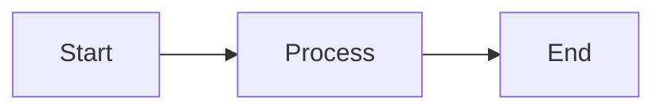

# GitHub Pages Setup Guide

This guide explains how to enable GitHub Pages for this documentation.

## 📋 What Was Created

1. **Documentation Files:**
   - `docs/README.md` - Homepage/index for the documentation
   - `docs/installation-guide.md` - Complete CakePHP installation guide
   - `docs/_config.yml` - GitHub Pages Jekyll configuration

2. **Workflow Rules:**
   - `.kilocode/workflows/docs-creation.md` - Comprehensive rules for creating documentation from scraped data

## 🚀 Enable GitHub Pages

### Step 1: Push to GitHub

```bash
git add docs/
git add .kilocode/workflows/docs-creation.md
git commit -m "Add CakePHP documentation with GitHub Pages support"
git push origin main
```

### Step 2: Enable GitHub Pages

1. Go to your repository on GitHub
2. Click **Settings** tab
3. Scroll down to **Pages** section (left sidebar)
4. Under **Source**, select:
   - Branch: `main` (or your default branch)
   - Folder: `/docs`
5. Click **Save**

### Step 3: Wait for Deployment

GitHub will automatically build and deploy your site. This usually takes 1-2 minutes.

### Step 4: Access Your Documentation

Your documentation will be available at:

```
https://<your-username>.github.io/<repository-name>/
```

## ✅ Features Included

### Mermaid Diagrams

The documentation includes Mermaid diagrams that render automatically on GitHub Pages:



### Syntax Highlighting

Code blocks with proper language tags for syntax highlighting:

```php
<?php
echo "Hello, CakePHP!";
```

### Navigation

- Table of contents in each document
- Cross-references between documents
- Back to home links

### Callouts

- **Notes** for additional information
- **Warnings** for important notices
- **Tips** for best practices

## 📝 Creating More Documentation

Follow the workflow defined in `.kilocode/workflows/docs-creation.md`:

1. **Parse** scraped data from `scraped_data/` directory
2. **Extract** headers, content, and code blocks
3. **Format** using the markdown template
4. **Add** Mermaid diagrams where helpful
5. **Include** proper navigation and cross-references
6. **Save** to `docs/` directory with kebab-case naming
7. **Update** `docs/README.md` with link to new document

## 🎨 Customization

### Change Theme

Edit `docs/_config.yml` and change the theme:

```yaml
theme: jekyll-theme-minimal
# or
theme: jekyll-theme-slate
# or
theme: jekyll-theme-architect
```

Available themes:

- jekyll-theme-cayman (current)
- jekyll-theme-minimal
- jekyll-theme-slate
- jekyll-theme-architect
- jekyll-theme-hacker
- jekyll-theme-leap-day
- jekyll-theme-merlot
- jekyll-theme-midnight
- jekyll-theme-modernist
- jekyll-theme-tactile
- jekyll-theme-time-machine

### Custom Domain

To use a custom domain:

1. Add a `CNAME` file to `docs/` directory:

   ```
   docs.yourdomain.com
   ```

2. Configure DNS with your domain provider:
   - Add a CNAME record pointing to `<username>.github.io`

3. In GitHub Settings > Pages, enter your custom domain

## 🔍 Testing Locally

To test the documentation locally before pushing:

### Using Jekyll

```bash
# Install Jekyll
gem install bundler jekyll

# Navigate to docs directory
cd docs

# Create Gemfile
cat > Gemfile << EOF
source 'https://rubygems.org'
gem 'github-pages', group: :jekyll_plugins
EOF

# Install dependencies
bundle install

# Serve locally
bundle exec jekyll serve

# Visit http://localhost:4000
```

### Using Python

```bash
# Navigate to docs directory
cd docs

# Start simple HTTP server
python -m http.server 8000

# Visit http://localhost:8000
```

> **Note:** The Python method won't process Jekyll templates, but will show the raw markdown rendered by your browser.

## 📚 Next Steps

1. ✅ Enable GitHub Pages (follow steps above)
2. ✅ Verify documentation renders correctly
3. ✅ Create more documentation from scraped data
4. ✅ Update README.md with links to new docs
5. ✅ Share your documentation URL!

## 🐛 Troubleshooting

### Mermaid Diagrams Not Rendering

If Mermaid diagrams don't render on GitHub Pages:

1. Ensure you're using triple backticks with `mermaid` language tag:

   ````markdown
   ```mermaid
   graph LR
       A --> B
   ```
   ````

2. GitHub Pages may need additional configuration. Add this to your HTML head (create a custom layout if needed):
   ```html
   <script src="https://cdn.jsdelivr.net/npm/mermaid/dist/mermaid.min.js"></script>
   <script>
     mermaid.initialize({ startOnLoad: true });
   </script>
   ```

### 404 Errors

- Ensure branch and folder are correctly set in GitHub Pages settings
- Wait a few minutes for deployment to complete
- Check that `docs/README.md` or `docs/index.md` exists

### Styling Issues

- Clear browser cache
- Check `_config.yml` for syntax errors
- Verify theme name is correct

## 📞 Support

For issues with:

- **CakePHP:** Visit [CakePHP Community](https://cakephp.org/community)
- **GitHub Pages:** Check [GitHub Pages Documentation](https://docs.github.com/en/pages)
- **Jekyll:** See [Jekyll Documentation](https://jekyllrb.com/docs/)

---

**Happy Documenting! 📖**
