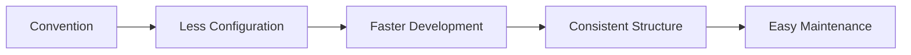
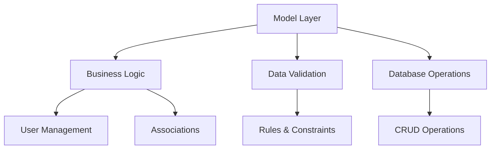
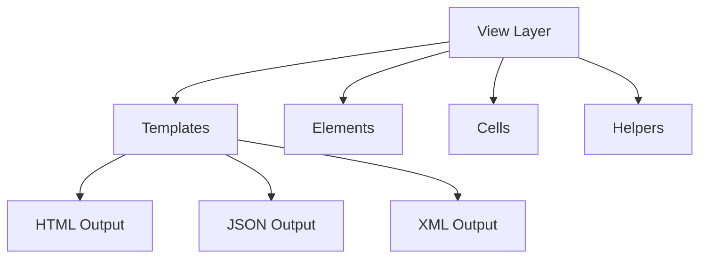
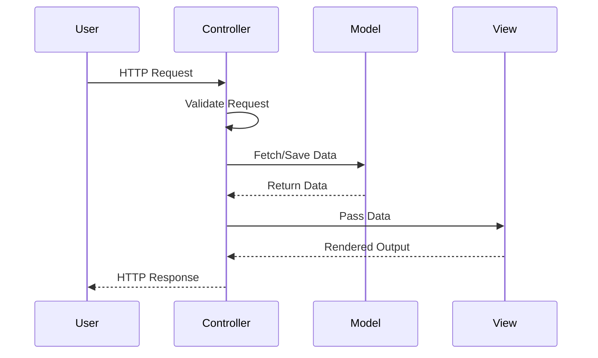
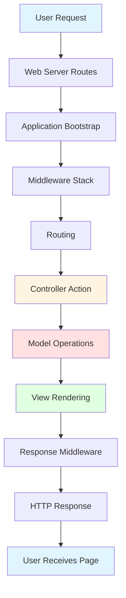
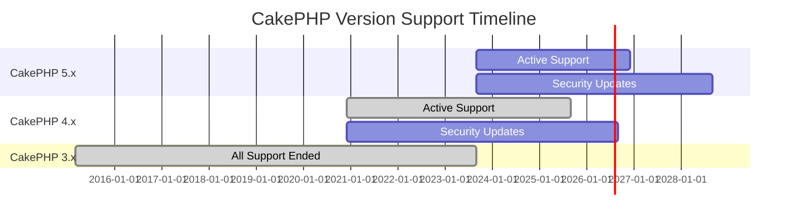

# CakePHP at a Glance

> **Source:** [CakePHP Official Documentation](https://book.cakephp.org/5.x/intro.html)

CakePHP is designed to make common web-development tasks simple and easy. By providing an all-in-one toolbox to get you started, the various parts of CakePHP work well together or separately.

The goal of this overview is to introduce the general concepts in CakePHP and give you a quick overview of how those concepts are implemented. If you are itching to get started on a project, you can start with the tutorial or dive into the docs.

## Table of Contents

- [Conventions Over Configuration](#conventions-over-configuration)
- [The Model Layer](#the-model-layer)
- [The View Layer](#the-view-layer)
- [The Controller Layer](#the-controller-layer)
- [CakePHP Request Cycle](#cakephp-request-cycle)
- [Additional Features](#additional-features)
- [Where to Get Help](#where-to-get-help)
- [Supported Versions](#supported-versions)

---

## Conventions Over Configuration

CakePHP provides a basic organizational structure that covers class names, filenames, database table names, and other conventions. While the conventions take some time to learn, by following them you can avoid needless configuration and make a uniform application structure that makes working with various projects simple.

> **Tip:** The conventions chapter covers the various conventions that CakePHP uses in detail.



---

## The Model Layer

The Model layer represents the part of your application that implements the business logic. It is responsible for retrieving data and converting it into the primary meaningful concepts in your application.

### Key Responsibilities

- Processing and validating data
- Managing associations between data
- Implementing business rules
- Handling data persistence

### Example: Working with Data

In the case of a social network, the Model layer would take care of tasks such as:

- Saving user data
- Managing friend associations
- Storing and retrieving user photos
- Finding suggestions for new friends

The model objects can be thought of as "Friend", "User", "Comment", or "Photo".

**Loading data from the `users` table:**

```php
use Cake\ORM\Locator\LocatorAwareTrait;

$users = $this->fetchTable('Users');
$resultset = $users->find()->all();
foreach ($resultset as $row) {
    echo $row->username;
}
```

> **Note:** You may notice that we didn't have to write any code before we could start working with our data. By using conventions, CakePHP will use standard classes for table and entity classes that have not yet been defined.

**Creating and saving a new user:**

```php
use Cake\ORM\Locator\LocatorAwareTrait;

$users = $this->fetchTable('Users');
$user = $users->newEntity(['email' => '[email protected]']);
$users->save($user);
```



---

## The View Layer

The View layer renders a presentation of modeled data. Being separate from the Model objects, it is responsible for using the information it has available to produce any presentational interface your application might need.

### Key Features

- Separation from business logic
- Reusable presentation components
- Multiple output formats (HTML, JSON, XML, CSV)
- Template system with elements and cells

### Example: Rendering User Data

```php
// In a view template file, we'll render an 'element' for each user.
<?php foreach ($resultset as $user): ?>
    <li class="user">
        <?= $this->element('user_info', ['user' => $user]) ?>
    </li>
<?php endforeach; ?>
```

The View layer provides extension points like:

- **View Templates** - Main presentation files
- **View Elements** - Reusable template fragments
- **View Cells** - Mini-controllers for complex view logic

> **Important:** The View layer is not limited to HTML or text representation. It can deliver JSON, XML, and through a pluggable architecture, any other format you may need (CSV, PDF, etc.).



---

## The Controller Layer

The Controller layer handles requests from users. It is responsible for rendering a response with the aid of both the Model and the View layers.

### Controller as a Manager

A controller can be seen as a manager that ensures all resources needed for completing a task are delegated to the correct workers. It:

1. Waits for requests from clients
2. Checks validity according to authentication/authorization rules
3. Delegates data fetching or processing to the model
4. Selects the type of presentational data clients are accepting
5. Delegates rendering to the View layer

### Example: User Registration Controller

```php
public function add()
{
    $user = $this->Users->newEmptyEntity();
    if ($this->request->is('post')) {
        $user = $this->Users->patchEntity($user, $this->request->getData());
        if ($this->Users->save($user, ['validate' => 'registration'])) {
            $this->Flash->success(__('You are now registered.'));
        } else {
            $this->Flash->error(__('There were some problems.'));
        }
    }
    $this->set('user', $user);
}
```

> **Note:** You may notice that we never explicitly rendered a view. CakePHP's conventions will take care of selecting the right view and rendering it with the view data we prepared with `set()`.



---

## CakePHP Request Cycle

Now that you are familiar with the different layers in CakePHP, let's review how a request cycle works.

### The Request Flow

The typical CakePHP request cycle starts with a user requesting a page or resource in your application. At a high level, each request goes through the following steps:



### Request Cycle Steps

1. **Web Server Rewrite Rules** - Direct request to `webroot/index.php`
2. **Application Bootstrap** - Load configuration and initialize services
3. **Middleware Stack** - Process request through middleware layers
4. **Routing** - Parse URL and find matching controller/action
5. **Controller Action** - Execute business logic
6. **Model Layer** - Fetch/save data as needed
7. **View Rendering** - Generate response content
8. **Response Middleware** - Process response through middleware
9. **HTTP Response** - Send final response to user

---

## Additional Features

Hopefully this quick overview has piqued your interest. Some other great features in CakePHP are:

- 🔐 **Built-in Security** - CSRF protection, input validation, XSS prevention
- 🗄️ **Powerful ORM** - Intuitive query builder and associations
- 🔌 **Plugin Architecture** - Extend functionality with reusable plugins
- 🧪 **Testing Framework** - Built-in support for unit and integration tests
- 🌍 **Internationalization** - Multi-language support out of the box
- 📧 **Email** - Send emails with ease
- 💾 **Caching** - Multiple caching backends supported
- 🔍 **Validation** - Comprehensive validation system
- 🛠️ **Code Generation** - Bake console for rapid development
- 📝 **Logging** - Flexible logging system

---

## Where to Get Help

### Official Resources

- **[Official CakePHP Website](https://cakephp.org)** - Downloads, screencasts, and more
- **[The Cookbook](https://book.cakephp.org)** - Comprehensive documentation
- **[The Bakery](https://bakery.cakephp.org)** - Tutorials and code examples
- **[API Documentation](https://api.cakephp.org/)** - Detailed API reference

### Community Support

- **[Slack Channel](https://cakephp.org/slack)** - Real-time chat support
- **[Discord](https://discord.gg/cakephp)** - Community discussions
- **[Official Forum](https://discourse.cakephp.org/)** - Ask questions and share knowledge
- **[Stack Overflow](https://stackoverflow.com/questions/tagged/cakephp)** - Tag questions with `cakephp`

### Test Cases

If the API documentation isn't sufficient, check out the test cases in `tests/TestCase/`. They serve as practical examples for function and data member usage.

> **Tip:** Try your best to answer your questions on your own first using the documentation. Answers may come slower from the community, but will remain longer in the docs.

---

## Supported Versions

CakePHP follows semantic versioning and provides clear support timelines for each major and minor version.

### Current Versions (February 2026)

| Version | PHP Support | Status           | Active Support | Security Support |
| ------- | ----------- | ---------------- | -------------- | ---------------- |
| **5.x** | 8.1 - 8.5+  | ✅ Current       | 5.1 - 5.3      | 5.3+             |
| **4.x** | 7.2 - 8.3   | 🔒 Security Only | 4.4 - 4.6      | Until Sept 2026  |
| **3.x** | 5.6 - 7.4   | ❌ Unsupported   | -              | -                |
| **2.x** | 5.4 - 7.4   | ❌ Unsupported   | -              | -                |

### Support Policy

**Major Version Support:**

- Active support for previous major version continues for **2 years** after new major release
- Security updates provided for **3 years** after new major release
- Example: CakePHP 5.0 released Sept 10, 2023
  - CakePHP 4.x supported until Sept 10, 2025
  - Security updates until Sept 10, 2026

**Minor Version Support:**

- Active support ends when new minor version is released
- Security updates provided for **18 months** or until major version EOL (whichever comes first)
- Example: When CakePHP 5.2 releases, active support for 5.1 ends

> **Important:** Keep production applications on a currently supported major line and plan regular upgrades to stay within supported minor ranges.

> **Tip:** Each minor and major release includes automated upgrade commands. See the upgrade guide for details on using these commands.



---

## Just the Start

The next obvious steps are to:

1. 📥 [Download CakePHP](https://cakephp.org/download)
2. 📖 [Read the Tutorial](https://book.cakephp.org/5.x/quickstart.html)
3. 🚀 Build something awesome!

---

**Released under the MIT License.**

**Copyright © Cake Software Foundation, Inc. All rights reserved.**

---

[← Back to Documentation Home](index.md) | [Next: Installation Guide →](installation-guide.md)
