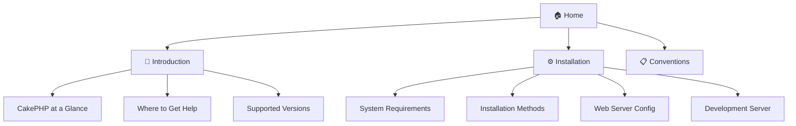
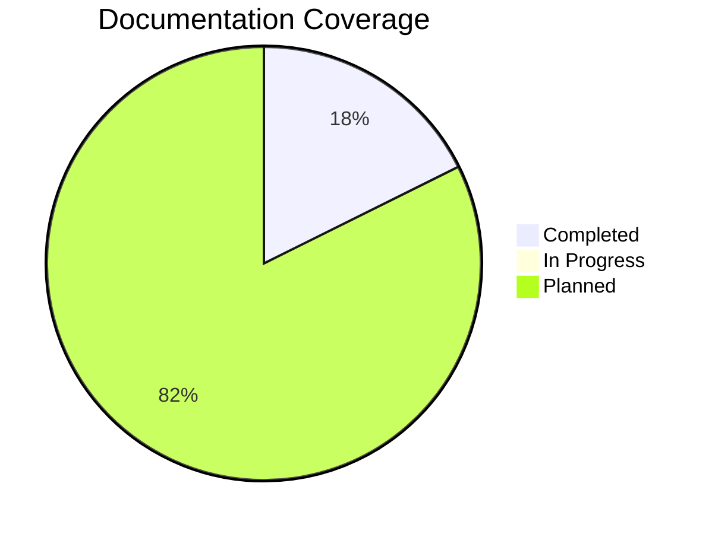

  

# CakePHP 5.x Documentation

Welcome to the CakePHP 5.x documentation repository. This documentation is generated from the official CakePHP documentation and enhanced with visualizations and examples.

---

## 📚 Documentation Map

---

## 🚀 Getting Started

  <h3 style="margin-top: 0;">📖 Introduction</h3>
  
Learn about CakePHP's architecture, MVC pattern, and core concepts.

  <a href="01-cakephp-at-a-glance.html" style="display: inline-block; margin-top: 10px; padding: 8px 16px; background: var(--link-color); color: white; border-radius: 4px; text-decoration: none;">Read Introduction →</a>

  <h3 style="margin-top: 0;">⚙️ Installation</h3>
  
Complete guide to installing and configuring CakePHP 5.x on your system.

  <a href="02-installation-guide.html" style="display: inline-block; margin-top: 10px; padding: 8px 16px; background: var(--link-color); color: white; border-radius: 4px; text-decoration: none;">Install CakePHP →</a>

---

## 📋 Available Documentation

### Getting Started

| Document                                        | Description                                       | Status       |
| ----------------------------------------------- | ------------------------------------------------- | ------------ |
| [CakePHP at a Glance](cakephp-at-a-glance.html) | Introduction to CakePHP concepts and architecture | ✅ Available |
| [Installation Guide](installation-guide.html)   | Complete installation and configuration guide     | ✅ Available |
| [CakePHP Conventions](03-conventions.html) | Naming conventions and folder structure for rapid development | ✅ Available |

### Coming Soon

- 🗄️ Database Configuration
- 🛣️ Routing Basics
- 🎮 Controllers & Views
- 📊 ORM & Query Builder
- 🔐 Authentication & Authorization
- 🧪 Testing
- 🚀 Deployment
- And more...

---

## 🎯 About This Documentation

This documentation is:

  <strong>✅ GitHub Pages Compatible</strong> 
  Renders perfectly on GitHub Pages

  <strong>📊 Mermaid Diagrams</strong> 
  Enhanced with visual flowcharts

  <strong>💻 Code Examples</strong> 
  Complete, working code examples

  <strong>🌙 Dark Mode</strong> 
  Toggle between light and dark themes

  <strong>📋 Copy Buttons</strong> 
  One-click code copying

  <strong>📱 Responsive</strong> 
  Works on all devices

---

## 🚀 Quick Links

### Official Resources

- [Official CakePHP Website](https://cakephp.org)
- [Official Documentation](https://book.cakephp.org/5.x/)
- [CakePHP GitHub Repository](https://github.com/cakephp/cakephp)
- [API Documentation](https://api.cakephp.org/)

### Community

- [CakePHP Slack](https://cakephp.org/slack)
- [CakePHP Discord](https://discord.gg/cakephp)
- [Official Forum](https://discourse.cakephp.org/)
- [Stack Overflow](https://stackoverflow.com/questions/tagged/cakephp)

### Tools & Plugins

- [The Bakery](https://bakery.cakephp.org) - Tutorials and code examples
- [Awesome CakePHP](https://github.com/FriendsOfCake/awesome-cakephp) - Curated list of plugins
- [CakePHP Plugins](https://plugins.cakephp.org/) - Official plugin repository

---

## 📖 How to Use This Documentation

1. **Browse** the available documentation using the links above
2. **Search** using your browser's search function (Ctrl+F / Cmd+F)
3. **Toggle** dark mode using the button in the top-right corner
4. **Copy** code examples with one click using the copy button
5. **Navigate** between pages using the navigation bar at the top

Each guide includes:

- 📑 Table of contents for easy navigation
- 💻 Code examples with syntax highlighting
- 📊 Visual diagrams using Mermaid
- 💡 Tips, warnings, and best practices
- 🔗 Links to related documentation

---

## 🤝 Contributing

This documentation is generated from scraped CakePHP official documentation. If you find any issues or have suggestions:

1. Open an issue on the GitHub repository
2. Submit a pull request with improvements
3. Share feedback in the community channels

---

## 📊 Documentation Progress

**Current Status:** 3 documents completed, 14+ planned

---

## 📄 License

Released under the MIT License.

Copyright © Cake Software Foundation, Inc. All rights reserved.

---

  <h3 style="margin-top: 0;">Ready to Get Started?</h3>
  
Begin your CakePHP journey with our comprehensive guides!

  

    <a href="01-cakephp-at-a-glance.html" style="padding: 12px 24px; background: var(--link-color); color: white; border-radius: 6px; text-decoration: none; font-weight: 600;">📖 Read Introduction</a>
    <a href="02-installation-guide.html" style="padding: 12px 24px; background: #28a745; color: white; border-radius: 6px; text-decoration: none; font-weight: 600;">⚙️ Install CakePHP</a>
  

---

**Last Updated:** March 10, 2026
