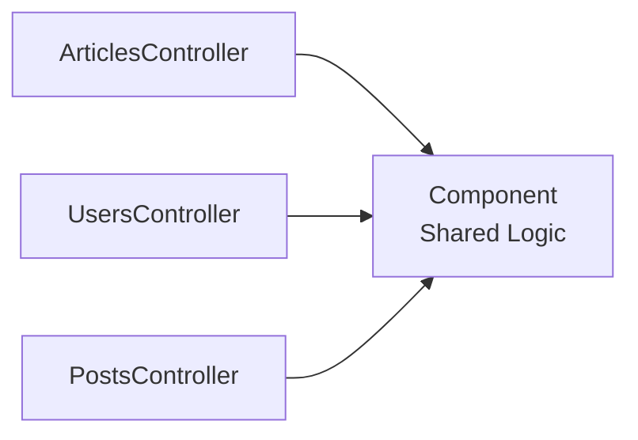
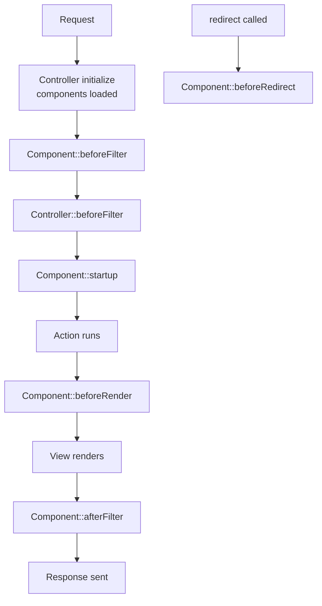
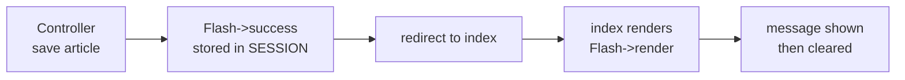
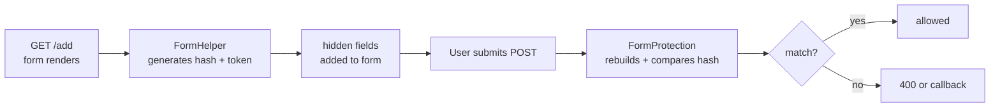
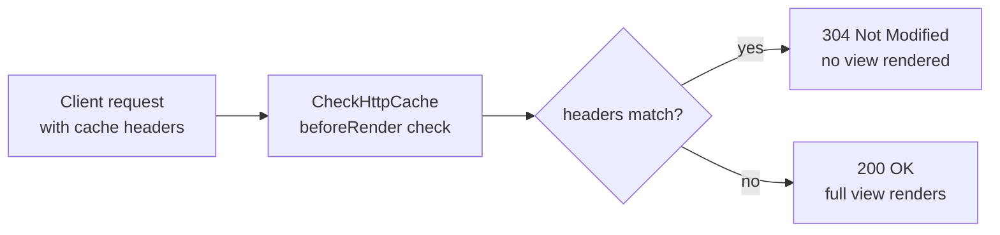
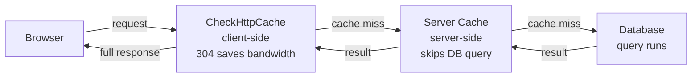

# CakePHP — Components
> Complete Reference Docs | CL03 Study Notes

---

## Table of Contents

1. [What Components Are](#1-what-components-are)
2. [Component Callbacks (Lifecycle)](#2-component-callbacks-lifecycle)
3. [Creating Custom Components](#3-creating-custom-components)
4. [Flash Component](#4-flash-component)
5. [FormProtection Component](#5-formprotection-component)
6. [CheckHttpCache Component](#6-checkhttpcache-component)
7. [Cache Config vs CheckHttpCache](#7-cache-config-vs-checkhttpcache)

---

## 1. What Components Are

Components are reusable logic classes shared across controllers. When the same code appears in multiple controllers — move it into a component. Controllers stay thin, logic stays reusable.



### File Location

```
src/
└── Controller/
    └── Component/
        ├── MathComponent.php
        ├── AuthComponent.php
        ├── SlugComponent.php
        └── RoleCheckComponent.php
```

### Loading via `loadComponent()`

```php
public function initialize(): void
{
    parent::initialize();

    // basic load
    $this->loadComponent('Flash');

    // load with configuration
    $this->loadComponent('FormProtection', [
        'unlockedActions' => ['index', 'view'],
    ]);

    // custom component with config
    $this->loadComponent('Math', [
        'precision' => 2,
    ]);
}
```

### Accessing as `$this->ComponentName`

```php
public function add(): void
{
    $this->Flash->success('Saved.');
    $result = $this->Math->doComplexOperation(10, 20);
}
```

### `setConfig()` and `getConfig()`

```php
public function beforeFilter(EventInterface $event): void
{
    parent::beforeFilter($event);

    // write config at runtime
    $this->FormProtection->setConfig('validate', false);
    $this->Flash->setConfig(['key' => 'myFlash', 'clear' => true]);

    // read config
    $unlockedActions = $this->FormProtection->getConfig('unlockedActions');
}
```

### Aliasing via `className`

Replace a built-in component with your own while keeping the same property name:

```php
$this->loadComponent('Flash', [
    'className' => 'MyFlash', // loads MyFlashComponent
]);
// still accessed as $this->Flash
```

```php
// src/Controller/Component/MyFlashComponent.php
class MyFlashComponent extends FlashComponent
{
    public function success(string $message, array $options = []): void
    {
        $message = '✓ ' . $message;
        parent::success($message, $options);
    }
}
```

### Loading on the Fly

```php
public function export(): void
{
    $this->loadComponent('Csv'); // only loaded for this action
    $data = $this->Csv->generate($this->Articles->find()->all());
}
```

> Lifecycle callbacks are NOT fired on components loaded on the fly.

### Components Inside Components

```php
class CustomComponent extends Component
{
    protected array $components = ['Flash', 'Math'];

    public function doSomething(): void
    {
        $result = $this->Math->doComplexOperation(5, 10);
        $this->Flash->success('Result: ' . $result);
    }
}
```

### Accessing Controller from Component

```php
class AuthComponent extends Component
{
    public function requireAdmin(): void
    {
        $controller = $this->getController();
        $user = $controller->request->getSession()->read('Auth.user');

        if ($user['role'] !== 'admin') {
            $controller->Flash->error('Admins only.');
            $controller->redirect(['controller' => 'Pages', 'action' => 'home']);
        }
    }
}
```

### Summary Table

| | Detail |
|---|---|
| Load | `initialize()` for all actions, inside action for one-off |
| Access | `$this->ComponentName` |
| Configure | `loadComponent('Name', [...])` or `setConfig()` |
| Alias | `className` option |
| Use another component | `protected array $components = ['Other']` |
| Access controller | `$this->getController()` |
| File location | `src/Controller/Component/NameComponent.php` |

---

## 2. Component Callbacks (Lifecycle)

### Full Lifecycle



### 1. `beforeFilter()`

Runs before the controller's own `beforeFilter()`. Used for auth checks and config setup.

```php
public function beforeFilter(EventInterface $event): void
{
    $controller = $this->getController();
    $user = $controller->request->getSession()->read('Auth.user');

    if (!$user) {
        $event->setResult($controller->redirect('/users/login'));
        return;
    }
}
```

### 2. `startup()`

Runs after all `beforeFilter()` callbacks. Safe to use things set in `beforeFilter()`.

```php
public function startup(EventInterface $event): void
{
    $controller = $this->getController();
    $role = $controller->request->getAttribute('userRole');

    if ($role !== 'admin') {
        $event->setResult($controller->redirect('/'));
        return;
    }
}
```

### 3. `beforeRender()`

Runs after action completes, before view renders. Used to inject variables into every view.

```php
public function beforeRender(EventInterface $event): void
{
    $controller = $this->getController();
    $controller->set('currentUser',
        $controller->request->getSession()->read('Auth.user')
    );
}
```

### 4. `afterFilter()`

Runs after response is built. Last chance to log or clean up.

```php
public function afterFilter(EventInterface $event): void
{
    $controller = $this->getController();
    \Cake\Log\Log::info(sprintf(
        'Completed: %s::%s — Status %s',
        $controller->getName(),
        $controller->request->getParam('action'),
        $controller->response->getStatusCode()
    ));
}
```

### 5. `beforeRedirect()`

Fires only when controller calls `$this->redirect()`.

```php
public function beforeRedirect(EventInterface $event, $url, Response $response): void
{
    \Cake\Log\Log::info('Redirect to: ' . (is_array($url) ? json_encode($url) : $url));
}
```

### Redirecting from Callbacks — Two Ways

**`$event->setResult()`** — stops other callbacks:

```php
public function beforeFilter(EventInterface $event): void
{
    if (!$this->isLoggedIn()) {
        $event->setResult($this->getController()->redirect('/login'));
        return;
    }
}
```

**`RedirectException`** — halts everything immediately, cleanest approach:

```php
use Cake\Http\Exception\RedirectException;
use Cake\Routing\Router;

public function beforeFilter(EventInterface $event): void
{
    if (!$this->isLoggedIn()) {
        throw new RedirectException(Router::url('/login'));

        // with status code and extra headers
        throw new RedirectException(Router::url('/login'), 302, [
            'X-Reason' => 'not-authenticated'
        ]);
    }
}
```

### Full Example — `ActivityLogComponent`

```php
<?php
declare(strict_types=1);
namespace App\Controller\Component;

use Cake\Controller\Component;
use Cake\Event\EventInterface;
use Cake\Log\Log;

class ActivityLogComponent extends Component
{
    private float $startTime;

    public function beforeFilter(EventInterface $event): void
    {
        $this->startTime = microtime(true);
        Log::info('Request started: ' . $this->getController()->request->getRequestTarget());
    }

    public function startup(EventInterface $event): void
    {
        $user = $this->getController()->request->getSession()->read('Auth.user');
        Log::info('User: ' . ($user['name'] ?? 'guest'));
    }

    public function beforeRender(EventInterface $event): void
    {
        $duration = microtime(true) - $this->startTime;
        $this->getController()->set('renderTime', round($duration, 4));
    }

    public function afterFilter(EventInterface $event): void
    {
        $duration = microtime(true) - $this->startTime;
        Log::info(sprintf(
            'Completed in %ss — Status %s',
            round($duration, 4),
            $this->getController()->response->getStatusCode()
        ));
    }

    public function beforeRedirect(EventInterface $event, $url, $response): void
    {
        Log::info('Redirect to: ' . (is_array($url) ? json_encode($url) : $url));
    }
}
```

### Callback Summary

| Callback | When It Fires | Common Use |
|---|---|---|
| `beforeFilter()` | Before controller's beforeFilter | Auth check, config setup |
| `startup()` | After all beforeFilters | Role check, post-auth logic |
| `beforeRender()` | After action, before view | Inject view vars, headers |
| `afterFilter()` | After response built | Logging, cleanup |
| `beforeRedirect()` | When redirect called | Log redirects, modify URL |

---

## 3. Creating Custom Components

### Conventions

- File location: `src/Controller/Component/`
- Class name suffix: `Component` e.g. `MathComponent`
- Must extend `Cake\Controller\Component`
- Has own `initialize(array $config)` method

### Basic Skeleton

```php
<?php
declare(strict_types=1);
namespace App\Controller\Component;

use Cake\Controller\Component;

class MathComponent extends Component
{
    protected array $_defaultConfig = [
        'precision' => 2,
        'currency'  => 'INR',
    ];

    public function initialize(array $config): void
    {
        parent::initialize($config);
    }

    public function doComplexOperation(float $a, float $b): float
    {
        return round($a + $b, $this->getConfig('precision'));
    }
}
```

### `$_defaultConfig` — Auto Merged

```php
// controller loads with override
$this->loadComponent('Math', ['precision' => 4]);

// result after merge
[
    'precision' => 4,    // overridden
    'currency'  => 'INR' // kept from default
]

// read and write at runtime
$this->getConfig('precision');
$this->getConfig();
$this->setConfig('precision', 5);
$this->setConfig(['precision' => 5]);
```

### Dependency Injection

```php
class SsoComponent extends Component
{
    private UserService $users;

    public function __construct(
        ComponentRegistry $registry,
        array $config = [],
        UserService $users,
    ) {
        parent::__construct($registry, $config);
        $this->users = $users;
    }
}
```

### Full Example — `RoleCheckComponent`

```php
<?php
declare(strict_types=1);
namespace App\Controller\Component;

use Cake\Controller\Component;
use Cake\Event\EventInterface;
use Cake\Http\Exception\ForbiddenException;

class RoleCheckComponent extends Component
{
    protected array $_defaultConfig = [
        'adminActions' => ['delete', 'edit'],
        'sessionKey'   => 'Auth.user',
        'roleField'    => 'role',
        'redirectUrl'  => '/',
    ];

    public function beforeFilter(EventInterface $event): void
    {
        $controller   = $this->getController();
        $action       = $controller->request->getParam('action');
        $adminActions = $this->getConfig('adminActions');

        if (!in_array($action, $adminActions)) {
            return;
        }

        $user = $controller->request->getSession()
                    ->read($this->getConfig('sessionKey'));

        if (!$user || $user[$this->getConfig('roleField')] !== 'admin') {
            $controller->Flash->error('Admins only.');
            $event->setResult(
                $controller->redirect($this->getConfig('redirectUrl'))
            );
        }
    }

    public function requireRole(string $role): void
    {
        $controller = $this->getController();
        $user = $controller->request->getSession()
                    ->read($this->getConfig('sessionKey'));

        if (!$user || $user[$this->getConfig('roleField')] !== $role) {
            throw new ForbiddenException('You do not have permission.');
        }
    }

    public function isAdmin(): bool
    {
        $controller = $this->getController();
        $user = $controller->request->getSession()
                    ->read($this->getConfig('sessionKey'));

        return isset($user[$this->getConfig('roleField')])
            && $user[$this->getConfig('roleField')] === 'admin';
    }
}
```

### Full Example — `SlugComponent`

```php
<?php
declare(strict_types=1);
namespace App\Controller\Component;

use Cake\Controller\Component;

class SlugComponent extends Component
{
    protected array $_defaultConfig = [
        'separator' => '-',
        'lowercase' => true,
        'maxLength' => 191,
    ];

    public function generate(string $text): string
    {
        $separator = $this->getConfig('separator');
        $slug = preg_replace('/[^a-zA-Z0-9\s]/', '', $text);
        $slug = preg_replace('/\s+/', $separator, trim($slug));

        if ($this->getConfig('lowercase')) {
            $slug = strtolower($slug);
        }

        return substr($slug, 0, $this->getConfig('maxLength'));
    }
}
```

---

## 4. Flash Component

### What It Is

Stores one-time notification messages in `$_SESSION` between requests. After a form save, redirect happens, and on the next page the message is displayed once then cleared.



### Loading

```php
public function initialize(): void
{
    parent::initialize();
    $this->loadComponent('Flash');
}
```

### `__call()` Magic Method

Method name maps to element in `templates/element/flash/`:

```php
$this->Flash->success('Article saved.');      // → flash/success.php
$this->Flash->error('Could not save.');       // → flash/error.php
$this->Flash->warning('Check your input.');   // → flash/warning.php
$this->Flash->info('Session expiring soon.'); // → flash/info.php
$this->Flash->greatSuccess('Excellent!');     // → flash/great_success.php
```

### `set()` Method — Plain Text

```php
$this->Flash->set('This is a plain message.');
```

### Options — Second Parameter

```php
$this->Flash->success('User saved', [
    'key'     => 'positive',  // session key — default is 'flash'
    'clear'   => true,        // delete existing messages first
    'element' => 'custom',    // override element (only with set())
    'params'  => [            // variables inside element template
        'name'  => $user->name,
        'email' => $user->email,
    ],
    'escape'  => false,       // allow HTML — escape manually
]);
```

### `key` Option — Multiple Stacks

```php
$this->Flash->success('Saved.', ['key' => 'positive']);
$this->Flash->error('Failed.', ['key' => 'alert']);

// render each key separately in template
<?= $this->Flash->render() ?>           // renders 'flash' key
<?= $this->Flash->render('positive') ?> // renders 'positive' key
<?= $this->Flash->render('alert') ?>    // renders 'alert' key
```

### `params` — Data Inside Elements

```php
// controller
$this->Flash->success('User saved', [
    'params' => ['name' => $user->name, 'email' => $user->email],
]);

// templates/element/flash/success.php
<div class="flash-success">
    <?= h($message) ?>: <?= h($params['name']) ?>, <?= h($params['email']) ?>
</div>
```

### HTML in Flash Messages

```php
// escape must be false — you are responsible for escaping user data
$this->Flash->info(
    sprintf('<b>%s</b> %s', h($highlight), h($message)),
    ['escape' => false]
);
```

### Custom Flash Elements

```php
<!-- templates/element/flash/success.php -->
<div class="flash flash-success">
    <span class="icon">✓</span>
    <?= $escape ? h($message) : $message ?>
</div>

<!-- templates/element/flash/error.php -->
<div class="flash flash-error">
    <span class="icon">✕</span>
    <?= $escape ? h($message) : $message ?>
</div>
```

### CSS for Flash Messages

```css
.flash {
    padding: 0.75rem 1rem;
    font-size: 0.82rem;
    margin-bottom: 1.5rem;
    display: flex;
    align-items: center;
    gap: 0.5rem;
}
.flash-success {
    background: rgba(200, 245, 66, 0.08);
    border: 1px solid var(--accent);
    color: var(--accent);
}
.flash-error {
    background: rgba(255, 77, 77, 0.08);
    border: 1px solid var(--danger);
    color: var(--danger);
}
.flash-warning {
    background: rgba(245, 167, 66, 0.08);
    border: 1px solid #f5a742;
    color: #f5a742;
}
```

### Summary

| Method | What It Does |
|---|---|
| `success('msg')` | Green success message |
| `error('msg')` | Red error message |
| `warning('msg')` | Orange warning message |
| `info('msg')` | Info message |
| `set('msg')` | Plain text, no element |
| `render()` | Output messages in template |
| `render('key')` | Output specific key stack |
| `key` option | Separate message stacks |
| `clear` option | Overwrite existing messages |
| `params` option | Pass vars into element |
| `escape` option | Allow HTML |

---

## 5. FormProtection Component

### What It Does

Protects forms against tampering between render and submit. Generates a hash of the form structure on GET, validates it matches on POST.



### What It Prevents

```
✅ Form action URL cannot be changed
✅ Unknown fields cannot be added via devtools
✅ Fields cannot be removed from form
✅ Hidden field values cannot be modified
❌ Does NOT prevent select/radio option changes
```

### Loading

```php
public function initialize(): void
{
    parent::initialize();
    $this->loadComponent('Flash');
    $this->loadComponent('FormProtection'); // load BEFORE components that process forms
}
```

### Critical Requirement — Must Use FormHelper

```php
// ✅ CORRECT — FormHelper injects tokens automatically
<?= $this->Form->create($article, ['url' => ['action' => 'add']]) ?>
    <?= $this->Form->control('title', ['label' => false]) ?>
    <?= $this->Form->control('body', ['type' => 'textarea', 'label' => false]) ?>
    <?= $this->Form->button('Save', ['class' => 'btn']) ?>
<?= $this->Form->end() ?>

// ❌ WRONG — plain HTML bypasses FormProtection token generation
<form action="/articles/add" method="post">
    <input name="title" />
</form>
```

### `validate` — Disable All Validation

```php
// disable globally
$this->loadComponent('FormProtection', ['validate' => false]);

// disable for specific prefix in beforeFilter
public function beforeFilter(EventInterface $event): void
{
    parent::beforeFilter($event);
    if ($this->request->getParam('prefix') === 'Admin') {
        $this->FormProtection->setConfig('validate', false);
    }
}
```

### `unlockedFields` — Exclude Specific Fields

Fields excluded from POST validation — can be freely modified by JS:

```php
$this->loadComponent('FormProtection', [
    'unlockedFields' => ['latitude', 'longitude', 'dynamic_field'],
]);
```

### `unlockedActions` — Exclude Specific Actions

```php
$this->loadComponent('FormProtection', [
    'unlockedActions' => ['search', 'apiIndex', 'delete'],
]);
```

### `validationFailureCallback` — Custom Error Handling

```php
use Cake\Controller\Exception\FormProtectionException;

public function beforeFilter(EventInterface $event): void
{
    parent::beforeFilter($event);

    $this->FormProtection->setConfig(
        'validationFailureCallback',
        function (FormProtectionException $exception) {
            \Cake\Log\Log::warning('Form tampering: ' . $exception->getMessage());
            $this->Flash->error('Form security check failed.');
            return $this->redirect(['action' => 'index']);
        }
    );
}
```

### FormProtection vs CSRF

| | CSRF | FormProtection |
|---|---|---|
| Protects against | Cross-site request forgery | Form field tampering |
| How | Cookie + hidden token match | Field hash comparison |
| Works with | Any HTML form | FormHelper forms only |
| Checks | Token presence + match | Form structure integrity |
| Both needed? | Yes — they protect different things |

### Full `ArticlesController` Setup

```php
class ArticlesController extends AppController
{
    public function initialize(): void
    {
        parent::initialize();
        $this->loadComponent('Flash');
        $this->loadComponent('FormProtection', [
            'unlockedActions' => ['search', 'apiIndex', 'delete'],
        ]);
        $this->loadComponent('CheckHttpCache');
    }

    public function beforeFilter(\Cake\Event\EventInterface $event): void
    {
        parent::beforeFilter($event);
        $this->FormProtection->setConfig(
            'validationFailureCallback',
            function (FormProtectionException $exception) {
                $this->Flash->error('Form Security Check Failed');
                return $this->redirect(['action' => 'index']);
            }
        );
    }
}
```

---

## 6. CheckHttpCache Component

### What It Is

An HTTP caching mechanism that tells browsers and reverse proxies whether the response has changed. If nothing changed — returns empty `304 Not Modified` and skips view rendering entirely.



### Loading

```php
$this->loadComponent('CheckHttpCache');
```

Automatically activates a `beforeRender` check on every action.

### Two Header Pairs Compared

| Request Header | Response Header | Checks |
|---|---|---|
| `If-None-Match` | `Etag` | Content identity hash |
| `If-Modified-Since` | `Last-Modified` | Timestamp of last change |

### Correct Pattern — `isNotModified()`

The key is to call `isNotModified()` and **return the response directly**:

```php
public function view(int $id): void
{
    $article = $this->Articles->get($id);

    $response = $this->response
        ->withEtag(md5($article->modified . $article->id))
        ->withModified($article->modified)
        ->withCache('-1 minute', '+1 hour');

    // return response directly — sends 304 immediately
    if ($response->isNotModified($this->request)) {
        return $response; // ← must return, not just assign
    }

    $this->response = $response;
    $this->set('article', $article);
}
```

> **Common mistake** — `$this->response = $response; return;` does NOT send 304. You must `return $response` directly.

### `index()` with Cache

```php
public function index(): void
{
    $articles = $this->paginate($this->Articles);

    $latest = $this->Articles->find()
        ->orderBy(['modified' => 'DESC'])
        ->first();

    if ($latest) {
        $response = $this->response
            ->withEtag(md5($latest->modified . $latest->id))
            ->withModified($latest->modified)
            ->withCache('-1 minute', '+1 hour');

        if ($response->isNotModified($this->request)) {
            return $response; // ← return directly
        }

        $this->response = $response;
    }

    $this->set(['articles' => $articles, 'page' => 'Articles Index']);
}
```

### Testing — How to See 304

1. Uncheck `Disable cache` in DevTools Network tab
2. Visit `/articles/view/3` — first request gets `200 OK` with `Etag` header
3. Refresh with `F5` — browser sends `If-None-Match` back
4. You should now see `304 Not Modified`

---

## 7. Cache Config vs CheckHttpCache

### They Are Completely Different



| | CheckHttpCache Component | Cache Config |
|---|---|---|
| What it caches | HTTP response headers | Data/query results |
| Where | Browser/client side | Server side |
| What it saves | Bandwidth | CPU + DB queries |
| How | Etag, Last-Modified, 304 | `Cache::write()`, `Cache::read()` |
| Who benefits | Client/browser | Server |
| DB query still runs? | Yes | No |

### Cache Config — Setup in `app.php`

```php
'Cache' => [
    'default' => [
        'className' => 'File',
        'duration'  => '+1 hours',
        'path'      => CACHE,
    ],
    'articles' => [
        'className' => 'File',   // or 'Redis', 'Memcached'
        'duration'  => '+30 minutes',
        'path'      => CACHE . 'articles/',
    ],
]
```

### Cache Engines

| Engine | Use Case |
|---|---|
| `File` | Default — stores in `tmp/cache/` — development |
| `Redis` | Fast in-memory — best for production |
| `Memcached` | Fast in-memory — alternative to Redis |
| `Array` | In-memory per request — testing only |
| `Null` | Disables caching — useful in development |

### Using Cache in Controller

```php
use Cake\Cache\Cache;

public function view(int $id): void
{
    // try server cache first — skip DB
    $article = Cache::read('article_' . $id, 'articles');

    if ($article === null) {
        $article = $this->Articles->get($id);
        Cache::write('article_' . $id, $article, 'articles');
    }

    $this->set('article', $article);
}

// clear cache when article is updated
public function edit(int $id): void
{
    // after save...
    Cache::delete('article_' . $id, 'articles');
}
```

### Using Both Together — Best Practice

```php
public function view(int $id): void
{
    // 1. server cache — skip DB entirely
    $article = Cache::read('article_' . $id, 'articles');

    if ($article === null) {
        $article = $this->Articles->get($id);
        Cache::write('article_' . $id, $article, 'articles');
    }

    // 2. HTTP cache — skip response if browser has it
    $response = $this->response
        ->withEtag(md5($article->modified . $article->id))
        ->withModified($article->modified)
        ->withCache('-1 minute', '+1 hour');

    if ($response->isNotModified($this->request)) {
        return $response;
    }

    $this->response = $response;
    $this->set('article', $article);
}
```

### What Each Layer Does

```
First request (cold):
  Browser → Server → DB query runs → stored in server cache → 200 full HTML sent

Second request (same browser):
  Browser sends If-None-Match → 304 Not Modified → nothing sent → browser uses saved HTML

Third request (different browser):
  Browser → Server → server cache hit → no DB query → 200 full HTML sent
```

---

## Complete `ArticlesController` Reference

```php
<?php
declare(strict_types=1);
namespace App\Controller;

use Cake\Controller\Exception\FormProtectionException;
use Cake\Cache\Cache;

class ArticlesController extends AppController
{
    public function initialize(): void
    {
        parent::initialize();
        $this->loadComponent('Flash');
        $this->loadComponent('FormProtection', [
            'unlockedActions' => ['search', 'apiIndex', 'delete'],
        ]);
        $this->loadComponent('CheckHttpCache');
    }

    public function beforeFilter(\Cake\Event\EventInterface $event): void
    {
        parent::beforeFilter($event);
        $this->FormProtection->setConfig(
            'validationFailureCallback',
            function (FormProtectionException $exception) {
                $this->Flash->error('Form Security Check Failed');
                return $this->redirect(['action' => 'index']);
            }
        );
    }

    public function index(): void
    {
        $articles = $this->paginate(
            $this->Articles->find()
                ->select(['id', 'title', 'body'])
                ->orderBy(['Articles.id' => 'ASC']),
            ['limit' => 10]
        );
        $latest = $this->Articles->find()->orderBy(['modified' => 'DESC'])->first();
        if ($latest) {
            $response = $this->response
                ->withEtag(md5($latest->modified . $latest->id))
                ->withModified($latest->modified)
                ->withCache('-1 minute', '+1 hour');
            if ($response->isNotModified($this->request)) {
                return $response;
            }
            $this->response = $response;
        }
        $this->set(['articles' => $articles, 'page' => 'Articles Index']);
        $this->viewBuilder()->addHelper('Paginator')->setLayout('default');
    }

    public function view(int $id): void
    {
        $article = $this->Articles->get($id);
        $response = $this->response
            ->withEtag(md5($article->modified . $article->id))
            ->withModified($article->modified)
            ->withCache('-1 minute', '+1 hour');
        if ($response->isNotModified($this->request)) {
            return $response;
        }
        $this->response = $response;
        $this->set('article', $article);
        $this->viewBuilder()->addHelper('Html')->setLayout('default');
    }

    public function add(): void
    {
        $article = $this->Articles->newEmptyEntity();
        if ($this->request->is('post')) {
            $article = $this->Articles->patchEntity($article, $this->request->getData());
            $article->user_id  = 1;
            $article->slug     = strtolower(str_replace(' ', '-', $article->title ?? ''));
            $article->published = 1;
            if ($this->Articles->save($article)) {
                $this->Flash->success('Article created.');
                return $this->redirect(['action' => 'index']);
            }
            $this->Flash->error('Could not save.');
        }
        $this->set(compact('article'));
        $this->viewBuilder()->addHelper('Html')->addHelper('Form')->setLayout('default');
    }

    public function edit(int $id): void
    {
        $article = $this->Articles->get($id);
        if ($this->request->is(['post', 'put'])) {
            $this->Articles->patchEntity($article, $this->request->getData());
            $article->slug = strtolower(str_replace([' ', "'", '"'], ['-', '', ''], $article->title ?? ''));
            if ($this->Articles->save($article)) {
                $this->Flash->success('Article updated.');
                return $this->redirect(['action' => 'index']);
            }
            $this->Flash->error('Could not update.');
        }
        $this->set(compact('article'));
        $this->viewBuilder()->addHelper('Html')->addHelper('Form')->setLayout('default');
    }

    public function delete(int $id): void
    {
        $this->request->allowMethod(['post', 'delete']);
        $article = $this->Articles->get($id);
        if ($this->Articles->delete($article)) {
            $this->Flash->success('Article deleted.');
        } else {
            $this->Flash->error('Could not delete.');
        }
        return $this->redirect(['action' => 'index']);
    }

    public function search(): void
    {
        $query    = $this->request->getData('query') ?? '';
        $articles = $this->paginate(
            $this->Articles->find()
                ->where(['Articles.title LIKE' => '%' . $query . '%'])
                ->orderBy(['Articles.id' => 'ASC']),
            ['limit' => 10]
        );
        $this->set(['articles' => $articles, 'query' => $query, 'page' => 'Search: ' . h($query)]);
        $this->viewBuilder()->addHelper('Paginator')->setLayout('default');
    }

    public function apiIndex(): void
    {
        $this->disableAutoRender();
        $this->response = $this->response
            ->withType('application/json')
            ->withStatus(200)
            ->withStringBody(json_encode($this->Articles->find()->all()->toArray()));
    }
}
```

---

*CL03 — CakePHP Components | Abhay Raj | March 2026*