# CakePHP — Controllers
> Complete Reference Docs | CL02 Study Notes

---

## Table of Contents

1. [Controller Basics](#1-controller-basics)
2. [Request Flow](#2-request-flow)
3. [Routing](#3-routing)
4. [Controller Actions](#4-controller-actions)
5. [Interacting with Views](#5-interacting-with-views)
6. [Rendering a View](#6-rendering-a-view)
7. [Content Type Negotiation](#7-content-type-negotiation)
8. [Redirecting](#8-redirecting)
9. [Pagination](#9-pagination)
10. [Loading Components](#10-loading-components)
11. [ORM Basics](#11-orm-basics)

---

## 1. Controller Basics

### What a Controller Is

A Controller sits between the Model and the View in the MVC pattern. It receives a request, talks to the model layer, and decides what to send back as a response.

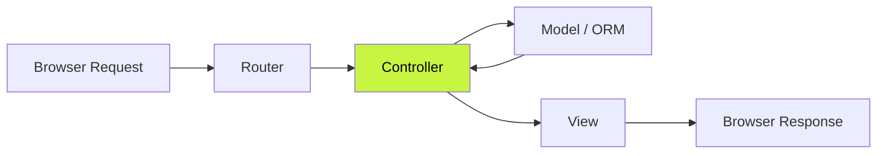

### Naming Conventions

| Model | Controller File | Controller Class | URL |
|---|---|---|---|
| Article | ArticlesController.php | ArticlesController | /articles |
| User | UsersController.php | UsersController | /users |
| BlogPost | BlogPostsController.php | BlogPostsController | /blog-posts |

- Controller named after **plural** of model
- File in `src/Controller/`
- Class extends `AppController`

### `declare(strict_types=1)`

Must be the very first statement after `<?php`. Enforces strict PHP type checking — prevents silent type coercion.

```php
<?php
declare(strict_types=1);  // enforce strict types

// WITHOUT strict_types
function add(int $a, int $b): int { return $a + $b; }
add("5", "3"); // ✅ works — PHP coerces strings to int

// WITH strict_types=1
add("5", "3"); // ❌ TypeError — strings not allowed
add(5, 3);     // ✅ works
```

### Inheritance Chain

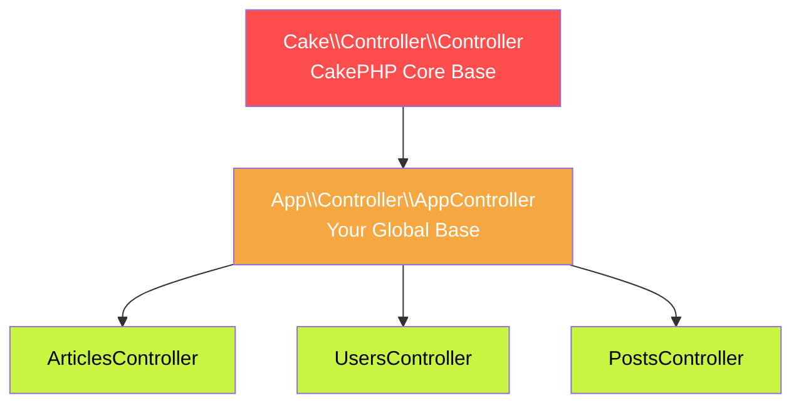

### `AppController` — Global Base

Everything loaded in `AppController` is available in every controller.

```php
<?php
declare(strict_types=1);
namespace App\Controller;

use Cake\Controller\Controller;

class AppController extends Controller
{
    public function initialize(): void
    {
        parent::initialize(); // ALWAYS call parent first

        $this->loadComponent('Flash');
        $this->loadComponent('FormProtection');
    }
}
```

> **Rule** — `parent::initialize()` is mandatory. Skipping it breaks CakePHP internals entirely.

### `ArticlesController` — Specific Controller

```php
<?php
declare(strict_types=1);
namespace App\Controller;

class ArticlesController extends AppController
{
    public function initialize(): void
    {
        parent::initialize();
        // controller-specific setup here
    }
}
```

---

## 2. Request Flow

### Full Flow

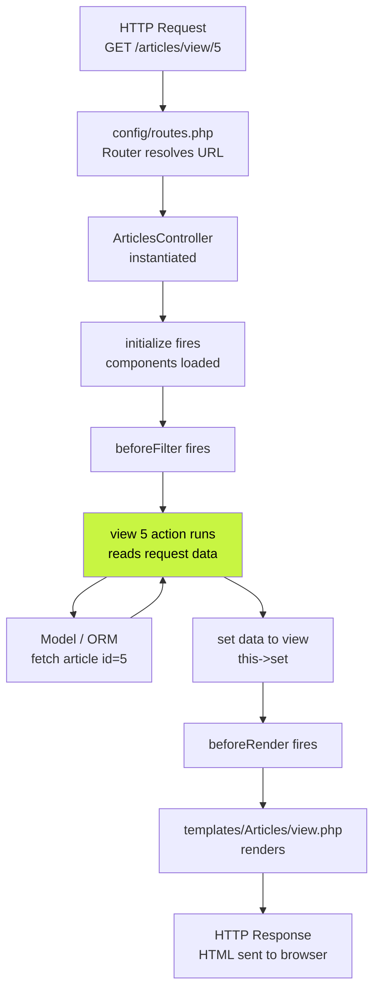

### `$this->request` — The Request Object

Available in every controller action automatically. Wraps all incoming data — never use `$_POST`, `$_GET`, `$_SERVER` directly.

```php
// HTTP method check
$this->request->is('post');
$this->request->is('get');
$this->request->is(['post', 'put']);
$this->request->is('ajax');
$this->request->is('json');

// POST form data
$this->request->getData();              // all POST data as array
$this->request->getData('title');       // specific field
$this->request->getData('user.name');   // nested field

// URL query string (?page=2&sort=title)
$this->request->getQuery('page');
$this->request->getQuery('sort', 'asc'); // with default

// Route parameters (/articles/view/5 → id=5)
$this->request->getParam('id');
$this->request->getParam('controller');
$this->request->getParam('action');

// HTTP headers
$this->request->getHeader('Content-Type');
$this->request->clientIp();

// Current URL
$this->request->getPath();          // /articles/view/5
$this->request->getRequestTarget(); // /articles/view/5?page=2

// Session
$this->request->getSession()->read('Auth.user');
$this->request->getSession()->write('key', 'value');

// Attributes (set by middleware)
$this->request->getAttribute('user');
```

### Quick Reference Table

| Method | Gets |
|---|---|
| `getData('field')` | POST form data |
| `getQuery('key')` | URL query string `?key=value` |
| `getParam('id')` | Route parameters `/view/5` |
| `is('post')` | Check HTTP method |
| `getPath()` | Current URL path |
| `getHeader('x')` | HTTP headers |
| `clientIp()` | Client IP address |
| `getAttribute('key')` | Data attached by middleware |

---

## 3. Routing

### What Routing Does

Translates a URL into a controller, action, and parameters using rules defined in `config/routes.php`.

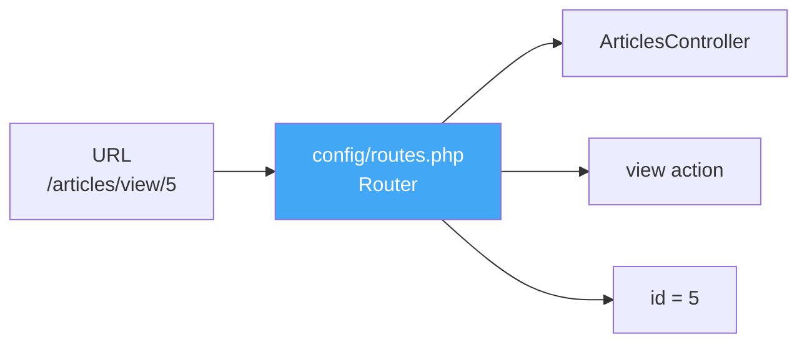

### `DashedRoute`

Enforces dash-style URLs app-wide.

```
/my-articles    ✅  DashedRoute
/myArticles     ❌
/my_articles    ❌
```

### `config/routes.php` — Full Breakdown

```php
<?php
use Cake\Routing\Route\DashedRoute;
use Cake\Routing\RouteBuilder;

return function (RouteBuilder $routes): void {

    // set default URL style to dashes for all routes
    $routes->setRouteClass(DashedRoute::class);

    $routes->scope('/', function (RouteBuilder $builder): void {

        // Rule 1: homepage → PagesController::display('home')
        $builder->connect('/', [
            'controller' => 'Pages',
            'action'     => 'display',
            'home'
        ]);

        // Rule 2: /pages/ANYTHING → PagesController::display(ANYTHING)
        // * is wildcard — /pages/about → display('about')
        $builder->connect('/pages/*', 'Pages::display');

        // Rule 3: catch-all — auto routes by convention
        // /articles        → ArticlesController::index()
        // /articles/view/5 → ArticlesController::view(5)
        $builder->fallbacks();
    });
};
```

### URL Resolution — Rules Priority

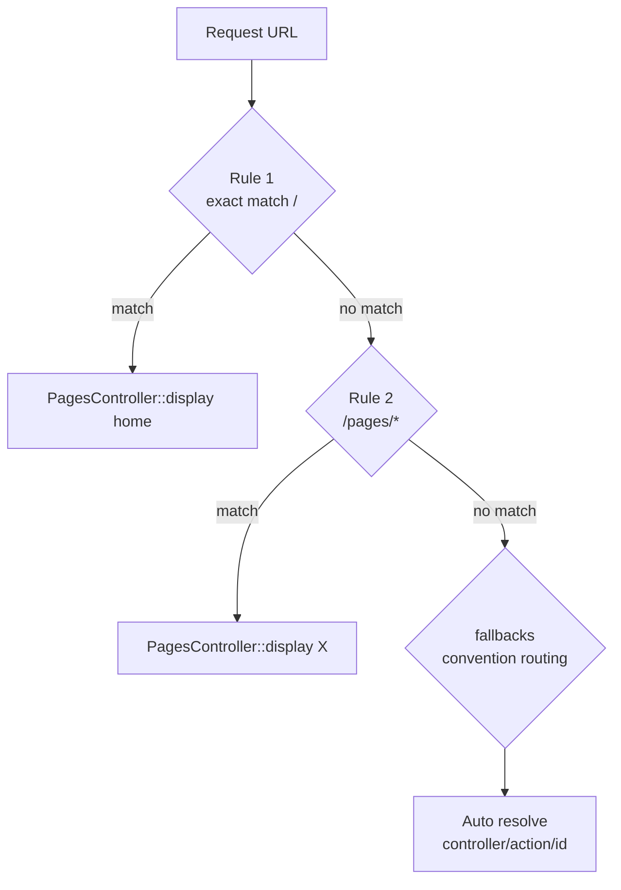

### Convention-Based Routing (fallbacks)

```
/articles              → ArticlesController::index()
/articles/view/5       → ArticlesController::view(5)
/articles/edit/5       → ArticlesController::edit(5)
/articles/delete/5     → ArticlesController::delete(5)
/users/login           → UsersController::login()
/blog-posts/index      → BlogPostsController::index()
```

---

## 4. Controller Actions

### What an Action Is

Every **public** method in a controller is automatically a routable action. No registration needed.

```php
class ArticlesController extends AppController
{
    public function index(): void { }    // ✅ routable — /articles
    public function view(): void { }     // ✅ routable — /articles/view
    private function helper(): void { }  // ❌ NOT routable — private
    protected function setup(): void { } // ❌ NOT routable — protected
}
```

### Return Types

```php
// void — renders template automatically
public function index(): void { }

// explicit Response — skips auto-render
public function apiIndex(): ResponseInterface { }
```

### Full `ArticlesController` — All Actions

```php
<?php
declare(strict_types=1);
namespace App\Controller;

class ArticlesController extends AppController
{
    public function initialize(): void
    {
        parent::initialize();
        $this->loadComponent('Flash');
    }

    // GET /articles → list all with pagination
    public function index(): void
    {
        $this->paginate = [
            'limit' => 10,
            'order' => ['Articles.created' => 'desc'],
        ];
        $articles = $this->paginate($this->Articles);
        $this->set([
            'articles' => $articles,
            'page'     => 'Articles Index',
        ]);
        $this->viewBuilder()
             ->addHelper('Paginator')
             ->addHelper('Html')
             ->setLayout('default');
    }

    // GET /articles/view/5 → show single article
    public function view(int $id): void
    {
        // get() throws NotFoundException automatically if not found
        $article = $this->Articles->get($id);
        $this->set('article', $article);
    }

    // GET /articles/add  → show empty form
    // POST /articles/add → save new article
    public function add(): void
    {
        $article = $this->Articles->newEmptyEntity();
        if ($this->request->is('post')) {
            $article = $this->Articles->patchEntity($article, $this->request->getData());
            $article->user_id  = 1;
            $article->slug     = strtolower(str_replace(' ', '-', $article->title ?? ''));
            $article->published = 1;
            if ($this->Articles->save($article)) {
                $this->Flash->success('Article created.');
                return $this->redirect(['action' => 'index']);
            }
            $this->Flash->error('Could not save.');
        }
        $this->set(compact('article'));
        $this->viewBuilder()->addHelper('Form')->setLayout('default');
    }

    // GET /articles/edit/5  → show pre-filled form
    // POST /articles/edit/5 → update article
    public function edit(int $id): void
    {
        $article = $this->Articles->get($id); // must be BEFORE if block
        if ($this->request->is(['post', 'put'])) {
            $this->Articles->patchEntity($article, $this->request->getData());
            $article->slug = strtolower(str_replace(' ', '-', $article->title ?? ''));
            if ($this->Articles->save($article)) {
                $this->Flash->success('Article updated.');
                return $this->redirect(['action' => 'index']);
            }
            $this->Flash->error('Could not update.');
        }
        $this->set(compact('article'));
        $this->viewBuilder()->addHelper('Form')->setLayout('default');
    }

    // POST /articles/delete/5 → delete article
    public function delete(int $id): void
    {
        $this->request->allowMethod(['post', 'delete']); // block GET
        $article = $this->Articles->get($id);
        if ($this->Articles->delete($article)) {
            $this->Flash->success('Article deleted.');
        } else {
            $this->Flash->error('Could not delete.');
        }
        return $this->redirect(['action' => 'index']);
    }

    // POST /articles/search → filter articles by title
    public function search(): void
    {
        $query    = $this->request->getData('query') ?? '';
        $articles = $this->Articles->find('all')
            ->where(['Articles.title LIKE' => '%' . $query . '%'])
            ->orderBy(['Articles.created' => 'DESC'])
            ->all();
        $this->set([
            'articles' => $articles,
            'query'    => $query,
            'count'    => count($articles),
        ]);
    }

    // GET /articles/api-index → JSON response
    public function apiIndex(): void
    {
        $this->disableAutoRender();
        $articles = $this->Articles->find('all')->toArray();
        $this->response = $this->response
            ->withType('application/json')
            ->withStatus(200)
            ->withStringBody(json_encode($articles));
    }
}
```

### Template Convention

CakePHP auto-renders `templates/ControllerName/action_name.php` unless you return an explicit Response.

```
ArticlesController::index()   → templates/Articles/index.php
ArticlesController::view()    → templates/Articles/view.php
ArticlesController::add()     → templates/Articles/add.php
ArticlesController::edit()    → templates/Articles/edit.php
ArticlesController::search()  → templates/Articles/search.php
```

---

## 5. Interacting with Views

### `$this->set()` — Passing Data to Views

Every variable the template needs must come through `$this->set()`. Three ways to use it:

```php
// 1. Single variable — available as $color in template
$this->set('color', 'pink');

// 2. Associative array — multiple vars at once
$this->set([
    'articles' => $articles,
    'total'    => count($articles),
    'page'     => 'Articles Index',
]);

// 3. compact() — cleanest pattern, variable name = key name
$article = $this->Articles->get($id);
$this->set(compact('article'));
// available as $article in template
```

### `$this->viewBuilder()` — Configure the View

Configures how CakePHP renders the view **before** rendering happens. All methods return the same builder so they chain.

```php
$this->viewBuilder()
     ->addHelper('Html')        // load Html helper
     ->addHelper('Form')        // load Form helper
     ->addHelper('Paginator')   // load Paginator helper
     ->addHelper('Url')         // load Url helper
     ->setLayout('default')     // use templates/layout/default.php
     ->setTemplate('listing')   // render listing.php instead of index.php
     ->setClassName('Json')     // use JsonView instead of default View
     ->setTheme('AdminTheme')   // use theme directory
     ->disableAutoLayout();     // no layout wrapping at all
```

### All `viewBuilder()` Methods

| Method | What It Does |
|---|---|
| `addHelper('Name')` | Load helper into view — `$this->Html`, `$this->Form` etc |
| `setLayout('name')` | Wrap template in `templates/layout/name.php` |
| `setTemplate('name')` | Override default template file |
| `setClassName('Json')` | Replace View class — JsonView, XmlView, custom |
| `setTheme('Name')` | Switch to theme template directory |
| `setVar('key', $val)` | Pass single variable (alternative to `set()`) |
| `setVars([...])` | Pass multiple variables (alternative to `set([...])`) |
| `setOption('key', $val)` | Pass config to View class constructor |
| `setConfigMergeStrategy()` | `MERGE_DEEP` (default) vs `MERGE_SHALLOW` |
| `disableAutoLayout()` | No layout — bare template output only |

### `setConfigMergeStrategy()`

Controls how config arrays merge when `setConfig()` called multiple times.

```php
use Cake\View\ViewBuilder;

// MERGE_DEEP (default) — recursively merges nested arrays
$this->viewBuilder()->setConfigMergeStrategy(ViewBuilder::MERGE_DEEP);

// MERGE_SHALLOW — only top level merged, nested arrays overwritten
$this->viewBuilder()->setConfigMergeStrategy(ViewBuilder::MERGE_SHALLOW);
```

### Controller → View Data Flow

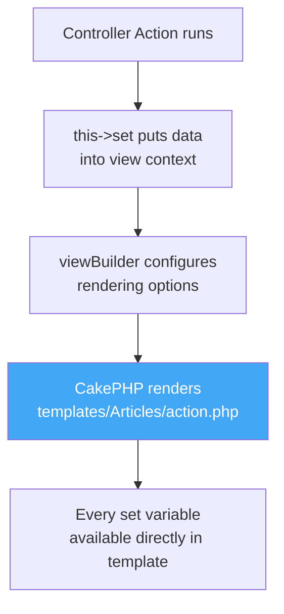

---

## 6. Rendering a View

### Auto-Render (Default)

CakePHP automatically renders after every action unless you return an explicit Response. You never write this — it just happens.

```php
public function index(): void
{
    $this->set('articles', $articles);
    // CakePHP auto-renders templates/Articles/index.php
}
```

### `$this->render()` — Manual Control

```php
// render a different template (not the default action name)
return $this->render('listing');
// renders templates/Articles/listing.php instead of index.php

// render an element directly — useful for AJAX partial responses
return $this->render('/element/ajaxreturn');
// renders templates/element/ajaxreturn.php — no layout

// specify both template and layout
return $this->render('index', 'admin');
// renders templates/Articles/index.php
// wrapped in templates/layout/admin.php
```

### `$this->disableAutoRender()`

Skip auto-rendering entirely. Use when action builds its own complete response — JSON, file download, redirect.

```php
public function apiIndex(): void
{
    $this->disableAutoRender(); // skip template lookup

    $this->response = $this->response
        ->withType('application/json')
        ->withStatus(200)
        ->withStringBody(json_encode($this->Articles->find()->toArray()));
}
```

> **Common mistake** — forgetting `disableAutoRender()` when building a JSON response. CakePHP tries to find a template after your response is built and throws `MissingTemplateException`.

### Render Decision Flow

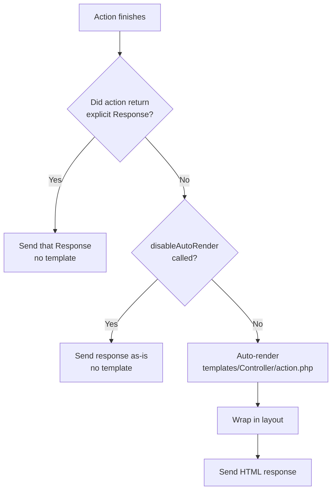

---

## 7. Content Type Negotiation

### What It Is

Serve different formats (HTML, JSON, XML) from the same action based on what the client requests — via `Accept` header or URL extension.

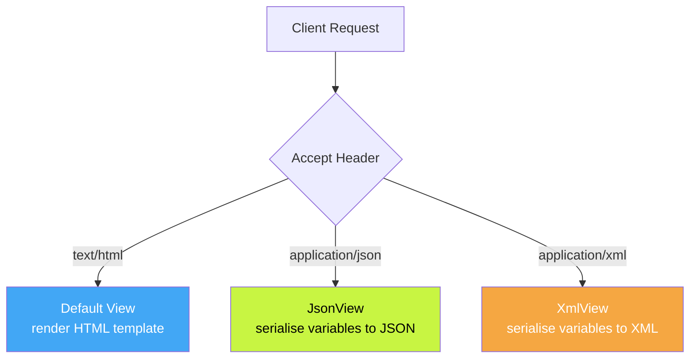

### `$this->addViewClasses()` — Register Supported Formats

Called in `initialize()` so all actions can negotiate:

```php
use Cake\View\JsonView;
use Cake\View\XmlView;

public function initialize(): void
{
    parent::initialize();
    $this->Flash->loadComponent('Flash');

    $this->addViewClasses([
        JsonView::class,
        XmlView::class,
    ]);
}
```

### Checking Content Type in Action

```php
public function index(): void
{
    $articles = $this->Articles->find('all')->toArray();

    if ($this->request->is('json')) {
        $this->set('articles', $articles);
        $this->viewBuilder()->setOption('serialize', ['articles']);
        return;
    }

    if ($this->request->is('ajax')) {
        $this->viewBuilder()->setLayout('ajax');
    }

    $this->set([
        'articles' => $articles,
        'page'     => 'Articles Index',
    ]);
}
```

### Special View Classes

| Class | Purpose |
|---|---|
| `JsonView` | Serialises `set()` variables to JSON. No template needed. Controlled by `serialize` option |
| `XmlView` | Same as JsonView but outputs XML |
| `AjaxView` | Renders template but strips layout — HTML fragment for AJAX |
| `NegotiationRequiredView` | Returns HTTP 406 if client `Accept` header does not match any registered class |

```php
// JsonView — serialize option controls what gets JSON encoded
$this->viewBuilder()->setOption('serialize', ['articles', 'total']);
// output: {"articles":[...],"total":3}

// AjaxView — template without layout
$this->viewBuilder()->setClassName('Ajax');

// NegotiationRequiredView — strict API content type enforcement
$this->addViewClasses([
    JsonView::class,
    NegotiationRequiredView::class, // 406 if not JSON
]);
```

---

## 8. Redirecting

### `$this->redirect()` — All Forms

```php
// Array syntax — safest, CakePHP builds URL from routing rules
$this->redirect(['controller' => 'Orders', 'action' => 'confirm']);
$this->redirect(['action' => 'index']);           // same controller
$this->redirect(['action' => 'view', $id]);       // with parameter

// Relative URL
$this->redirect('/orders/confirm');

// Absolute URL
$this->redirect('https://example.com');

// Back to previous page via HTTP_REFERER header
$this->redirect($this->referer());

// With HTTP status code
$this->redirect('/orders/confirm', 301); // permanent — browser caches
$this->redirect('/orders/confirm', 302); // temporary — default
$this->redirect('/orders/confirm', 303); // see other — correct after POST
```

### Always `return` a Redirect

```php
public function add(): void
{
    if ($this->request->is('post')) {
        if ($this->Articles->save($article)) {
            return $this->redirect(['action' => 'index']); // return stops execution
            // without return, code below still runs
        }
    }
}
```

### Redirecting in Callbacks

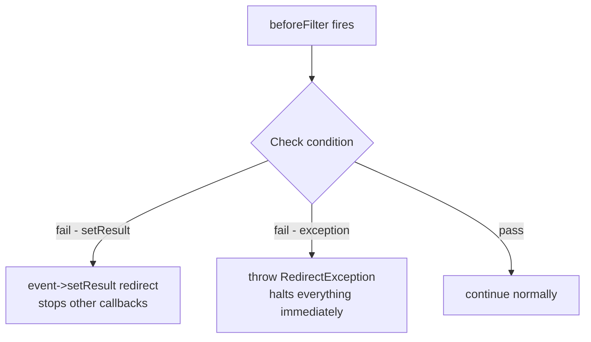

**`$event->setResult()`:**

```php
public function beforeFilter(\Cake\Event\EventInterface $event): void
{
    if (!$this->isLoggedIn()) {
        $event->setResult($this->redirect('/login'));
        // stops other callbacks, controller action never runs
    }
}
```

**`RedirectException` (CakePHP 4.1+) — cleanest:**

```php
use Cake\Http\Exception\RedirectException;

public function beforeFilter(\Cake\Event\EventInterface $event): void
{
    if (!$this->isLoggedIn()) {
        throw new RedirectException('/login');
        // impossible for any code to run after a throw
    }
}
```

---

## 9. Pagination

### `$paginate` Property — Controller Config

```php
class ArticlesController extends AppController
{
    protected array $paginate = [
        'limit'          => 10,                          // records per page
        'order'          => ['Articles.created' => 'desc'], // default sort
        'conditions'     => ['published' => 1],          // filter
        'contain'        => ['Users'],                   // eager load
        'maxLimit'       => 100,                         // cap — prevent ?limit=99999
        'sortableFields' => ['title', 'created', 'id'],  // whitelist sortable columns
    ];
}
```

### `$this->paginate()` — Execute

```php
public function index(): void
{
    // basic — uses $paginate property
    $articles = $this->paginate($this->Articles);

    // override inline for this call only
    $articles = $this->paginate($this->Articles, [
        'limit' => 5,
        'order' => ['Articles.title' => 'asc'],
    ]);

    // paginate a query object
    $query    = $this->Articles->find('published')->contain('Comments');
    $articles = $this->paginate($query);

    $this->set(compact('articles'));
    $this->viewBuilder()->addHelper('Paginator');
}
```

### PaginatorHelper — In Template

```php
// counter — "Page 2 of 250, showing 10 of 2500 articles"
<?= $this->Paginator->counter('Page {{page}} of {{pages}}, showing {{current}} of {{count}} articles') ?>

// navigation
<?= $this->Paginator->first('« First') ?>
<?= $this->Paginator->prev('← Prev') ?>
<?= $this->Paginator->numbers() ?>
<?= $this->Paginator->next('Next →') ?>
<?= $this->Paginator->last('Last »') ?>

// sortable column links — toggles asc/desc on click
<?= $this->Paginator->sort('title', 'Title') ?>
<?= $this->Paginator->sort('created', 'Date') ?>

// boolean checks
<?= $this->Paginator->hasPrev() ? 'has prev' : '' ?>
<?= $this->Paginator->hasNext() ? 'has next' : '' ?>
```

### URL Pattern CakePHP Generates

```
/articles?page=1
/articles?page=2
/articles?page=2&sort=title&direction=asc
/articles?page=2&limit=10
```

### Out of Range Pages

```php
use Cake\Http\Exception\NotFoundException;

public function index(): void
{
    try {
        $articles = $this->paginate($this->Articles);
    } catch (NotFoundException $e) {
        return $this->redirect(['action' => 'index']); // redirect to page 1
    }
}
```

### Manual Pagination (Without ORM)

```php
public function index(): void
{
    $limit   = 2;
    $page    = max(1, (int)$this->request->getQuery('page', 1));
    $total   = count($this->data);
    $pages   = (int)ceil($total / $limit);
    $offset  = ($page - 1) * $limit;
    $articles = array_slice($this->data, $offset, $limit);

    $this->set([
        'articles' => $articles,
        'total'    => $total,
        'page'     => $page,
        'pages'    => $pages,
        'limit'    => $limit,
    ]);
}
```

```php
<!-- manual prev/next in template -->
<?php if ($page > 1): ?>
    <a href="/articles?page=<?= $page - 1 ?>">← Prev</a>
<?php endif; ?>
<span>Page <?= $page ?> of <?= $pages ?></span>
<?php if ($page < $pages): ?>
    <a href="/articles?page=<?= $page + 1 ?>">Next →</a>
<?php endif; ?>
```

---

## 10. Loading Components

### In `initialize()`

```php
public function initialize(): void
{
    parent::initialize();

    $this->loadComponent('Flash');
    $this->loadComponent('FormProtection');
    $this->loadComponent('Comments', ['priority' => 5]);
}
```

### Common Built-in Components

| Component | Purpose |
|---|---|
| `Flash` | One-time session messages — `success()`, `error()`, `warning()` |
| `FormProtection` | Validates form field tampering between render and submit |
| `Authentication` | Login/logout, identity resolution, session/JWT/cookie |
| `Authorization` | What an authenticated user is allowed to do via policies |

### Flash Component

```php
// setting messages in controller
$this->Flash->success('Article saved.');
$this->Flash->error('Could not save.');
$this->Flash->warning('Check your input.');

// with options
$this->Flash->success('User saved', [
    'key'    => 'positive',
    'clear'  => true,
    'params' => ['name' => $user->name],
]);

// rendering in template
<?= $this->Flash->render() ?>
<?= $this->Flash->render('positive') ?> // specific key
```

### Loading in a Single Action

```php
public function export(): void
{
    $this->loadComponent('Csv');
    // available only within this action
}
```

---

## 11. ORM Basics

### How ORM Works

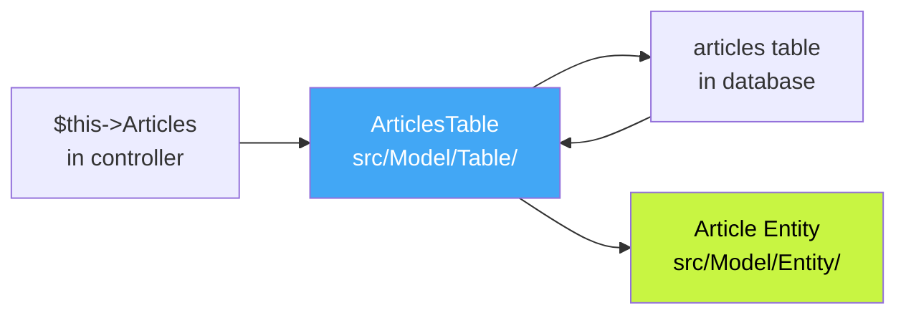

CakePHP automatically maps `articles` table → `ArticlesTable` class → available as `$this->Articles` in controller. No registration needed — convention handles it.

### `ArticlesTable` — Table Class

```php
<?php
declare(strict_types=1);
namespace App\Model\Table;

use Cake\ORM\Table;
use Cake\Validation\Validator;

class ArticlesTable extends Table
{
    public function initialize(array $config): void
    {
        parent::initialize($config);

        $this->setTable('articles');       // maps to articles DB table
        $this->setPrimaryKey('id');        // primary key column
        $this->setDisplayField('title');   // label for dropdowns

        // auto-set created + modified on save
        $this->addBehavior('Timestamp');

        // associations
        $this->belongsTo('Users', [
            'foreignKey' => 'user_id',
        ]);
        $this->hasMany('Comments', [
            'foreignKey' => 'article_id',
            'dependent'  => true, // delete comments when article deleted
        ]);
    }

    public function validationDefault(Validator $validator): Validator
    {
        $validator
            ->notEmptyString('title', 'Title is required')
            ->minLength('title', 3, 'Too short')
            ->notEmptyString('body', 'Body is required')
            ->boolean('published');

        return $validator;
    }
}
```

### `initialize()` Method — What Each Line Does

| Method | Purpose | Required |
|---|---|---|
| `parent::initialize()` | CakePHP internal setup | Always — first line |
| `setTable('name')` | Which DB table to map to | Only if name differs |
| `setPrimaryKey('col')` | Primary key column | Only if not `id` |
| `setDisplayField('col')` | Human label for dropdowns | Recommended |
| `addBehavior('Timestamp')` | Auto created/modified | Recommended |
| `belongsTo()` | Many-to-one association | When needed |
| `hasMany()` | One-to-many association | When needed |
| `belongsToMany()` | Many-to-many via join table | When needed |

### `Article` Entity — Entity Class

```php
<?php
declare(strict_types=1);
namespace App\Model\Entity;

use Cake\ORM\Entity;

class Article extends Entity
{
    // fields that can be mass-assigned via patchEntity/newEntity
    protected array $_accessible = [
        'user_id'   => true,
        'title'     => true,
        'slug'      => true,
        'body'      => true,
        'published' => true,
        'created'   => true,
        'modified'  => true,
    ];
}
```

> **Rule** — If a field is missing from `$_accessible`, `patchEntity()` silently ignores it. This is exactly what causes `Undefined property` errors.

### ORM Methods — Quick Reference

| Method | SQL Equivalent |
|---|---|
| `find('all')` | `SELECT *` |
| `find('all')->where([...])` | `SELECT * WHERE ...` |
| `find('all')->orderBy([...])` | `SELECT * ORDER BY ...` |
| `find('all')->limit(n)` | `SELECT * LIMIT n` |
| `find('all')->contain([...])` | `SELECT * JOIN ...` |
| `find('all')->count()` | `SELECT COUNT(*)` |
| `get($id)` | `SELECT * WHERE id = $id LIMIT 1` |
| `newEmptyEntity()` | blank object — no SQL |
| `patchEntity($entity, $data)` | fills entity — no SQL yet |
| `save($entity)` | `INSERT` or `UPDATE` |
| `delete($entity)` | `DELETE WHERE id = $id` |

### Array vs Entity in Templates

```php
// OLD — array data store
echo $article['title'];
echo $article['body'];
echo $article['id'];

// NEW — ORM entity
echo $article->title;
echo $article->body;
echo $article->id;
echo $article->created;  // DateTime object
```

### CRUD — ORM Pattern Per Action

```mermaid
flowchart TD
    subgraph index["index()"]
        A1[paginate Articles] --> B1[set articles]
    end

    subgraph view["view(id)"]
        A2[get id] --> B2[set article]
    end

    subgraph add["add()"]
        A3[newEmptyEntity] --> B3{is POST?}
        B3 -->|yes| C3[patchEntity getData]
        C3 --> D3{save?}
        D3 -->|yes| E3[redirect index]
        D3 -->|no| F3[Flash error\nre-render form]
        B3 -->|no| G3[set empty entity\nrender form]
    end

    subgraph edit["edit(id)"]
        A4[get id] --> B4{is POST?}
        B4 -->|yes| C4[patchEntity getData]
        C4 --> D4{save?}
        D4 -->|yes| E4[redirect index]
        D4 -->|no| F4[Flash error]
        B4 -->|no| G4[set entity\nrender form prefilled]
    end

    subgraph delete["delete(id)"]
        A5[allowMethod POST] --> B5[get id]
        B5 --> C5[delete entity]
        C5 --> D5[redirect index]
    end
```

### CSRF in Forms

Every POST form must include the CSRF token:

```html
<form action="/articles/add" method="post">
    <input type="hidden"
           name="_csrfToken"
           value="<?= $this->request->getAttribute('csrfToken') ?>">
    <!-- form fields -->
</form>
```

> **Note** — use plain `<input>` not `$this->Form->hidden()` for CSRF. The Form helper generates different output that CakePHP middleware does not recognise correctly in all cases.

---

## File Structure Reference

```
src/
├── Controller/
│   ├── AppController.php          ← global base controller
│   ├── ArticlesController.php     ← specific controller
│   └── Component/
│       └── MyComponent.php
├── Model/
│   ├── Table/
│   │   └── ArticlesTable.php      ← ORM table class
│   └── Entity/
│       └── Article.php            ← ORM entity class
templates/
├── Articles/
│   ├── index.php                  ← list view
│   ├── view.php                   ← single record view
│   ├── add.php                    ← create form
│   ├── edit.php                   ← edit form
│   └── search.php                 ← search results
├── layout/
│   └── default.php                ← layout wrapper
└── element/
    └── flash/
        ├── success.php
        └── error.php
config/
└── routes.php                     ← URL routing rules
```

---

*CL02 — CakePHP Controllers | Abhay Raj | March 2026*