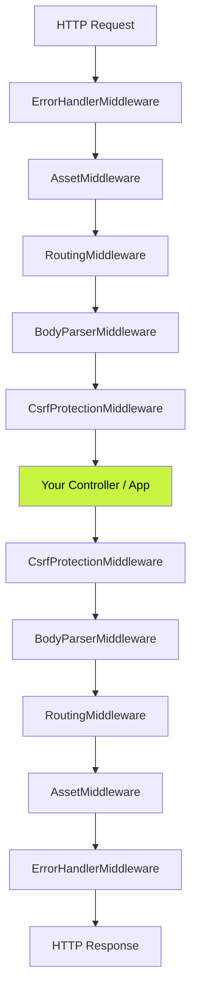
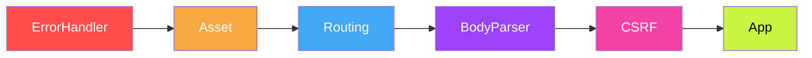
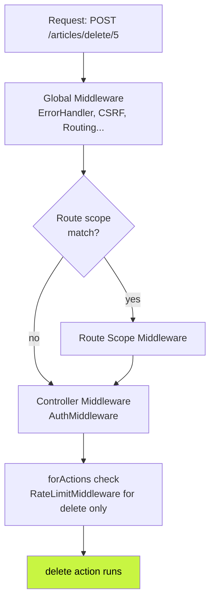
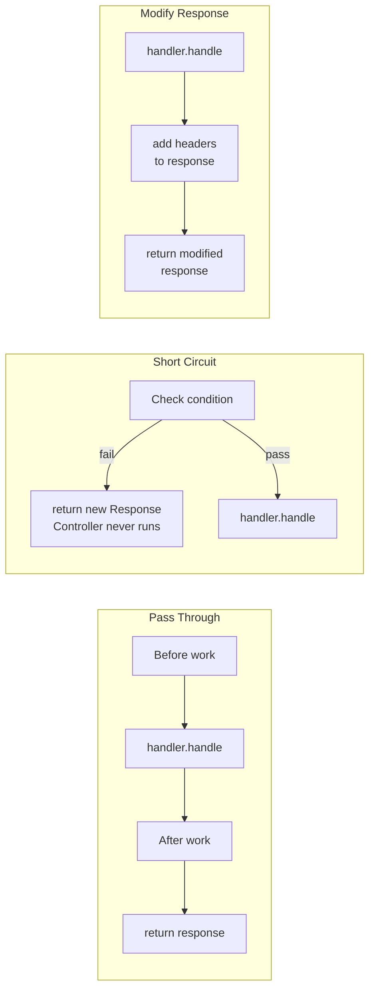
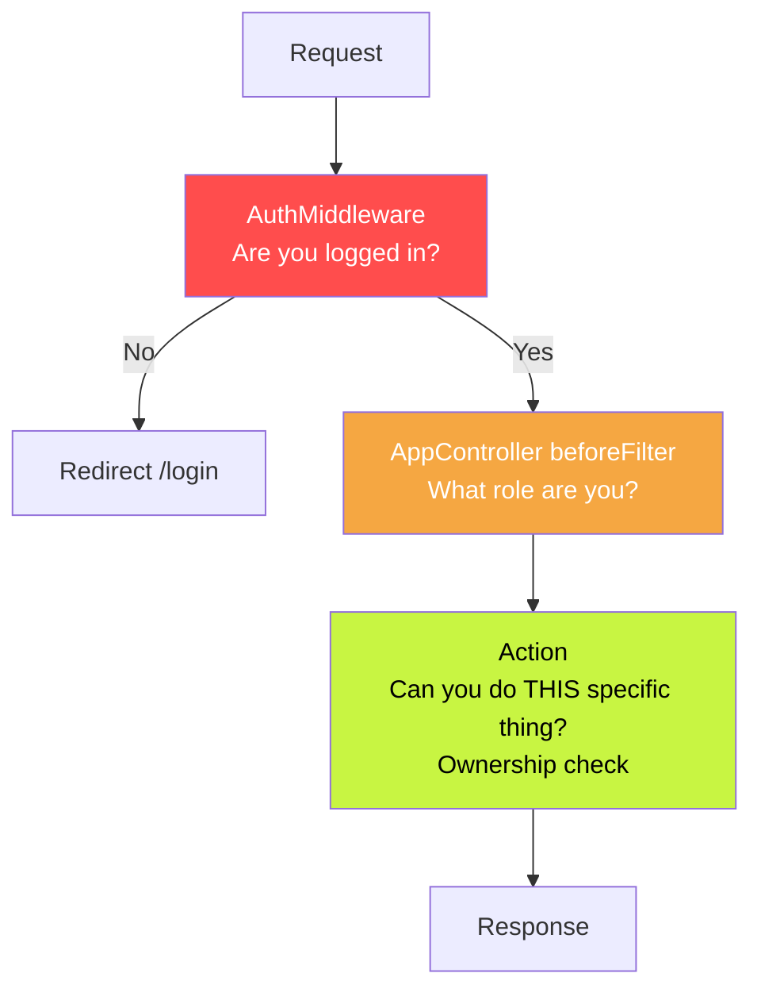
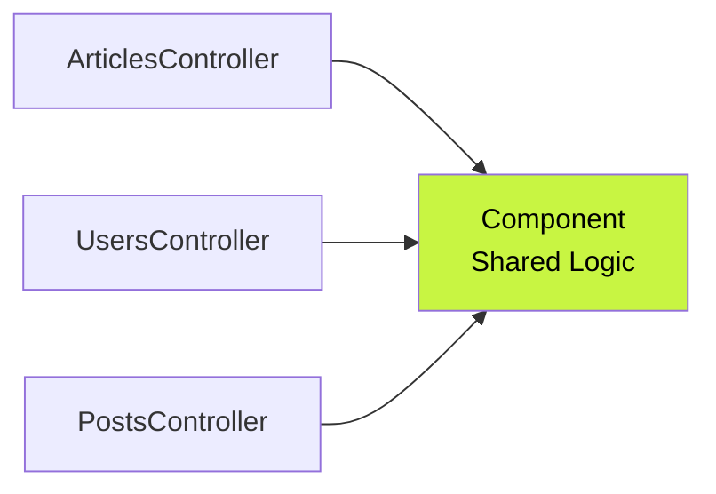
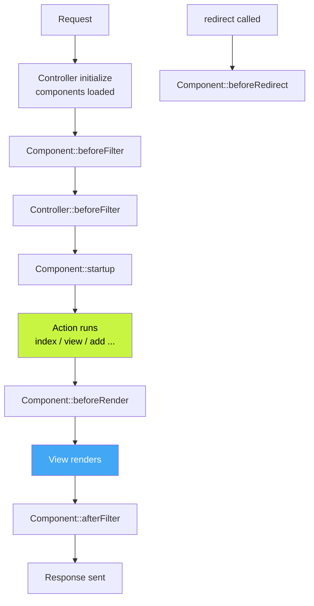

# CakePHP — Middleware & Components
> Complete Reference Docs | CL03 Study Notes

---

## Table of Contents

1. [Middleware — What It Is](#1-middleware--what-it-is)
2. [Built-in Middleware](#2-built-in-middleware)
3. [Applying Middleware](#3-applying-middleware)
4. [Creating Custom Middleware](#4-creating-custom-middleware)
5. [Components — What They Are](#5-components--what-they-are)
6. [Component Callbacks (Lifecycle)](#6-component-callbacks-lifecycle)

---

## 1. Middleware — What It Is

### The Onion Model

Every HTTP request passes **inward** through each middleware layer before reaching the controller. The response passes **outward** back through the same layers.



### Two Things Middleware Can Do

**Pass Through** — do work, hand off to next layer, return what comes back:

```php
public function process(
    ServerRequestInterface $request,
    RequestHandlerInterface $handler
): ResponseInterface
{
    // work BEFORE passing inward
    $request = $request->withAttribute('startTime', microtime(true));

    $response = $handler->handle($request); // pass to next layer

    // work AFTER response comes back
    $response = $response->withHeader('X-Powered-By', 'CakePHP');

    return $response;
}
```

**Short Circuit** — return immediately, nothing inside ever runs:

```php
public function process(
    ServerRequestInterface $request,
    RequestHandlerInterface $handler
): ResponseInterface
{
    if (!$this->isLoggedIn($request)) {
        // controller never runs
        $response = new \Cake\Http\Response();
        return $response->withLocation('/users/login')->withStatus(302);
    }

    return $handler->handle($request);
}
```

### Key Standards

| Standard | What It Defines |
|---|---|
| **PSR-7** | Request & Response objects — immutable, use `with*()` to modify |
| **PSR-15** | `MiddlewareInterface` — every middleware must implement `process()` |
| **PSR-15** | `RequestHandlerInterface` — the `$handler` that calls next layer |

### Immutability — PSR-7 Rule

```php
// WRONG — direct modification does nothing
$request->attribute = 'value';

// CORRECT — returns a NEW object with the change
$request = $request->withAttribute('user', $currentUser);
$response = $response->withHeader('X-Custom', 'value');
$response = $response->withStatus(404);
```

### File Location

```
src/
├── Application.php        ← middleware stack registered here
└── Middleware/
    ├── AuthMiddleware.php
    ├── LoggingMiddleware.php
    └── CorsMiddleware.php
```

---

## 2. Built-in Middleware

### Stack Order — Why Order Matters



> **Critical** — CSRF must come AFTER BodyParser. If reversed, `_csrfToken` from POST body is not yet parsed when CSRF checks for it — every form fails.

### 1. `ErrorHandlerMiddleware`

Outermost layer. Catches any exception thrown by any inner layer or controller and converts it to a proper error page or JSON error response.

```php
new ErrorHandlerMiddleware(Configure::read('Error'), $this)
```

### 2. `AssetMiddleware`

Checks if request is for a static file — CSS, JS, image — in a plugin or theme's `webroot`. Serves it directly, request never reaches router.

```php
new AssetMiddleware([
    'cacheTime' => '+1 year'
])
```

### 3. `RoutingMiddleware`

Parses the URL using `config/routes.php` and attaches resolved controller, action, and parameters to the request object.

```php
new RoutingMiddleware($this)
// after this, $request->getParam('controller') works
```

### 4. `CsrfProtectionMiddleware`

Generates a CSRF token cookie. On every POST/PUT/DELETE it checks that submitted `_csrfToken` matches the cookie. Rejects with 403 if mismatch.

```php
new CsrfProtectionMiddleware([
    'httponly' => true,
    'secure'   => true,
    'samesite' => 'Strict',
])

// Skip CSRF for API routes
$csrfMiddleware->skipCheckCallback(function ($request) {
    if ($request->getParam('prefix') === 'api') {
        return true;
    }
    return false;
});
```

In every POST form you must include:

```html
<input type="hidden" name="_csrfToken"
       value="<?= $this->request->getAttribute('csrfToken') ?>">
```

### 5. `BodyParserMiddleware`

Parses JSON, XML, or custom encoded request bodies into PHP arrays accessible via `$request->getData()`.

```php
new BodyParserMiddleware()                    // JSON only (default)
new BodyParserMiddleware(['xml' => true])     // enable XML too
new BodyParserMiddleware(['json' => false])   // disable JSON

// custom CSV parser
$parser = new BodyParserMiddleware();
$parser->addParser(['text/csv'], function($body, $request) {
    return Csv::parse($body);
});
```

### 6. `HttpsEnforcerMiddleware`

Redirects all HTTP requests to HTTPS. Only enable in production.

```php
if (!Configure::read('debug')) {
    $middlewareQueue->add(new HttpsEnforcerMiddleware([
        'redirect'   => true,
        'statusCode' => 302,
    ]));
}
```

### 7. `EncryptedCookieMiddleware`

Transparently encrypts and decrypts specified cookies using AES via OpenSSL. Controller code never sees encrypted values.

```php
new EncryptedCookieMiddleware(
    ['user_prefs', 'session_data'],             // cookies to encrypt
    Configure::read('Security.cookieKey')        // exclusive key for cookies only
)
```

### 8. `SecurityHeadersMiddleware`

Adds security HTTP headers to every response protecting against clickjacking, MIME sniffing, XSS.

```php
$securityHeaders = new SecurityHeadersMiddleware();
$securityHeaders
    ->setXFrameOptions('SAMEORIGIN')     // prevent clickjacking
    ->noSniff()                          // prevent MIME sniffing
    ->noOpen()                           // X-Download-Options
    ->setReferrerPolicy('same-origin')   // Referrer-Policy
    ->setXssProtection('1; mode=block'); // XSS protection

$middlewareQueue->add($securityHeaders);
```

### 9. `RateLimitMiddleware`

Limits requests per time window. Returns HTTP 429 when exceeded.

```php
new RateLimitMiddleware([
    'limit'      => 100,
    'window'     => 60,
    'identifier' => function($request) {
        return $request->clientIp();
    }
])
```

### 10. `LocaleSelectorMiddleware`

Reads `Accept-Language` header and sets app locale automatically.

```php
new LocaleSelectorMiddleware(['en', 'hi', 'fr'])
// falls back to default if browser language not in allowed list
```

---

## 3. Applying Middleware

### Global — `Application::middleware()`

Applied to every request. Registered in `src/Application.php`.

```php
public function middleware(MiddlewareQueue $middlewareQueue): MiddlewareQueue
{
    $middlewareQueue
        ->add(new ErrorHandlerMiddleware(Configure::read('Error'), $this))
        ->add(new AssetMiddleware())
        ->add(new RoutingMiddleware($this))
        ->add(new BodyParserMiddleware())
        ->add(new CsrfProtectionMiddleware());

    return $middlewareQueue;
}
```

### MiddlewareQueue Operations

```php
$layer = new \App\Middleware\CustomMiddleware();

$middlewareQueue->add($layer);          // add to END — runs last
$middlewareQueue->prepend($layer);      // add to START — runs first
$middlewareQueue->insertAt(2, $layer);  // insert at position 2

// insert relative to existing middleware
$middlewareQueue->insertBefore(
    'Cake\Error\Middleware\ErrorHandlerMiddleware',
    $layer
);
$middlewareQueue->insertAfter(
    'Cake\Routing\Middleware\RoutingMiddleware',
    $layer
);
```

### Route Scoped Middleware

Applied only to specific URL prefixes. Registered in `config/routes.php`.

```php
use App\Middleware\AuthMiddleware;
use App\Middleware\AdminMiddleware;

// only /api/* goes through ApiAuthMiddleware
$routes->scope('/api', function (RouteBuilder $builder) {
    $builder->registerMiddleware('apiAuth', new ApiAuthMiddleware());
    $builder->applyMiddleware('apiAuth');
    $builder->connect('/articles', ['controller' => 'Articles', 'action' => 'index']);
});

// only /admin/* goes through AdminMiddleware
$routes->scope('/admin', function (RouteBuilder $builder) {
    $builder->registerMiddleware('admin', new AdminMiddleware());
    $builder->applyMiddleware('admin');
    $builder->connect('/dashboard', ['controller' => 'Admin', 'action' => 'index']);
});
```

### Controller Middleware

Applied only when a specific controller handles the request.

```php
class ArticlesController extends AppController
{
    public function initialize(): void
    {
        parent::initialize();

        // apply to ALL actions
        $this->middleware(new AuthMiddleware());

        // apply only to specific actions
        $this->middleware(new RateLimitMiddleware())
             ->forActions(['add', 'edit', 'delete']);

        // apply to all EXCEPT specific actions
        $this->middleware(new AuthMiddleware())
             ->exceptActions(['index', 'view']);
    }
}
```

### Plugin Middleware

```php
// plugins/ContactManager/src/Plugin.php
class Plugin extends BasePlugin
{
    public function middleware(MiddlewareQueue $middlewareQueue): MiddlewareQueue
    {
        $middlewareQueue->add(new ContactManagerContextMiddleware());
        return $middlewareQueue;
    }
}
```

### Full Request Flow With All Levels



### Scope Comparison

| Method | Scope | Use Case |
|---|---|---|
| `Application::middleware()` | Every request | Auth, logging, CSRF |
| Route scoped | Specific URL prefix | API auth, admin checks |
| Controller middleware | Specific controller | Per-resource rate limiting |
| `forActions()` | Specific actions only | Protect write actions |
| `exceptActions()` | All except listed | Allow public read, protect write |
| Plugin | Plugin routes only | Plugin-specific logic |

---

## 4. Creating Custom Middleware

### Conventions

- File location: `src/Middleware/`
- Class name suffix: `Middleware` e.g. `AuthMiddleware`
- Must implement `Psr\Http\Server\MiddlewareInterface`
- One required method: `process()`

### Basic Skeleton

```php
<?php
declare(strict_types=1);
namespace App\Middleware;

use Psr\Http\Message\ResponseInterface;
use Psr\Http\Message\ServerRequestInterface;
use Psr\Http\Server\MiddlewareInterface;
use Psr\Http\Server\RequestHandlerInterface;

class MyMiddleware implements MiddlewareInterface
{
    public function process(
        ServerRequestInterface  $request,
        RequestHandlerInterface $handler
    ): ResponseInterface
    {
        // BEFORE — modify request going inward
        $request = $request->withAttribute('key', 'value');

        $response = $handler->handle($request); // pass to next layer

        // AFTER — modify response coming outward
        $response = $response->withHeader('X-Custom', 'value');

        return $response;
    }
}
```

### Three Patterns



### Example 1 — `LoggingMiddleware`

```php
<?php
declare(strict_types=1);
namespace App\Middleware;

use Cake\Log\Log;
use Psr\Http\Message\ResponseInterface;
use Psr\Http\Message\ServerRequestInterface;
use Psr\Http\Server\MiddlewareInterface;
use Psr\Http\Server\RequestHandlerInterface;

class LoggingMiddleware implements MiddlewareInterface
{
    public function process(
        ServerRequestInterface $request,
        RequestHandlerInterface $handler
    ): ResponseInterface
    {
        Log::info(sprintf(
            '[%s] %s %s',
            date('Y-m-d H:i:s'),
            $request->getMethod(),
            $request->getRequestTarget()
        ));

        $response = $handler->handle($request);

        Log::info(sprintf(
            'Response: %s for %s',
            $response->getStatusCode(),
            $request->getRequestTarget()
        ));

        return $response;
    }
}
```

### Example 2 — `AuthMiddleware`

```php
<?php
declare(strict_types=1);
namespace App\Middleware;

use Cake\Http\Response;
use Psr\Http\Message\ResponseInterface;
use Psr\Http\Message\ServerRequestInterface;
use Psr\Http\Server\MiddlewareInterface;
use Psr\Http\Server\RequestHandlerInterface;

class AuthMiddleware implements MiddlewareInterface
{
    private array $publicRoutes = [
        '/users/login',
        '/users/register',
        '/',
    ];

    public function process(
        ServerRequestInterface $request,
        RequestHandlerInterface $handler
    ): ResponseInterface
    {
        $path = $request->getUri()->getPath();

        if (in_array($path, $this->publicRoutes)) {
            return $handler->handle($request);
        }

        $session = $request->getAttribute('session');

        if (!$session->read('Auth.user')) {
            $response = new Response();
            return $response->withLocation('/users/login')->withStatus(302);
        }

        // attach user to request for controllers to read
        $request = $request->withAttribute('user', $session->read('Auth.user'));

        return $handler->handle($request);
    }
}
```

### Example 3 — `CorsMiddleware`

```php
<?php
declare(strict_types=1);
namespace App\Middleware;

use Cake\Http\Response;
use Psr\Http\Message\ResponseInterface;
use Psr\Http\Message\ServerRequestInterface;
use Psr\Http\Server\MiddlewareInterface;
use Psr\Http\Server\RequestHandlerInterface;

class CorsMiddleware implements MiddlewareInterface
{
    public function process(
        ServerRequestInterface $request,
        RequestHandlerInterface $handler
    ): ResponseInterface
    {
        // handle preflight OPTIONS — browser sends this before actual request
        if ($request->getMethod() === 'OPTIONS') {
            $response = new Response();
            return $response
                ->withHeader('Access-Control-Allow-Origin', '*')
                ->withHeader('Access-Control-Allow-Methods', 'GET, POST, PUT, DELETE')
                ->withHeader('Access-Control-Allow-Headers', 'Content-Type, Authorization')
                ->withStatus(200);
        }

        $response = $handler->handle($request);

        return $response
            ->withHeader('Access-Control-Allow-Origin', '*')
            ->withHeader('Access-Control-Allow-Methods', 'GET, POST, PUT, DELETE')
            ->withHeader('Access-Control-Allow-Headers', 'Content-Type, Authorization');
    }
}
```

### Registering All in `Application.php`

```php
use App\Middleware\LoggingMiddleware;
use App\Middleware\AuthMiddleware;
use App\Middleware\CorsMiddleware;

public function middleware(MiddlewareQueue $middlewareQueue): MiddlewareQueue
{
    $middlewareQueue
        ->add(new ErrorHandlerMiddleware(Configure::read('Error'), $this))
        ->add(new LoggingMiddleware())
        ->add(new CorsMiddleware())
        ->add(new AssetMiddleware())
        ->add(new RoutingMiddleware($this))
        ->add(new BodyParserMiddleware())
        ->add(new CsrfProtectionMiddleware())
        ->add(new AuthMiddleware());   // needs routing to be done first

    return $middlewareQueue;
}
```

### Pattern Summary

| Pattern | When to Use |
|---|---|
| Pass through | Logging, timing, adding headers |
| Short circuit | Auth check, rate limit, maintenance mode |
| Modify response | CORS headers, security headers |
| `withAttribute()` | Pass data from middleware to controller |
| `getAttribute()` | Read in controller what middleware attached |

### RBAC — Middleware vs Component



| | Middleware | Component/Controller |
|---|---|---|
| Runs | Before controller | Inside controller |
| Best for | Login check, token validation | Role/permission per action |
| Has model access | No | Yes |
| Has action context | No | Yes |
| Performance | Better — stops early | Slightly heavier |

> **Rule** — Use middleware as the gatekeeper, component as the judge.

---

## 5. Components — What They Are

Components are reusable logic classes shared across controllers. When the same code appears in multiple controllers — move it into a component.



### File Location

```
src/
└── Controller/
    └── Component/
        ├── MathComponent.php
        ├── AuthComponent.php
        └── CsvComponent.php
```

### Loading via `loadComponent()`

```php
public function initialize(): void
{
    parent::initialize();

    // basic load
    $this->loadComponent('Flash');

    // load with config
    $this->loadComponent('FormProtection', [
        'unlockedActions' => ['index', 'view'],
    ]);

    // custom component with config
    $this->loadComponent('Math', [
        'precision' => 2,
    ]);
}
```

### Accessing as `$this->ComponentName`

```php
public function add(): void
{
    $this->Flash->success('Saved.');
    $result = $this->Math->doComplexOperation(10, 20);
}
```

### `setConfig()` and `getConfig()`

```php
public function beforeFilter(EventInterface $event): void
{
    parent::beforeFilter($event);

    $this->FormProtection->setConfig('validate', false);
    $this->Flash->setConfig(['key' => 'myFlash', 'clear' => true]);

    $unlockedActions = $this->FormProtection->getConfig('unlockedActions');
}
```

### Aliasing via `className`

```php
// load MyFlashComponent but access as $this->Flash
$this->loadComponent('Flash', [
    'className' => 'MyFlash',
]);
```

```php
// src/Controller/Component/MyFlashComponent.php
class MyFlashComponent extends FlashComponent
{
    public function success(string $message, array $options = []): void
    {
        $message = '✓ ' . $message;
        parent::success($message, $options);
    }
}
```

### Loading on the Fly

```php
public function export(): void
{
    $this->loadComponent('Csv'); // only when this action runs
    $data = $this->Csv->generate($this->Articles->find()->all());
}
```

> **Note** — on-the-fly components do not have lifecycle callbacks fired automatically.

### Components Inside Components

```php
class CustomComponent extends Component
{
    protected array $components = ['Flash', 'Math'];

    public function doSomething(): void
    {
        $result = $this->Math->doComplexOperation(5, 10);
        $this->Flash->success('Result: ' . $result);
    }
}
```

### Accessing Controller from Component

```php
class AuthComponent extends Component
{
    public function requireAdmin(): void
    {
        $controller = $this->getController();
        $user = $controller->request->getSession()->read('Auth.user');

        if ($user['role'] !== 'admin') {
            $controller->Flash->error('Admins only.');
            $controller->redirect(['controller' => 'Pages', 'action' => 'home']);
        }
    }
}
```

### Summary Table

| | Detail |
|---|---|
| Load location | `initialize()` for all actions, inside action for one-off |
| Access | `$this->ComponentName` |
| Configure | `loadComponent('Name', [...])` or `setConfig()` |
| Alias | `className` option |
| Use another component | `protected array $components = ['Other']` |
| Access controller | `$this->getController()` |
| File location | `src/Controller/Component/NameComponent.php` |

---

## 6. Component Callbacks (Lifecycle)

### Full Lifecycle



### 1. `beforeFilter()`

Runs before the controller's own `beforeFilter()`. Used for auth checks, config setup.

```php
public function beforeFilter(EventInterface $event): void
{
    $controller = $this->getController();
    $user = $controller->request->getSession()->read('Auth.user');

    if (!$user) {
        $event->setResult($controller->redirect('/users/login'));
        return;
    }
}
```

### 2. `startup()`

Runs after all `beforeFilter()` callbacks complete. Safe to read things set in `beforeFilter()`.

```php
public function startup(EventInterface $event): void
{
    $controller = $this->getController();
    $role = $controller->request->getAttribute('userRole');

    if ($role !== 'admin') {
        $event->setResult($controller->redirect('/'));
        return;
    }
}
```

### 3. `beforeRender()`

Runs after action completes, before view renders. Used to inject variables into every view.

```php
public function beforeRender(EventInterface $event): void
{
    $controller = $this->getController();

    $controller->set('currentUser',
        $controller->request->getSession()->read('Auth.user')
    );
}
```

### 4. `afterFilter()`

Runs after response is built. Last chance to modify response, log, clean up.

```php
public function afterFilter(EventInterface $event): void
{
    $controller = $this->getController();

    \Cake\Log\Log::info(sprintf(
        'Completed: %s::%s — Status %s',
        $controller->getName(),
        $controller->request->getParam('action'),
        $controller->response->getStatusCode()
    ));
}
```

### 5. `beforeRedirect()`

Fires only when controller calls `$this->redirect()`.

```php
public function beforeRedirect(
    EventInterface $event,
    $url,
    Response $response
): void
{
    \Cake\Log\Log::info('Redirect to: ' . (is_array($url) ? json_encode($url) : $url));
}
```

### Redirecting from Callbacks — Two Ways

**`$event->setResult()`** — sets redirect as event result, stops other callbacks:

```php
public function beforeFilter(EventInterface $event): void
{
    if (!$this->isLoggedIn()) {
        $event->setResult($this->getController()->redirect('/login'));
        return;
    }
}
```

**`RedirectException`** — halts everything immediately, cleanest approach:

```php
use Cake\Http\Exception\RedirectException;
use Cake\Routing\Router;

public function beforeFilter(EventInterface $event): void
{
    if (!$this->isLoggedIn()) {
        throw new RedirectException(Router::url('/login'));

        // with status code and extra headers
        throw new RedirectException(Router::url('/login'), 302, [
            'X-Reason' => 'not-authenticated'
        ]);
    }
}
```

### Full Example — `ActivityLogComponent`

```php
<?php
declare(strict_types=1);
namespace App\Controller\Component;

use Cake\Controller\Component;
use Cake\Event\EventInterface;
use Cake\Log\Log;

class ActivityLogComponent extends Component
{
    private float $startTime;

    public function beforeFilter(EventInterface $event): void
    {
        $this->startTime = microtime(true);
        Log::info('Request started: ' . $this->getController()->request->getRequestTarget());
    }

    public function startup(EventInterface $event): void
    {
        $user = $this->getController()->request->getSession()->read('Auth.user');
        Log::info('User: ' . ($user['name'] ?? 'guest'));
    }

    public function beforeRender(EventInterface $event): void
    {
        $duration = microtime(true) - $this->startTime;
        $this->getController()->set('renderTime', round($duration, 4));
    }

    public function afterFilter(EventInterface $event): void
    {
        $duration = microtime(true) - $this->startTime;
        Log::info(sprintf(
            'Completed in %ss — Status %s',
            round($duration, 4),
            $this->getController()->response->getStatusCode()
        ));
    }

    public function beforeRedirect(EventInterface $event, $url, $response): void
    {
        Log::info('Redirect to: ' . (is_array($url) ? json_encode($url) : $url));
    }
}
```

### Callback Summary

| Callback | When It Fires | Common Use |
|---|---|---|
| `beforeFilter()` | Before controller's beforeFilter | Auth check, config setup |
| `startup()` | After all beforeFilters | Role check, post-auth logic |
| `beforeRender()` | After action, before view | Inject view vars, headers |
| `afterFilter()` | After response built | Logging, cleanup |
| `beforeRedirect()` | When redirect called | Log redirects, modify URL |

---

*CL03 — CakePHP Middleware & Components | Abhay Raj | March 2026*