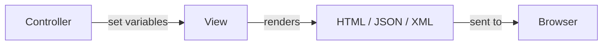
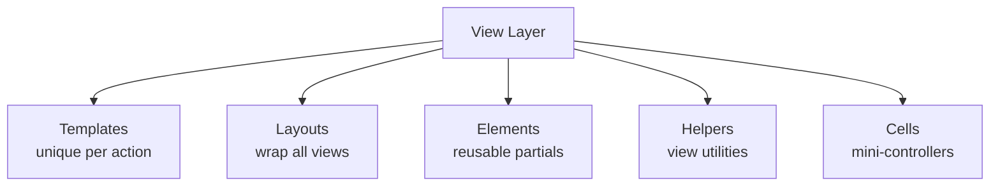
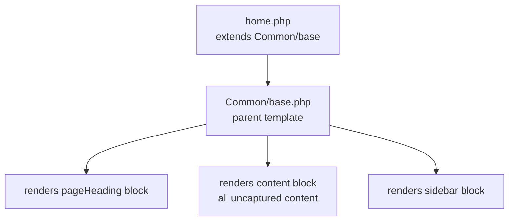
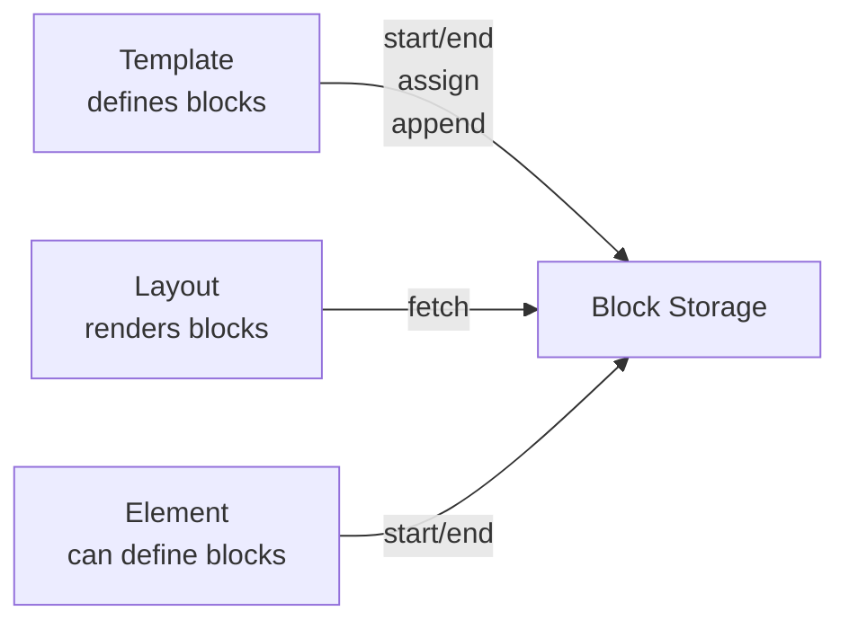
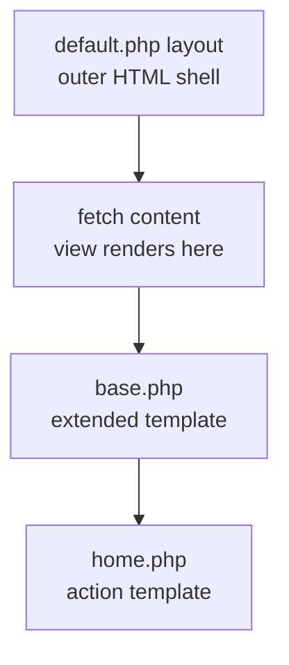
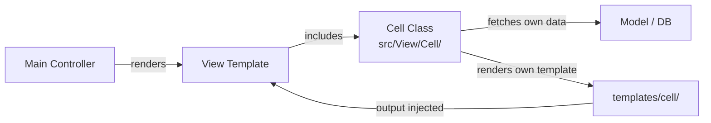
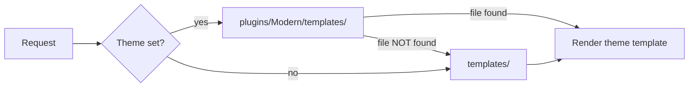
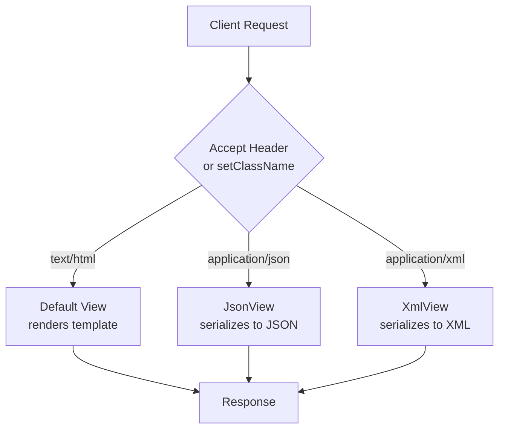
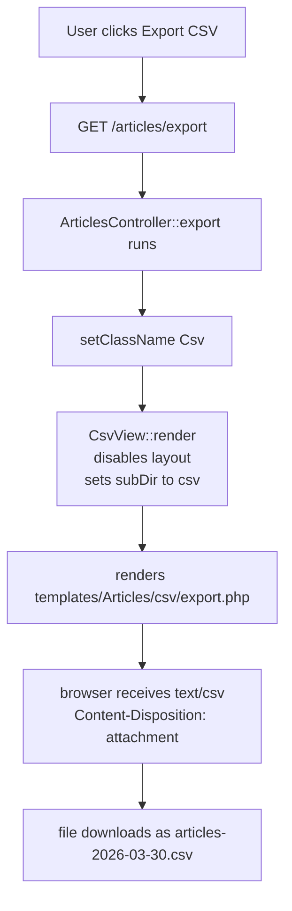
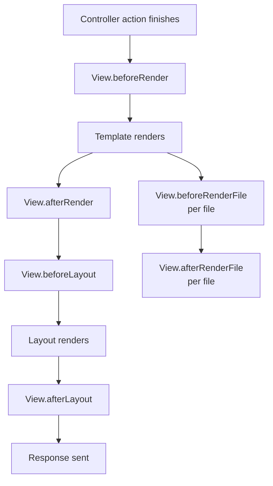

# CakePHP — Views
> Complete Reference Docs | CL04 Study Notes

---

## Table of Contents

1. [View Basics](#1-view-basics)
2. [View Templates & Extending Views & View Blocks](#2-view-templates--extending-views--view-blocks)
3. [Layouts](#3-layouts)
4. [Elements](#4-elements)
5. [View Cells](#5-view-cells)
6. [Themes](#6-themes)
7. [JSON and XML Views](#7-json-and-xml-views)
8. [Custom View Classes](#8-custom-view-classes)
9. [View Events](#9-view-events)

---

## 1. View Basics

### What Views Are

Views are the V in MVC. They present data passed from controllers — HTML, JSON, XML, CSV, file downloads. Views never touch the database directly.



### View Parts



### `AppView` — Global View Base

Lives at `src/View/AppView.php`. Load helpers here that every view needs — no need to call `addHelper()` in every controller:

```php
<?php
declare(strict_types=1);
namespace App\View;

use Cake\View\View;

class AppView extends View
{
    public function initialize(): void
    {
        // available in EVERY template automatically
        $this->addHelper('Html');
        $this->addHelper('Form');
        $this->addHelper('Flash');
        $this->addHelper('Paginator');
    }
}
```

### Template File Location — Naming Convention

```
templates/
└── Homes/              ← named after controller (plural)
    └── home.php        ← HomesController::home()
└── Articles/
    ├── index.php       ← ArticlesController::index()
    ├── view.php        ← ArticlesController::view()
    ├── add.php         ← ArticlesController::add()
    └── edit.php        ← ArticlesController::edit()
```

### Alternative PHP Syntax in Templates

```php
<!-- foreach — preferred in templates -->
<ul>
<?php foreach ($articles as $article): ?>
    <li><?= h($article->title) ?></li>
<?php endforeach; ?>
</ul>

<!-- if / elseif / else -->
<?php if ($user): ?>
    <p>Hello <?= h($user->name) ?></p>
<?php elseif ($guest): ?>
    <p>Hello Guest</p>
<?php else: ?>
    <p>Hello Unknown</p>
<?php endif; ?>

<!-- for -->
<?php for ($i = 0; $i < 10; $i++): ?>
    <span><?= $i ?></span>
<?php endfor; ?>

<!-- while -->
<?php while ($condition): ?>
    <p>Content</p>
<?php endwhile; ?>
```

> Colons replace opening braces. `endforeach` / `endif` / `endfor` / `endwhile` replace closing braces.

### `h()` — Always Escape User Data

CakePHP does NOT auto-escape. Always use `h()` on user-provided data:

```php
// WRONG — XSS vulnerability
<?= $article->title ?>

// CORRECT — always use h()
<?= h($article->title) ?>
<?= h($user->comment) ?>

// h() converts dangerous characters
// < → &lt;   > → &gt;   " → &quot;   & → &amp;
```

### `set()` in View

Variables set in controller are available in template AND layout. You can also call `set()` inside a template to pass vars to the layout:

```php
// in controller
$this->set('articles', $articles);
$this->set('pageTitle', 'All Articles');

// in template — passes to layout
$this->set('activeMenuButton', 'articles');

// in layout — all above vars available
<?= h($pageTitle) ?>
```

### File Structure Summary

```
src/
└── View/
    └── AppView.php             ← global view base
templates/
├── Homes/
│   └── home.php
├── layout/
│   └── default.php
└── element/
    └── flash/
        ├── success.php
        └── error.php
```

---

## 2. View Templates & Extending Views & View Blocks

### Extending Views

`$this->extend()` lets one template wrap inside another — like a layout, but between templates.



**Parent template** — defines slots:

```php
<!-- templates/Common/base.php -->
<div class="page-wrap">
    <header class="page-header">
        <h1><?= $this->fetch('pageHeading', 'Default Heading') ?></h1>
    </header>
    <div class="page-body">
        <main class="page-main">
            <?= $this->fetch('content') ?>
        </main>
        <?php if ($this->fetch('sidebar') !== ''): ?>
        <aside class="page-sidebar">
            <?= $this->fetch('sidebar') ?>
        </aside>
        <?php endif; ?>
    </div>
</div>
```

**Child template** — fills slots:

```php
<!-- templates/Homes/home.php -->
<?php
$this->extend('/Common/base');
$this->assign('title',       'CakePHP Views Study');
$this->assign('pageHeading', h($pageTitle));
$this->Html->css('home', ['block' => true]);
?>

<?php $this->start('sidebar'); ?>
    <ul>
        <?php foreach ($viewConcepts as $concept): ?>
            <li><?= h($concept) ?></li>
        <?php endforeach; ?>
    </ul>
<?php $this->end(); ?>

<!-- uncaptured content goes into 'content' block automatically -->
<p><?= h($pageSubtitle) ?></p>
```

> `content` is a **reserved block** — CakePHP automatically puts all uncaptured content into it. Never name your own block `content`.

### View Blocks — Complete API



#### `start()` and `end()` — Define a Block

```php
<?php $this->start('sidebar'); ?>
    <nav>
        <a href="/articles">Articles</a>
        <a href="/users">Users</a>
    </nav>
<?php $this->end(); ?>
```

#### `assign()` — Directly Assign Content

```php
$this->assign('title', 'My Page Title');
$this->assign('pageClass', 'home-page');
$this->assign('title', $pageTitle); // from variable
```

#### `fetch()` — Output a Block

```php
<?= $this->fetch('sidebar') ?>
<?= $this->fetch('cart', 'Your cart is empty') ?>  // with fallback

// conditionally show surrounding markup
<?php if ($this->fetch('menu') !== ''): ?>
    <div class="menu">
        <?= $this->fetch('menu') ?>
    </div>
<?php endif; ?>
```

#### `append()` — Add to Existing Block

```php
$this->append('sidebar');
echo $this->element('sidebar/popular_posts');
$this->end();

// shorthand
$this->append('sidebar', '<li>Extra item</li>');
```

#### `prepend()` — Insert Before Existing Block

```php
$this->prepend('sidebar', '<li>This goes first</li>');
```

#### `reset()` — Clear a Block

```php
$this->reset('sidebar');
$this->assign('sidebar', ''); // also clears
```

### Scripts and CSS via Blocks

```php
// in template — push to named blocks
$this->Html->script('home',   ['block' => true]);        // → 'script' block
$this->Html->css('home',      ['block' => true]);        // → 'css' block
$this->Html->meta('description', 'My site',
                  ['block' => true]);                     // → 'meta' block

// push to custom block name
$this->Html->script('chart', ['block' => 'scriptBottom']);
```

```php
<!-- in layout — render blocks in head -->
<head>
    <title><?= h($this->fetch('title')) ?></title>
    <?= $this->fetch('meta') ?>
    <?= $this->fetch('css') ?>
    <?= $this->fetch('script') ?>
</head>
<body>
    <?= $this->fetch('content') ?>
    <?= $this->fetch('scriptBottom') ?>
</body>
```

### Block Summary Table

| Method | What It Does |
|---|---|
| `start('name')` | Begin capturing content into named block |
| `end()` | Stop capturing |
| `assign('name', $val)` | Directly set block content |
| `fetch('name')` | Output a block |
| `fetch('name', 'default')` | Output with fallback if empty |
| `append('name', $content)` | Add to end of existing block |
| `prepend('name', $content)` | Add to start of existing block |
| `reset('name')` | Clear block entirely |

---

## 3. Layouts

### What a Layout Is

A layout is the outer shell — `<html>`, `<head>`, `<body>`, navigation, footer — everything consistent across all pages. The view's content is injected via `$this->fetch('content')`.



### Default Layout

```
templates/
└── layout/
    ├── default.php    ← used unless specified otherwise
    ├── admin.php      ← admin section
    └── ajax.php       ← AJAX responses — empty layout
```

### What `default.php` Must Have

```php
<!DOCTYPE html>
<html lang="en">
<head>
    <meta charset="UTF-8">
    <title><?= h($this->fetch('title')) ?></title>
    <?= $this->fetch('meta') ?>
    <?= $this->fetch('css') ?>
</head>
<body>

    <?php if ($this->fetch('nav') !== ''): ?>
    <nav class="site-nav">
        <?= $this->fetch('nav') ?>
    </nav>
    <?php endif; ?>

    <!-- REQUIRED — where view renders -->
    <div class="site-wrap">
        <?= $this->fetch('content') ?>
    </div>

    <?= $this->fetch('script') ?>
    <?= $this->fetch('scriptBottom') ?>

</body>
</html>
```

### Setting Layout from Controller

```php
// specific action
public function home(): void
{
    $this->viewBuilder()->setLayout('default');
    $this->viewBuilder()->setLayout('admin');
    $this->viewBuilder()->setLayout('ajax');
}

// all actions via beforeRender
public function beforeRender(\Cake\Event\EventInterface $event): void
{
    $this->viewBuilder()->setLayout('admin');
}
```

### Multiple Layouts — When to Use

| Layout | Use Case |
|---|---|
| `default.php` | Standard pages — full HTML shell |
| `admin.php` | Admin panel — different nav, sidebar |
| `ajax.php` | AJAX responses — completely empty |
| `image.php` | Image output — no HTML |

### Plugin Layouts

```php
$this->viewBuilder()->setLayout('Contacts.contact');
// looks in plugins/Contacts/templates/layout/contact.php
```

### Extending Layouts

```php
// templates/layout/admin.php
$this->extend('application');
$this->prepend('content', '<div class="admin-wrapper">');
$this->append('content', '</div>');
echo $this->fetch('content');
```

---

## 4. Elements

### What Elements Are

Reusable partial view files — small blocks of presentation code used in multiple places. Nav items, stat boxes, flash messages, cards.

```
templates/
└── element/
    ├── stats_bar.php
    ├── concept_card.php
    └── flash/
        ├── success.php
        └── error.php
```

### Rendering an Element

```php
// basic
echo $this->element('stats_bar');

// with variables
echo $this->element('stats_bar', [
    'totalArticles' => 100,
    'label'         => 'Total Articles',
]);

// from plugin
echo $this->element('Contacts.helpbox');

// from subfolder
echo $this->element('sidebar/recent_posts');
```

### Variables Inside Elements

**Passed variables** — second argument:

```php
// rendering
echo $this->element('concept_card', [
    'title'       => 'Templates',
    'description' => 'Unique PHP file per action',
    'index'       => '01',
]);

// inside templates/element/concept_card.php
<div class="concept-card">
    <span class="card-index"><?= h($index) ?></span>
    <h3><?= h($title) ?></h3>
    <p><?= h($description) ?></p>
</div>
```

**Controller variables** — all `set()` variables also available in every element automatically:

```php
// controller sets this
$this->set('currentUser', $user);

// available in element WITHOUT passing — merged automatically
<p>Posted by <?= h($currentUser->name) ?></p>
```

### Element Caching

```php
// cache using default config
echo $this->element('stats_bar', [], ['cache' => true]);

// cache with specific config and key
echo $this->element('stats_bar', [], [
    'cache' => [
        'config' => 'long_view',
        'key'    => 'stats_bar_home',
    ]
]);

// same element multiple times — different keys required
echo $this->element('concept_card',
    ['article' => $article1],
    ['cache' => ['key' => 'card_' . $article1->id]]
);
echo $this->element('concept_card',
    ['article' => $article2],
    ['cache' => ['key' => 'card_' . $article2->id]]
);
```

### Element Callbacks

```php
// enable before/afterRender callbacks for this element
echo $this->element('my_element', [], ['callbacks' => true]);
```

### Routing Prefix and Elements

```
templates/Admin/element/stats_bar.php   ← checked first for Admin prefix
templates/element/stats_bar.php         ← fallback
```

### CL04 Elements Built

**`templates/element/stats_bar.php`:**

```php
<div class="stats-bar">
    <?php foreach ($stats as $stat): ?>
        <div class="stat-item">
            <span class="stat-value"><?= h($stat['value']) ?></span>
            <span class="stat-label"><?= h($stat['label']) ?></span>
        </div>
    <?php endforeach; ?>
</div>
```

**`templates/element/concept_card.php`:**

```php
<div class="concept-card">
    <span class="card-index"><?= h($index) ?></span>
    <h3 class="card-title"><?= h($title) ?></h3>
    <p class="card-desc"><?= h($description) ?></p>
</div>
```

---

## 5. View Cells

### What View Cells Are

Mini-controllers for self-contained UI components. They have their own logic, their own template, and their own data fetching — completely independent of the main controller.



### Element vs Cell

| | Element | Cell |
|---|---|---|
| Has own data fetching | ❌ No | ✅ Yes |
| Accesses models | ❌ No | ✅ Yes |
| Has own logic | ❌ No | ✅ Yes |
| Isolated scope | ❌ Shares view vars | ✅ Completely isolated |
| Use for | Static/passed data | Dynamic DB-driven widgets |

### File Structure

```
src/
└── View/
    └── Cell/
        └── ArticleStatsCell.php     ← cell class

templates/
└── cell/
    └── ArticleStats/
        ├── display.php              ← default method template
        └── summary.php             ← additional method template
```

### Creating a Cell

```php
// src/View/Cell/ArticleStatsCell.php
<?php
declare(strict_types=1);
namespace App\View\Cell;

use Cake\View\Cell;

class ArticleStatsCell extends Cell
{
    // default method — called when you do $this->cell('ArticleStats')
    public function display(): void
    {
        $total     = $this->fetchTable('Articles')->find()->count();
        $published = $this->fetchTable('Articles')
                         ->find()->where(['published' => 1])->count();
        $latest    = $this->fetchTable('Articles')
                         ->find()->orderBy(['created' => 'DESC'])->first();

        $this->set(compact('total', 'published', 'latest'));
    }

    // additional method — $this->cell('ArticleStats::summary')
    public function summary(int $limit = 3): void
    {
        $articles = $this->fetchTable('Articles')->find()
                        ->orderBy(['created' => 'DESC'])
                        ->limit($limit)
                        ->all();
        $this->set('articles', $articles);
    }
}
```

### Cell Template

```php
<!-- templates/cell/ArticleStats/display.php -->
<!-- isolated scope — controller set() vars NOT available here -->
<div class="cell-widget">
    <div class="cell-header">Article Stats Cell</div>
    <div class="cell-body">
        <div class="cell-stat">
            <span class="cell-number"><?= h($total) ?></span>
            <span class="cell-label">Total</span>
        </div>
        <div class="cell-stat">
            <span class="cell-number"><?= h($published) ?></span>
            <span class="cell-label">Published</span>
        </div>
    </div>
    <?php if ($latest): ?>
        <div class="cell-latest">Latest — <?= h($latest->title) ?></div>
    <?php endif; ?>
</div>
```

### Loading and Rendering Cells

```php
// basic — calls display()
<?= $this->cell('ArticleStats') ?>

// specific method
<?= $this->cell('ArticleStats::summary') ?>

// pass arguments to method
<?= $this->cell('ArticleStats::summary', [5]) ?>

// from plugin
<?= $this->cell('Messaging.Inbox') ?>

// explicit render — better error messages
<?= $this->cell('ArticleStats')->render() ?>

// alternate template
<?= $this->cell('ArticleStats')->render('compact') ?>
```

### Cell Scope is Isolated

```php
// controller sets this
$this->set('currentUser', $user);

// in main template — ✅ available
<?= h($currentUser->name) ?>

// in cell template — ❌ NOT available
// must pass via set() inside the cell class
```

### Cell Options

```php
class ArticleStatsCell extends Cell
{
    protected array $_validCellOptions = ['limit', 'showLatest'];
    protected int $limit = 5;
    protected bool $showLatest = true;

    public function display(): void
    {
        $articles = $this->fetchTable('Articles')->find()
                        ->limit($this->limit)->all();
        $this->set('articles', $articles);
        $this->set('showLatest', $this->showLatest);
    }
}

// pass options when creating cell
<?= $this->cell('ArticleStats', [], ['limit' => 10, 'showLatest' => false]) ?>
```

### Caching Cell Output

```php
<?= $this->cell('ArticleStats', [], ['cache' => true]) ?>

<?= $this->cell('ArticleStats', [], [
    'cache' => [
        'config' => 'cell_cache',
        'key'    => 'article_stats_home',
    ]
]) ?>
```

### Using Helpers Inside a Cell

```php
class ArticleStatsCell extends Cell
{
    public function initialize(): void
    {
        $this->viewBuilder()->addHelper('Html');
        $this->viewBuilder()->addHelper('Number');
    }
}
```

### Cell Events

```
Cell.beforeAction   ← fires before cell method runs
Cell.afterAction    ← fires after cell method runs
```

---

## 6. Themes

### What Themes Are

Themes are plugins focused on providing template files. Swap the entire look and feel of your app without touching controllers or models.



### Theme File Structure

```
plugins/
└── Modern/
    ├── src/
    │   └── Plugin.php
    ├── templates/
    │   ├── layout/
    │   │   └── default.php     ← overrides templates/layout/default.php
    │   ├── Homes/
    │   │   └── home.php        ← overrides templates/Homes/home.php
    │   ├── Common/
    │   │   └── base.php        ← must mirror your extend() paths
    │   └── element/
    │       └── stats_bar.php   ← overrides element
    └── webroot/
        └── css/
            └── modern.css
```

### Step 1 — Plugin Bootstrap

```php
// plugins/Modern/src/Plugin.php
<?php
declare(strict_types=1);
namespace Modern;

use Cake\Core\BasePlugin;

class Plugin extends BasePlugin
{
    protected bool $routesEnabled  = false;
    protected bool $consoleEnabled = false;
}
```

### Step 2 — Load in `Application.php`

```php
public function bootstrap(): void
{
    parent::bootstrap();
    $this->addPlugin('Modern');
}
```

### Step 3 — Set Theme in Controller

```php
// specific action
public function home(): void
{
    $this->viewBuilder()->setTheme('Modern');
}

// all actions
public function beforeRender(\Cake\Event\EventInterface $event): void
{
    $this->viewBuilder()->setTheme('Modern');
}
```

### Important — Mirror ALL Extended Paths

If `home.php` calls `$this->extend('/Common/base')`, the theme must also have `plugins/Modern/templates/Common/base.php`. If not, content goes blank because CakePHP looks in the theme first and cannot find the parent template.

```
home.php extends /Common/base
    ↓
CakePHP looks for: plugins/Modern/templates/Common/base.php  ← must exist
    ↓ if not found
Content renders blank — known gotcha
```

### Theme Assets

```
plugins/Modern/webroot/css/modern.css   → served at /modern/css/modern.css
plugins/Modern/webroot/js/modern.js     → served at /modern/js/modern.js
```

HtmlHelper auto-builds correct paths when theme is active:

```php
$this->Html->css('main');
// generates: /modern/css/main.css
// falls back: /css/main.css if not in theme
```

### Conditional Theme Switching

```php
// by user preference
public function beforeRender(\Cake\Event\EventInterface $event): void
{
    $user = $this->request->getSession()->read('Auth.user');
    if (isset($user['theme'])) {
        $this->viewBuilder()->setTheme($user['theme']);
    }
}

// by device
public function beforeRender(\Cake\Event\EventInterface $event): void
{
    $ua = $this->request->getHeader('User-Agent')[0] ?? '';
    if (str_contains(strtolower($ua), 'mobile')) {
        $this->viewBuilder()->setTheme('Mobile');
    }
}
```

---

## 7. JSON and XML Views

### What They Are

Built-in view classes that serialize data directly to JSON or XML — no template files needed for basic usage.



### `viewClasses()` — Register Supported Formats

```php
use Cake\View\JsonView;
use Cake\View\XmlView;

public function viewClasses(): array
{
    return [JsonView::class, XmlView::class];
}
```

### `serialize` Option — No Template Needed

```php
public function index(): void
{
    $articles = $this->Articles->find()->all()->toArray();
    $this->set('articles', $articles);

    // single variable
    $this->viewBuilder()->setOption('serialize', 'articles');

    // multiple variables
    $this->viewBuilder()->setOption('serialize', ['articles', 'total']);
}
```

### Using Template Files for Custom Formatting

```php
// controller — no serialize option
public function index(): void
{
    $articles = $this->Articles->find()->all();
    $this->set(compact('articles'));
}
```

```php
// templates/Articles/json/index.php
foreach ($articles as $article) {
    unset($article->body); // strip fields
}
echo json_encode(compact('articles'));
```

```php
// templates/Articles/xml/index.php
foreach ($articles as $article) {
    unset($article->body);
}
echo $this->Xml->toXml(compact('articles'));
```

### `jsonOptions` — Control `json_encode`

```php
$this->viewBuilder()
     ->setOption('serialize', ['errors'])
     ->setOption('jsonOptions', JSON_FORCE_OBJECT);

$this->viewBuilder()
     ->setOption('jsonOptions', JSON_PRETTY_PRINT | JSON_UNESCAPED_UNICODE);
```

### `XmlView` Options

```php
$this->viewBuilder()
     ->setOption('rootNode', 'urlset')
     ->setOption('serialize', ['@xmlns', 'url']);
```

### Choosing View Class Directly — `setClassName()`

Most reliable approach — bypasses Accept header negotiation entirely:

```php
public function apiHome(): void
{
    $stats = [
        'total'     => (int)$this->fetchTable('Articles')->find()->count(),
        'published' => (int)$this->fetchTable('Articles')
                           ->find()->where(['published' => 1])->count(),
    ];

    $this->set('stats', $stats);
    $this->viewBuilder()
         ->setClassName('Json')             // ← direct — no Accept header needed
         ->setOption('serialize', ['stats'])
         ->setOption('jsonOptions', JSON_PRETTY_PRINT);
}
```

### Enabling URL Extensions

To use `/action.json` URLs — add to `config/routes.php`:

```php
$routes->scope('/', function (RouteBuilder $builder): void {
    $builder->setExtensions(['json', 'xml']); // must be FIRST line

    $builder->connect('/', ['controller' => 'Homes', 'action' => 'home']);
    $builder->fallbacks();
});
```

### When to Use Which

| Approach | Use When |
|---|---|
| `setClassName('Json')` | Single action always returns JSON |
| `viewClasses()` + Accept header | Same action serves HTML and JSON |
| `setExtensions(['json'])` in routes | Want `/action.json` URLs |

---

## 8. Custom View Classes

### What They Are

When built-in views are not enough — PDF, CSV, Markdown, custom output. Create a view class that fully controls rendering.

### Conventions

```
src/View/CsvView.php        ← file location
class CsvView extends View  ← must extend View
setClassName('Csv')         ← omit View suffix when referencing
```

### CL04 Implementation — `CsvView`

```php
// src/View/CsvView.php
<?php
declare(strict_types=1);
namespace App\View;

use Cake\View\View;

class CsvView extends View
{
    public static function contentType(): string
    {
        return 'text/csv';
    }

    protected string $subDir = 'csv'; // looks in templates/Controller/csv/

    public function render(?string $view = null, ?string $layout = null): string
    {
        $this->disableAutoLayout(); // no HTML wrapper
        return parent::render($view, $layout);
    }
}
```

### CSV Template

```php
<!-- templates/Articles/csv/export.php -->
<?php
$response = $this->getResponse()
    ->withType('text/csv')
    ->withDownload($filename);
$this->setResponse($response);
?>
<?= implode(',', ['ID', 'Title', 'Slug', 'Published', 'Created']) . "\n" ?>
<?php foreach ($articles as $article): ?>
<?= implode(',', [
    $article->id,
    '"' . str_replace('"', '""', $article->title) . '"',
    $article->slug,
    $article->published ? 'Yes' : 'No',
    $article->created->format('Y-m-d'),
]) . "\n" ?>
<?php endforeach; ?>
```

### Export Action

```php
// in ArticlesController
public function export(): void
{
    $articles = $this->Articles->find('all')
        ->select(['id', 'title', 'slug', 'published', 'created'])
        ->orderBy(['Articles.id' => 'ASC'])
        ->all();

    $filename = 'articles-' . date('Y-m-d') . '.csv';
    $this->set(compact('articles', 'filename'));
    $this->viewBuilder()->setClassName('Csv');
}
```

### How It Works End to End



### PDF View Skeleton

```php
// src/View/PdfView.php
class PdfView extends View
{
    protected string $subDir     = 'pdf';
    protected string $layoutPath = 'pdf';

    public static function contentType(): string
    {
        return 'application/pdf';
    }

    public function render(?string $view = null, ?string $layout = null): string
    {
        $html = parent::render($view, $layout);
        // $dompdf = new \Dompdf\Dompdf();
        // $dompdf->loadHtml($html);
        // $dompdf->render();
        // return $dompdf->output();
        return $html;
    }
}
```

### Custom View Summary

| | Detail |
|---|---|
| File location | `src/View/NameView.php` |
| Must extend | `Cake\View\View` |
| Content type | `public static function contentType(): string` |
| Override rendering | Override `render()` method |
| Custom template dir | `protected string $subDir` |
| Custom layout dir | `protected string $layoutPath` |
| Reference in controller | `setClassName('Name')` — no `View` suffix |
| Disable layout | `$this->disableAutoLayout()` |

---

## 9. View Events

### What They Are

CakePHP fires events at specific points in the view rendering lifecycle. Attach listeners to inject logic without touching templates or controllers.



### All Six Events

| Event | When It Fires |
|---|---|
| `View.beforeRender` | Before any template renders — after action finishes |
| `View.beforeRenderFile` | Before EACH file — templates, elements, layouts |
| `View.afterRenderFile` | After EACH file renders |
| `View.afterRender` | After template renders — before layout |
| `View.beforeLayout` | Before layout renders |
| `View.afterLayout` | After everything renders — final output ready |

### Listening in `AppView`

```php
// src/View/AppView.php
class AppView extends View
{
    public function initialize(): void
    {
        $this->addHelper('Html');
        $this->addHelper('Form');
        $this->addHelper('Flash');
        $this->addHelper('Paginator');

        // inject global vars before every render
        $this->getEventManager()->on(
            'View.beforeRender',
            function (EventInterface $event): void {
                $view = $event->getSubject();
                $view->set('appName',    'CakePHP View Study');
                $view->set('renderYear', date('Y'));
            }
        );

        // log after full page assembled
        $this->getEventManager()->on(
            'View.afterLayout',
            function (EventInterface $event): void {
                \Cake\Log\Log::debug('View render complete');
            }
        );
    }
}
```

### Listening via Helper Callbacks

```php
// src/View/Helper/RenderTimerHelper.php
class RenderTimerHelper extends Helper
{
    private float $startTime;

    public function beforeRender(EventInterface $event, string $viewFile): void
    {
        $this->startTime = microtime(true);
    }

    public function afterLayout(EventInterface $event, string $layoutFile): void
    {
        $duration = round((microtime(true) - $this->startTime) * 1000, 2);
        $this->getView()->getResponse()
             ->withHeader('X-Render-Time', $duration . 'ms');
    }

    public function beforeRenderFile(EventInterface $event, string $viewFile): void
    {
        // $viewFile = full path to file being rendered
    }

    public function afterRenderFile(EventInterface $event, string $viewFile, string $content): void
    {
        // $content = rendered output of that file
        // return modified content to change output
        return preg_replace('/<!--(.|\s)*?-->/', '', $content); // strip comments
    }
}
```

### Practical Use Cases Per Event

```php
// View.beforeRender — inject global vars
$this->getEventManager()->on('View.beforeRender',
    function (EventInterface $event): void {
        $view = $event->getSubject();
        $view->set('currentYear', date('Y'));
    }
);

// View.afterRenderFile — modify rendered output
public function afterRenderFile($event, $file, $content): void
{
    return preg_replace('/<!--(.|\s)*?-->/', '', $content);
}

// View.beforeLayout — last chance before layout
$this->getEventManager()->on('View.beforeLayout',
    function (EventInterface $event): void {
        $event->getSubject()->set('renderComplete', true);
    }
);

// View.afterLayout — log total render time
$this->getEventManager()->on('View.afterLayout',
    function (EventInterface $event): void {
        \Cake\Log\Log::info('Page render complete');
    }
);
```

### Use in Layout Footer

```php
<!-- templates/layout/default.php -->
<footer class="site-footer">
    <?= h($appName) ?> — <?= h($renderYear) ?>
</footer>
```

---

## Complete File Map — CL04 Project

```
src/
├── Controller/
│   ├── HomesController.php
│   └── ArticlesController.php (export action)
└── View/
    ├── AppView.php                          ← global helpers + events
    ├── CsvView.php                          ← custom CSV view
    └── Cell/
        └── ArticleStatsCell.php             ← cell class

templates/
├── Homes/
│   └── home.php                             ← extends Common/base
├── Common/
│   └── base.php                             ← parent template
├── Articles/
│   └── csv/
│       └── export.php                       ← CSV template
├── cell/
│   └── ArticleStats/
│       └── display.php                      ← cell template
├── element/
│   ├── stats_bar.php
│   └── concept_card.php
└── layout/
    └── default.php                          ← main layout

plugins/
└── Modern/
    ├── src/Plugin.php
    ├── templates/
    │   ├── layout/default.php
    │   └── Common/base.php                  ← must exist if home.php extends it
    └── webroot/css/modern.css

webroot/
└── css/
    └── home.css
```

---

## Missing & Additional Coverage

---

### Theme Blank Page — Debug Steps

The most common theme issue — blank page with only the theme header showing. This happens when `home.php` calls `$this->extend('/Common/base')` but the theme does not have a matching `Common/base.php`.

```
home.php calls $this->extend('/Common/base')
        ↓
CakePHP looks in theme first:
plugins/Modern/templates/Common/base.php   ← does NOT exist
        ↓
Falls through incorrectly — content renders blank
```

**Fix checklist:**

```
1. plugins/Modern/templates/Common/base.php   ← create this
2. plugins/Modern/templates/layout/default.php ← verify fetch('content') is present
3. If still blank — temporarily remove $this->extend() in home.php to isolate
4. Check Application.php — $this->addPlugin('Modern') must be in bootstrap()
```

**`plugins/Modern/templates/Common/base.php`** — must exist:

```php
<div class="page-wrap">
    <header class="page-header">
        <h1><?= $this->fetch('pageHeading', 'Default Heading') ?></h1>
    </header>
    <div class="page-body">
        <main class="page-main">
            <?= $this->fetch('content') ?>
        </main>
        <?php if ($this->fetch('sidebar') !== ''): ?>
            <aside class="page-sidebar">
                <?= $this->fetch('sidebar') ?>
            </aside>
        <?php endif; ?>
    </div>
</div>
```

---

### JSON View — Serialization Failure Fix

`SerializationFailureException` happens when the data passed to JsonView contains objects that cannot be JSON-encoded — ORM entities, Query objects, DateTime objects.

```php
// WRONG — ORM entity objects cannot be serialized directly
$articles = $this->Articles->find()->all();
$this->set('articles', $articles);
$this->viewBuilder()->setOption('serialize', ['articles']);

// CORRECT — convert to plain array first
$articles = $this->Articles->find()->all()->toArray();
$this->set('articles', $articles);

// ALSO CORRECT — use plain scalars only
$stats = [
    'total'     => (int)$this->fetchTable('Articles')->find()->count(),
    'published' => (int)$this->fetchTable('Articles')
                       ->find()->where(['published' => 1])->count(),
];
```

**Working `apiHome()` — what actually fixed it:**

```php
public function apiHome(): void
{
    $stats = [
        'total'     => (int)$this->fetchTable('Articles')->find()->count(),
        'published' => (int)$this->fetchTable('Articles')
                           ->find()->where(['published' => 1])->count(),
    ];

    $this->set('stats', $stats);

    // setClassName('Json') is most reliable — bypasses Accept header entirely
    $this->viewBuilder()
         ->setClassName('Json')
         ->setOption('serialize', ['stats'])
         ->setOption('jsonOptions', JSON_PRETTY_PRINT);
}
```

---

### JSONP Responses

```php
// enable JSONP — client calls with ?callback=myFunction
$this->set('jsonp', true);
$this->set('articles', $articles);
$this->viewBuilder()
     ->setClassName('Json')
     ->setOption('serialize', ['articles']);

// response wraps JSON in callback:
// myFunction({"articles":[...]})
```

---

### Caching View Sections

Cache expensive sections of your view output — View Cells or helper operations:

```php
// in template — cache a section of output
echo $this->cache(function () use ($user, $article) {
    echo $this->cell('UserProfile', [$user]);
    echo $this->cell('ArticleFull', [$article]);
}, ['key' => 'my_view_key']);

// with specific cache config
echo $this->cache(function () use ($articles) {
    foreach ($articles as $article) {
        echo $this->element('article_card', compact('article'));
    }
}, ['key' => 'articles_list', 'config' => 'view_long']);
```

Cached view content goes into `View::$elementCache` config by default. Use `config` option to override.

---

### Paginating Data Inside a Cell

```php
// src/View/Cell/FavoritesCell.php
<?php
declare(strict_types=1);
namespace App\View\Cell;

use Cake\View\Cell;
use Cake\Datasource\Paging\NumericPaginator;

class FavoritesCell extends Cell
{
    public function display(): void
    {
        $paginator = new NumericPaginator();

        $results = $paginator->paginate(
            $this->fetchTable('Articles'),
            $this->request->getQueryParams(),
            [
                'limit' => 5,
                'scope' => 'cell', // scoped URL params — avoids conflict with main paginator
            ]
        );

        $this->set('favorites', $results);
    }
}
```

```php
<!-- templates/cell/Favorites/display.php -->
<ul>
    <?php foreach ($favorites as $article): ?>
        <li><?= h($article->title) ?></li>
    <?php endforeach; ?>
</ul>
```

> `scope` is critical — without it the cell's pagination URL params conflict with the main controller's pagination params when both are on the same page.

---

### `MarkdownView` — Custom View Example

```php
// src/View/MarkdownView.php
<?php
declare(strict_types=1);
namespace App\View;

use Cake\View\View;

class MarkdownView extends View
{
    public static function contentType(): string
    {
        return 'text/markdown';
    }

    public function render(?string $view = null, ?string $layout = null): string
    {
        $this->disableAutoLayout();
        return parent::render($view, $layout);
    }
}

// used in controller
public function readme(): void
{
    $this->viewBuilder()->setClassName('Markdown');
}
```

---

### Full Final `HomesController.php`

```php
<?php
declare(strict_types=1);
namespace App\Controller;

use Cake\View\JsonView;
use Cake\View\XmlView;

class HomesController extends AppController
{
    public function initialize(): void
    {
        parent::initialize();
        $this->loadComponent('CheckHttpCache');
    }

    // Topic 7 — register JSON and XML view support
    public function viewClasses(): array
    {
        return [JsonView::class, XmlView::class];
    }

    public function home(): void
    {
        // Topic 6 — set theme
        // $this->viewBuilder()->setTheme('Modern');

        // Topic 1 — set() associative array
        $this->set([
            'pageTitle'    => 'CakePHP — View Layer Study',
            'pageSubtitle' => 'Topics 1-9 — Full View Layer',
        ]);

        // Topic 1 — set() compact()
        $viewConcepts = [
            'Templates — unique per action',
            'Layouts — wrap all views',
            'Elements — reusable partials',
            'Helpers — view utilities',
            'Cells — mini-controllers',
        ];
        $this->set(compact('viewConcepts'));

        // Topic 4 — element data
        $conceptCards = [
            ['title' => 'Templates',  'description' => 'Unique PHP file per controller action'],
            ['title' => 'Layouts',    'description' => 'Outer HTML shell wrapping every view'],
            ['title' => 'Elements',   'description' => 'Reusable partial view snippets'],
            ['title' => 'Helpers',    'description' => 'View layer utility classes'],
            ['title' => 'Cells',      'description' => 'Mini-controllers for UI components'],
        ];

        $stats = [
            ['label' => 'Templates', 'value' => count($viewConcepts)],
            ['label' => 'Articles',  'value' => $this->fetchTable('Articles')->find()->count()],
            ['label' => 'Elements',  'value' => 2],
        ];

        $this->set(compact('conceptCards', 'stats'));
        $this->viewBuilder()->setLayout('default');
    }

    // Topic 7 — JSON API endpoint
    public function apiHome(): void
    {
        $stats = [
            'total'     => (int)$this->fetchTable('Articles')->find()->count(),
            'published' => (int)$this->fetchTable('Articles')
                               ->find()->where(['published' => 1])->count(),
        ];

        $this->set('stats', $stats);
        $this->viewBuilder()
             ->setClassName('Json')
             ->setOption('serialize', ['stats'])
             ->setOption('jsonOptions', JSON_PRETTY_PRINT);
    }
}
```

---

### Complete Build Summary — What Was Implemented

| Topic | What Was Built |
|---|---|
| 1 | `HomesController`, `home.php`, `home.css`, `h()`, foreach/if syntax |
| 2 | `templates/Common/base.php`, `extend()`, sidebar block, nav block |
| 3 | `templates/layout/default.php` with all blocks, nav block from template |
| 4 | `stats_bar.php` element, `concept_card.php` element, cards grid |
| 5 | `ArticleStatsCell`, `templates/cell/ArticleStats/display.php` |
| 6 | `plugins/Modern/` plugin, theme layout, `plugins/Modern/templates/Common/base.php` |
| 7 | `apiHome()` with `setClassName('Json')`, serialization fix |
| 8 | `src/View/CsvView.php`, `templates/Articles/csv/export.php`, export action |
| 9 | `AppView` event listeners, `beforeRender` injects `$appName` + `$renderYear` |

---

*CL04 — CakePHP Views | Abhay Raj | March 2026*